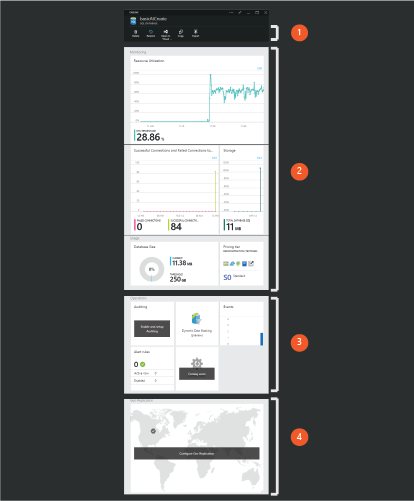
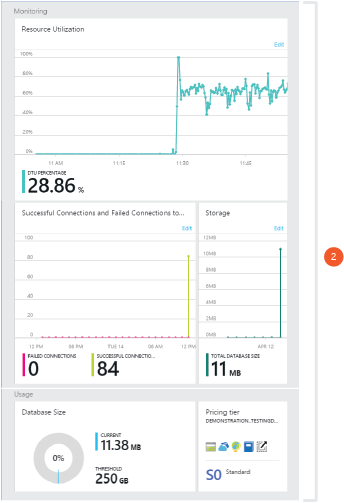
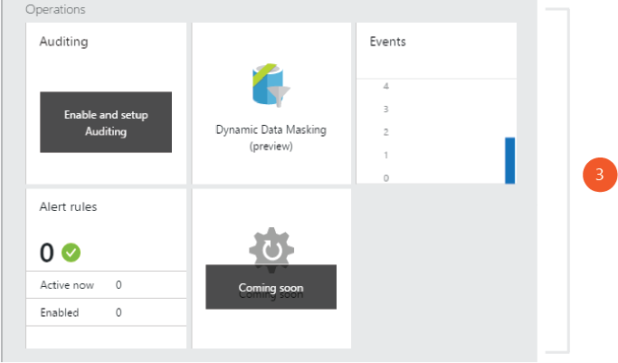
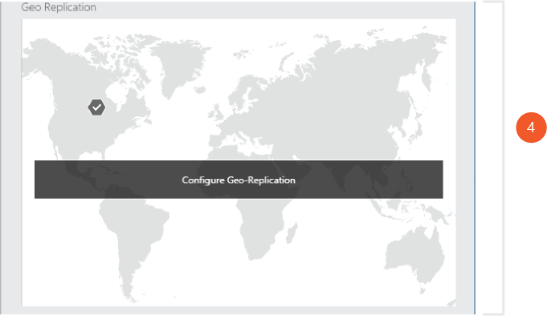

<properties
	pageTitle="Manage Azure SQL Databases using the Azure Portal"
	description="Learn how to use the Azure Portal to manage a relational database in the cloud using the Azure Portal."
	services="sql-database"
	documentationCenter=""
	authors="stevestein"
	manager="jhubbard"
	editor=""/>

<tags
	ms.service="sql-database"
	ms.devlang="NA"
	ms.workload="data-management"
	ms.topic="article"
	ms.tgt_pltfrm="NA"
	ms.date="05/20/2016"
	ms.author="sstein"/>

# Managing Azure SQL Databases using the Azure portal

> [AZURE.SELECTOR]
- [Azure Portal](sql-database-manage-portal.md)
- [SSMS](sql-database-manage-azure-ssms.md)
- [PowerShell](sql-database-command-line-tools.md)

The [Azure portal](https://portal.azure.com/) allows you to create, monitor and manage Azure SQL databases and logical servers. This article highlights some of the more common tasks.

## 1. Database management actions

The Azure portal provides a set of common database actions accessible at the top of a database blade. You can restore a database to a previous point in time, open a database in Visual Studio, copy a database to a new server, and export the database to an Azure storage account.

- [Restoring a SQL database](sql-database-recovery-using-backups.md)
- [Open a SQL database in Visual Studio](sql-database-connect-query.md)
- [Export a SQL database](sql-database-export.md)

## 2. Database monitoring

Azure SQL databases by default feature monitoring charts for Database Transaction Unit (DTU), database size, and connection health. These monitoring charts can be customized and extended to additionally chart CPU percentage, Data IO percentage, Deadlocks, Log IO percentage or even the percentage of requests blocked by firewall.

Additionally, alert rules can be setup to monitor a specified metric and alert a designated administrator and co-administrator when pre-set thresholds are reached.

## 3. Database security & auditing

Azure SQL databases can be configured to track all database events and write them to an audit log in your Azure storage account. This feature can help you maintain regulatory compliance, understand database activity, and gain insight into discrepancies that could indicate business concerns or suspected security violations.

- [SQL Database Auditing](sql-database-auditing-get-started.md)

Azure SQL databases can also be configured to mask sensitive data to non-privileged users.

- [Dynamic Data Masking](sql-database-dynamic-data-masking-get-started.md)

## 4. Geo-Replication

Azure SQL databases can be configured to asynchronously replicate committed transactions to a secondary database. The Geo-Replication part on the portal allows you to select the Azure region you would like the secondary database to reside in. 

- [Geo-Replication](sql-database-geo-replication-overview.md)

## Additional resources

- [SQL Database](sql-database-technical-overview.md)
