<properties
	pageTitle="Manage Azure SQL Database using the Azure Portal | Microsoft Azure"
	description="Learn how to use the Azure Portal to manage a relational database in the cloud using the Azure Portal."
	services="sql-database"
	documentationCenter=""
	authors="stevestein"
	manager="jhubbard"
	editor=""/>

<tags
	ms.service="sql-database"
	ms.devlang="NA"
	ms.workload="data-management"
	ms.topic="article"
	ms.tgt_pltfrm="NA"
	ms.date="09/19/2016"
	ms.author="sstein"/>

# Managing Azure SQL Databases using the Azure portal

> [AZURE.SELECTOR]
- [Azure portal](sql-database-manage-portal.md)
- [SSMS](sql-database-manage-azure-ssms.md)
- [PowerShell](sql-database-command-line-tools.md)

The [Azure portal](https://portal.azure.com/) allows you to create, monitor, and manage Azure SQL databases and servers. This article provides a quick description and links to the details of the more common tasks.

## View your Azure SQL databases, servers, and pools

To view the available SQL Database services, click **More services**, and type **SQL** in the search box:

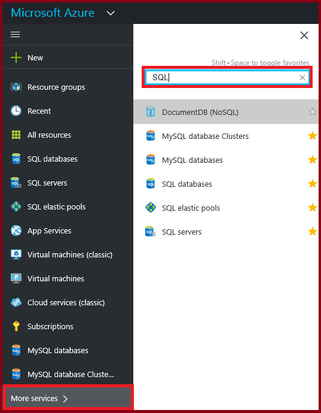

## How do I create or view Azure SQL databases?

To open the **SQL databases** blade, click **SQL databases**, and then click the database you want to work with, or click **+Add** to create a SQL database. For details, see [Create a SQL database in minutes by using the Azure portal](sql-database-get-started.md).

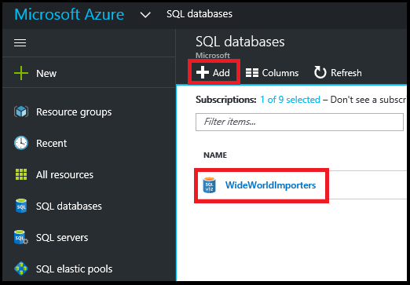

## How do I create or view Azure SQL servers?

To open the **SQL servers** blade, click **SQL servers**, and then click the server you want to work with, or click **+Add** to create a SQL server. For details, see [Create a SQL database in minutes by using the Azure portal](sql-database-get-started.md).

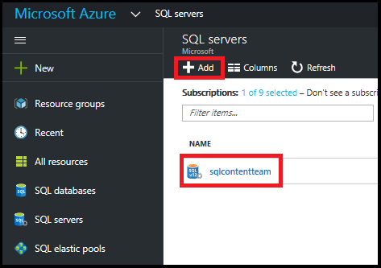

## How do I create or view SQL elastic pools?

To open the **SQL elastic pools** blade, click **SQL elastic pools**, and then click the pool you want to work with, or click **+Add** to create a pool. For details, see [Create an elastic database pool with the Azure portal](sql-database-elastic-pool-create-portal.md).

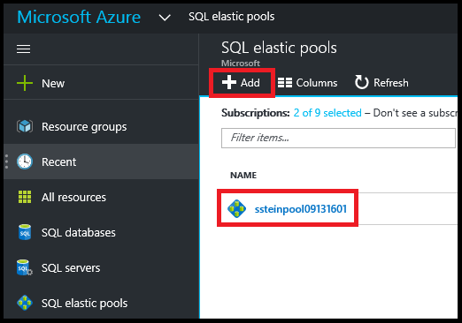

## How do I update or view SQL database settings?

To view or update your database settings, click the desired setting on the SQL database blade:

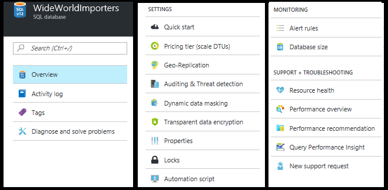

## How do I find a SQL databases fully qualified server name?

To view your databases server name, click **Overview** on the **SQL database** blade and note the server name:

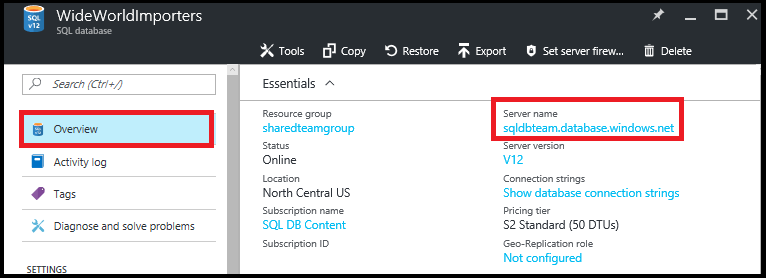

## How do I manage firewall rules to control access to my SQL server and database?

To view, create, or update firewall rules, click **Set server firewall** on the **SQL database** blade. For details, see [Configure an Azure SQL Database server-level firewall rule using the Azure portal](sql-database-configure-firewall-settings.md).

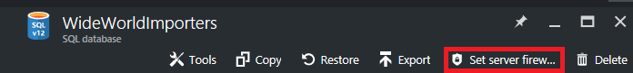

## How do I change my SQL database service tier or performance level?

To update the service tier or performance level of a SQL database, click **Pricing tier (scale DTUs)** on the **SQL database** blade. For details, see [Change the service tier and performance level (pricing tier) of a SQL database](sql-database-scale-up.md).

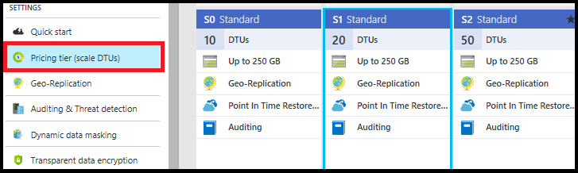

## How do I configure auditing and threat detection for a SQL database?

To configure auditing and threat detection for a SQL database, click **Auditing and Threat detection** on the **SQL database** blade. For details, see [Get started with SQL database auditing](sql-database-auditing-get-started.md), and [Get started with SQL Database Threat Detection](sql-database-threat-detection-get-started.md).

## How do I configure dynamic data masking for a SQL database?

To configure dynamic data masking for a SQL database, click **Dynamic data masking** on the **SQL database** blade. For details, see [Get started with SQL Database Dynamic Data Masking](sql-database-dynamic-data-masking-get-started.md).

## How do I configure transparent data encryption (TDE) for a SQL database?

To configure transparent data encryption for a SQL database, click **Transparent data encryption** on the **SQL database** blade. For details, see [Enable TDE on a database using the portal](https://msdn.microsoft.com/library/dn948096#Anchor_1).

## How do I view or change the max size of a SQL database?

To view or change the size a SQL database, click **Database size** on the **SQL database** blade. Update the max size of a database by changing the service tier or performance level. For details, see [Change the service tier and performance level (pricing tier) of a SQL database](sql-database-scale-up.md).

## How do I monitor and improve the performance of a SQL database?

To monitor and improve performance characteristics of a SQL database, click **Performance overview** on the **SQL database** blade. For details, see [SQL Database Performance Insight](sql-database-performance.md).

## How do I configure Geo-Replication?

To set up Geo-Replication for a SQL database, click **Geo-Replication** on the **SQL database** blade. For details, see [Configure Geo-Replication for Azure SQL Database with the Azure portal](sql-database-geo-replication-portal.md).

## How do I failover to a geo-replicated SQL database?

To failover to a geo-replicated secondary, click **Geo-Replication** on the **SQL database** blade, then click **Failover**. For details, see [Initiate a planned or unplanned failover for Azure SQL Database with the Azure portal](sql-database-geo-replication-failover-portal.md).

## How do I copy a SQL database?

To copy a SQL database, click **Copy** on the **SQL database** blade. For details, see [Copy an Azure SQL database using the Azure portal](sql-database-copy-portal.md).

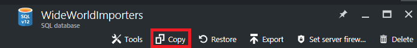

## How do I archive an Azure SQL database to a BACPAC file?

To create a BACPAC of a SQL database, click **Export** on the **SQL database** blade. For details, see [Archive an Azure SQL database to a BACPAC file using the Azure portal](sql-database-export.md).

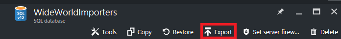

## How do I restore a SQL database to a previous point in time?

To restore a SQL database, click **Restore** on the **SQL database** blade. For details, see [Restore an Azure SQL Database to a previous point in time with the Azure portal](sql-database-point-in-time-restore-portal.md).

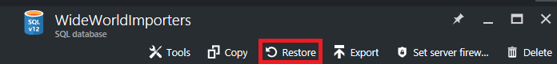

## How do I create an Azure SQL database from a BACPAC file?

To create a SQL database from a BACPAC file, click **Import database** on the **SQL server** blade. For details, see [Import a BACPAC file to create an Azure SQL database](sql-database-import.md).

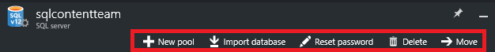

## How do I restore a deleted SQL database?

To restore a deleted SQL database, click **Deleted databases** on the **SQL server** blade (the SQL server that contained the database that was deleted). For details, see [Restore a deleted Azure SQL database using the Azure portal](sql-database-restore-deleted-database-portal.md).

## How do I delete a SQL database?

To delete a SQL database, click **Delete** on the **SQL database** blade. 

## Additional resources

- [SQL Database](sql-database-technical-overview.md)
- [Monitor and manage an elastic database pool with the Azure portal](sql-database-elastic-pool-manage-portal.md)
