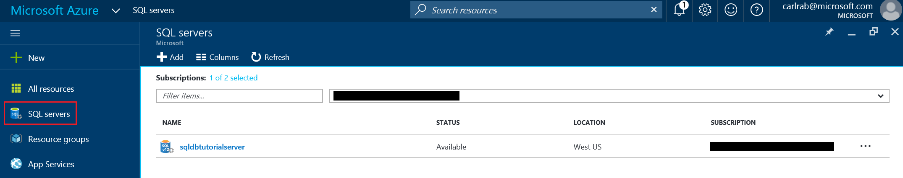
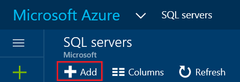

 
# Create and manage Azure SQL Database servers with the Azure portal

You can create and manage Azure SQL Database server with the [Azure portal](https://portal.azure.com/), PowerShell, the REST API, or C#. This topic is about using the Azure portal. For PowerShell, see [Create and manage servers using Powershell](sql-database-manage-servers-powershell.md).

## Create an Azure SQL Database server using the Azure portal

1. Open the **SQL servers** blade in the [Azure portal](https://portal.azure.com/). 

    

2. Click **Add** to create a SQL server

    

> [!TIP]
> For a getting started tutorial using the Azure portal and SQL Server Management Studio, see [Get started with Azure SQL Database servers, databases and firewall rules by using the Azure portal and SQL Server Management Studio](sql-database-get-started.md).
>

## View and update Azure SQL server settings using the Azure portal
1. Open the **SQL servers** blade in the [Azure portal](https://portal.azure.com/). 

    

2. Click the server you want to work with and then click the desired setting on the SQL servers blade. 

    

> [!TIP]
> For a getting started tutorial that creates a server using the Azure portal, see [Create a database - Azure portal](sql-database-get-started.md).
>

## Next steps
* For an overview of management tools, see [Overview of management tools](sql-database-manage-overview.md)
* To see how to perform management tasks using the Azure portal, see [Manage Azure SQL Databases using the Azure portal](sql-database-manage-portal.md)
* To see how to perform management tasks using PowerShell, see [Manage Azure SQL Databases using PowerShell](sql-database-manage-powershell.md)
* To see how to perform additional tasks using SQL Server Management Studio, see [SQL Server Management Studio](sql-database-manage-azure-ssms.md).
* For information about the SQL Database service, see [What is SQL Database](sql-database-technical-overview.md). 
* For information about Azure Database servers and database features, see [Features](sql-database-features.md).
