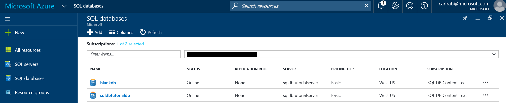
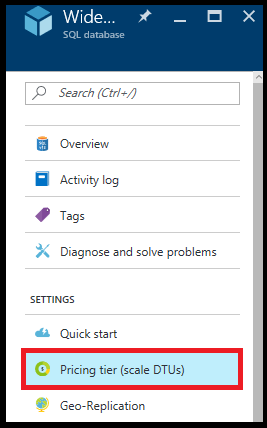

# Create and manage single Azure SQL databases with the Azure portal

You can create and manage single Azure SQL databases with the [Azure portal](https://portal.azure.com/), PowerShell, Transact-SQL, the REST API, or C#. This topic is about using the Azure portal. For PowerShell, see [Create and manage single databases with Powershell](sql-database-manage-single-databases-powershell.md). For Transact-SQL, see [Create and manage single databases with Transact-SQL](sql-database-manage-single-databases-tsql.md). 

## Create a single Azure SQL database with the Azure portal

1. Open the **SQL databases** blade in the [Azure portal](https://portal.azure.com/). 

    
2. On the SQL databases blade, click **Add**.

    

> [!TIP]
> For a tutorial creating a database with the Azure portal, see [Create a database - Azure portal](sql-database-get-started.md).
>    

## View and update SQL database settings using the Azure portal

1. Open the **SQL databases** blade in the [Azure portal](https://portal.azure.com/). 

    

2. Click the database you want to work with and then click the desired setting on the SQL database blade.

    

## Change the service tier and performance level of a single database

Open the SQL Database blade for the database you want to scale up or down:

1. In the [Azure portal](https://portal.azure.com), click **More services** > **SQL databases**.
2. Click the database you want to change.
3. On the **SQL database** blade, click **Pricing tier (scale DTUs)**:
   
   

4. Choose a new tier and click **Select**:
   
   Clicking **Select** submits a scale request to change the pricing tier. Depending on the size of your database, the scale operation can take some time to complete (see [Service tiers](sql-database-service-tiers.md).
   
   > [!NOTE]
   > Changing your database pricing tier does not change the max database size. To change your database max size, use [Transact-SQL (T-SQL)](https://msdn.microsoft.com/library/mt574871.aspx) or [PowerShell](https://msdn.microsoft.com/library/mt619433.aspx).
   >  
   
   
5. Click the notification icon (bell), in the upper right:
   
   
   
6. Click the notification text to open the details pane where you can see the status of the request.

## Next steps
* For an overview of management tools, see [Overview of management tools](sql-database-manage-overview.md).
* To see how to perform management tasks using the Azure portal, see [Manage Azure SQL Databases using the Azure portal](sql-database-manage-portal.md).
* To see how to perform management tasks using PowerShell, see [Manage Azure SQL Databases using PowerShell](sql-database-manage-powershell.md).
* To see how to perform management tasks using SQL Server Management Studio, see [SQL Server Management Studio](sql-database-manage-azure-ssms.md).
* For information about the SQL Database service, see [What is SQL Database](sql-database-technical-overview.md). 
* For information about Azure Database servers and database features, see [Features](sql-database-features.md).
