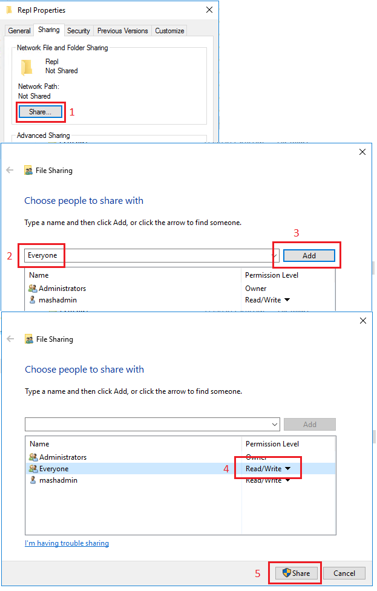
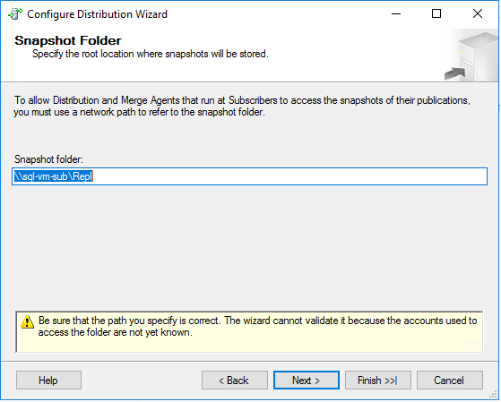
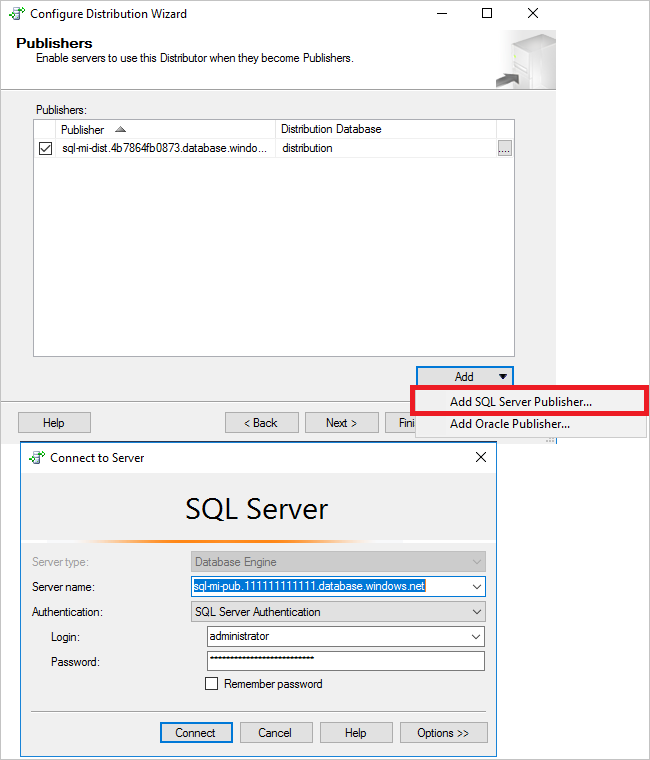

# Tutorial: Managed instance security in Azure SQL Database using Azure AD server principals (logins)


In this tutorial, you learn how to:

> [!div class="checklist"]
> - Configure a Managed Instance as a replication Publisher. 
> - Configure a Managed Instance as a replication Distributor. 
> - Configure a SQL Server as a subscriber. 

This tutorial is intended for an experienced audience and assumes that the user is familiar with deploying and connecting to both managed instances, and SQL Server VMs within Azure. As such, certain steps in this tutorial are glossed over. 


To learn more, see the [Azure SQL Database managed instance overview](sql-database-managed-instance-index.yml), [capabilities](sql-database-managed-instance.md), and [SQL Transactional Replication](sql-database-managed-instance-transactional-replication.md) articles.

## Prerequisites

To complete the tutorial, make sure you have the following prerequisites:

- An [Azure subscription](https://azure.microsoft.com/en-us/free/). 
- Experience with deploying two managed instances within the same virtual network, and a SQL Server VM in Azure. 
- The latest version of [Azure Powershell](/powershell/azure/install-az-ps?view=azps-1.7.0).

## 1 - Create the resource group
Use the following PowerShell code snippet to create a new resource group:

```powershell
# set variables
$ResourceGroupName = "SQLMI-Repl"
$Location = "West US 2"

# Create a new resource group
New-AzResourceGroup -Name  $ResourceGroupName -Location $Location
```

## 2 - Create two managed instances
Create two managed instances within this new resource group using the [Azure portal](https://portal.azure.com). 

- The name of the first managed instance should be: `sql-mi-pub` and the name of the virtual network should be `vnet-sql-mi-pub`.
- The name of the second managed instance should be: `sql-mi-dist` and it should be _in the same virtual network as the first managed instance_. 

For more information about creating a managed instance, see [Create a managed instance in the portal](sql-database-managed-instance-get-started.md)

## 3 - Create a SQL Server VM
Create a SQL Server virtual machine using the [Azure portal](https://portal.azure.com). The SQL Server virtual machine should have the following characteristics:

- Name: `sql-vm-sub`
- Image: SQL Server 2016 or greater
- Resource group: the same as the managed instance
- Location: the same as the managed instance
- Virtual network: `sql-vm-sub-vnet` 

For more information about deploying a SQL Server VM to azure, see [Quickstart: Create SQL Server VM](../virtual-machines/windows/sql/quickstart-sql-vm-create-portal.md)

## 4 - Configure VPN peering
To enable communication, configure VPN peering between the virtual network of the two managed instances, and the virtual network of the SQL Server VM. To do so, use the following PowerShell code snippet:

```powershell
# Set variables
$virtualNetwork1 = Get-AzVirtualNetwork `
  -ResourceGroupName SQLMI-Repl `
  -Name vnet-sql-mi-pub 

 $virtualNetwork2 = Get-AzVirtualNetwork `
  -ResourceGroupName SQLMI-Repl `
  -Name sql-vm-sub-vnet 

# Configure VPN peering from publisher to subscriber
Add-AzVirtualNetworkPeering `
  -Name Pub-to-Sub-Peering `
  -VirtualNetwork $virtualNetwork1 `
  -RemoteVirtualNetworkId $virtualNetwork2.Id

# Configure VPN peering from subscriber to publisher
Add-AzVirtualNetworkPeering `
  -Name Sub-to-Pub-Peering `
  -VirtualNetwork $virtualNetwork2 `
  -RemoteVirtualNetworkId $virtualNetwork1.Id

# Check status of peering on the publisher vNet; should say connected
Get-AzVirtualNetworkPeering `
 -ResourceGroupName SQLMI-Repl `
 -VirtualNetworkName vnet-sql-mi-pub `
 | Select PeeringState

# Check status of peering on the subscriber vNet; should say connected
Get-AzVirtualNetworkPeering `
 -ResourceGroupName SQLMI-Repl `
 -VirtualNetworkName sql-vm-sub-vnet `
 | Select PeeringState

```

Once VPN peering is established, test connectivity by launching SQL Server Management Studio (SSMS) on your SQL Server VM and connecting to both managed instances. For more information on connecting to a managed instance using SSMS, see [Use SSMS to connect to the MI](sql-database-managed-instance-configure-p2s#use-ssms-to-connect-to-the-managed-instance). 

## 5 - Create share on subscriber
Create a shared folder on the subscriber for the snapshot location.  To do so, do the following:

1. Connect to your SQL Server VM. 
1. Launch File Explorer and navigate to `c:\`. 
1. Right-click in the empty space, navigate to **New** and create a **New folder**. 
1. Right-click the new folder and rename it to `Repl`. 
1. Right-click the new `Repl` folder and select **Properties**. 
1. Select the **Sharing** tab, and choose to **Share** the folder. 
1. Type `Everyone` in the field and select **Add** to share the folder with `Everyone`. 
1. Using the drop down under **Permission Level**, ensure that **Everyone** has `Read/Write` permission to the **Repl** folder. 
1. Select **Share** to share the folder, and then select **Done** to close the **File sharing** window. 
1. Make note of the value for **Network Path** as you will need it for the snapshot location. It should be `\\sql-vm-sub\Repl`. 
1. Select **Close** to close the **Repl Properties** window. 

  

# 7 - Create a database
Create a new database on the publisher MI. To do so, do the following:

1. Launch SQL Server Management Studio (SSMS) on your SQL Server VM. 
1. Connect to the `sql-mi-pub` managed instance. 
1. Open a **New Query** window and execute the following T-SQL query to create the database:

```sql
-- Create the databases
USE [master]
GO

-- Drop database if it exists
IF EXISTS (SELECT *FROM sys.sysdatabases WHERE name = 'ReplTutorial')
BEGIN
    DROP DATABASE DemoDW
END
GO

-- Create new database
CREATE DATABASE [ReplTutorial]
GO


-- Create table
USE [ReplTutorial]
GO
CREATE TABLE ReplTest (
	ID INT NOT NULL PRIMARY KEY,
	c1 VARCHAR(100) NOT NULL,
	dt1 DATETIME NOT NULL DEFAULT getdate()
)
GO

-- Populate table with dat
USE [ReplTutorial]
GO

INSERT INTO ReplTest (ID, c1) VALUES (6, 'pub')
INSERT INTO ReplTest (ID, c1) VALUES (2, 'pub')
INSERT INTO ReplTest (ID, c1) VALUES (3, 'pub')
INSERT INTO ReplTest (ID, c1) VALUES (4, 'pub')
INSERT INTO ReplTest (ID, c1) VALUES (5, 'pub')
GO
SELECT * FROM ReplTest
GO
```

## 6 - Configure distribution 
Once connectivity is established and you have a sample database, you can configure distribution on your `sql-mi-dist` managed instance. To do so, do the following:

1. Launch SQL Server Management Studio (SSMS) on your SQL Server VM. 
1. Connect to the `sql-mi-dist` managed instance. 
1. Right-click the **Replication** node within **Object Explorer** and select **Configure Distribution**. 
1. Select **Next** to move past the welcome page. 
1. Select the option where the `sql-mi-dist` instance acts as its own distributor, and select **Next**. 
1. On the **Snapshot Folder** page, type in the value of the **Network path** of your folder. It should be `\\sql-vm-sub\Repl`. Select **Next**.  

   

1. On the **Distribution Database** page, leave all the values as default. 
1. On the **Publishers** page, select **Add** and then select **Add SQL Server Publisher** from the drop down. This will open the **Connect to Server** dialog box. Connect to the publisher instance `sql-mi-pub`. Select **Next**. 

  

1. On the **Distributor Password** page, type in a complex password that will be used by the distributor. Select **Next**. 
1. On the **Wizard Action** page, ensure that **Configure distribution** is checked and select **Next**. 
1. On the **Complete the Wizard** page, review your configuration and select **Finish** when ready to proceed. 
1. Select **Close** once the configuration is complete. 


## 7 - Create the publication
Once distribution  has been configured, you can now create the publisher. To do so, do the following:

1. Launch SQL Server Management Studio (SSMS) on your SQL Server VM. 
1. Connect to the `sql-mi-pub` managed instance. 
1. In **Object Explorer**, expand the **Replication** node and right-click the **Local Publication** folder. Select **New Publication...**. 
1. Select **Next** to move past the welcome page. 
1. On the **Distributor** page, select the option to **Use the following server as the Distributor**. Select **Add...**. Connect to your distributor instance, `sql-mi-dist`. Select **Next**. 
1. On the **Administrative Password** page, supply the password that you manually configured when you configured distribution (on the **Distributor password** page). Select **Next**. 
1. 


## Clean up resources

```powershell
# Set the variables
$ResourceGroupName = "SQLMI-Repl"

# Remove the resource2 group
Remove-AzResourceGroup -Name $ResourceGroupName

```

## Next steps

### Enable security features

See the following [managed instance capabilities security features](sql-database-managed-instance.md#azure-sql-database-security-features) article for a comprehensive list of ways to secure your database. The following security features are discussed:

- [Managed instance auditing](sql-database-managed-instance-auditing.md) 
- [Always encrypted](/sql/relational-databases/security/encryption/always-encrypted-database-engine)
- [Threat detection](sql-database-managed-instance-threat-detection.md) 
- [Dynamic data masking](/sql/relational-databases/security/dynamic-data-masking)
- [Row-level security](/sql/relational-databases/security/row-level-security) 
- [Transparent data encryption (TDE)](https://docs.microsoft.com/sql/relational-databases/security/encryption/transparent-data-encryption-azure-sql)

### Managed instance capabilities

For a complete overview of a managed instance capabilities, see:

> [!div class="nextstepaction"]
> [Managed instance capabilities](sql-database-managed-instance.md)
