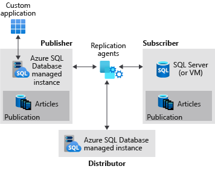
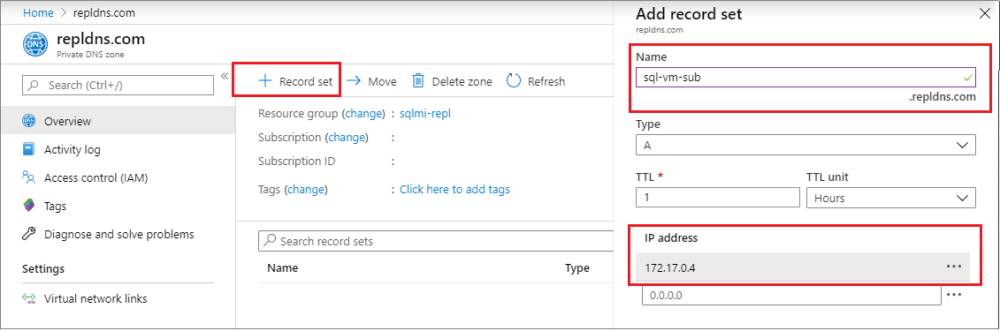

# Tutorial: Configure transactional replication between two managed instances and SQL Server


In this tutorial, you learn how to:

> [!div class="checklist"]
> - Configure a Managed Instance as a replication Publisher. 
> - Configure a Managed Instance as a replication Distributor. 
> - Configure a SQL Server as a subscriber. 



This tutorial is intended for an experienced audience and assumes that the user is familiar with deploying and connecting to both managed instances, and SQL Server VMs within Azure. As such, certain steps in this tutorial are glossed over. 

To learn more, see the [Azure SQL Database managed instance overview](sql-database-managed-instance-index.yml), [capabilities](sql-database-managed-instance.md), and [SQL Transactional Replication](sql-database-managed-instance-transactional-replication.md) articles.

To configure replication between a managed instance publisher and a managed instance subscriber, see [Configure transactional replication between two managed instances](replication-with-sql-database-managed-instance.md). 

## Prerequisites

To complete the tutorial, make sure you have the following prerequisites:

- An [Azure subscription](https://azure.microsoft.com/free/). 
- Experience with deploying two managed instances within the same virtual network. 
- A SQL Server subscriber, either on-premises or an Azure VM. This tutorial uses an Azure VM.  
- [SQL Server Management Studio (SSMS) 18.0 or greater](/sql/ssms/download-sql-server-management-studio-ssms).
- The latest version of [Azure Powershell](/powershell/azure/install-az-ps?view=azps-1.7.0).
- Port 445, and 1433 allow SQL traffic on both the Azure Firewall and the Windows Firewall. 

## 1 - Create the resource group
Use the following PowerShell code snippet to create a new resource group:

```powershell-interactive
# set variables
$ResourceGroupName = "SQLMI-Repl"
$Location = "East US 2"

# Create a new resource group
New-AzResourceGroup -Name  $ResourceGroupName -Location $Location
```

## 2 - Create two managed instances
Create two managed instances within this new resource group using the [Azure portal](https://portal.azure.com). 

- The name of the publisher managed instance should be: `sql-mi-publisher` (along with a few characters for randomization) and the name of the virtual network should be `vnet-sql-mi-publisher`.
- The name of the distributor managed instance should be: `sql-mi-distributor` (along with a few characters for randomization) and it should be _in the same virtual network as the publisher managed instance_.

   

For more information about creating a managed instance, see [Create a managed instance in the portal](sql-database-managed-instance-get-started.md)

  > [!NOTE]
  > For the sake of simplicity, and because it is the most common configuration, this tutorial suggests placing the distributor managed instance within the same virtual network as the publisher. However, it's possible to create the distributor in a separate virtual network. To do so, you will need to configure VPN peering between the virtual networks of the publisher and distributor, and then configure VPN peering between the virtual networks of the distributor and subscriber. 

## 3 - Create a SQL Server VM
Create a SQL Server virtual machine using the [Azure portal](https://portal.azure.com). The SQL Server virtual machine should have the following characteristics:

- Name: `sql-vm-sub`
- Image: SQL Server 2016 or greater
- Resource group: the same as the managed instance
- Virtual network: `sql-vm-sub-vnet` 

For more information about deploying a SQL Server VM to Azure, see [Quickstart: Create SQL Server VM](../virtual-machines/windows/sql/quickstart-sql-vm-create-portal.md).

## 4 - Configure VPN peering
Configure VPN peering to enable communication between the virtual network of the two managed instances, and the virtual network of SQL Server. To do so, use this PowerShell code snippet:

```powershell-interactive
# Set variables
$SubscriptionId = '<SubscriptionID>'
$resourceGroup = 'SQLMI-Repl'
$pubvNet = 'sql-mi-publisher-vnet'
$subvNet = 'sql-vm-sub-vnet'
$pubsubName = 'Pub-to-Sub-Peer'
$subpubName = 'Sub-to-Pub-Peer'

$virtualNetwork1 = Get-AzVirtualNetwork `
  -ResourceGroupName $resourceGroup `
  -Name $pubvNet 

 $virtualNetwork2 = Get-AzVirtualNetwork `
  -ResourceGroupName $resourceGroup `
  -Name $subvNet  

# Configure VPN peering from publisher to subscriber
Add-AzVirtualNetworkPeering `
  -Name $pubsubName `
  -VirtualNetwork $virtualNetwork1 `
  -RemoteVirtualNetworkId $virtualNetwork2.Id

# Configure VPN peering from subscriber to publisher
Add-AzVirtualNetworkPeering `
  -Name $subpubName `
  -VirtualNetwork $virtualNetwork2 `
  -RemoteVirtualNetworkId $virtualNetwork1.Id

# Check status of peering on the publisher vNet; should say connected
Get-AzVirtualNetworkPeering `
 -ResourceGroupName $resourceGroup `
 -VirtualNetworkName $pubvNet `
 | Select PeeringState

# Check status of peering on the subscriber vNet; should say connected
Get-AzVirtualNetworkPeering `
 -ResourceGroupName $resourceGroup `
 -VirtualNetworkName $subvNet `
 | Select PeeringState

```

Once VPN peering is established, test connectivity by launching SQL Server Management Studio (SSMS) on your SQL Server and connecting to both managed instances. For more information on connecting to a managed instance using SSMS, see [Use SSMS to connect to the MI](sql-database-managed-instance-configure-p2s.md#use-ssms-to-connect-to-the-managed-instance). 


## 5 - Create private DNS zone

A private DNS zone allows DNS routing between the managed instances and the SQL Server. 

### Create private DNS Zone
1. Sign into the [Azure portal](https://portal.azure.com).
1. Select **Create a resource** to create a new Azure resource. 
1. Search for `private dns zone` on Azure Marketplace. 
1. Choose the **Private DNS zone** resource published by Microsoft and then select **Create** to create the DNS zone. 
1. Choose the subscription and resource group from the drop-down. 
1. Provide an arbitrary name for your DNS zone such as `repldns.com`. 

   

1. Select **Review + create**. Review the parameters for your private DNS zone and then select **Create** to create your resource. 

### Create A record

1. Go to your new **Private DNS zone** and select **Overview**. 
1. Select **+ Record set** to create a new A-Record. 
1. Provide the name of your SQL Server VM as well as the private internal IP address. 

   

1. Select **OK** to create the A record. 

### Link the virtual network

1. Go to your new **Private DNS zone** and select **Virtual network links**. 
1. Select **+ Add**. 
1. Provide a name for the link, such as `Pub-link`. 
1. Select your subscription from the drop-down and then select the virtual network for your publisher managed instance. 
1. Check the box next to **Enable auto registration**. 

   

1. Select **OK** to link your virtual network. 
1. Repeat these steps to add a link for the subscriber virtual network, with a name such as `Sub-link`. 


## 6 - Create Azure Storage Account

[Create an Azure Storage Account](https://docs.microsoft.com/azure/storage/common/storage-create-storage-account#create-a-storage-account) for the working directory, and then create a [file share](../storage/files/storage-how-to-create-file-share.md) within the storage account. 

Copy the file share path in the format of:
`\\storage-account-name.file.core.windows.net\file-share-name`   

Example: `\\replstorage.file.core.windows.net\replshare`

Copy the storage access key connection string in the format of:
`DefaultEndpointsProtocol=https;AccountName=<Storage-Account-Name>;AccountKey=****;EndpointSuffix=core.windows.net`   

Example: `DefaultEndpointsProtocol=https;AccountName=replstorage;AccountKey=dYT5hHZVu9aTgIteGfpYE64cfis0mpKTmmc8+EP53GxuRg6TCwe5eTYWrQM4AmQSG5lb3OBskhg==;EndpointSuffix=core.windows.net`


For more information, see [Manage storage account access keys](../storage/common/storage-account-keys-manage.md). 


## 7 - Create a database
Create a new database on the publisher MI. To do so, follow these steps:

1. Launch SQL Server Management Studio (SSMS) on your SQL Server. 
1. Connect to the `sql-mi-publisher` managed instance. 
1. Open a **New Query** window and execute the following T-SQL query to create the database:

```sql
-- Create the databases
USE [master]
GO

-- Drop database if it exists
IF EXISTS (SELECT * FROM sys.sysdatabases WHERE name = 'ReplTutorial')
BEGIN
    DROP DATABASE ReplTutorial
END
GO

-- Create new database
CREATE DATABASE [ReplTutorial]
GO

-- Create table
USE [ReplTutorial]
GO
CREATE TABLE ReplTest (
	ID INT NOT NULL PRIMARY KEY,
	c1 VARCHAR(100) NOT NULL,
	dt1 DATETIME NOT NULL DEFAULT getdate()
)
GO

-- Populate table with data
USE [ReplTutorial]
GO

INSERT INTO ReplTest (ID, c1) VALUES (6, 'pub')
INSERT INTO ReplTest (ID, c1) VALUES (2, 'pub')
INSERT INTO ReplTest (ID, c1) VALUES (3, 'pub')
INSERT INTO ReplTest (ID, c1) VALUES (4, 'pub')
INSERT INTO ReplTest (ID, c1) VALUES (5, 'pub')
GO
SELECT * FROM ReplTest
GO
```

## 8 - Configure distribution 
Once connectivity is established and you have a sample database, you can configure distribution on your `sql-mi-distributor` managed instance. To do so, follow these steps:

1. Launch SQL Server Management Studio (SSMS) on your SQL Server. 
1. Connect to the `sql-mi-distributor` managed instance. 
1. Open a **New Query** window and run the following Transact-SQL code to configure distribution on the distributor managed instance: 

   ```sql
   EXEC sp_adddistpublisher @publisher = 'sql-mi-publisher.b6bf57.database.windows.net', -- primary publisher
        @distribution_db = N'distribution',
        @security_mode = 0,
        @login = N'azureuser',
        @password = N'<publisher_password>',
        @working_directory = N'\\replstorage.file.core.windows.net\replshare',
        @storage_connection_string = N'<storage_connection_string>'
        -- example: @storage_connection_string = N'DefaultEndpointsProtocol=https;AccountName=replstorage;AccountKey=dYT5hHZVu9aTgIteGfpYE64cfis0mpKTmmc8+EP53GxuRg6TCwe5eTYWrQM4AmQSG5lb3OBskhg==;EndpointSuffix=core.windows.net'

   ```

   > [!NOTE]
   > Be sure to use only backslashes (`\`) for the @working_directory parameter. Using a forward slash (`/`) can cause an error when connecting to the file share. 

1. Connect to the `sql-mi-publisher` managed instance. 
1. Open a **New Query** window and run the following Transact-SQL code to register the distributor at the publisher: 

```sql
Use MASTER
EXEC sys.sp_adddistributor @distributor = 'sql-mi-distributor.b6bf57.database.windows.net', @password = '<distributor_admin_password>' 
```


## 9 - Create the publication
Once distribution has been configured, you can now create the publication. To do so, follow these steps: 

1. Launch SQL Server Management Studio (SSMS) on your SQL Server. 
1. Connect to the `sql-mi-publisher` managed instance. 
1. In **Object Explorer**, expand the **Replication** node and right-click the **Local Publication** folder. Select **New Publication...**. 
1. Select **Next** to move past the welcome page. 
1. On the **Publication Database** page, select the `ReplTutorial` database you created previously. Select **Next**. 
1. On the **Publication type** page, select **Transactional publication**. Select **Next**. 
1. On the **Articles** page, check the box next to **Tables**. Select **Next**. 
1. On the **Filter Table Rows** page, select **Next** without adding any filters. 
1. On the **Snapshot Agent** page, check the box next to **Create snapshot immediately and keep the snapshot available to initialize subscriptions**. Select **Next**. 
1. On the **Agent Security** page, select **Security Settings..**. Provide SQL Server login credentials to use for the Snapshot agent, and to connect to the Publisher. Select **OK** to close the **Snapshot Agent Security** page. Select **Next**. 

   

1. On the **Wizard Actions** page, choose to **Create the publication** and (optionally) choose to **Generate a script file with steps to create the publication** if you want to save this script for later. 
1. On the **Complete the Wizard** page, name your publication `ReplTest` and select **Next** to create your publication. 
1. Once your publication has been created, refresh the **Replication** node in **Object Explorer** and expand **Local Publications** to see your new publication. 


## 10 - Create the subscription 

Once the publication has been created, you can create the subscription. To do so, follow these steps: 

1. Launch SQL Server Management Studio (SSMS) on your SQL Server. 
1. Connect to the `sql-mi-publisher` managed instance. 
1. Open a **New Query** window and run the following Transact-SQL code to add the subscription and distribution agent. Use the DNS as part of the subscriber name. 

```sql
use [ReplTutorial]
exec sp_addsubscription 
@publication = N'ReplTest',
@subscriber = N'sql-vm-sub.repldns.com', -- include the DNS configured in the private DNS zone
@destination_db = N'ReplSub', 
@subscription_type = N'Push', 
@sync_type = N'automatic', 
@article = N'all', 
@update_mode = N'read only', 
@subscriber_type = 0

exec sp_addpushsubscription_agent
@publication = N'ReplTest',
@subscriber = N'sql-vm-sub.repldns.com', -- include the DNS configured in the private DNS zone
@subscriber_db = N'ReplSub', 
@job_login = N'azureuser', 
@job_password = '<Complex Password>', 
@subscriber_security_mode = 0, 
@subscriber_login = N'azureuser', 
@subscriber_password = '<Complex Password>', 
@dts_package_location = N'Distributor'
GO
```

## 11 - Test replication 

Once replication has been configured, you can test it by inserting new items on the publisher and watching the changes propagate to the subscriber. 

Run the following T-SQL snippet to view the rows on the subscriber:

```sql
Use ReplSub
select * from dbo.ReplTest
```

Run the following T-SQL snippet to insert additional rows on the publisher, and then check the rows again on the subscriber. 

```sql
Use ReplTutorial
INSERT INTO ReplTest (ID, c1) VALUES (15, 'pub')
```

## Clean up resources

1. Navigate to your resource group in the [Azure portal](https://portal.azure.com). 
1. Select the managed instance(s) and then select **Delete**. Type `yes` in the text box to confirm you want to delete the resource and then select **Delete**. This process may take some time to complete in the background, and until it"s done, you will not be able to delete the *Virtual cluster* or any other dependent resources. Monitor the delete in the Activity tab to confirm your managed instance has been deleted. 
1. Once the managed instance is deleted, delete the *Virtual cluster* by selecting it in your resource group, and then choosing **Delete**. Type `yes` in the text box to confirm you want to delete the resource and then select **Delete**. 
1. Delete any remaining resources. Type `yes` in the text box to confirm you want to delete the resource and then select **Delete**. 
1. Delete the resource group by selecting **Delete resource group**, typing in the name of the resource group, `myResourceGroup`, and then selecting **Delete**. 

## Known errors

### Windows logins are not supported

`Exception Message: Windows logins are not supported in this version of SQL Server.`

The agent was configured with a Windows login and needs to use a SQL Server login instead. Use the **Agent Security** page of the **Publication properties** to change the login credentials to a SQL Server login. 


### Failed to connect to Azure Storage


`Connecting to Azure Files Storage '\\replstorage.file.core.windows.net\replshare' Failed to connect to Azure Storage '' with OS error: 53.`

2019-11-19 02:21:05.07 Obtained Azure Storage Connection String for replstorage
2019-11-19 02:21:05.07 Connecting to Azure Files Storage '\\replstorage.file.core.windows.net\replshare'
2019-11-19 02:21:31.21 Failed to connect to Azure Storage '' with OS error: 53.


This is likely because port 445 is closed in either the Azure firewall, the Windows firewall, or both. 

`Connecting to Azure Files Storage '\\replstorage.file.core.windows.net\replshare' Failed to connect to Azure Storage '' with OS error: 55.`

Using a forward slash instead of backslash in the file path for the file share can cause this error. 
  This is okay: `\\replstorage.file.core.windows.net\replshare`
  This can cause an OS 55 error: `'\\replstorage.file.core.windows.net/replshare'`

### Could not connect to Subscriber

`The process could not connect to Subscriber 'SQL-VM-SUB`
`Could not open a connection to SQL Server [53].`
`A network-related or instance-specific error has occurred while establishing a connection to SQL Server. Server is not found or not accessible. Check if instance name is correct and if SQL Server is configured to allow remote connections.`

Possible solutions:
- Ensure port 1433 is open. 
- Ensure TCP/IP is enabled on the subscriber. 
- Confirm the DNS name was used when creating the subscriber. 
- Verify that your virtual networks are correctly linked in the private DNS zone. 
- Verify your A-record is configured correctly. 
- Verify your VPN peering is configured correctly. 

### No publications to which you can subscribe

When adding a new subscription using the **New Subscription** wizard, on the **Publication** page, you may find that there are no databases and publications listed as available options, and you might see the following error message:

`There are no publications to which you can subscribe, either because this server has no publications or because you do not have sufficient privileges to access the publications.`
 
While it's possible that this error message is accurate, and there really aren't publications available on the publisher you connected to, or you're lacking sufficient permissions, this error could also be caused by an older version of SQL Server Management Studio. Try upgrading to SQL Server Management Studio 18.0 or greater to rule this out as a root cause. 


## Next steps

### Enable security features

See the following [managed instance capabilities security features](sql-database-managed-instance.md#azure-sql-database-security-features) article for a comprehensive list of ways to secure your database. The following security features are discussed:

- [Managed instance auditing](sql-database-managed-instance-auditing.md) 
- [Always encrypted](/sql/relational-databases/security/encryption/always-encrypted-database-engine)
- [Threat detection](sql-database-managed-instance-threat-detection.md) 
- [Dynamic data masking](/sql/relational-databases/security/dynamic-data-masking)
- [Row-level security](/sql/relational-databases/security/row-level-security) 
- [Transparent data encryption (TDE)](https://docs.microsoft.com/sql/relational-databases/security/encryption/transparent-data-encryption-azure-sql)

### Managed instance capabilities

For a complete overview of a managed instance capabilities, see:

> [!div class="nextstepaction"]
> [Managed instance capabilities](sql-database-managed-instance.md)
