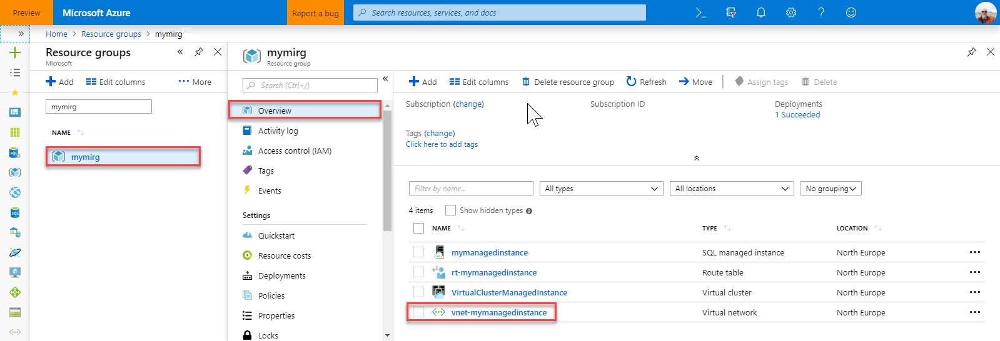
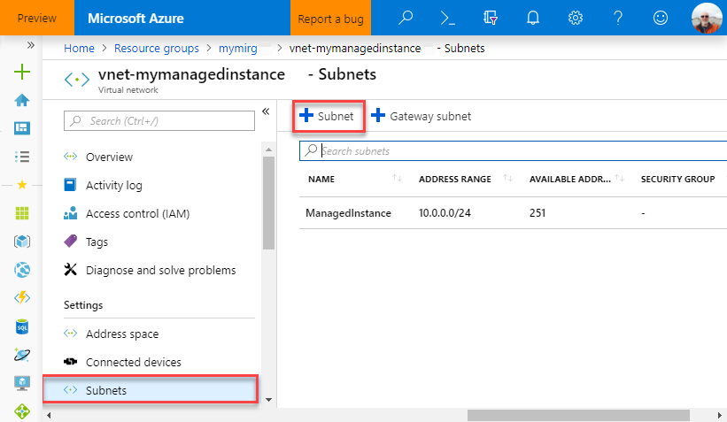
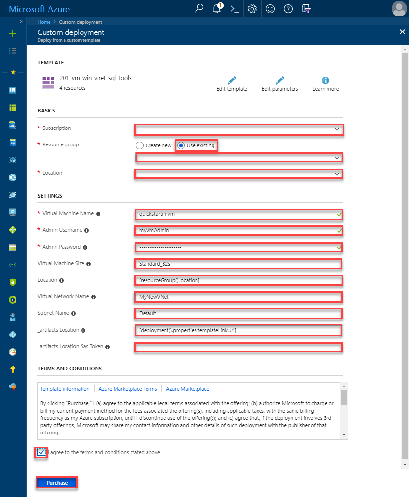
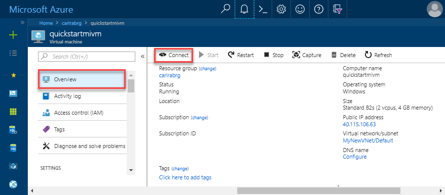
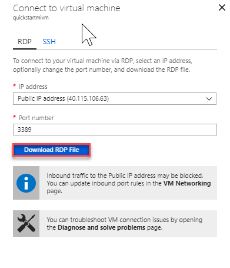

# Configure Azure VM to connect to an Azure SQL Database Managed Instance

This quickstarts demonstrates how to configure an Azure virtual machine to connect to an Azure SQL Database Managed Instance using SQL Server Management Studio (SSMS). For a quickstart showing how to connect from an on-premises client computer using a point-to-site connection, see [Configure a point-to-site connection](sql-database-managed-instance-configure-p2s.md) 

## Prerequisites

This quickstart uses as its starting point the resources created in this quickstart: [Create a Managed Instance](sql-database-managed-instance-get-started.md).

## Sign in to the Azure portal

Sign in to the [Azure portal](https://portal.azure.com/).

## Create a new subnet in the Managed Instance VNet

The following steps create a new subnet in the Managed Instance VNet for an Azure virtual machine to connect to the Managed Instance. The Managed Instance subnet is dedicated to Managed Instances and you cannot create any other resources (for example Azure Virtual Machines) in that subnet. 

1. Open the resource group for the Managed Instance that you created in the [Create a Managed Instance](sql-database-managed-instance-get-started.md) quickstart and click the virtual network for your Managed Instance and then click **Subnets**.

   

2. Click the **+** sign next to **Subnet** to create a new subnet.

   

3. Fill out the form with the requested information, using the information in the following table:

   | Setting| Suggested value | Description |
   | ---------------- | ----------------- | ----------- | 
   | **Name** | Any valid name|For valid names, see [Naming rules and restrictions](https://docs.microsoft.com/azure/architecture/best-practices/naming-conventions).|
   | **Address range (CIDR block)** | A valid range | The default value is good for this quickstart.|
   | **Network security group** | None | The default value is good for this quickstart.|
   | **Route table** | None | The default value is good for this quickstart.|
   | **Service endpoints ** | 0 selected | The default value is good for this quickstart.|
   | **Subnet delegation** | None | The default value is good for this quickstart.|
 
   

4. Click **OK** to create this additional subnet in the Managed Instance VNet.

## Create a virtual machine in the new subnet in the VNet

The following steps show you how to create a virtual machine in the new subnet to connect to the Managed Instance. 

## Prepare the Azure virtual machine

Since SQL Managed Instance is placed in your private Virtual Network, you need to create an Azure VM with some installed SQL client tool like SQL Server Management Studio or Azure Data Studio to connect to the Managed Instance and execute queries. This quickstart uses SQL Server Management Studio.

The easiest way to create a client virtual machine with all necessary tools is to use the Azure Resource Manager templates.

1. Click on the following button to create a client virtual machine and install SQL Server Management Studio (make sure that you are signed-in to the Azure portal in another browser tab):

    

2. Fill out the form with the requested information, using the information in the following table:

   | Setting| Suggested value | Description |
   | ---------------- | ----------------- | ----------- |
   | **Subscription** | A valid subscription | Must be a subscription in which you have permission to create new resources |
   | **Resource Group** |The resource group that you specified in the [Create Managed Instance](sql-database-managed-instance-get-started.md) quickstart.|This must be the resource group in which the VNet exists.|
   | **Location** | The location for the resource group | This value is populated based on the resource group selected | 
   | **Virtual machine name**  | Any valid name | For valid names, see [Naming rules and restrictions](https://docs.microsoft.com/azure/architecture/best-practices/naming-conventions).|
   |**Admin Username**|Any valid user name|For valid names, see [Naming rules and restrictions](https://docs.microsoft.com/azure/architecture/best-practices/naming-conventions). Do not use "serveradmin" as that is a reserved server-level role.| 
   |**Password**|Any valid password|The password must be at least 12 characters long and meet the [defined complexity requirements](../virtual-machines/windows/faq.md#what-are-the-password-requirements-when-creating-a-vm).|
   | **Virtual Machine Size** | Any valid size | The default in this template of **Standard_B2s is sufficient for this quickstart. |
   | **Location**|[resourceGroup().location].| Do not change this value |
   | **Virtual Network Name**|The location that you previously selected|For information about regions, see [Azure Regions](https://azure.microsoft.com/regions/).|
   | **Subnet name**|The name of the subnet that you created in the previous procedure| Do not choose the subnet in which you created the Managed Instance|
   | **artifacts Location** | [deployment().properties.templateLink.uri]  Do not change this value |
   | **artifacts Location Sas token** | leave blank | Do not change this value |

   

   If you used the suggested VNet name and the default subnet in [creating your Managed Instance](sql-database-managed-instance-get-started.md), you don't need to change last two parameters. Otherwise you should change these values to the values that you entered when you set up the network environment.

3. Select the **I agree to terms and conditions stated above** checkbox.
4. Click **Purchase** to deploy the Azure VM in your network.
5. Click the **Notifications** icon to view the status of deployment.
   
   Do not continue until the Azure virtual machine is created. 

## Connect to virtual machine

The following steps show you how to connect to your newly created virtual machine using a remote desktop connection.

1. After deployment completes, go to the virtual machine resource.

      

2. Click **Connect**. 
   
   A Remote Desktop Protocol file (.rdp file) form appears with the public IP address and port number for the virtual machine. 

     

3. Click **Download RDP File**.
 
   > [!NOTE]
   > You can also use SSH to connect to your VM.

4. Close the **Connect to virtual machine** form.
5. To connect to your VM, open the downloaded RDP file. 
6. When prompted, click **Connect**. On a Mac, you need an RDP client such as this [Remote Desktop Client](https://itunes.apple.com/us/app/microsoft-remote-desktop/id715768417?mt=12) from the Mac App Store.

6. Enter the user name and password you specified when creating the virtual machine, then click **Ok**.

7. You may receive a certificate warning during the sign-in process. Click **Yes** or **Continue** to proceed with the connection.

You are connected to your virtual machine in the Server Manager dashboard.

## Use SSMS to connect to the Managed Instance

1. In the virtual machine, open SQL Server Management Studio (SSMS).
 
   It will take a few moments to open as it needs to complete its configuration as this is the first time SSMS has been started.
2. In the **Connect to Server** dialog box, enter the fully qualified **host name** for your Managed Instance in the **Server name** box, select **SQL Server Authentication**, provide your login and password, and then click **Connect**.

      

After you connect, you can view your system and user databases in the Databases node, and various objects in the Security, Server Objects, Replication, Management, SQL Server Agent, and XEvent Profiler nodes.

## Next steps

- For a quickstart showing how to connect from an on-premises client computer using a point-to-site connection, see [Configure a point-to-site connection](sql-database-managed-instance-configure-p2s.md).
- For an overview of the connection options for applications, see [Connect your applications to Managed Instance](sql-database-managed-instance-connect-app.md).
- To restore an existing SQL Server database from on-premises to a Managed instance, you can use the [Azure Database Migration Service (DMS) for migration](../dms/tutorial-sql-server-to-managed-instance.md) to restore from a database backup file or the [T-SQL RESTORE command](sql-database-managed-instance-get-started-restore.md) to restore from a database backup file.
