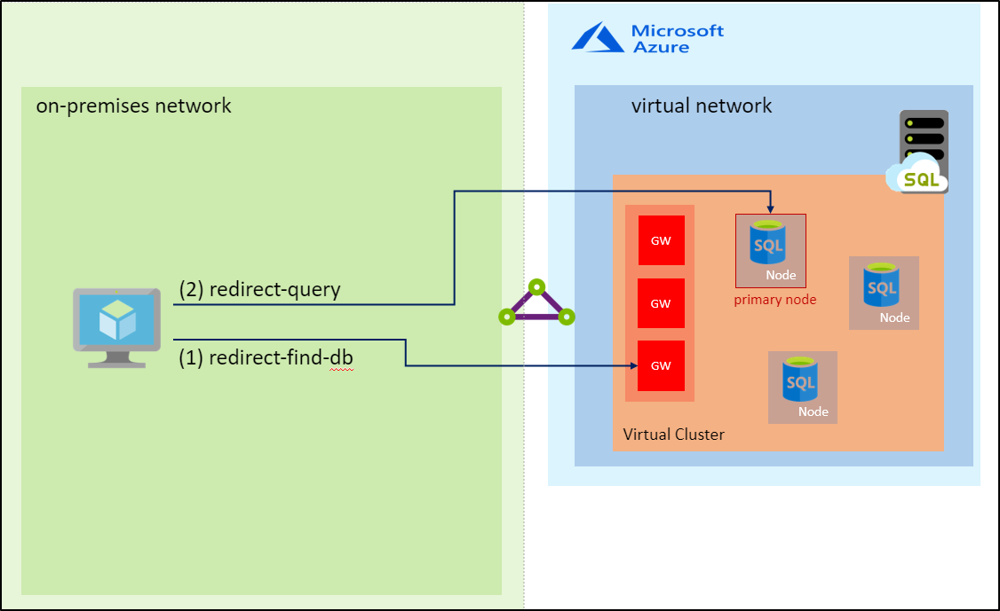
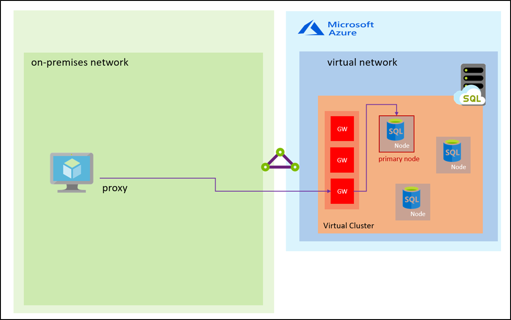

# Azure SQL Database managed instance connection types

This article explains how clients connect to Azure SQL Database managed instance depending on the connection type. Script samples to change connection types are provided below, along with considerations related to changing the default connectivity settings.

## Connection types

Azure SQL Database managed instance supports the following two connection types:

- **Redirect (recommended):** Clients establish connections directly to the node hosting the database. To enable connectivity using redirect, you must open firewalls and Network Security Groups (NSG) to allow access on ports 1433, and 11000-11999. Packets go directly to the database, and hence there are latency and throughput performance improvements using Redirect over Proxy.
- **Proxy (default):** In this mode, all connections are using a proxy gateway component. To enable connectivity, only port 1433 for private networks and port 3342 for public connection needs to be opened. Choosing this mode can result in higher latency and lower throughput, depending on nature of the workload. We highly recommend the Redirect connection policy over the Proxy connection policy for the lowest latency and highest throughput.

## Redirect connection type

Redirect connection type means that after the TCP session is established to the SQL engine, the client session obtains the destination virtual IP of the virtual cluster node from the load balancer. Subsequent packets flow directly to the virtual cluster node, bypassing the gateway. The following diagram illustrates this traffic flow.



> [!IMPORTANT]
> Redirection connection type currently works only for private endpoint. Regardless of the connection type setting, connections coming through the public endpoint would be through a proxy.

## Proxy connection type

Proxy connection type means that the TCP session is established using the gateway and all subsequent packets flow through it. The following diagram illustrates this traffic flow.



## Script to change connection type settings using PowerShell

[!INCLUDE [updated-for-az](../../includes/updated-for-az.md)]

The following PowerShell script shows how to change the connection type for a managed instance to Redirect.

```powershell
Install-Module -Name Az
Import-Module Az.Accounts
Import-Module Az.Sql

Connect-AzAccount
# Get your SubscriptionId from the Get-AzSubscription command
Get-AzSubscription
# Use your SubscriptionId in place of {subscription-id} below
Select-AzSubscription -SubscriptionId {subscription-id}
# Replace {rg-name} with the resource group for your managed instance, and replace {mi-name} with the name of your managed instance
$mi = Get-AzSqlInstance -ResourceGroupName {rg-name} -Name {mi-name}
$mi = $mi | Set-AzSqlInstance -ProxyOverride "Redirect" -force
```

## Next steps

- [Restore a database to a managed instance](sql-database-managed-instance-get-started-restore.md)
- Learn how to [configure a public endpoint on managed instance](sql-database-managed-instance-public-endpoint-configure.md)
- Learn about [managed instance connectivity architecture](sql-database-managed-instance-connectivity-architecture.md)