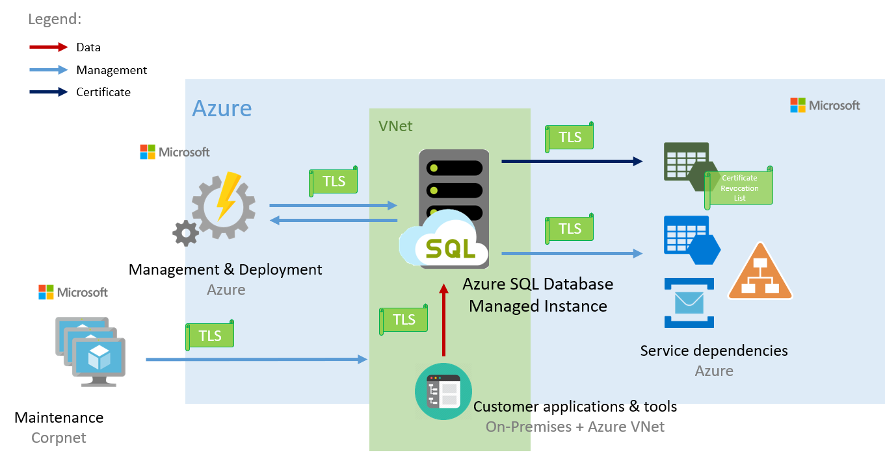
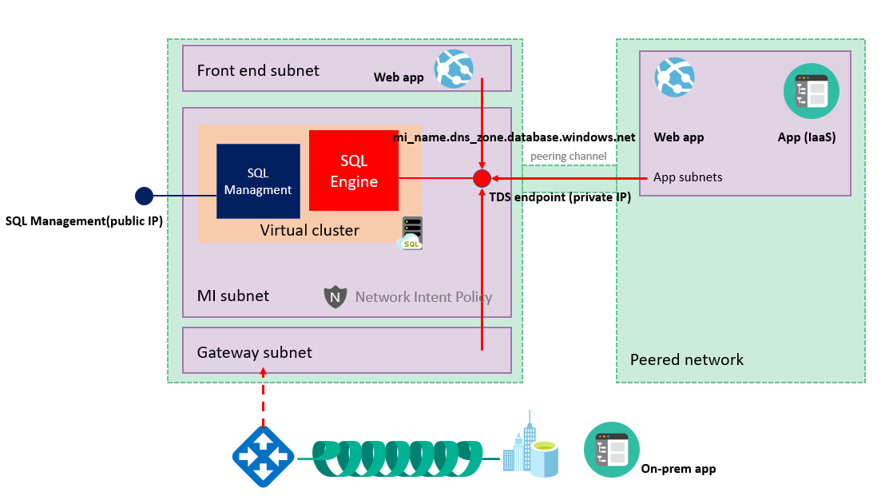
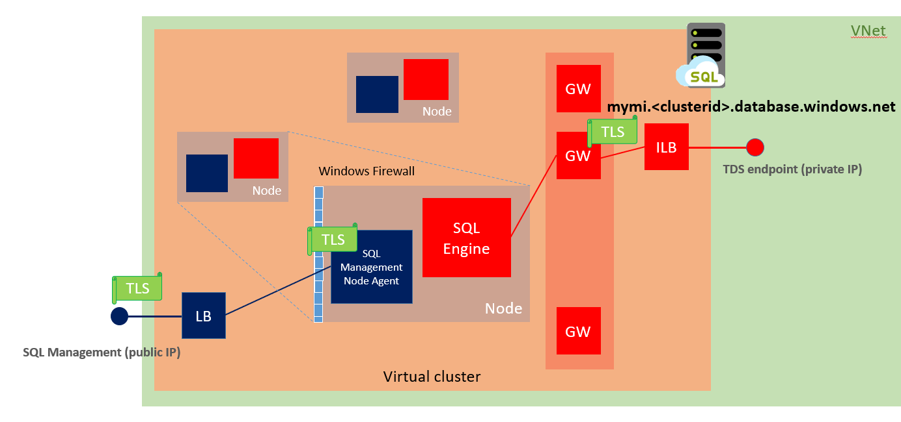

# Connectivity architecture for a managed instance in Azure SQL Database

This article explains communication in an Azure SQL Database managed instance. It also describes connectivity architecture and how the components direct traffic to the managed instance.  

The SQL Database managed instance is placed inside the Azure virtual network and the subnet that's dedicated to managed instances. This deployment provides:

- A secure private IP address.
- The ability to connect an on-premises network to a managed instance.
- The ability to connect a managed instance to a linked server or another on-premises data store.
- The ability to connect a managed instance to Azure resources.

## Communication overview

The following diagram shows entities that connect to a managed instance. It also shows the resources that need to communicate with the managed instance. The communication process at the bottom of the diagram represents customer applications and tools that connect to the managed instance as data sources.  

A managed instance is a platform as a service (PaaS) offering. Microsoft uses automated agents (management, deployment, and maintenance) to manage this service based on telemetry data streams. Because Microsoft is responsible for management, customers can't access the managed instance virtual cluster machines through Remote Desktop Protocol (RDP).

Some SQL Server operations started by end users or applications might require managed instances to interact with the platform. One case is the creation of a managed instance database. This resource is exposed through the Azure portal, PowerShell, Azure CLI, and the REST API.

Managed instances depend on Azure services such as Azure Storage for backups, Azure Event Hubs for telemetry, Azure Active Directory for authentication, Azure Key Vault for Transparent Data Encryption (TDE) and a couple of Azure platform services that provide security and supportability features. The managed instances makes connections to these services.

All communications are encrypted and signed using certificates. To check the trustworthiness of communicating parties, managed instances constantly verify these certificates through certificate revocation lists. If the certificates are revoked, the managed instance closes the connections to protect the data.

## High-level connectivity architecture

At a high level, a managed instance is a set of service components. These components are hosted on a dedicated set of isolated virtual machines that run inside the customer's virtual network subnet. These machines form a virtual cluster.

A virtual cluster can host multiple managed instances. If needed, the cluster automatically expands or contracts when the customer changes the number of provisioned instances in the subnet.

Customer applications can connect to managed instances and can query and update databases inside the virtual network, peered virtual network, or network connected by VPN or Azure ExpressRoute. This network must use an endpoint and a private IP address.  

Microsoft management and deployment services run outside the virtual network. A managed instance and Microsoft services connect over the endpoints that have public IP addresses. When a managed instance creates an outbound connection, on receiving end Network Address Translation (NAT) makes the connection look like it’s coming from this public IP address.

Management traffic flows through the customer's virtual network. That means that elements of the virtual network's infrastructure can harm management traffic by making the instance fail and become unavailable.

> [!IMPORTANT]
> To improve customer experience and service availability, Microsoft applies a network intent policy on Azure virtual network infrastructure elements. The policy can affect how the managed instance works. This platform mechanism transparently communicates networking requirements to users. The policy's main goal is to prevent network misconfiguration and to ensure normal managed instance operations. When you delete a managed instance, the network intent policy is also removed.

## Virtual cluster connectivity architecture

Let’s take a deeper dive into connectivity architecture for managed instances. The following diagram shows the conceptual layout of the virtual cluster.

Clients connect to a managed instance by using a host name that has the form `<mi_name>.<dns_zone>.database.windows.net`. This host name resolves to a private IP address although it's registered in a public Domain Name System (DNS) zone and is publicly resolvable. The `zone-id` is automatically generated when you create the cluster. If a newly created cluster hosts a secondary managed instance, it shares its zone ID with the primary cluster. For more information, see [Use auto failover groups to enable transparent and coordinated failover of multiple databases](sql-database-auto-failover-group.md##enabling-geo-replication-between-managed-instances-and-their-vnets).

This private IP address belongs to the managed instance's internal load balancer. The load balancer directs traffic to the managed instance's gateway. Because multiple managed instances can run inside the same cluster, the gateway uses the managed instance's host name to redirect traffic to the correct SQL engine service.

Management and deployment services connect to a managed instance by using a [management endpoint](#management-endpoint) that maps to an external load balancer. Traffic is routed to the nodes only if it's received on a predefined set of ports that only the managed instance's management components use. A built-in firewall on the nodes is set up to allow traffic only from Microsoft IP ranges. Certificates mutually authenticate all communication between management components and the management plane.

## Management endpoint

Microsoft manages the managed instance by using a management endpoint. This endpoint is inside the instance's virtual cluster. The management endpoint is protected by a built-in firewall on the network level. On the application level, it's protected by mutual certificate verification. To find the endpoint's IP address, see [Determine the management endpoint's IP address](sql-database-managed-instance-find-management-endpoint-ip-address.md).

When connections start inside the managed instance (as with backups and audit logs), traffic appears to start from the management endpoint's public IP address. You can limit access to public services from a managed instance by setting firewall rules to allow only the managed instance's IP address. For more information, see [Verify the managed instance's built-in firewall](sql-database-managed-instance-management-endpoint-verify-built-in-firewall.md).

> [!NOTE]
> Traffic that goes to Azure services that are inside the managed instance's region is optimized and for that reason not NATed to managed instance management endpoint public IP address. For that reason if you need to use IP based firewall rules, most commonly for storage, service needs to be in a different region from managed instance.

## Network requirements

Deploy a managed instance in a dedicated subnet inside the virtual network. The subnet must have these characteristics:

- **Dedicated subnet:** The managed instance's subnet can't contain any other cloud service that's associated with it, and it can't be a gateway subnet. The subnet can't contain any resource but the managed instance, and you can't later add other types of resources in the subnet.
- **Network security group (NSG):** An NSG that's associated with the virtual network must  define [inbound security rules](#mandatory-inbound-security-rules) and [outbound security rules](#mandatory-outbound-security-rules) before any other rules. You can use an NSG to control access to the managed instance's data endpoint by filtering traffic on port 1433 and ports 11000-11999 when managed instance is configured for redirect connections.
- **User defined route (UDR) table:** A UDR table that's associated with the virtual network must include specific [entries](#user-defined-routes).
- **No service endpoints:** No service endpoint should be associated with the managed instance's subnet. Make sure that the service endpoints option is disabled when you create the virtual network.
- **Sufficient IP addresses:** The managed instance subnet must have at least 16 IP addresses. The recommended minimum is 32 IP addresses. For more information, see [Determine the size of the subnet for managed instances](sql-database-managed-instance-determine-size-vnet-subnet.md). You can deploy managed instances in [the existing network](sql-database-managed-instance-configure-vnet-subnet.md) after you configure it to satisfy [the networking requirements for managed instances](#network-requirements). Otherwise, create a [new network and subnet](sql-database-managed-instance-create-vnet-subnet.md).

> [!IMPORTANT]
> You can't deploy a new managed instance if the destination subnet lacks these characteristics. When you create a managed instance, a network intent policy is applied on the subnet to prevent noncompliant changes to networking setup. After the last instance is removed from the subnet, the network intent policy is also removed.

### Mandatory inbound security rules

| Name       |Port                        |Protocol|Source           |Destination|Action|
|------------|----------------------------|--------|-----------------|-----------|------|
|management  |9000, 9003, 1438, 1440, 1452|TCP     |Any              |MI SUBNET  |Allow |
|mi_subnet   |Any                         |Any     |MI SUBNET        |MI SUBNET  |Allow |
|health_probe|Any                         |Any     |AzureLoadBalancer|MI SUBNET  |Allow |

### Mandatory outbound security rules

| Name       |Port          |Protocol|Source           |Destination|Action|
|------------|--------------|--------|-----------------|-----------|------|
|management  |80, 443, 12000|TCP     |MI SUBNET        |AzureCloud |Allow |
|mi_subnet   |Any           |Any     |MI SUBNET        |MI SUBNET  |Allow |

> [!IMPORTANT]
> Ensure there is only one inbound rule for ports 9000, 9003, 1438, 1440, 1452 and one outbound rule for ports 80, 443, 12000. Managed Instance provisioning through Azure Resource Manager deployments will fail if inbound and outbound rules are configured separately for each port. If these ports are in separate rules, the deployment will fail with error code `VnetSubnetConflictWithIntendedPolicy`

\* MI SUBNET refers to the IP address range for the subnet in the form 10.x.x.x/y. You can find this information in the Azure portal, in subnet properties.

> [!IMPORTANT]
> Although required inbound security rules allow traffic from _any_ source on ports 9000, 9003, 1438, 1440, and 1452, these ports are protected by a built-in firewall. For more information, see [Determine the management endpoint address](sql-database-managed-instance-find-management-endpoint-ip-address.md).
> [!NOTE]
> If you use transactional replication in a managed instance, and if you use any instance database as a publisher or a distributor, open port 445 (TCP outbound) in the subnet's security rules. This port will allow access to the Azure file share.

### User defined routes

|Name|Address prefix|Next Hop|
|----|--------------|-------|
|subnet_to_vnetlocal|MI SUBNET|Virtual network|
|mi-13-64-11-nexthop-internet|13.64.0.0/11|Internet|
|mi-13-96-13-nexthop-internet|13.96.0.0/13|Internet|
|mi-13-104-14-nexthop-internet|13.104.0.0/14|Internet|
|mi-20-8-nexthop-internet|20.0.0.0/8|Internet|
|mi-23-96-13-nexthop-internet|23.96.0.0/13|Internet|
|mi-40-64-10-nexthop-internet|40.64.0.0/10|Internet|
|mi-42-159-16-nexthop-internet|42.159.0.0/16|Internet|
|mi-51-8-nexthop-internet|51.0.0.0/8|Internet|
|mi-52-8-nexthop-internet|52.0.0.0/8|Internet|
|mi-64-4-18-nexthop-internet|64.4.0.0/18|Internet|
|mi-65-52-14-nexthop-internet|65.52.0.0/14|Internet|
|mi-66-119-144-20-nexthop-internet|66.119.144.0/20|Internet|
|mi-70-37-17-nexthop-internet|70.37.0.0/17|Internet|
|mi-70-37-128-18-nexthop-internet|70.37.128.0/18|Internet|
|mi-91-190-216-21-nexthop-internet|91.190.216.0/21|Internet|
|mi-94-245-64-18-nexthop-internet|94.245.64.0/18|Internet|
|mi-103-9-8-22-nexthop-internet|103.9.8.0/22|Internet|
|mi-103-25-156-22-nexthop-internet|103.25.156.0/22|Internet|
|mi-103-36-96-22-nexthop-internet|103.36.96.0/22|Internet|
|mi-103-255-140-22-nexthop-internet|103.255.140.0/22|Internet|
|mi-104-40-13-nexthop-internet|104.40.0.0/13|Internet|
|mi-104-146-15-nexthop-internet|104.146.0.0/15|Internet|
|mi-104-208-13-nexthop-internet|104.208.0.0/13|Internet|
|mi-111-221-16-20-nexthop-internet|111.221.16.0/20|Internet|
|mi-111-221-64-18-nexthop-internet|111.221.64.0/18|Internet|
|mi-129-75-16-nexthop-internet|129.75.0.0/16|Internet|
|mi-131-253-16-nexthop-internet|131.253.0.0/16|Internet|
|mi-132-245-16-nexthop-internet|132.245.0.0/16|Internet|
|mi-134-170-16-nexthop-internet|134.170.0.0/16|Internet|
|mi-134-177-16-nexthop-internet|134.177.0.0/16|Internet|
|mi-137-116-15-nexthop-internet|137.116.0.0/15|Internet|
|mi-137-135-16-nexthop-internet|137.135.0.0/16|Internet|
|mi-138-91-16-nexthop-internet|138.91.0.0/16|Internet|
|mi-138-196-16-nexthop-internet|138.196.0.0/16|Internet|
|mi-139-217-16-nexthop-internet|139.217.0.0/16|Internet|
|mi-139-219-16-nexthop-internet|139.219.0.0/16|Internet|
|mi-141-251-16-nexthop-internet|141.251.0.0/16|Internet|
|mi-146-147-16-nexthop-internet|146.147.0.0/16|Internet|
|mi-147-243-16-nexthop-internet|147.243.0.0/16|Internet|
|mi-150-171-16-nexthop-internet|150.171.0.0/16|Internet|
|mi-150-242-48-22-nexthop-internet|150.242.48.0/22|Internet|
|mi-157-54-15-nexthop-internet|157.54.0.0/15|Internet|
|mi-157-56-14-nexthop-internet|157.56.0.0/14|Internet|
|mi-157-60-16-nexthop-internet|157.60.0.0/16|Internet|
|mi-167-220-16-nexthop-internet|167.220.0.0/16|Internet|
|mi-168-61-16-nexthop-internet|168.61.0.0/16|Internet|
|mi-168-62-15-nexthop-internet|168.62.0.0/15|Internet|
|mi-191-232-13-nexthop-internet|191.232.0.0/13|Internet|
|mi-192-32-16-nexthop-internet|192.32.0.0/16|Internet|
|mi-192-48-225-24-nexthop-internet|192.48.225.0/24|Internet|
|mi-192-84-159-24-nexthop-internet|192.84.159.0/24|Internet|
|mi-192-84-160-23-nexthop-internet|192.84.160.0/23|Internet|
|mi-192-100-102-24-nexthop-internet|192.100.102.0/24|Internet|
|mi-192-100-103-24-nexthop-internet|192.100.103.0/24|Internet|
|mi-192-197-157-24-nexthop-internet|192.197.157.0/24|Internet|
|mi-193-149-64-19-nexthop-internet|193.149.64.0/19|Internet|
|mi-193-221-113-24-nexthop-internet|193.221.113.0/24|Internet|
|mi-194-69-96-19-nexthop-internet|194.69.96.0/19|Internet|
|mi-194-110-197-24-nexthop-internet|194.110.197.0/24|Internet|
|mi-198-105-232-22-nexthop-internet|198.105.232.0/22|Internet|
|mi-198-200-130-24-nexthop-internet|198.200.130.0/24|Internet|
|mi-198-206-164-24-nexthop-internet|198.206.164.0/24|Internet|
|mi-199-60-28-24-nexthop-internet|199.60.28.0/24|Internet|
|mi-199-74-210-24-nexthop-internet|199.74.210.0/24|Internet|
|mi-199-103-90-23-nexthop-internet|199.103.90.0/23|Internet|
|mi-199-103-122-24-nexthop-internet|199.103.122.0/24|Internet|
|mi-199-242-32-20-nexthop-internet|199.242.32.0/20|Internet|
|mi-199-242-48-21-nexthop-internet|199.242.48.0/21|Internet|
|mi-202-89-224-20-nexthop-internet|202.89.224.0/20|Internet|
|mi-204-13-120-21-nexthop-internet|204.13.120.0/21|Internet|
|mi-204-14-180-22-nexthop-internet|204.14.180.0/22|Internet|
|mi-204-79-135-24-nexthop-internet|204.79.135.0/24|Internet|
|mi-204-79-179-24-nexthop-internet|204.79.179.0/24|Internet|
|mi-204-79-181-24-nexthop-internet|204.79.181.0/24|Internet|
|mi-204-79-188-24-nexthop-internet|204.79.188.0/24|Internet|
|mi-204-79-195-24-nexthop-internet|204.79.195.0/24|Internet|
|mi-204-79-196-23-nexthop-internet|204.79.196.0/23|Internet|
|mi-204-79-252-24-nexthop-internet|204.79.252.0/24|Internet|
|mi-204-152-18-23-nexthop-internet|204.152.18.0/23|Internet|
|mi-204-152-140-23-nexthop-internet|204.152.140.0/23|Internet|
|mi-204-231-192-24-nexthop-internet|204.231.192.0/24|Internet|
|mi-204-231-194-23-nexthop-internet|204.231.194.0/23|Internet|
|mi-204-231-197-24-nexthop-internet|204.231.197.0/24|Internet|
|mi-204-231-198-23-nexthop-internet|204.231.198.0/23|Internet|
|mi-204-231-200-21-nexthop-internet|204.231.200.0/21|Internet|
|mi-204-231-208-20-nexthop-internet|204.231.208.0/20|Internet|
|mi-204-231-236-24-nexthop-internet|204.231.236.0/24|Internet|
|mi-205-174-224-20-nexthop-internet|205.174.224.0/20|Internet|
|mi-206-138-168-21-nexthop-internet|206.138.168.0/21|Internet|
|mi-206-191-224-19-nexthop-internet|206.191.224.0/19|Internet|
|mi-207-46-16-nexthop-internet|207.46.0.0/16|Internet|
|mi-207-68-128-18-nexthop-internet|207.68.128.0/18|Internet|
|mi-208-68-136-21-nexthop-internet|208.68.136.0/21|Internet|
|mi-208-76-44-22-nexthop-internet|208.76.44.0/22|Internet|
|mi-208-84-21-nexthop-internet|208.84.0.0/21|Internet|
|mi-209-240-192-19-nexthop-internet|209.240.192.0/19|Internet|
|mi-213-199-128-18-nexthop-internet|213.199.128.0/18|Internet|
|mi-216-32-180-22-nexthop-internet|216.32.180.0/22|Internet|
|mi-216-220-208-20-nexthop-internet|216.220.208.0/20|Internet|
||||

In addition, you can add entries to the route table to route traffic that has on-premises private IP ranges as a destination through the virtual network gateway or virtual network appliance (NVA).

If the virtual network includes a custom DNS, the custom DNS server must be able to resolve host names in \*.core.windows.net zone. Using additional features like Azure AD Authentication might require resolving additional FQDNs. For more information, see [Set up a custom DNS](sql-database-managed-instance-custom-dns.md).

## Next steps

- For an overview, see [SQL Database advanced data security](sql-database-managed-instance.md).
- Learn how to [set up a new Azure virtual network](sql-database-managed-instance-create-vnet-subnet.md) or an [existing Azure virtual network](sql-database-managed-instance-configure-vnet-subnet.md) where you can deploy managed instances.
- [Calculate the size of the subnet](sql-database-managed-instance-determine-size-vnet-subnet.md) where you want to deploy the managed instances.
- Learn how to create a managed instance:
  - From the [Azure portal](sql-database-managed-instance-get-started.md).
  - By using [PowerShell](scripts/sql-database-create-configure-managed-instance-powershell.md).
  - By using [an Azure Resource Manager template](https://azure.microsoft.com/resources/templates/101-sqlmi-new-vnet/).
  - By using [an Azure Resource Manager template (using JumpBox, with SSMS included)](https://portal.azure.com/). 
