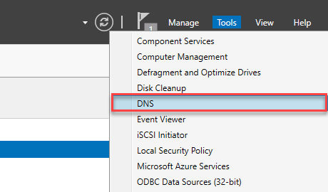
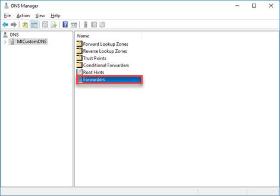
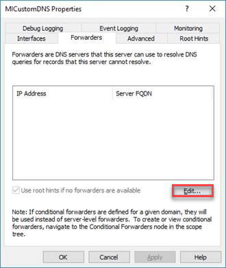
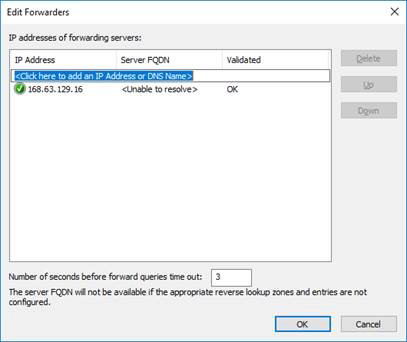
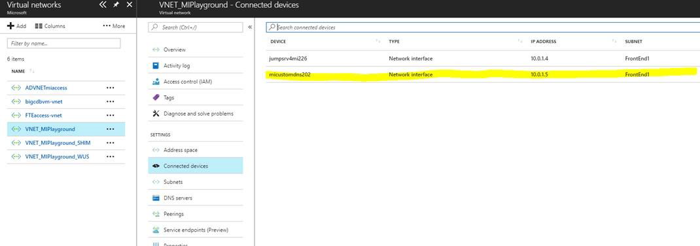
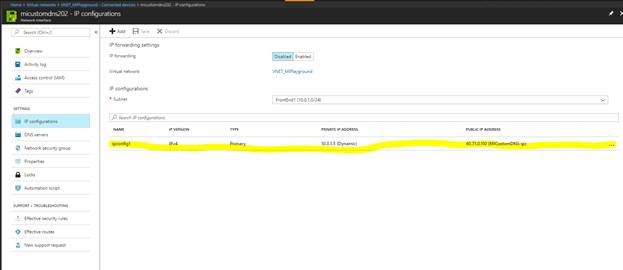
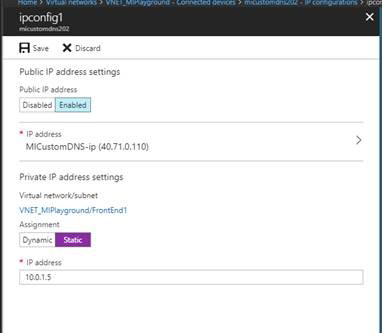

# Configuring a Custom DNS for Azure SQL Database Managed Instance

An Azure SQL Database Managed Instance (preview) must be deployed within an Azure [virtual network (VNet)](../virtual-network/virtual-networks-overview.md). There are a few scenarios, linked servers to other SQL instances in your cloud or hybrid environment, that require private host names to be resolved from the Managed Instance. In this case, you need to configure a custom DNS inside Azure. Since Managed Instance uses the same DNS for its inner workings, the virtual network DNS configuration needs to be compatible with Managed Instance. 

To make a custom DNS configuration compatible with Managed Instance, you need to complete the following steps: 
- Configure Custom DNS to forward requests to Azure DNS 
- Set up the Custom DNS as primary and Azure DNS as secondary for the VNet 
- Register the Custom DNS as primary and Azure DNS as secondary

## Configure Custom DNS to forward requests to Azure DNS 

To configure DNS forwarding on Windows Server 2016, use these steps: 

1. In **Server Manager**, click **Tools**, and then click **DNS**. 

    

2. Double-click **Forwarders**.

    

3. Click **Edit**. 

    

4. Enter Azure's recursive resolvers IP address, such as 168.63.129.16.

    
 
## Set up Custom DNS as primary and Azure DNS as secondary 
 
DNS configuration on an Azure VNet requires that you enter IP addresses, so configure the Azure VM that hosts the DNS server with a static IP address using the following next steps: 

1. In the Azure portal, open the custom DNS VM network interface.

    

2. In IP Configurations section. select IP configuration 

    

3. Set private IP address as Static. Write down the IP address (10.0.1.5 on this screenshot) 

    

## Register Custom DNS as primary and Azure DNS as secondary 

1. In the Azure portal, find custom DNS option for your VNet.

    

2. Switch to Custom and enter your custom DNS server IP address as well as Azure's recursive resolvers IP address, such as 168.63.129.16. 

    

   > [!IMPORTANT]
   > Not setting Azure’s recursive resolver in DNS list causes the Managed Instance to enter faulty state. Recovering from that state may require you to create new instance in a VNet with the compliant networking policies, create instance level data, and restore your databases. See [VNet Configuration](sql-database-managed-instance-vnet-configuration.md).

## Next steps

- For an overview, see [What is a Managed Instance](sql-database-managed-instance.md)
- For a tutorial showing you how to create a new Managed Instance, see [Creating a Managed Instance](sql-database-managed-instance-create-tutorial-portal.md).
- For information about configuring a VNet for a Managed Instance, see [VNet configuration for Managed Instances](sql-database-managed-instance-vnet-configuration.md)
