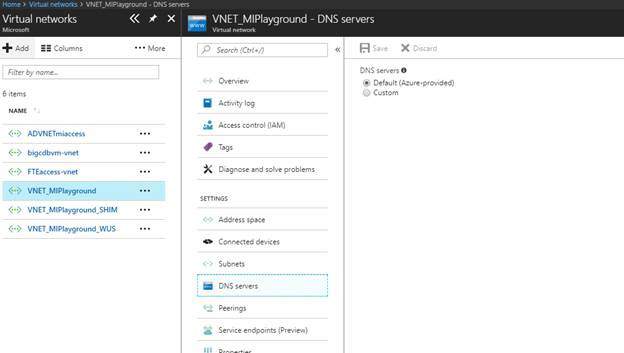
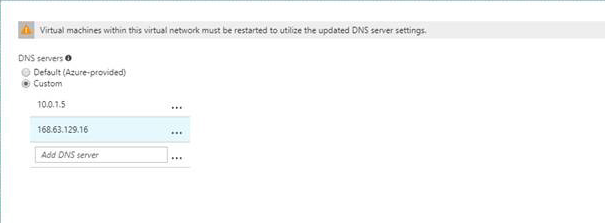

# Configuring a Custom DNS for Azure SQL Database Managed Instance

An Azure SQL Database Managed Instance must be deployed within an Azure [virtual network (VNet)](../virtual-network/virtual-networks-overview.md). There are a few scenarios (for example, db mail, linked servers to other SQL instances in your cloud or hybrid environment) that require private host names to be resolved from the Managed Instance. In this case, you need to configure a custom DNS inside Azure. Since Managed Instance uses the same DNS for its inner workings, the virtual network DNS configuration needs to be compatible with Managed Instance.

   > [!IMPORTANT]
   > Always use fully-qualified domain names (FQDN) for the mail servers, SQL Servers, and other services even if they are within your private DNS zone. For example use `smtp.contoso.com` for mail server because simple `smtp` will not be properly resolved.

To make a custom DNS configuration is compatible with the Managed Instance, you need to:

- Configure custom DNS server so it is able to resolve public domain names
- Put Azure Recursive Resolver DNS IP address 168.63.129.16 at the end of the virtual network DNS list

## Setting up custom DNS servers configuration

1. In the Azure portal, find custom DNS option for your VNet.

   

2. Switch to Custom and enter your custom DNS server IP address as well as Azure's recursive resolvers IP address 168.63.129.16.

   

   > [!IMPORTANT]
   > Not setting Azure’s recursive resolver in the DNS list can cause the Managed Instance to enter a faulty state when the custom DNS servers are unavailable for some reason. Recovering from that state may require you to create new instance in a VNet with the compliant networking policies, create instance level data, and restore your databases. Setting the Azure’s recursive resolver as the last entry in the DNS list ensures, even when all custom DNS servers fail, public names can still be resolved.

## Next steps

- For an overview, see [What is a Managed Instance](sql-database-managed-instance.md)
- For a tutorial showing you how to create a new Managed Instance, see [Creating a Managed Instance](sql-database-managed-instance-get-started.md).
- For information about configuring a VNet for a Managed Instance, see [VNet configuration for Managed Instances](sql-database-managed-instance-connectivity-architecture.md)
