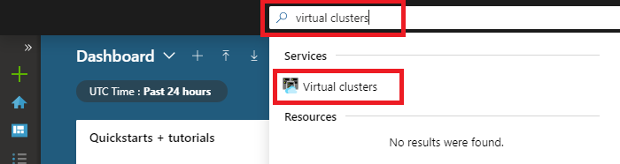
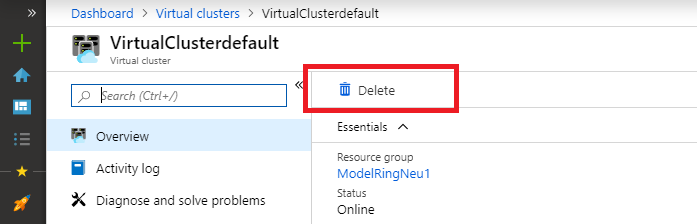

# Delete a subnet after deleting an Azure SQL Database managed instance

This article provides guidelines on how to manually delete a subnet after deleting the last Azure SQL Database managed instance residing in it.

SQL Database uses a [virtual cluster](sql-database-managed-instance-connectivity-architecture.md#virtual-cluster-connectivity-architecture) to contain the deleted managed instance. The virtual cluster persists for 12 hours after the instance deletion, to enable you to quickly create managed instances in the same subnet. There's no charge for keeping an empty virtual cluster. During this period, the subnet associated with the virtual cluster can't be deleted.

If you don't want to wait 12 hours, and prefer to delete the virtual cluster and its subnet immediately, you can do so manually. Delete the virtual cluster manually by using the Azure portal or the virtual clusters API.

> [!NOTE]
> The virtual cluster should contain no managed instances for the deletion to be successful.

## Delete virtual cluster from the Azure portal

To delete a virtual cluster by using the Azure portal, search for the virtual cluster resources.

After you locate the virtual cluster you want to delete, select this resource, and select **Delete**. You're prompted to confirm the virtual cluster deletion.

The Azure portal notifications area shows you confirmation that the virtual cluster was deleted. Successful deletion of the virtual cluster immediately releases the subnet for reuse.

> [!TIP]
> If there are no managed instances shown in the virtual cluster, and you are unable to delete the virtual cluster, ensure that you do not have an ongoing instance deployment in progress. This includes started and canceled deployments that are still in progress. Reviewing Deployments tab of the resource group the instance was deployed to will indicate any deployments in progress. In this case, await for deployment to complete, delete managed instance and then the virtual cluster.

## Delete virtual cluster by using the API

To delete a virtual cluster through the API, use the URI parameters specified in the [virtual clusters delete method](https://docs.microsoft.com/rest/api/sql/virtualclusters/delete).

## Next steps

- For an overview, see [What is a Managed Instance?](sql-database-managed-instance.md).
- Learn about [connectivity architecture in Managed Instance](sql-database-managed-instance-connectivity-architecture.md).
- Learn how to [modify an existing virtual network for Managed Instance](sql-database-managed-instance-configure-vnet-subnet.md).
- For a tutorial that shows how to create a virtual network, create a Managed Instance, and restore a database from a database backup, see [Create an Azure SQL Database Managed Instance](sql-database-managed-instance-get-started.md).
- For DNS issues, see [Configuring a custom DNS](sql-database-managed-instance-custom-dns.md).
