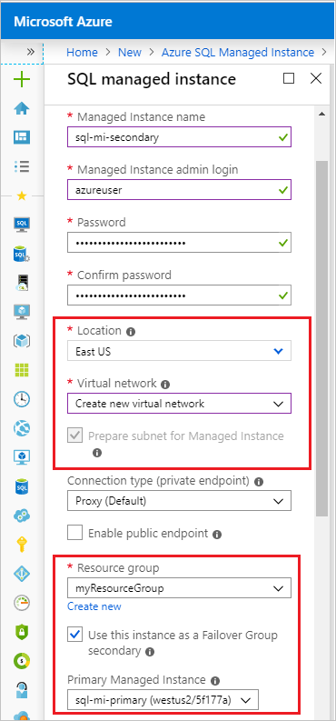

# Tutorial: Configure a failover group for an Azure SQL Database managed instance

Configure a failover group for an Azure SQL database managed instance. In this article, you will learn how to:

> [!div class="checklist"]
> - Create a primary managed instance
> - Create a secondary managed instance as part of a [failover group](sql-database-auto-failover-group.md). 
> - Configure networking to facilitate communication between the two managed instances.
> - Test failover

  > [!NOTE]
  > Creating a managed instance can take a significant amount of time. As a result, this tutorial could take several hours to complete. 

## Prerequisites

To complete this tutorial, make sure you've installed the following items:

- An Azure subscription, [create a free account](https://azure.microsoft.com/free/) if you don't already have one. 
- [Azure PowerShell](/powershell/azureps-cmdlets-docs)


> [!IMPORTANT]
> Be sure to set up firewall rules to use the public IP address of the computer on which you're performing the steps in this tutorial. Database-level firewall rules will replicate automatically to the secondary server.
>
> For information see [Create a database-level firewall rule](/sql/relational-databases/system-stored-procedures/sp-set-database-firewall-rule-azure-sql-database) or to determine the IP address used for the server-level firewall rule for your computer see [Create a server-level firewall](sql-database-server-level-firewall-rule.md).  

## 1 - Create resource group and primary managed instance
In this step, you will create the resource group and the primary managed instance for your failover group using the Azure portal. 

1. Sign into the [Azure portal](https://portal.azure.com). 
1. Choose to **Create a resource** on the upper-left hand corner of the Azure portal. 
1. Type `managed instance` in the search box and select the option for Azure SQL Managed Instance. 
1. Select **Create** to launch the **SQL managed instance** creation page. 
1. On the **SQL managed instance** creation page, fill out or select the following values and then select **Create** to create your primary managed instance. 
    - **Subscription**: Select your subscription from the drop-down. 
    - **Managed Instance name**: Type in a name for your primary managed instance, such as `primary-sql-mi`. 
    - **Managed Instance admin login**: Type in a login name, such as `azureuser`. 
    - **Time zone**: Select your preferred time zone from the drop-down. 
    - **Collation**: Type in your preferred collation. The default is `SQL_Latin1_General_CP1_CI_AS`. 
    - **Location**: Select your preferred location from the drop-down, such as `West US 2`. 
    - **Virtual network**: Choose to **Create new virtual network** from the drop-down. 
    - **Connection type**: Leave this as **Proxy (Default)** and optionally select the checkbox next to **Enable public endpoint**. 
    - **Resource group**: Choose to **Create new** and then type in the name of your resource group, such as `myResourceGroup`. 

       

## Create a secondary managed instance
The following steps create a secondary managed instance as part of failover group using the Azure portal. 

1. In the [Azure portal](http://portal.azure.com), select **Create a resource** and search for *Azure SQL Managed Instance*. 
1. Select the **Azure SQL Managed Instance** option published by Microsoft, and then select **Create** on the next blade.
1. Fill out the required fields to configure your secondary managed instance. 

  The following table shows the values necessary for the managed instance:

   | **Field** | Value |
   | --- | --- |
   | **Subscription** |  The subscription where your primary managed instance resides. |
   | **Managed instance name** | The name of your new secondary managed instance, such as `sql-mi-secondary`  | 
   | **Managed instance admin login** | The login you want to use for your new secondary managed instance, such as `azureuser`. |
   | **Password** | A complex password that will be used by the admin login for the new secondary managed instance.  |
   | **Collation** | The collation for your secondary managed instance. *SQL_Latin1_General_CP1_CI_AS* is provided by default. |
   | **Location**| The location where your resource group resides. This must be a different region than where your primary managed instance is.  |
   | **Virtual network**| Create a new virtual network for the secondary managed instance, as the two managed instances need to be in different vNets. |
   | **Resource group**| The resource group where your primary managed instance resides. |
   | &nbsp; | &nbsp; |

1. Select the checkbox next to *I want to use this managed instance as an Instance Failover Group secondary*. 
1. From the **DnsZonePartner managed instance** drop-down, select the managed instance you want to act as the primary.




## Create a failover group

Using Azure PowerShell, create [failover groups](sql-database-auto-failover-group.md) between an existing Azure SQL server and a new Azure SQL server in another region. Then add the sample database to the failover group.

> [!IMPORTANT]
> [!INCLUDE [sample-powershell-install](../../includes/sample-powershell-install-no-ssh.md)]

To create a failover group, run the following script:

   ```powershell
    # Set variables for your server and database
    $adminlogin = "<your admin>"
    $password = "<your password>"
    $myresourcegroupname = "<your resource group name>"
    $mylocation = "<your resource group location>"
    $myservername = "<your existing server name>"
    $mydatabasename = "<your database name>"
    $mydrlocation = "<your disaster recovery location>"
    $mydrservername = "<your disaster recovery server name>"
    $myfailovergroupname = "<your globally unique failover group name>"

    # Create a backup server in the failover region
    New-AzureRmSqlServer -ResourceGroupName $myresourcegroupname `
       -ServerName $mydrservername `
       -Location $mydrlocation `
       -SqlAdministratorCredentials $(New-Object -TypeName System.Management.Automation.PSCredential `
          -ArgumentList $adminlogin, $(ConvertTo-SecureString -String $password -AsPlainText -Force))

    # Create a failover group between the servers
    New-AzureRMSqlDatabaseFailoverGroup `
       –ResourceGroupName $myresourcegroupname `
       -ServerName $myservername `
       -PartnerServerName $mydrservername  `
       –FailoverGroupName $myfailovergroupname `
       –FailoverPolicy Automatic `
       -GracePeriodWithDataLossHours 2

    # Add the database to the failover group
    Get-AzureRmSqlDatabase `
       -ResourceGroupName $myresourcegroupname `
       -ServerName $myservername `
       -DatabaseName $mydatabasename | `
     Add-AzureRmSqlDatabaseToFailoverGroup `
       -ResourceGroupName $myresourcegroupname `
       -ServerName $myservername `
       -FailoverGroupName $myfailovergroupname
   ```

Geo-replication settings can also be changed in the Azure portal, by selecting your database, then **Settings** > **Geo-Replication**.


## Run the sample project

1. In the console, create a Maven project with the following command:

   ```bash
   mvn archetype:generate "-DgroupId=com.sqldbsamples" "-DartifactId=SqlDbSample" "-DarchetypeArtifactId=maven-archetype-quickstart" "-Dversion=1.0.0"
   ```

1. Type **Y** and press **Enter**.

1. Change directories to the new project.

   ```bash
   cd SqlDbSample
   ```

1. Using your favorite editor, open the *pom.xml* file in your project folder.

1. Add the Microsoft JDBC Driver for SQL Server dependency by adding the following `dependency` section. The dependency must be pasted within the larger `dependencies` section.

   ```xml
   <dependency>
     <groupId>com.microsoft.sqlserver</groupId>
     <artifactId>mssql-jdbc</artifactId>
    <version>6.1.0.jre8</version>
   </dependency>
   ```

1. Specify the Java version by adding the `properties` section after the `dependencies` section:

   ```xml
   <properties>
     <maven.compiler.source>1.8</maven.compiler.source>
     <maven.compiler.target>1.8</maven.compiler.target>
   </properties>
   ```

1. Support manifest files by adding the `build` section after the `properties` section:

   ```xml
   <build>
     <plugins>
       <plugin>
         <groupId>org.apache.maven.plugins</groupId>
         <artifactId>maven-jar-plugin</artifactId>
         <version>3.0.0</version>
         <configuration>
           <archive>
             <manifest>
               <mainClass>com.sqldbsamples.App</mainClass>
             </manifest>
           </archive>
        </configuration>
       </plugin>
     </plugins>
   </build>
   ```

1. Save and close the *pom.xml* file.

1. Open the *App.java* file located in ..\SqlDbSample\src\main\java\com\sqldbsamples and replace the contents with the following code:

   ```java
   package com.sqldbsamples;

   import java.sql.Connection;
   import java.sql.Statement;
   import java.sql.PreparedStatement;
   import java.sql.ResultSet;
   import java.sql.Timestamp;
   import java.sql.DriverManager;
   import java.util.Date;
   import java.util.concurrent.TimeUnit;

   public class App {

      private static final String FAILOVER_GROUP_NAME = "<your failover group name>";  // add failover group name
  
      private static final String DB_NAME = "<your database>";  // add database name
      private static final String USER = "<your admin>";  // add database user
      private static final String PASSWORD = "<your password>";  // add database password

      private static final String READ_WRITE_URL = String.format("jdbc:" +
         "sqlserver://%s.database.windows.net:1433;database=%s;user=%s;password=%s;encrypt=true;" +
         "hostNameInCertificate=*.database.windows.net;loginTimeout=30;", +
         FAILOVER_GROUP_NAME, DB_NAME, USER, PASSWORD);
      private static final String READ_ONLY_URL = String.format("jdbc:" +
         "sqlserver://%s.secondary.database.windows.net:1433;database=%s;user=%s;password=%s;encrypt=true;" +
         "hostNameInCertificate=*.database.windows.net;loginTimeout=30;", +
         FAILOVER_GROUP_NAME, DB_NAME, USER, PASSWORD);

      public static void main(String[] args) {
         System.out.println("#######################################");
         System.out.println("## GEO DISTRIBUTED DATABASE TUTORIAL ##");
         System.out.println("#######################################");
         System.out.println("");

         int highWaterMark = getHighWaterMarkId();

         try {
            for(int i = 1; i < 1000; i++) {
                //  loop will run for about 1 hour
                System.out.print(i + ": insert on primary " +
                   (insertData((highWaterMark + i))?"successful":"failed"));
                TimeUnit.SECONDS.sleep(1);
                System.out.print(", read from secondary " +
                   (selectData((highWaterMark + i))?"successful":"failed") + "\n");
                TimeUnit.SECONDS.sleep(3);
            }
         } catch(Exception e) {
            e.printStackTrace();
      }
   }

   private static boolean insertData(int id) {
      // Insert data into the product table with a unique product name so we can find the product again
      String sql = "INSERT INTO SalesLT.Product " +
         "(Name, ProductNumber, Color, StandardCost, ListPrice, SellStartDate) VALUES (?,?,?,?,?,?);";

      try (Connection connection = DriverManager.getConnection(READ_WRITE_URL);
              PreparedStatement pstmt = connection.prepareStatement(sql)) {
         pstmt.setString(1, "BrandNewProduct" + id);
         pstmt.setInt(2, 200989 + id + 10000);
         pstmt.setString(3, "Blue");
         pstmt.setDouble(4, 75.00);
         pstmt.setDouble(5, 89.99);
         pstmt.setTimestamp(6, new Timestamp(new Date().getTime()));
         return (1 == pstmt.executeUpdate());
      } catch (Exception e) {
         return false;
      }
   }

   private static boolean selectData(int id) {
      // Query the data previously inserted into the primary database from the geo replicated database
      String sql = "SELECT Name, Color, ListPrice FROM SalesLT.Product WHERE Name = ?";

      try (Connection connection = DriverManager.getConnection(READ_ONLY_URL);
              PreparedStatement pstmt = connection.prepareStatement(sql)) {
         pstmt.setString(1, "BrandNewProduct" + id);
         try (ResultSet resultSet = pstmt.executeQuery()) {
            return resultSet.next();
         }
      } catch (Exception e) {
         return false;
      }
   }

   private static int getHighWaterMarkId() {
      // Query the high water mark id stored in the table to be able to make unique inserts
      String sql = "SELECT MAX(ProductId) FROM SalesLT.Product";
      int result = 1;
      try (Connection connection = DriverManager.getConnection(READ_WRITE_URL);
              Statement stmt = connection.createStatement();
              ResultSet resultSet = stmt.executeQuery(sql)) {
         if (resultSet.next()) {
             result =  resultSet.getInt(1);
            }
         } catch (Exception e) {
          e.printStackTrace();
         }
         return result;
      }
   }
   ```

1. Save and close the *App.java* file.

1. In the command console, run the following command:

   ```bash
   mvn package
   ```

1. Start the application that will run for about 1 hour until stopped manually, allowing you time to run the failover test.

   ```bash
   mvn -q -e exec:java "-Dexec.mainClass=com.sqldbsamples.App"
   ```

   ```output
   #######################################
   ## GEO DISTRIBUTED DATABASE TUTORIAL ##
   #######################################

   1. insert on primary successful, read from secondary successful
   2. insert on primary successful, read from secondary successful
   3. insert on primary successful, read from secondary successful
   ...
   ```

## Test failover

Run the following scripts to simulate a failover and observe the application results. Notice how some inserts and selects will fail during the database migration.

You can also check the role of the disaster recovery server during the test with the following command:

   ```powershell
   (Get-AzureRMSqlDatabaseFailoverGroup `
      -FailoverGroupName $myfailovergroupname `
      -ResourceGroupName $myresourcegroupname `
      -ServerName $mydrservername).ReplicationRole
   ```

To test a failover:

1. Start a manual failover of the failover group:

   ```powershell
   Switch-AzureRMSqlDatabaseFailoverGroup `
      -ResourceGroupName $myresourcegroupname `
      -ServerName $mydrservername `
      -FailoverGroupName $myfailovergroupname
   ```

1. Revert failover group back to the primary server:

   ```powershell
   Switch-AzureRMSqlDatabaseFailoverGroup `
      -ResourceGroupName $myresourcegroupname `
      -ServerName $myservername `
      -FailoverGroupName $myfailovergroupname
   ```

## Next steps

In this tutorial, you configured an Azure SQL database and application for failover to a remote region and tested a failover plan. You learned how to:

> [!div class="checklist"]
> - Create a geo-replication failover group
> - Run a Java application to query an Azure SQL database
> - Test failover

Advance to the next tutorial on how to migrate using DMS.

> [!div class="nextstepaction"]
> [Migrate SQL Server to Azure SQL database managed instance using DMS](../dms/tutorial-sql-server-to-managed-instance.md)
