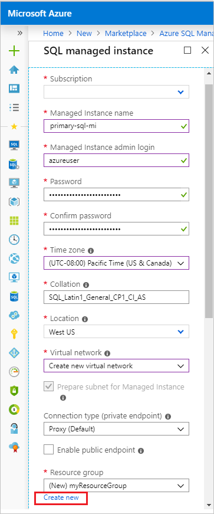
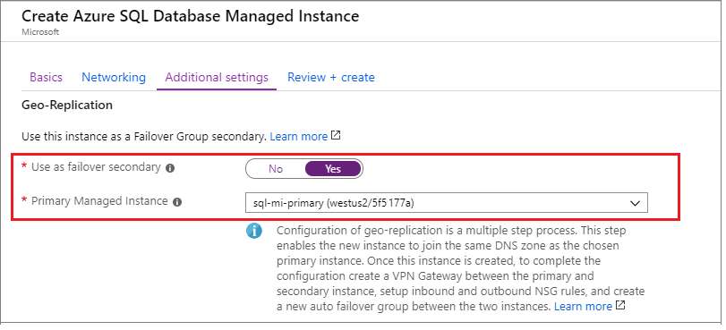
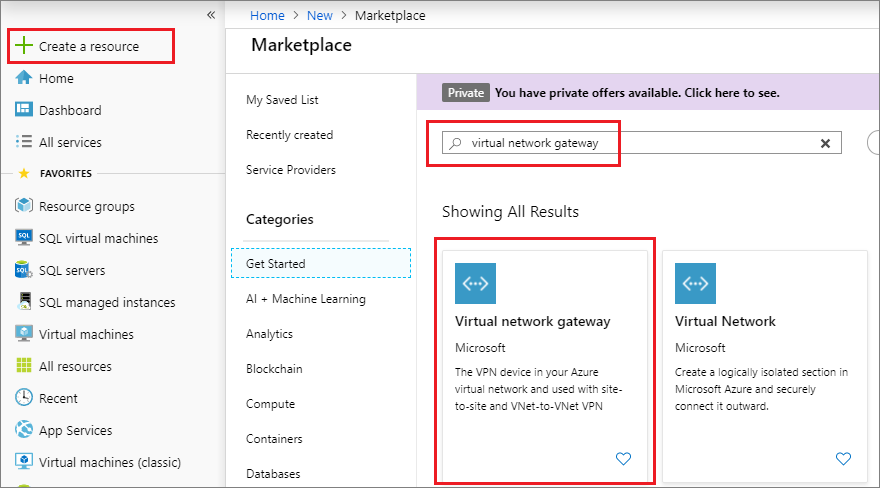
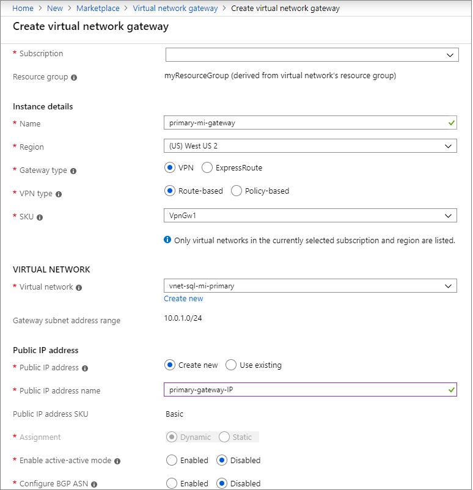
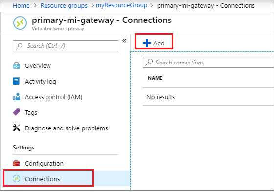
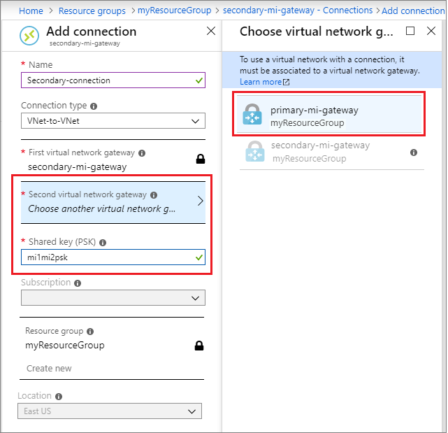
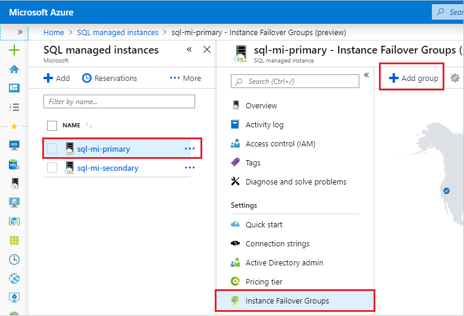
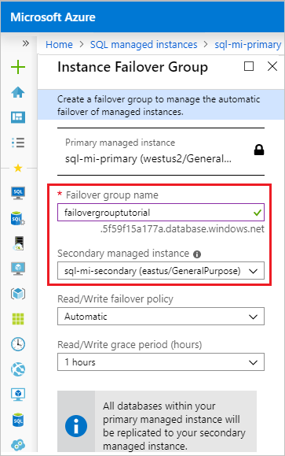
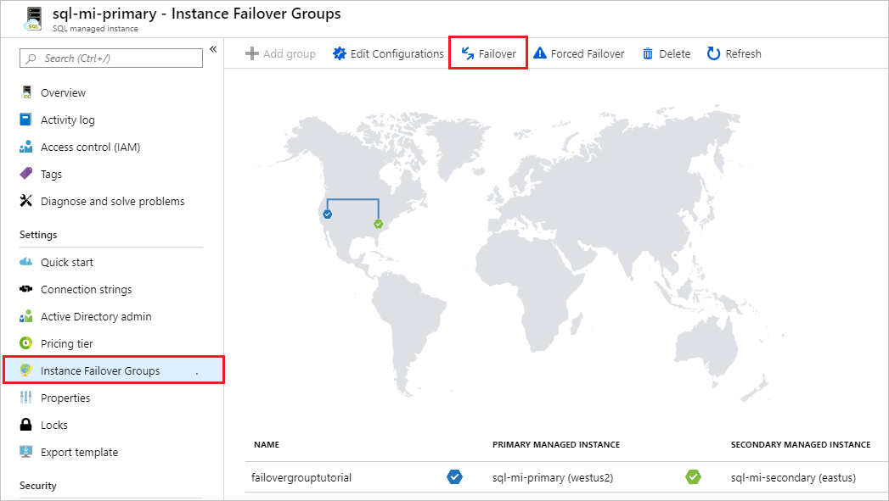
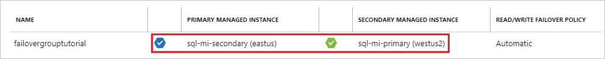

# Tutorial: Add a SQL Database managed instance to a failover group

Add a SQL Database managed instance to a failover group. In this article, you will learn how to:

> [!div class="checklist"]
> - Create a primary managed instance
> - Create a secondary managed instance as part of a [failover group](sql-database-auto-failover-group.md). 
> - Test failover

  > [!NOTE]
  > Creating a managed instance can take a significant amount of time. As a result, this tutorial could take several hours to complete. For more information on provisioning times, see [managed instance management operations](sql-database-managed-instance.md#managed-instance-management-operations). 
  > Using failover groups with managed instances is currently in preview. 

## Prerequisites

To complete this tutorial, make sure you have: 

- An Azure subscription, [create a free account](https://azure.microsoft.com/free/) if you don't already have one. 

## 1 -  Create resource group and primary managed instance
In this step, you will create the resource group and the primary managed instance for your failover group using the Azure portal. 

1. Sign into the [Azure portal](https://portal.azure.com). 
1. Choose to **Create a resource** on the upper-left hand corner of the Azure portal. 
1. Type `managed instance` in the search box and select the option for Azure SQL Managed Instance. 
1. Select **Create** to launch the **SQL managed instance** creation page. 
1. On the **Create Azure SQL Database Managed Instance** page, on the **Basics** tab
    1. Under **Project Details**, select your **Subscription** from the drop-down and then choose to **Create New** resource group. Type in a name for your resource group, such as `myResourceGroup`. 
    1. Under **Managed Instance Details**, provide the name of your managed instance, and the region where you would like to deploy your managed instance. Be sure to select a region with a [paired region](/azure/best-practices-availability-paired-regions). Leave the **Compute + storage** at default values. 
    1. Under **Administrator Account**, provide an admin login, such as `azureuser`, and a complex admin password. 

    

1. Leave the rest of the settings at default values, and select **Review + create** to review your managed instance settings. 
1. Select **Create** to create your primary managed instance. 

## 2 - Create a virtual network
In this step, you will create a virtual network for the secondary managed instance. This step is necessary because there is a requirement that the subnet of the primary and secondary managed instances have non-overlapping address ranges. 

To verify the subnet range of your primary virtual network, follow these steps:
1. In the [Azure portal](https://portal.azure.com), navigate to your resource group and select the virtual network for your primary instance. 
1. Select **Subnets** under **Settings** and note the **Address range**. The subnet address range of the virtual network for the secondary managed instance cannot overlap this. 

   

To create a virtual network, follow these steps:

1. In the [Azure portal](https://portal.azure.com), select **Create a resource** and search for *virtual network*. 
1. Select the **Virtual Network** option published by Microsoft and then select **Create** on the next page. 
1. Fill out the required fields to configure the virtual network for your secondary managed instance, and then select **Create**. 

   The following table shows the values necessary for the secondary virtual network:

    | **Field** | Value |
    | --- | --- |
    | **Name** |  The name for the virtual network to be used by the secondary managed instance, such as `vnet-sql-mi-secondary`. |
    | **Address space** | The address space for your virtual network, such as `10.128.0.0/16`. | 
    | **Subscription** | The subscription where your primary managed instance and resource group reside. |
    | **Region** | The location where you will deploy your secondary managed instance; this should be in a [paired region](/azure/best-practices-availability-paired-regions) to the primary managed instance.  |
    | **Subnet** | The name for your subnet. `default` is provided for you by default. |
    | **Address range**| The address range for your subnet. This must be different than the subnet address range used by the virtual network of your primary managed instance, such as `10.128.0.0/24`.  |
    | &nbsp; | &nbsp; |

    

## 3 - Create a secondary managed instance
In this step, you will create a secondary managed instance in the Azure portal, which will also configure the networking between the two managed instances. 

Your second managed instance must:
- Be empty. 
- Be located within a [paired region](/azure/best-practices-availability-paired-regions) with its primary managed instance counterpart. 
- Have a different subnet and IP range than the primary managed instance. 

To create your secondary managed instance, follow these steps: 

1. In the [Azure portal](http://portal.azure.com), select **Create a resource** and search for *Azure SQL Managed Instance*. 
1. Select the **Azure SQL Managed Instance** option published by Microsoft, and then select **Create** on the next page.
1. On the **Basics** tab of the **Create Azure SQL Database Managed Instance** page, fill out the required fields to configure your secondary managed instance. 

   The following table shows the values necessary for the secondary managed instance:
 
    | **Field** | Value |
    | --- | --- |
    | **Subscription** |  The subscription where your primary managed instance is. |
    | **Resource group**| The resource group where your primary managed instance is. |
    | **Managed instance name** | The name of your new secondary managed instance, such as `sql-mi-secondary`  | 
    | **Region**| The [paired region](/azure/best-practices-availability-paired-regions) location for your secondary managed instance.  |
    | **Managed instance admin login** | The login you want to use for your new secondary managed instance, such as `azureuser`. |
    | **Password** | A complex password that will be used by the admin login for the new secondary managed instance.  |
    | &nbsp; | &nbsp; |

1. Under the **Networking** tab, for the **Virtual Network**, select the virtual network you created for the secondary managed instance from the drop-down.

   

1. Under the **Additional settings** tab, for **Geo-Replication**, choose to **Yes** to _Use as failover secondary_. Select the primary managed instance from the drop-down. 
    1. Be sure that the collation and time zone matches that of the primary managed instance. The primary managed instance created in this tutorial used  the default of `SQL_Latin1_General_CP1_CI_AS` collation and the `(UTC) Coordinated Universal Time` time zone. 

   

1. Select **Review + create** to review the settings for your secondary managed instance. 
1. Select **Create** to create your secondary managed instance. 

## 4 - Create primary virtual network gateway 

For two managed instances to participate in a failover group, there must be a gateway configured between the virtual networks of the two managed instances to allow network communication. You can create the gateway for the primary managed instance using the Azure portal:

1. In the [Azure portal](https://portal.azure.com), go to your resource group and select the **Virtual network** resource for your primary managed instance. 
1. Select **Subnets** under **Settings** and then select to add a new **Gateway subnet**. Leave the default values. 

   

1. Once the subnet gateway is created, select **Create a resource** from the left navigation pane and then type `Virtual network gateway` in the search box. Select the **Virtual network gateway** resource published by **Microsoft**. 

   

1. Fill out the required fields to configure the gateway your primary managed instance. 

   The following table shows the values necessary for the gateway for the primary managed instance:
 
    | **Field** | Value |
    | --- | --- |
    | **Subscription** |  The subscription where your primary managed instance is. |
    | **Name** | The name for your virtual network gateway, such as `primary-mi-gateway`. | 
    | **Region** | The region where your secondary managed instance is. |
    | **Gateway type** | Select **VPN**. |
    | **VPN Type** | Select **Route-based** |
    | **SKU**| Leave default of `VpnGw1`. |
    | **Location**| The location where your secondary managed instance and secondary virtual network is.   |
    | **Virtual network**| Select the virtual network that was created in section 2, such as `vnet-sql-mi-primary`. |
    | **Public IP address**| Select **Create new**. |
    | **Public IP address name**| Enter a name for your IP address, such as `primary-gateway-IP`. |
    | &nbsp; | &nbsp; |
1. Leave the other values as default, and then select **Review + create** to review the settings for your virtual network gateway.

   

1. Select **Create** to create your new virtual network gateway. 

## 5 - Configure secondary virtual network gateway 

Repeat the steps in the previous section to create the virtual network subnet and gateway for the secondary managed instance. Fill out the required fields to configure the gateway for your secondary managed instance. 

   The following table shows the values necessary for the gateway for the secondary managed instance:

   | **Field** | Value |
   | --- | --- |
   | **Subscription** |  The subscription where your secondary managed instance is. |
   | **Name** | The name for your virtual network gateway, such as `secondary-mi-gateway`. | 
   | **Region** | The region where your secondary managed instance is. |
   | **Gateway type** | Select **VPN**. |
   | **VPN Type** | Select **Route-based** |
   | **SKU**| Leave default of `VpnGw1`. |
   | **Location**| The location where your secondary managed instance and secondary virtual network is.   |
   | **Virtual network**| Select the virtual network that was created in section 2, such as `vnet-sql-mi-secondary`. |
   | **Public IP address**| Select **Create new**. |
   | **Public IP address name**| Enter a name for your IP address, such as `secondary-gateway-IP`. |
   | &nbsp; | &nbsp; |

   

## 6 - Connect the gateways
In this step, create a connection between gateways. A connection must be established from the primary to the secondary gateway, and then a separate connection must be established between the secondary to the primary gateway. Be sure to use the same **Shared key** when configuring connectivity between both gateways. 

To configure connectivity, follow these steps:

1. Navigate to your resource group in the [Azure portal](https://portal.azure.com) and select the primary gateway you created in Step 4. 
1. Select **Connections** under **Settings** and then select **Add** to create a new connection. 

   

1. Enter a name for your connection, such as `Primary-connection`, and type in a value for the **Shared Key** such as `mi1mi2psk`. 
1. Select the **Second virtual network gateway** and then select the gateway for the secondary managed instance, such as `secondary-mi-gateway`. 

   

1. Select **OK** to add your new primary-to-secondary gateway connection.
1. Repeat these steps to create a connection from the gateway of the secondary managed instance to the gateway of the primary managed instance. 

   

## 7 - Create a failover group
In this step, you will create the failover group and add both managed instances to it. 

1. In the [Azure portal](https://portal.azure.com), go to **All services** and type in `managed instance` in the search box. 
1. (Optional) Select the star next to **SQL managed instances** to add managed instances as shortcut to your left-hand navigation bar. 
1. Select **SQL managed instances** and select your primary managed instance, such as `sql-mi-primary`. 
1. Under **Settings**, navigate to **Instance Failover Groups** and then choose to **Add group** to open the **Instance Failover Group** page. 

   

1. On the **Instance Failover Group** page, type the name of  your failover group, such as `failovergrouptutorial` and then choose the secondary managed instance, such as `sql-mi-secondary` from the drop-down. Select **Create** to create your failover group. 

   

1. Once failover group deployment is complete, you will be taken back to the **Failover group** page. 

## 8 - Test failover
In this step, you will fail your failover group over to the secondary server, and then fail back using the Azure portal. 

1. Navigate to your managed instance within the [Azure portal](https://portal.azure.com) and select **Instance Failover Groups** under settings. 
1. Review which managed instance is the primary, and which managed instance is the secondary. 
1. Select **Failover** and then select **Yes** on the warning about TDS sessions being disconnected. 

   

1. Review which manged instance is the primary and which instance is the secondary. If fail over succeeded, the two instances should have switched roles. 

   

1. Select **Failover** once again to fail the primary instance back to the primary role. 

## Clean up resources
Clean up resources by first deleting the managed instance, then the virtual cluster, then any remaining resources, and finally the resource group. 

1. Navigate to your resource group in the [Azure portal](https://portal.azure.com). 
1. Select the managed instance and then select **Delete**. Type `yes` in the text box to confirm you want to delete the resource and then select **Delete**. This process may take some time to complete in the background, and until it's done, you will not be able to delete the *Virtual cluster* or any other dependent resources. Monitor the delete in the Activity tab to confirm your managed instance has been deleted. 
1. Once the managed instance is deleted, delete the *Virtual cluster* by selecting it in your resource group, and then choosing **Delete**. Type `yes` in the text box to confirm you want to delete the resource and then select **Delete**. 
1. Delete any remaining resources. Type `yes` in the text box to confirm you want to delete the resource and then select **Delete**. 
1. Delete the resource group by selecting **Delete resource group**, typing in the name of the resource group, `myResourceGroup`, and then selecting **Delete**. 

## Next steps

In this tutorial, you configured a failover group between two managed instances. You learned how to:

> [!div class="checklist"]
> - Create a primary managed instance
> - Create a secondary managed instance as part of a [failover group](sql-database-auto-failover-group.md). 
> - Test failover

Advance to the next quickstart on how to connect to your managed instance, and how to restore a database to your managed instance: 

> [!div class="nextstepaction"]
> [Connect to your managed instance](sql-database-managed-instance-configure-vm.md)
> [Restore a database to a managed instance](sql-database-managed-instance-get-started-restore.md)

