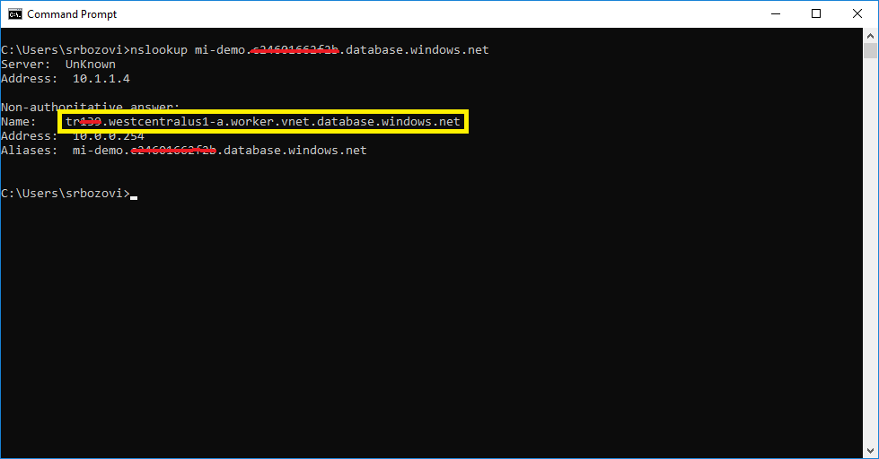
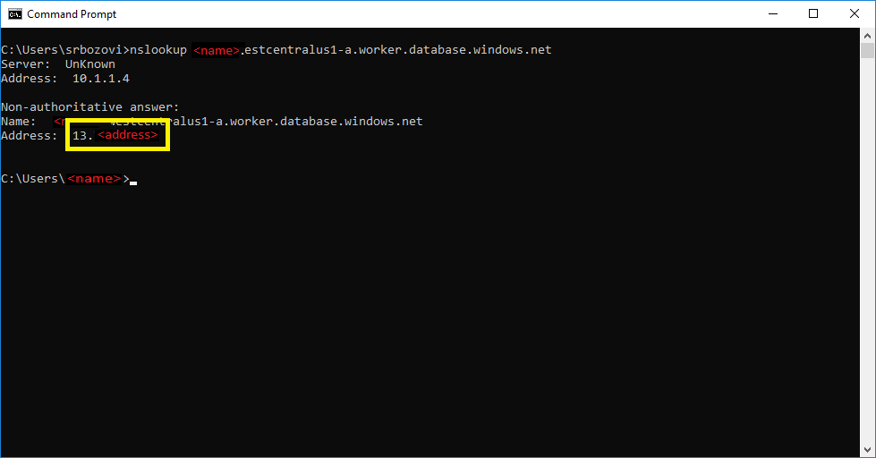

# Determine the management endpoint IP address

The Azure SQL Database Managed Instance virtual cluster contains a management endpoint that Microsoft uses for management operations. The management endpoint is protected with a built-in firewall on the network level and mutual certificate verification on the application level. You can determine the IP address of the management endpoint, but you can't access this endpoint.

## Determine IP address

Let’s assume that Managed Instance host is `mi-demo.xxxxxx.database.windows.net`. Run `nslookup` using the host name.

Now do another `nslookup` for highlighted name removing the `.vnet.` segment. You’ll get the public IP address when you execute this command.

## Next steps

For more information about Managed Instances and connectivity, see [Azure SQL Database Managed Instance Connectivity Architecture](sql-database-managed-instance-connectivity-architecture.md).
