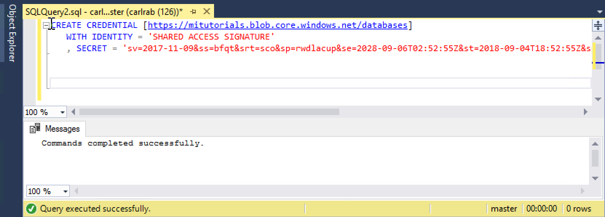
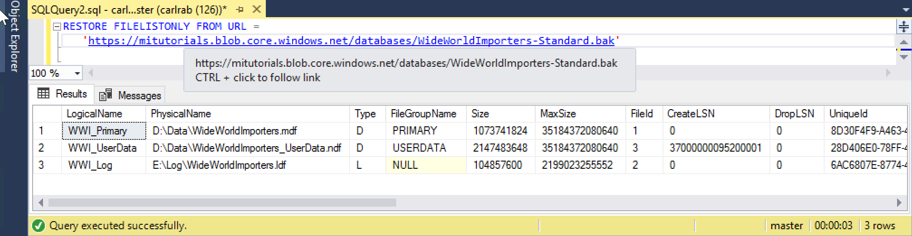
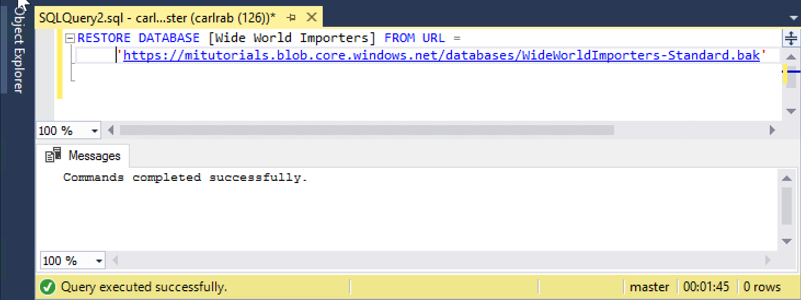

# Restore a database backup to an Azure SQL Database Managed Instance

This quickstart demonstrates how to restore a backup of a database stored in Azure blob storage into the Managed Instance using the Wide World Importers - Standard backup file. This method requires some downtime. 

> [!VIDEO https://www.youtube.com/embed/RxWYojo_Y3Q]

For a tutorial using the Azure Database Migration Service (DMS) for migration, see [Managed Instance migration using DMS](../dms/tutorial-sql-server-to-managed-instance.md). For a discussion of the various migration methods, see [SQL Server instance migration to Azure SQL Database Managed Instance](sql-database-managed-instance-migrate.md).

## Prerequisites

This quickstart:
- Uses as its starting point the resources created in this quickstart: [Create a Managed Instance](sql-database-managed-instance-get-started.md).
- Requires the newest version of [SQL Server Management Studio](https://docs.microsoft.com/sql/ssms/sql-server-management-studio-ssms) on your on-premises client computer
- Requires connectivity to your Managed Instance using SQL Server Management Studio. See these quickstarts for connectivity options:
  - [Connect to an Azure SQL Database Managed Instance from an Azure VM](sql-database-managed-instance-configure-vm.md)
  - [Connect to an Azure SQL Database Managed Instance from on-premises using a Point-to-Site connection](sql-database-managed-instance-configure-p2s.md).
- Uses a preconfigured Azure blob storage account containing the Wide World Importers - Standard backup file (downloaded from https://github.com/Microsoft/sql-server-samples/releases/download/wide-world-importers-v1.0/WideWorldImporters-Standard.bak).

> [!NOTE]
> For more information about backing up and rsstoring a SQL Server database using Azure blob storage and a Shared Access Signature (SAS), see [SQL Server Backup to URL](sql-database-managed-instance-get-started-restore.md).

## Restore the Wide World Importers database from a backup file

With SSMS, use the following steps to restore the Wide World Importers database to your Managed Instance from the backup file.

1. Open SQL Server Management Studio (SSMS) and connect to your Managed Instance.
2. In SSMS, open a new query window.
3. Use the following script to create a credential in the Managed Instance using the preconfigured storage account and SAS key.

   ```sql
   CREATE CREDENTIAL [https://mitutorials.blob.core.windows.net/databases] 
   WITH IDENTITY = 'SHARED ACCESS SIGNATURE'
   , SECRET = 'sv=2017-11-09&ss=bfqt&srt=sco&sp=rwdlacup&se=2028-09-06T02:52:55Z&st=2018-09-04T18:52:55Z&spr=https&sig=WOTiM%2FS4GVF%2FEEs9DGQR9Im0W%2BwndxW2CQ7%2B5fHd7Is%3D' 
   ```

    

    > [!NOTE]
    > Always remove the leading **?** from generated SAS key.
  
3. Use the following script to check the SAS credential and backup validity - providing the URL for the container with the backup file:

   ```sql
   RESTORE FILELISTONLY FROM URL = 
      'https://mitutorials.blob.core.windows.net/databases/WideWorldImporters-Standard.bak'
   ```

    

4. Use the following script to restore the Wide World Importers database from a backup file - providing the URL for the container with the backup file:

   ```sql
   RESTORE DATABASE [Wide World Importers] FROM URL =
     'https://mitutorials.blob.core.windows.net/databases/WideWorldImporters-Standard.bak'
   ```

    

5. To track the status of your restore, run the following query in a new query session:

   ```sql
   SELECT session_id as SPID, command, a.text AS Query, start_time, percent_complete
      , dateadd(second,estimated_completion_time/1000, getdate()) as estimated_completion_time 
   FROM sys.dm_exec_requests r 
   CROSS APPLY sys.dm_exec_sql_text(r.sql_handle) a 
   WHERE r.command in ('BACKUP DATABASE','RESTORE DATABASE')`
   ```

6. When the restore completes, view it in Object Explorer. 

## Next steps

- For troubleshooting backup to URL, see [SQL Server Backup to URL Best Practices and Troubleshooting](https://docs.microsoft.com/sql/relational-databases/backup-restore/sql-server-backup-to-url-best-practices-and-troubleshooting).
- For an overview of the connection options for applications, see [Connect your applications to Managed Instance](sql-database-managed-instance-connect-app.md).
- To query using one of your favorite tools or languages, see [connect and query](sql-database-connect-query.md).
