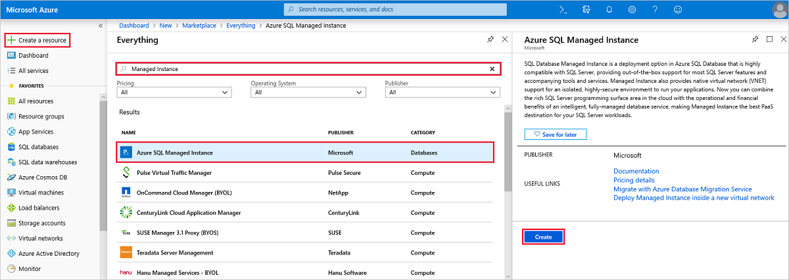
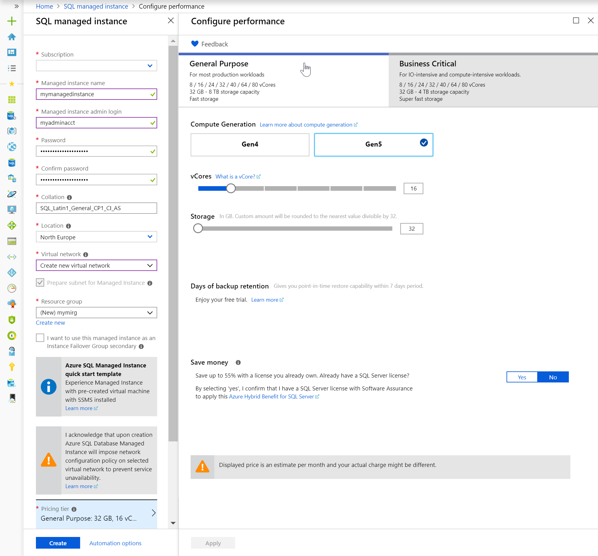
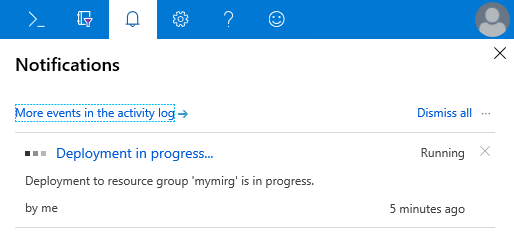
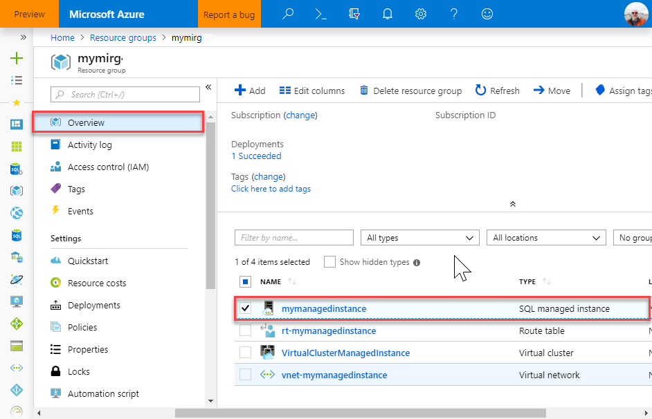
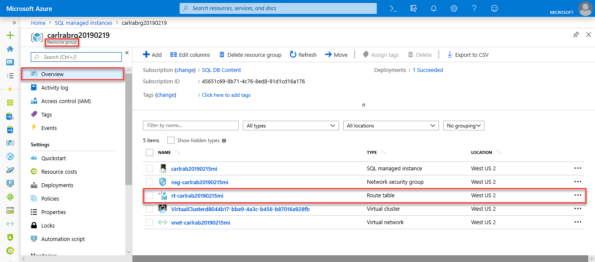
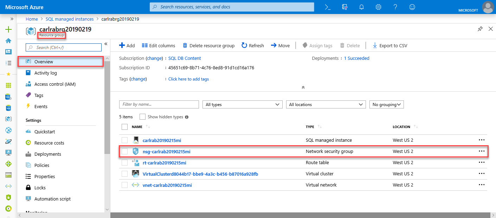
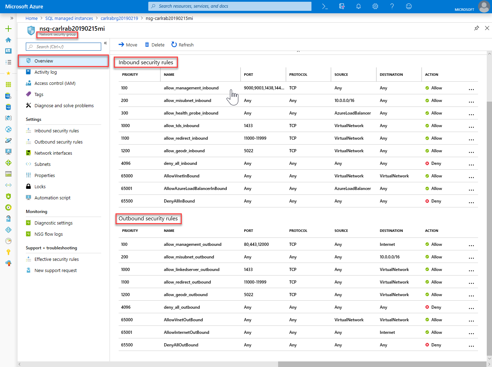
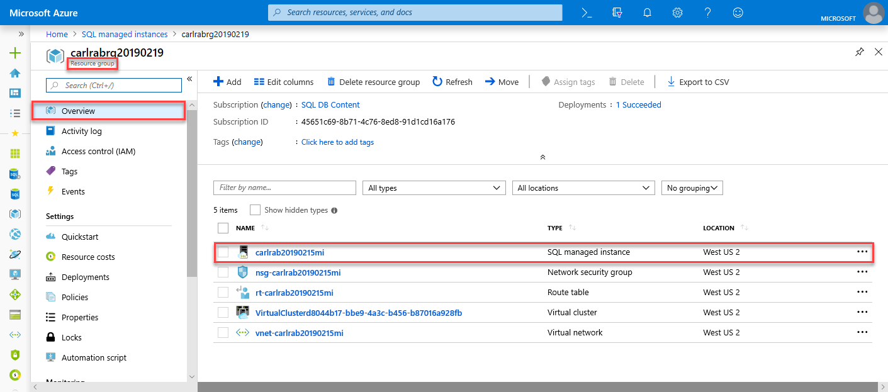
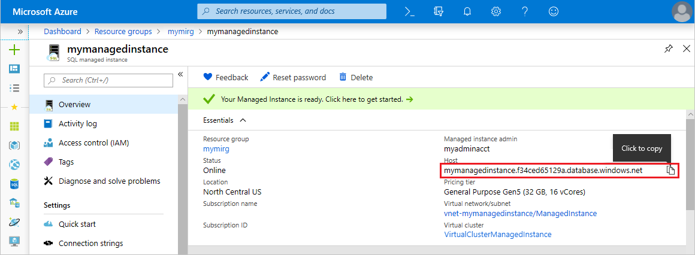

# Quickstart: Create an Azure SQL Database managed instance

This quickstart walks you through how to create an Azure SQL Database [managed instance](sql-database-managed-instance.md) in the Azure portal.

> [!IMPORTANT]
> For limitations, see [Supported regions](sql-database-managed-instance-resource-limits.md#supported-regions) and [Supported subscription types](sql-database-managed-instance-resource-limits.md#supported-subscription-types).

## Sign in to the Azure portal

If you don't have an Azure subscription, [create a free account](https://azure.microsoft.com/free/).

Sign in to the [Azure portal](https://portal.azure.com/).

## Create a managed instance

The following steps show you how to create a managed instance.

1. Select **Create a resource** in the upper-left corner of the Azure portal.
2. Locate **managed instance**, and then select **Azure SQL Managed Instance**.
3. Select **Create**.

   

4. Fill out the **SQL managed instance** form with the requested information by using the information in the following table.

   | Setting| Suggested value | Description |
   | ------ | --------------- | ----------- |
   | **Subscription** | Your subscription. | A subscription that gives you permission to create new resources. |
   |**Managed instance name**|Any valid name.|For valid names, see [Naming rules and restrictions](https://docs.microsoft.com/azure/architecture/best-practices/naming-conventions).|
   |**Managed instance admin login**|Any valid username.|For valid names, see [Naming rules and restrictions](https://docs.microsoft.com/azure/architecture/best-practices/naming-conventions). Don't use "serveradmin" because that's a reserved server-level role.|
   |**Password**|Any valid password.|The password must be at least 16 characters long and meet the [defined complexity requirements](../virtual-machines/windows/faq.md#what-are-the-password-requirements-when-creating-a-vm).|
   |**Time zone**|The time zone to be observed by your managed instance.|For more information, see [Time zones](sql-database-managed-instance-timezone.md).|
   |**Collation**|The collation that you want to use for your managed instance.|If you migrate databases from SQL Server, check the source collation by using `SELECT SERVERPROPERTY(N'Collation')` and use that value. For information about collations, see [Set or change the server collation](https://docs.microsoft.com/sql/relational-databases/collations/set-or-change-the-server-collation).|
   |**Location**|The location in which you want to create the managed instance.|For information about regions, see [Azure regions](https://azure.microsoft.com/regions/).|
   |**Virtual network**|Select either **Create new virtual network** or a valid virtual network and subnet.| If a network or subnet is unavailable, it must be [modified to satisfy the network requirements](sql-database-managed-instance-configure-vnet-subnet.md) before you select it as a target for the new managed instance. For information about the requirements for configuring the network environment for a managed instance, see [Configure a virtual network for a managed instance](sql-database-managed-instance-connectivity-architecture.md). |
   |**Enable public endpoint**   |Check this option to enable public endpoint   |For managed instance to be accessible through the public data endpoint, **Enable public endpoint** needs to be checked.| 
   |**Allow access from**   |Select one of the options: <ul> <li>**Azure services**</li> <li>**Internet**</li> <li>**No access**</li></ul>   |Portal experience enables configuring security group with public endpoint.     Based on your scenario, select one of the following options:   <ul> <li>Azure services - recommended when connecting from Power BI or other multi-tenant service. </li> <li> Internet - use for test purposes when you want to quickly spin up a managed instance. It’s not recommended for use in production environments. </li> <li> No access - this option creates a deny security rule. You’ll need to modify this rule in order to make managed instance accessible through public endpoint. </li> </ul>   For more information on public endpoint security, see [using Azure SQL Database managed instance securely with public endpoint](sql-database-managed-instance-public-endpoint-securely.md).|
   |**Connection type**|Choose between a Proxy and a Redirect connection type.|For more information about connection types, see [Azure SQL Database connection policy](sql-database-connectivity-architecture.md#connection-policy).|
   |**Resource group**|A new or existing resource group.|For valid resource group names, see [Naming rules and restrictions](https://docs.microsoft.com/azure/architecture/best-practices/naming-conventions).|

   

5. To use the managed instance as an instance failover group secondary, select the checkout and specify the DnsAzurePartner managed instance. This feature is in preview and isn't shown in the following screenshot.
6. Select **Pricing tier** to size compute and storage resources and to review the pricing tier options. The General Purpose pricing tier with 32 GB of memory and 16 vCores is the default value.
7. Use the sliders or text boxes to specify the amount of storage and the number of virtual cores.
8. When you're finished, select **Apply** to save your selection. 
9. Select **Create** to deploy the managed instance.
10. Select the **Notifications** icon to view the status of the deployment.

    

11. Select **Deployment in progress** to open the managed instance window to further monitor the deployment progress. 

> [!IMPORTANT]
> For the first instance in a subnet, deployment time is typically much longer than in subsequent instances. Don't cancel the deployment operation because it lasts longer than you expected.

## Review resources and retrieve your fully qualified server name

After the deployment is successful, review the resources that were created and retrieve the fully qualified server name for use in later quickstarts.

1. Open the resource group for your managed instance. View its resources that were created for you in the [create a managed instance](#create-a-managed-instance) quickstart.

   

2. Select the route table to review the user-defined route (UDR) table that was created for you.

   

3. In the route table, review the entries to route traffic from and within the managed instance virtual network. If you create or configure your route table manually, you must be sure to create these entries in the route table.

   

4. Return to the resource group, and select the network security group to review the security rules.

   

5. Review the inbound and outbound security rules. If you have configured public endpoints for your managed instance, see the article [Configure public endpoint](sql-database-managed-instance-public-endpoint-configure.md#allow-public-endpoint-traffic-on-the-network-security-group) for more information.

   

6. Return to the resource group, and select your managed instance.

   

7. On the **Overview** tab, locate the **Host** property. Copy the fully qualified host address for the managed instance for use in the next quickstart.

   

   The name is similar to **your_machine_name.a1b2c3d4e5f6.database.windows.net**.

## Next steps

- To learn about how to connect to a managed instance:
  - For an overview of the connection options for applications, see [Connect your applications to a managed instance](sql-database-managed-instance-connect-app.md).
  - For a quickstart that shows how to connect to a managed instance from an Azure virtual machine, see [Configure an Azure virtual machine connection](sql-database-managed-instance-configure-vm.md).
  - For a quickstart that shows how to connect to a managed instance from an on-premises client computer by using a point-to-site connection, see [Configure a point-to-site connection](sql-database-managed-instance-configure-p2s.md).
- To restore an existing SQL Server database from on-premises to a managed instance: 
    - Use the [Azure Database Migration Service (DMS) for migration](../dms/tutorial-sql-server-to-managed-instance.md) to restore from a database backup file. 
    - Use the [T-SQL RESTORE command](sql-database-managed-instance-get-started-restore.md) to restore from a database backup file.
- For advanced monitoring of managed instance database performance with built-in troubleshooting intelligence, see [Monitor Azure SQL Database by using Azure SQL Analytics](../azure-monitor/insights/azure-sql.md).
