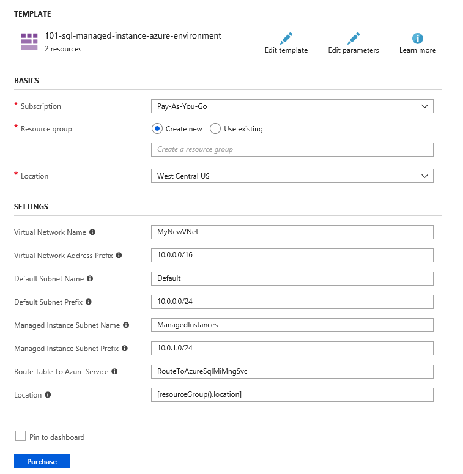
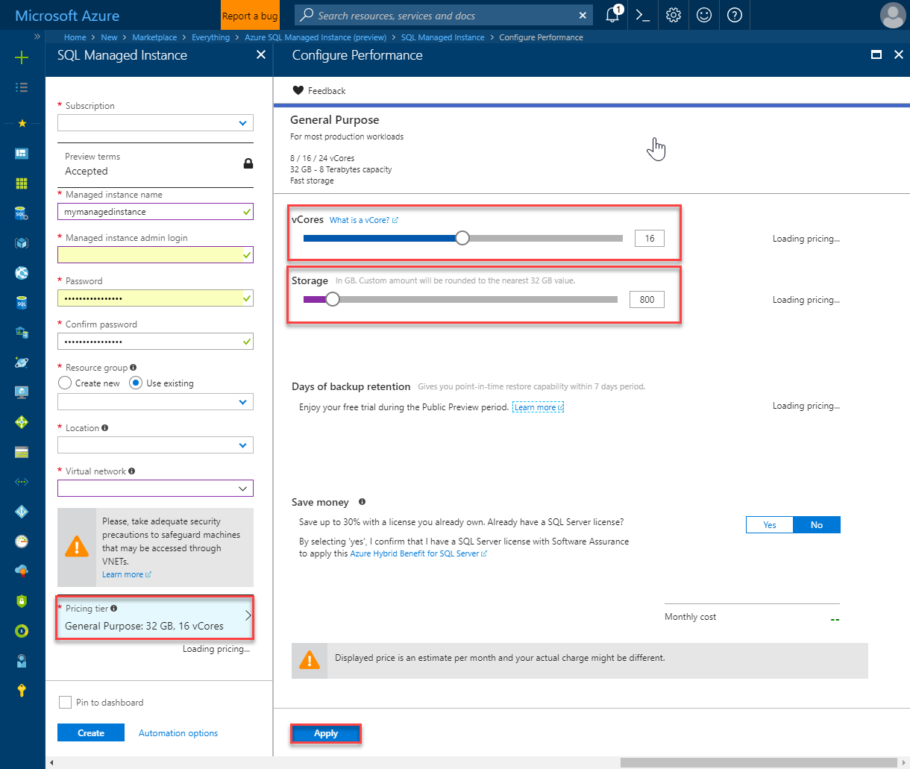

# Create an Azure SQL Managed Instance

This quickstart walks through how to create a SQL [Managed Instance](sql-database-managed-instance.md) in the Azure portal, including the preparation of the network environment. 

If you don't have an Azure subscription, create a [free](https://azure.microsoft.com/free/) account before you begin.

## Sign in to the Azure portal

Sign in to the [Azure portal](https://portal.azure.com/).

## Prerequisite - whitelist your subscription

This quickstart requires preview approval and whitelisting. Managed Instance is being released initially as a gated public preview that requires your subscription to be whitelisted. If your subscription is not already whitelisted, use the following steps to be offered and accept preview terms and send a request for whitelisting.

## Prepare network environment

SQL Managed Instance is a secure service that is placed in your own Azure Virtual Network (VNet). In order to create the Managed Instance, this quickstart creates the following network resources:
    - A Managed Instance subnet for the Managed Instance itself.
    - A user-defined route in the Managed Instance subnet that will enable Managed Instance to communicate with the Azure services that control and manage the instance.
    - A default subnet for client connectivity to the Managed Instance

The Managed Instance subnet is dedicated to Managed Instances and you cannot create any other resources (for example Azure Virtual Machines) in that subnet. Use the default subnet for client resources, such as a virtual machine for SQL Server Management Studio or for a web app.

1. Deploy the Azure network environment prepared for Azure SQL Database Managed Instance by clicking on the following button:

    

    This button will open a form in Azure portal where you can configure your network environment before you deploy it.

2. Optionally, change the names of VNet and subnets and adjust IP ranges associated to your networking resources. Then press **Purchase** to create and configure the network environment:

    

    > [!Note]
    > This Azure Resource Manager deployment creates two subnets in the VNet - one for Managed Instances called **ManagedInstances**, and the other called **Default** for other resources such as client virtual machine that can be used to connect to Managed Instance. If you change the names of VNet and subnets, make sure that you remember the new names because they will be needed in the following sections. In the rest of the tutorial will be assumed that you have created VNet called **MyNewVNet**, **ManagedInstances** subnet for SQL Managed Instances and **Default** subnet for Virtual machines and other resources.

## Create a Managed Instance

The following steps show you how to create your Managed Instance after your preview has been approved.

1. Click **Create a resource** in the upper left-hand corner of the Azure portal.
2. Locate **Managed Instance** and then select **Azure SQL Database Managed Instance (preview)**.
3. Click **Create**.

   

4. Select your subscription and verify that the preview terms show **Accepted**.

   

5. Fill out the Managed Instance form with the requested information, using the information in the following table:

   | Setting| Suggested value | Description |
   | ------ | --------------- | ----------- |
   |**Managed instance name**|Any valid name|For valid names, see [Naming rules and restrictions](https://docs.microsoft.com/azure/architecture/best-practices/naming-conventions).|
   |**Managed instance admin login**|Any valid user name|For valid names, see [Naming rules and restrictions](https://docs.microsoft.com/azure/architecture/best-practices/naming-conventions). Do not use "serveradmin" as that is a reserved server-level role.| 
   |**Password**|Any valid password|The password must be at least 16 characters long and meet the [defined complexity requirements](../virtual-machines/windows/faq.md#what-are-the-password-requirements-when-creating-a-vm).|
   |**Resource Group**|The resource group that you specified in the previous step|For valid resource group names, see [Naming rules and restrictions](https://docs.microsoft.com/azure/architecture/best-practices/naming-conventions).|
   |**Location**|The location that you specified in the previous step|For information about regions, see [Azure Regions](https://azure.microsoft.com/regions/).|
   |**Virtual network**|The virtual network that you created earlier| Choose **MyNewVNet/ManagedInstances** item if you have not changed the names in the previous step. Otherwise, choose the VNet name and managed instance subnet that you have entered in the previous section. **Do not use default subnet because it is not configured to host Managed Instances**. |

   

6. Click **Pricing tier** to size compute and storage resources as well as review the pricing tier options. By default, your instance gets 32 GB of storage space free of charge, **which may not be sufficient for your applications**.
7. Use the sliders or text boxes to specify the amount of storage and the number of virtual cores. 
   

8. When complete, click **Apply** to save your selection.  
9. Click **Create** to deploy the Managed Instance.
10. Click the **Notifications** icon to view the status of deployment.
11. Click **Deployment in progress** to open the Managed Instance window to further monitor the deployment progress.

While deployment occurs, continue to the next procedure.

> [!IMPORTANT]
> For the first instance in a subnet, deployment time is typically much longer than in case of the subsequent instances. Do not cancel deployment operation because it lasts longer than you expected. Creating the second Managed Instance in the subnet will take a couple of minutes.

## Next steps

- To learn about connecting to a Managed Instance, see:
  - For an overview of the connection options for applications, see [Connect your applications to Managed Instance](sql-database-managed-instance-connect-app.md).
  - For a quickstart showing how to connect to a Managed Instance from an Azure virtual machine, see [Configure an Azure virtual machine connection](sql-database-managed-instance-configure-vm.md).
  - For a quickstart showing how to connect to a Managed Instance from an on-premises client computer using a point-to-site connection, see [Configure a point-to-site connection](sql-database-managed-instance-configure-p2s.md).
- To restore an existing SQL Server database from on-premises to a Managed instance, you can use the [Azure Database Migration Service (DMS) for migration](../dms/tutorial-sql-server-to-managed-instance.md) to restore from a database backup file or the [T-SQL RESTORE command](sql-database-managed-instance-get-started-restore.md) to restore from a database backup file.
