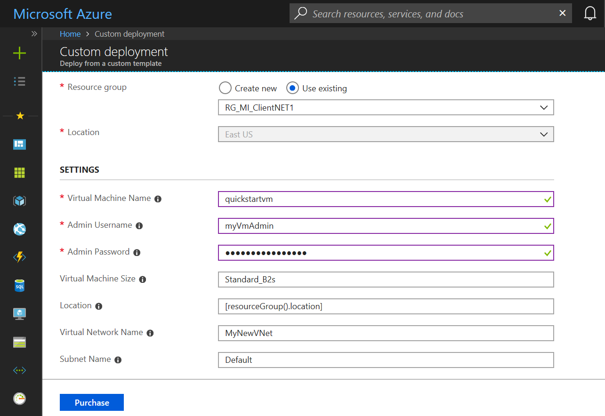

# Create an Azure SQL Managed Instance

This quickstart walks through how to create a SQL Managed Instance in Azure. Azure SQL Database Managed Instance is a Platform-as-a-Service (PaaS) SQL Server Database Engine Instance that enables you to run and scale highly available SQL Server databases in the Azure cloud. This quickstart shows you how to get started by creating a SQL Managed Instance.

If you don't have an Azure subscription, create a [free](https://azure.microsoft.com/free/) account before you begin.

## Sign in to the Azure portal

Sign in to the [Azure portal](https://portal.azure.com/).

## Prepare network environment

SQL Managed Instance is secure service that is placed in your own Azure Virtual Network (VNet). In order to create a Managed Instance, you would need to prepare network environment for managed instance, which includes:
 - Azure VNet where your Managed Instance will be placed.
 - Subnet in your Azure VNet where Managed Instances will be placed.
 - User-defined route that will enable Managed Instance to communicate with the Azure services that control and manage the instance.

The subnet is dedicated to Managed Instances and you cannot create any other resources (for example Azure Virtual Machines) in that subnet. You might want to create two subnets in your Azure VNet so you can place Managed Instances in the subnet dedicated to Managed Instances, and other the resources in the default subnet.

You can deploy Azure network environment prepared for Azure SQL Managed Instance by clicking on the following button:

This button will open a form where you can configure your network environment before you deploy it:

You might change the names of VNet and subnets and adjust IP ranges associated to your networking resources. Once you press "Purchase" button, this form will create and configure your environment. If you don't need two subnets, you can delete the default one later. 

 > [!Note]
 > If you change the names of VNet and subnets, make sure that you remember new names because they will be needed in the following sections. In the rest of the tutorial will be assumed that you have created VNet called **MyNewVNet**, **ManagedInstances** subnet for SQL Managed Instances and **Default** subnet for Virtual machines and other resources.

## Create a Managed Instance

The following steps show you how to create your Managed Instance after your preview has been approved.

1. Click **Create a resource** in the upper left-hand corner of the Azure portal.
2. Locate **Managed Instance** and then select **Azure SQL Database Managed Instance (preview)**.
3. Click **Create**.

   

4. Select your subscription and verify that the preview terms show **Accepted**.

   

5. Fill out the Managed Instance form with the requested information, using the information in the following table:

   | Setting| Suggested value | Description |
   | ------ | --------------- | ----------- |
   |**Managed instance name**|Any valid name|For valid names, see [Naming rules and restrictions](https://docs.microsoft.com/azure/architecture/best-practices/naming-conventions).|
   |**Managed instance admin login**|Any valid user name|For valid names, see [Naming rules and restrictions](https://docs.microsoft.com/azure/architecture/best-practices/naming-conventions). Do not use "serveradmin" as that is a reserved server-level role.| 
   |**Password**|Any valid password|The password must be at least 16 characters long and meet the [defined complexity requirements](../virtual-machines/windows/faq.md#what-are-the-password-requirements-when-creating-a-vm).|
   |**Resource Group**|The resource group that you created earlier||
   |**Location**|The location that you previously selected|For information about regions, see [Azure Regions](https://azure.microsoft.com/regions/).|
   |**Virtual network**|The virtual network that you created earlier| Choose **MyNewVNet/ManagedInstances** item if you have not changed the names in the previous step. Otherwise, choose the VNet name and managed instance subnet that you have entered in the previous section. **Do not use default subnet because it is not configured to host Managed Instances**. |

   

6. Click **Pricing tier** to size compute and storage resources as well as review the pricing tier options. By default, your instance gets 32 GB of storage space free of charge, **which may not be sufficient for your applications**.
7. Use the sliders or text boxes to specify the amount of storage and the number of virtual cores. 
   

8. When complete, click **Apply** to save your selection.  
9. Click **Create** to deploy the Managed Instance.
10. Click the **Notifications** icon to view the status of deployment.
 
   

11. Click **Deployment in progress** to open the Managed Instance window to further monitor the deployment progress.
 
   

While deployment occurs, continue to the next procedure.

> [!IMPORTANT]
> For the first instance in a subnet, deployment time is typically much longer than in case of the subsequent instances - sometimes more than 24 hours to complete. Do not cancel deployment operation because it lasts longer than you expected. This length of time to deploy your first instance is a temporary situation. Expect a significant reduction of deployment time shortly after the beginning of the public preview. Creating the second Managed Instance in the subnet will take a couple of minutes.

## Prepare client machine

Since SQL Managed Instance is placed in your private Virtual Network, you need to create an Azure VM with some installed SQL client tool like SQL Server Management Studio or SQL Operations Studio to connect to the Managed Instance and execute queries.

The easiest way to create a client virtual machine with all nesseccary tools is to use the following button (make sure that you are signed-in to the Azure portal):

This button will lead you to the following form in Azure portal where you can configure your Azure Virtual Machine that you will use to connect to your Managed Instance:

You would need to enter the name of virtual machine, administrator username, and password that you will use to connect to the VM. If you have not changed VNet name and the default subnet, you don't need to change last two parameters, otherwise you should change these values to the values that you entered when you set up the network environment.

When you click on the "Purchase" button, Azure VM will be deployed in the network that you prepared. You can connect to your VM using Remote Desktop connection and use SQL Server Management Studio or SQL Operation Studio installed on VM to connect to your Managed Instance.

## Next steps

 - [Connect your applications to Managed Instance](sql-database-managed-instance-connect-app.md).
 - [Migrate your databases from on-premises to Managed Instance](sql-database-managed-instance-migrate.md).

