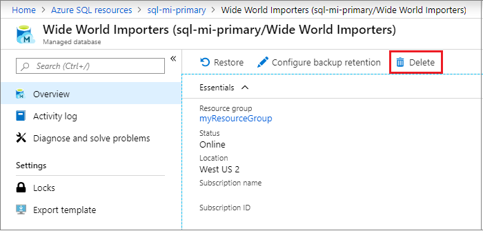

# Restore a SQL database in a managed instance to a previous point in time

Use point-in-time restore (PITR) to create a database as a copy of another database from some time in the past. This article describes how to do a point-in-time restore of a database in an Azure SQL Database managed instance.

Point-in-time restore is useful in recovery scenarios, such as incidents caused by errors, incorrectly loaded data, or deletion of crucial data. You can also use it simply for testing or auditing. Backup files are kept for 7 to 35 days, depending on your database settings.

Point-in-time restore can:

- Restore a database from an existing database.
- Restore a database from a deleted database.

For a managed instance, point-in-time restore can also:

- Restore a database to the same managed instance.
- Restore a database to another managed instance.

> [!NOTE]
> Point-in-time restore of a whole managed instance is not possible. This article explains only what's possible: point-in-time restore of a database that's hosted on a managed instance.

## Limitations

When you're restoring from one managed instance to another, both instances must be in the same subscription and region. Cross-region and cross-subscription restore aren't currently supported.

> [!WARNING]
> Be aware of the storage size of your managed instance. Depending on size of the data to be restored, you might run out of instance storage. If there isn't enough space for the restored data, use a different approach.

The following table shows point-in-time restore scenarios for managed instances:

|           |Restore existing DB to same managed instance| Restore existing DB to another managed instance|Restore dropped DB to same managed instance|Restore dropped DB to another managed instance|
|:----------|:----------|:----------|:----------|:----------|
|**Azure portal**| Yes|No |No|No|
|**Azure CLI**|Yes |Yes |No|No|
|**PowerShell**| Yes|Yes |Yes|Yes|

## Restore an existing database

Restore an existing database to the same instance by using the Azure portal, Powershell, or the Azure CLI. To restore a database to another instance, use Powershell or the Azure CLI so you can specify the properties for the target managed instance and resource group. If you don't specify these parameters, the database will be restored to the existing instance by default. The Azure portal doesn't currently support restoring to another instance.

# [Portal](#tab/azure-portal)

1. Sign in to the [Azure portal](https://portal.azure.com). 
2. Go to your managed instance and select the database that you want to restore.
3. Select **Restore** on the database page:

    

4. On the **Restore** page, select the point for the date and time that you want to restore the database to.
5. Select **Confirm** to restore your database. This action starts the restore process, which creates a new database and populates it with data from the original database at the specified point in time. For more information about the recovery process, see [Recovery time](sql-database-recovery-using-backups.md#recovery-time).

# [PowerShell](#tab/azure-powershell)

If you don't already have Azure PowerShell installed, see [Install the Azure PowerShell module](https://docs.microsoft.com/powershell/azure/install-az-ps).

To restore the database by using PowerShell, specify your values for the parameters in the following command. Then, run the command:

```powershell-interactive
$subscriptionId = "<Subscription ID>"
$resourceGroupName = "<Resource group name>"
$managedInstanceName = "<Managed instance name>"
$databaseName = "<Source-database>"
$pointInTime = "2018-06-27T08:51:39.3882806Z"
$targetDatabase = "<Name of new database to be created>"

Get-AzSubscription -SubscriptionId $subscriptionId
Select-AzSubscription -SubscriptionId $subscriptionId

Restore-AzSqlInstanceDatabase -FromPointInTimeBackup `
                              -ResourceGroupName $resourceGroupName `
                              -InstanceName $managedInstanceName `
                              -Name $databaseName `
                              -PointInTime $pointInTime `
                              -TargetInstanceDatabaseName $targetDatabase `
```

To restore the database to another managed instance, also specify the names of the target resource group and managed instance:  

```powershell-interactive
$targetResourceGroupName = "<Resource group of target managed instance>"
$targetInstanceName = "<Target managed instance name>"

Restore-AzSqlInstanceDatabase -FromPointInTimeBackup `
                              -ResourceGroupName $resourceGroupName `
                              -InstanceName $managedInstanceName `
                              -Name $databaseName `
                              -PointInTime $pointInTime `
                              -TargetInstanceDatabaseName $targetDatabase `
                              -TargetResourceGroupName $targetResourceGroupName `
                              -TargetInstanceName $targetInstanceName 
```

For details, see [Restore-AzSqlInstanceDatabase](https://docs.microsoft.com/powershell/module/az.sql/restore-azsqlinstancedatabase).

# [Azure CLI](#tab/azure-cli)

If you don't already have the Azure CLI installed, see [Install the Azure CLI](/cli/azure/install-azure-cli?view=azure-cli-latest).

To restore the database by using the Azure CLI, specify your values for the parameters in the following command. Then, run the command:

```azurecli-interactive
az sql midb restore -g mygroupname --mi myinstancename |
-n mymanageddbname --dest-name targetmidbname --time "2018-05-20T05:34:22"
```

To restore the database to another managed instance, also specify the names of the target resource group and managed instance:  

```azurecli-interactive
az sql midb restore -g mygroupname --mi myinstancename -n mymanageddbname |
       --dest-name targetmidbname --time "2018-05-20T05:34:22" |
       --dest-resource-group mytargetinstancegroupname |
       --dest-mi mytargetinstancename
```

For a detailed explanation of the available parameters, see the [CLI documentation for restoring a database in a managed instance](https://docs.microsoft.com/cli/azure/sql/midb?view=azure-cli-latest#az-sql-midb-restore).

---

## Restore a deleted database

Restoring a deleted database can be done by using PowerShell or Azure Portal.Please use this document to do this by [Azure Portal](https://docs.microsoft.com/azure/sql-database/sql-database-recovery-using-backups#managed-instance-database-1). The database can be restored to the same instance or another instance.

To restore a deleted database by using PowerShell, specify your values for the parameters in the following command. Then, run the command:

```powershell-interactive
$subscriptionId = "<Subscription ID>"
Get-AzSubscription -SubscriptionId $subscriptionId
Select-AzSubscription -SubscriptionId $subscriptionId

$resourceGroupName = "<Resource group name>"
$managedInstanceName = "<Managed instance name>"
$deletedDatabaseName = "<Source database name>"

$deleted_db = Get-AzSqlDeletedInstanceDatabaseBackup -ResourceGroupName $resourceGroupName `
            -InstanceName $managedInstanceName -DatabaseName $deletedDatabaseName 

$pointInTime = "2018-06-27T08:51:39.3882806Z"
$properties = New-Object System.Object
$properties | Add-Member -type NoteProperty -name CreateMode -Value "PointInTimeRestore"
$properties | Add-Member -type NoteProperty -name RestorePointInTime -Value $pointInTime
$properties | Add-Member -type NoteProperty -name RestorableDroppedDatabaseId -Value $deleted_db.Id
```

To restore the deleted database to another instance, change the names of the resource group and managed instance. Also, make sure that the location parameter matches the location of the resource group and the managed instance.

```powershell-interactive
$resourceGroupName = "<Second resource group name>"
$managedInstanceName = "<Second managed instance name>"

$location = "West Europe"

$restoredDBName = "WorldWideImportersPITR"
$resource_id = "subscriptions/$subscriptionId/resourceGroups/$resourceGroupName/providers/Microsoft.Sql/managedInstances/$managedInstanceName/databases/$restoredDBName"

New-AzResource -Location $location -Properties $properties `
        -ResourceId $resource_id -ApiVersion "2017-03-01-preview" -Force
```

## Overwrite an existing database

To overwrite an existing database, you must:

1. Drop the existing database that you want to overwrite.
2. Rename the point-in-time-restored database to the name of the database that you dropped.

### Drop the original database

You can drop the database by using the Azure portal, PowerShell, or the Azure CLI.

You can also drop the database by connecting to the managed instance directly, starting SQL Server Management Studio (SSMS), and then running the following Transact-SQL (T-SQL) command:

```sql
DROP DATABASE WorldWideImporters;
```

Use one of the following methods to connect to your database in the managed instance:

- [SSMS/Azure Data Studio via an Azure virtual machine](https://docs.microsoft.com/azure/sql-database/sql-database-managed-instance-configure-vm)
- [Point-to-site](https://docs.microsoft.com/azure/sql-database/sql-database-managed-instance-configure-p2s)
- [Public endpoint](https://docs.microsoft.com/azure/sql-database/sql-database-managed-instance-public-endpoint-configure)

# [Portal](#tab/azure-portal)

In the Azure portal, select the database from the managed instance, and then select **Delete**.

   

# [PowerShell](#tab/azure-powershell)

Use the following PowerShell command to drop an existing database from a managed instance:

```powershell
$resourceGroupName = "<Resource group name>"
$managedInstanceName = "<Managed instance name>"
$databaseName = "<Source database>"

Remove-AzSqlInstanceDatabase -Name $databaseName -InstanceName $managedInstanceName -ResourceGroupName $resourceGroupName
```

# [Azure CLI](#tab/azure-cli)

Use the following Azure CLI command to drop an existing database from a managed instance:

```azurecli-interactive
az sql midb delete -g mygroupname --mi myinstancename -n mymanageddbname
```

---

### Alter the new database name to match the original database name

Connect directly to the managed instance and start SQL Server Management Studio. Then, run the following Transact-SQL (T-SQL) query. The query will change the name of the restored database to that of the dropped database that you intend to overwrite.

```sql
ALTER DATABASE WorldWideImportersPITR MODIFY NAME = WorldWideImporters;
```

Use one of the following methods to connect to your database in the managed instance:

- [Azure virtual machine](https://docs.microsoft.com/azure/sql-database/sql-database-managed-instance-configure-vm)
- [Point-to-site](https://docs.microsoft.com/azure/sql-database/sql-database-managed-instance-configure-p2s)
- [Public endpoint](https://docs.microsoft.com/azure/sql-database/sql-database-managed-instance-public-endpoint-configure)

## Next steps

Learn about [automated backups](sql-database-automated-backups.md).
