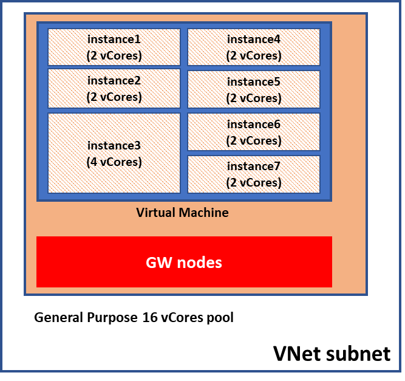
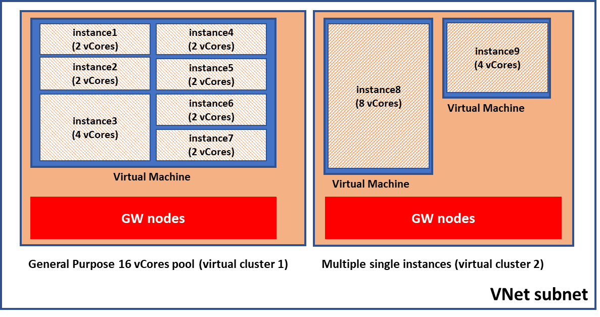

# What are SQL Database managed instance pools (preview)?

Instance pools are a new resource in Azure SQL Database, providing a convenient and cost-efficient way to migrate smaller SQL instances to the cloud at scale.

Previously, to migrate to the cloud, smaller, less compute-intensive workloads would often have to be consolidated on a larger managed instance. If you planned to migrate a group of databases hosted on multiple small-size SQL Servers on-premises (for example 2 vCores), you would need to deploy them together (consolidate) on the same managed instance of a larger size (8 vCores, for example). That typically required careful capacity planning and resource governance, additional security considerations and some extra data consolidation work at the instance level.

Managed instance pools bypass this by allowing you to *pre-provision compute* according to your total migration requirements (for example 8 vCores), then enabling you to deploy several individual managed instances up to your pre-provisioned compute level (two 2-vCore and one 4-vCore instances) and migrate databases these instances without any consolidation. The ability to deploy 2 vCore managed instance is now available only within instance pools.

Instance pools support native VNet integration and multiple pools can be deployed in the same subnet. Also, you can deploy multiple single instances (created outside of pools) and multiple instance pools in the same subnet, if your application requirements are such.

[Service tier property](https://docs.microsoft.com/en-us/azure/sql-database/sql-database-managed-instance-resource-limits#service-tier-characteristics) is associated to the pool resource so all deployed instances in that pool must have same service tier, aligned with the parent pool (General Purpose or Business Critical).

## Key capabilities of instance pools

Instance pools provide the following benefits for customers:

1.  Ability to host 2 vCore instances
2.  Predictable and fast instance deployment time (up to 5 minutes)
3.  Minimal IP address allocation

The following diagram illustrates an instance pool with multiple instances deployed within customer VNet subnet.



Instance pools enable deployment of multiple instances on the same virtual machine, which compute size is determined by the total number of vCores allocated for the pool. That architecture allows "partitioning" of allocated virtual machine into multiple instances, which can be any of the support sizes, including 2 vCores size, which is unique to instances deployed in pools.

Secondly, deployment or extension of a [virtual cluster](https://docs.microsoft.com/en-us/azure/sql-database/sql-database-managed-instance-connectivity-architecture#high-level-connectivity-architecture)
(dedicated set of virtual machines) is not part of managed instance provisioning but happens at managed instance provisioning time. Hence management operations on instances in a pool are much faster after pool is once deployed.

Since all instances in a pool share same virtual machine, total IP allocation does not depend on number of instances deployed, which is convenient for deployment in subnets with narrow IP range.

Every pool has a fixed IP allocation of only nine IP addresses (this does not include five IP addresses in the subnet reserved for its own needs).

For your reference, check out here [subnet size requirements](https://microsoft.sharepoint.com/teams/https:/docs.microsoft.com/en-us/azure/sql-database/ sql-database-managed-instance-determine-size-vnet-subnetsqlcloudlifter/Shared%20Documents/Documentation/Managed%20Instance%20Pools/Instance%20pool%20architecture.pptx) for single instances.

## Application scenarios for instance pools

These are the main use cases where instance pools should be considered:

- Migration of *a group of SQL* *instances* at the same time, where the majority are a smaller size (2 or 4 vCores, for example).

- Scenarios where *predictable and short instance creation or scaling* is important. For example - deployment of a new tenant in a SaaS multi-tenant application environment that requires instance-level surface area.

- Scenarios when having *fixed cost* or *spending limit* is important. For example -- running shared dev-test or demo environments of a fixed (or infrequently changing) size, in which you periodically deploy managed instances when needed.

- Scenarios where *minimal IP address allocation* in a VNet subnet is important. All instances in a pool are sharing virtual machine, hence number of allocated IP addresses is significantly lower than in case of single instances.

## How to deploy managed instances in pools

Process of instance deployment within a pool consists of two separate steps:

1. \[one-off\] Instance pool deployment. This is a long running operation, with the duration same as for [first instance creation in an empty subnet](https://docs.microsoft.com/en-us/azure/sql-database/sql-database-managed-instance#managed-instance-management-operations).

2. \[repetitive\] Instance deployment within the pool, created in the first step. Instance pool parameter must be explicitly specified as part of this operation. This is relatively fast operation, typically taking up to 5 minutes.

In public preview, both steps are supported through PowerShell and Resource Manager templates only. Azure portal experience will be added during public preview.

Once you deploy a managed instance within a pool, you can use the Azure portal to change its properties on the Pricing tier page.

For the detailed steps explaining how to create a pool and instances, check out [Getting started with managed instance pools](#security-consideration).

## Instance pool billing

Instance pools allow scaling compute and storage independently. Customers pay for compute associated with the pool resource and measured in vCores, and storage associated with every instance and measured in gigabytes (first 32 GB are free of charge for every instance).

vCore price for a pool is charged regardless of how many instances are deployed in that pool.

For the Compute price (measured in vCores), two pricing options are available:

-   License Included price: This is for customers who choose not to
    apply existing SQL Server licenses with Software Assurance

- Azure Hybrid Benefit price: Reduced price that includes Azure Hybrid Benefit for SQL Server. Customers can opt into this price by using their existing SQL Server licenses with Software Assurance. For eligibility and other details, see the [Azure Hybrid Benefit page](https://nam06.safelinks.protection.outlook.com/?url=https%3A%2F%2Fazure.microsoft.com%2Fen-us%2Fpricing%2Fhybrid-benefit%2F&data=02%7C01%7Cbonova%40microsoft.com%7C8bf82d6506374eadaa1208d722641b8a%7C72f988bf86f141af91ab2d7cd011db47%7C1%7C0%7C637015685864348664&sdata=4AAwQge%2Ftw%2BS0T8nRz%2B4BrNsdGFLjAOQacE5I%2BRglCM%3D&reserved=0)

Choosing between these two pricing options is not possible at the level of individual instances. All instances in the parent pool must be either at License Included price or Azure Hybrid Benefit price. The license model for the pool can be altered after the pool is created.

> [!IMPORTANT]
> If you specify License Model for the instance that is different than in the pool, instance level value will be ignored.

If you create instance pools on [subscriptions eligible for dev-test benefit](https://azure.microsoft.com/en-in/pricing/dev-test/), you will automatically receive discounted rates of up to 55 percent on Azure SQL managed instance.

For full details on instance pools pricing, refer to the "Instance Pools" section on the [managed instance pricing page](https://azure.microsoft.com/en-us/pricing/details/sql-database/managed/).

## Architecture of instance pools

Instance pools have similar architecture to regular managed instances ("single instances"). To support [deployments within Azure Virtual Networks (VNets)](https://docs.microsoft.com/en-us/azure/virtual-network/virtual-network-for-azure-services#deploy-azure-services-into-virtual-networks) and provide isolation and security for customers, instance pools also rely on [virtual
clusters](https://docs.microsoft.com/en-us/azure/sql-database/sql-database-managed-instance-connectivity-architecture#high-level-connectivity-architecture), which represent a dedicated set of isolated virtual machines deployed inside the customer\'s virtual network subnet.

The main difference between the two deployment models is that instance pools allow multiple SQL Server process deployments on the same virtual machine node, which are resource governed using [Windows Job
Objects](https://docs.microsoft.com/en-us/windows/desktop/ProcThread/job-objects), while single instances are always alone on a virtual machine node.

The following diagram shows instance pool and two individual instances deployed in the same subnet and illustrates main architectural details for both deployment models:



Every instance pool creates a separate virtual cluster underneath. Instances within a pool and single instances deployed in the same subnet do not share compute resources allocated to SQL Server
processes and gateway components that ensures performance predictability.

## Instance pools resource limitations

There are several resource limitations regarding instance pools and instances inside the pool:

- Instance pools are available only on Gen5 hardware
- Instances within the pool have dedicated CPU and RAM memory -- hence aggregated number of vCores across all instances must be less or equal to number of vCores allocated to the pool.
- All [instance level limits](https://docs.microsoft.com/en-us/azure/sql-database/sql-database-managed-instance-resource-limits#service-tier-characteristics) apply to instances created within a pool.
- In addition to instance-level limits there are also two limits imposed **at the instance pool level**:
  - **Total storage size per pool** **(8 TB)**
  - **Total number of databases per pool (100)**

Total storage allocation and number of databases across all instances must be lower or equal to the limits exposed by instance pools.

- Instance pools support vCore range of 8, 16, 24, 32, 40, 64, and 80.
- Managed instances inside pools support vCore range of 2, 4, 8, 16, 24, 32, 40, 64 and 80
- Managed instances inside pools support storage sizes between 32 GB and 8 TB, except:
  - 4 vCore instances support size between 32 GB and 2 TB
  - 2 vCore instances support size between 32 GB and 640 GB

## Public Preview limitations


The following limitations exist at public preview:

- Only the General Purpose service tier is available at this time. Business Critical service tier is planned to be added at GA time.

- Instance pools cannot be scaled during the public preview. This requires careful capacity planning before required deployment.

- No Azure portal support for instance pool creation and configuration exists at this time. All operations on instance pools are supported through PowerShell only. Initial instance deployment in a pre-created pool is also supported through PowerShell only. Once deployed in a pool, managed instances can be update using Azure portal.

- Managed instances created outside of the pool cannot be moved to an existing pool and vice versa, instances created inside pool cannot be moved outside as standalone managed instances or to another pool.
- Reserved Instance price (license included or with Azure Hybrid Benefit) is not available.

## SQL features supported

Instances created in pools support [full surface area](https://docs.microsoft.com/en-us/azure/sql-database/sql-database-managed-instance#sql-features-supported), same as regular single managed instances providing the same compatibility levels as standalone managed instance.

Every managed instance deployed in pools has separate instance of SQL Agent.

Optional features or features that require you to choose specific value (such as instance-level collation, time zone, public endpoint for data traffic, failover groups) are configured at instance level and can be different for every instance in the pool.

## Performance considerations

Although managed instances within pools do have dedicated vCore and RAM memory, they share local disk (for tempdb usage) and network resources. Although not very much likely, it is possible to experience "noisy neighbor" effect if multiple instances with the pool have high resource consumption at the same time. If you observe this behavior consider deploying these instances in a bigger pool or in form of single instances.

## Security consideration

Given that instances deployed in a pool share same virtual machine, you may want to consider disabling features that introduce higher security risks, or to firmly control access permissions to thee features. Examples are: CLR integration, native backup and restore, and database email.

## Getting started with instance pools

Instance pool operations are supported in PowerShell.

List of available commands \[link to commands\]


|Cmdlet |Description |
|:---|:---|
|New-AzSqlInstancePool | Creates an Azure SQL Database Instance pool |
|Get-AzSqlInstancePool | Returns information about Azure SQL Instance pool |
|Set-AzSqlInstancePool | Sets properties for an Azure SQL Database Instance pool |
|Remove-AzSqlInstancePool | Removes an Azure SQL Managed Database instance pool |
|Get-AzSqlInstancePoolUsage | Returns information about Azure SQL Instance pool usage |


To use PowerShell, make sure you [install the latest version of PowerShell Core](https://docs.microsoft.com/powershell/scripting/install/installing-powershell#powershell-core).

Then follow instructions to install Azure PowerShell module: [Install Azure PowerShell](https://docs.microsoft.com/powershell/azure/install-az-ps)

For operations related to Managed Instance inside pools, standard [Managed Instance commands](sql-database-managed-instance-create-manage.md#powershell-create-and-manage-managed-instances) can be used. When using these commands for instance inside pool, instance pool name property has to be populated.

### Examples

#### Create an instance pool

Step 1: Create new virtual network and subnet using [Azure portal template](https://docs.microsoft.com/en-us/azure/sql-database/sql-database-managed-instance-create-vnet-subnet) or use instructions for [preparing an existing virtual network](https://docs.microsoft.com/en-us/azure/sql-database/sql-database-managed-instance-configure-vnet-subnet)

Step 2: Execute command for creating new instance pool

```powershell
$instancePool = New-AzSqlInstancePool -ResourceGroupName "resource-group-name" -Name "mi-pool-name" -SubnetId "your-subnet-id" -LicenseType "BasePrice" -VCore 80 -Edition "GeneralPurpose" -ComputeGeneration "Gen5" -Location "westeurope"
```


### Create managed instance inside pool

```powershell
$instance = $instancePool | New-AzSqlInstance -Name "pool-mi-001" -VCore 2 -StorageSizeInGB 512
```

### Get pool usage with belonging managed instances details

```powershell
$myPool | Get-AzSqlInstancePoolUsage --ExpandChildren
```

### Update storage of managed instance placed inside the pool

```powershell
$instance | Set-AzSqlInstance -StorageSizeInGB 1024 -InstancePoolName "mi-pool-name"
```

### Get list of databases from managed instance

```powershell
$databases = Get-AzSqlInstanceDatabase -InstanceName "pool-mi-001" -ResourceGroupName " resource-group-name "
```


## Next steps

- To learn how to create your first managed instance, see [Quickstart guide](sql-database-managed-instance-get-started.md).
- For a features and comparison list, see [SQL common features](sql-database-features.md).
- For more information about VNet configuration, see [managed instance VNet configuration](sql-database-managed-instance-connectivity-architecture.md).
- For a quickstart that creates a managed instance and restores a database from a backup file, see [create a managed instance](sql-database-managed-instance-get-started.md).
- For a tutorial using the Azure Database Migration Service (DMS) for migration, see [managed instance migration using DMS](../dms/tutorial-sql-server-to-managed-instance.md).
- For advanced monitoring of managed instance database performance with built-in troubleshooting intelligence, see [Monitor Azure SQL Database using Azure SQL Analytics](../azure-monitor/insights/azure-sql.md).
- For pricing information, see [SQL Database managed instance pricing](https://azure.microsoft.com/pricing/details/sql-database/managed/).