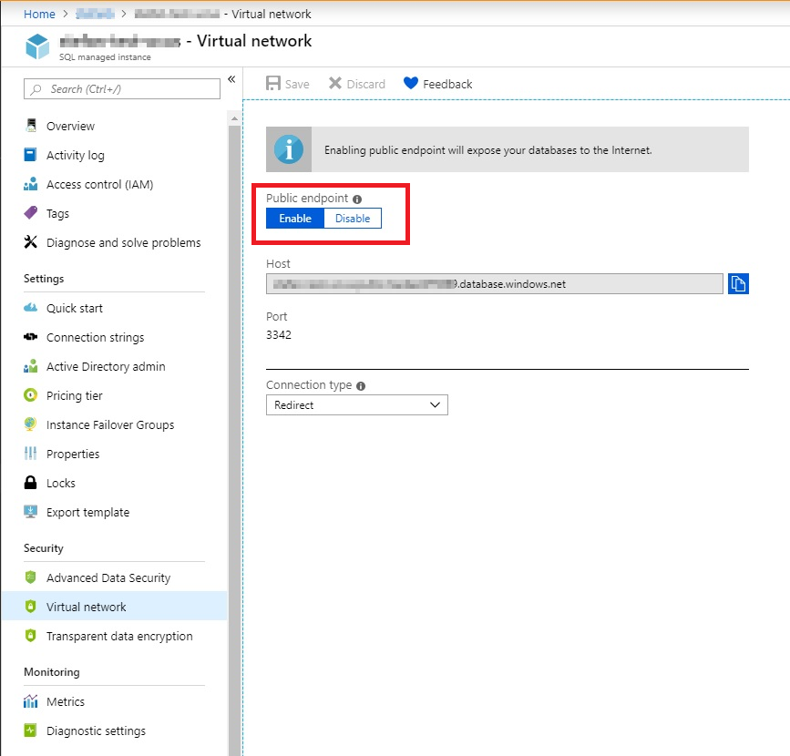
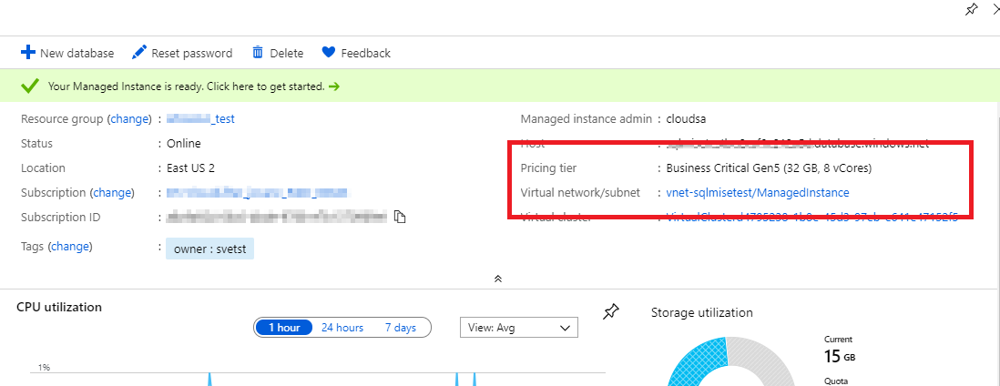
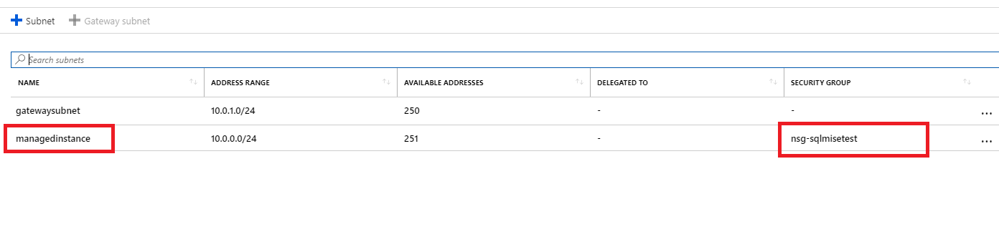
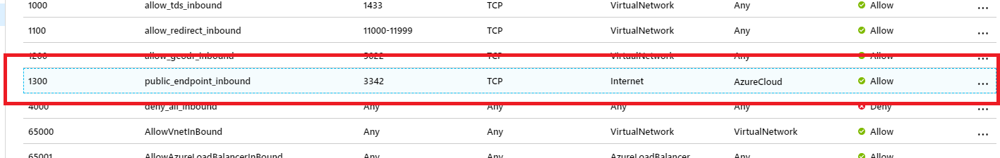
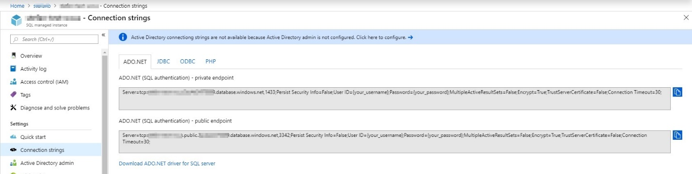

# Configure public endpoint in Azure SQL Database managed instance

Public endpoint for a [managed instance](https://docs.microsoft.com/azure/sql-database/sql-database-managed-instance-index) enables data access to your managed instance from outside the [virtual network](../virtual-network/virtual-networks-overview.md). You are able to access your managed instance from multi-tenant Azure services like Power BI, Azure App Service, or an on-premise network. By using the public endpoint on a managed instance, you do not need to use a VPN, which can help avoid VPN throughput issues.

In this article, you'll learn how to:

> [!div class="checklist"]
> - Enable public endpoint for your managed instance in the Azure portal
> - Enable public endpoint for your managed instance using PowerShell
> - Configure your managed instance network security group to allow traffic to the managed instance public endpoint
> - Obtain the managed instance public endpoint connection string

## Permissions

Due to the sensitivity of data that is in a managed instance, the configuration to enable managed instance public endpoint requires a two-step process. This security measure adheres to separation of duties (SoD):

- Enabling public endpoint on a managed instance needs to be done by the managed instance admin. The managed instance admin can be found on **Overview** page of your SQL managed instance resource.
- Allowing traffic using a network security group that needs to be done by a network admin. For more information, see [network security group permissions](../virtual-network/manage-network-security-group.md#permissions).

## Enabling public endpoint for a managed instance in the Azure portal

1. Launch the Azure portal at <https://portal.azure.com/.>
1. Open the resource group with the managed instance, and select the **SQL managed instance** that you want to configure public endpoint on.
1. On the **Security** settings, select the **Virtual network** tab.
1. In the Virtual network configuration page, select **Enable** and then the **Save** icon to update the configuration.



## Enabling public endpoint for a managed instance using PowerShell

### Enable public endpoint

Run the following PowerShell commands. Replace **subscription-id** with your subscription ID. Also replace **rg-name** with the resource group for your managed instance, and replace **mi-name** with the name of your managed instance.

```powershell
Install-Module -Name Az

Import-Module Az.Accounts
Import-Module Az.Sql

Connect-AzAccount

# Use your subscription ID in place of subscription-id below

Select-AzSubscription -SubscriptionId {subscription-id}

# Replace rg-name with the resource group for your managed instance, and replace mi-name with the name of your managed instance

$mi = Get-AzSqlInstance -ResourceGroupName {rg-name} -Name {mi-name}

$mi = $mi | Set-AzSqlInstance -PublicDataEndpointEnabled $true -force
```

### Disable public endpoint

To disable the public endpoint using PowerShell, you would execute the following command (and also do not forget to close the NSG for the inbound port 3342 if you have it configured):

```powershell
Set-AzSqlInstance -PublicDataEndpointEnabled $false -force
```

## Allow public endpoint traffic on the network security group

1. If you have the configuration page of the managed instance still open, navigate to the **Overview** tab. Otherwise, go back to your **SQL managed instance** resource. Select the **Virtual network/subnet** link, which will take you to the Virtual network configuration page.

    

1. Select the **Subnets** tab on the left configuration pane of your Virtual network, and make note of the **SECURITY GROUP** for your managed instance.

    

1. Go back to your resource group that contains your managed instance. You should see the **Network security group** name noted above. Select the name to go into the network security group configuration page.

1. Select the **Inbound security rules** tab, and **Add** a rule that has higher priority than the **deny_all_inbound** rule with the following settings: </br> </br>

    |Setting  |Suggested value  |Description  |
    |---------|---------|---------|
    |**Source**     |Any IP address or Service tag         |<ul><li>For Azure services like Power BI, select the Azure Cloud Service Tag</li> <li>For your computer or Azure VM, use NAT IP address</li></ul> |
    |**Source port ranges**     |*         |Leave this to * (any) as source ports are usually dynamically allocated and as such, unpredictable |
    |**Destination**     |Any         |Leaving destination as Any to allow traffic into the managed instance subnet |
    |**Destination port ranges**     |3342         |Scope destination port to 3342, which is the managed instance public TDS endpoint |
    |**Protocol**     |TCP         |Managed instance uses TCP protocol for TDS |
    |**Action**     |Allow         |Allow inbound traffic to managed instance through the public endpoint |
    |**Priority**     |1300         |Make sure this rule is higher priority than the **deny_all_inbound** rule |

    

    > [!NOTE]
    > Port 3342 is used for public endpoint connections to managed instance, and cannot be changed at this point.

## Obtaining the managed instance public endpoint connection string

1. Navigate to the SQL managed instance configuration page that has been enabled for public endpoint. Select the **Connection strings** tab under the **Settings** configuration.
1. Note that the public endpoint host name comes in the format <mi_name>.**public**.<dns_zone>.database.windows.net and that the port used for the connection is 3342.

    

## Next steps

- Learn about [using Azure SQL Database managed instance securely with public endpoint](sql-database-managed-instance-public-endpoint-securely.md).