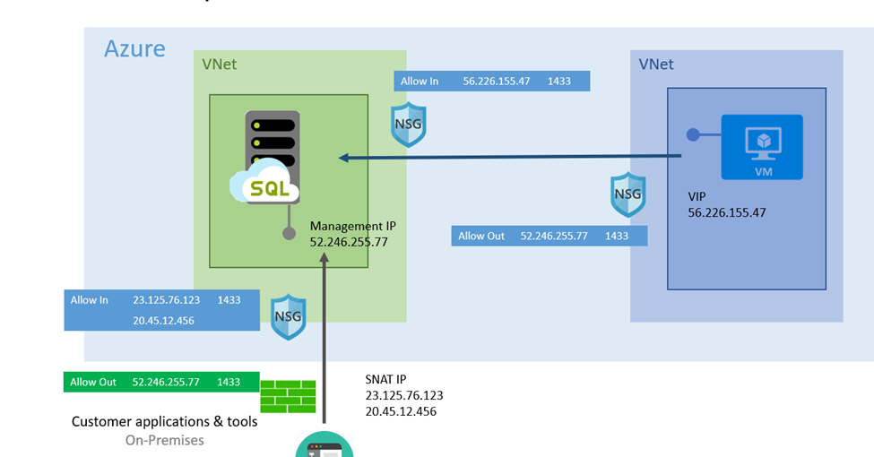

# Using Azure SQL Database managed instance securely with public endpoint

Azure SQL Database managed instance could be enabled to provide user connectivity over [public endpoint](../virtual-network/virtual-network-service-endpoints-overview.md). This article provides guidance how to make this configuration more secure.

## Scenarios

Managed instance provides private endpoint to enable connectivity from inside its virtual network. The default option is to provide maximum isolation. However, there are scenarios where a public endpoint connection is needed:

- Integration with multi-tenant only PaaS offerings.
- Higher throughput of data exchange than using VPN.
- Company policies prohibit PaaS inside corporate networks.

## Deploying managed instance for public Endpoint access

Although not mandatory, the common deployment model for a managed instance with public endpoint access is to create the instance in a dedicated isolated virtual network. In this configuration, the virtual network is used just for virtual cluster isolation. It's not relevant if the managed instance IP address space overlaps with a corporate network IP address space.

## Securing data in motion

Managed instance data traffic is always encrypted if the client driver supports encryption. Data between the managed instance and other Azure Virtual Machines or Azure services never leaves Azure's backbone. If there's a managed instance to an on-premises network connection, it's recommended to use Express Route with Microsoft peering. Express Route will help avoid moving data over public Internet (for managed instance private connectivity, only private peering can be used).

## Locking down inbound and outbound connectivity

The following diagram shows recommended security configurations.

Managed Instance has a [dedicated public endpoint address](sql-database-managed-instance-find-management-endpoint-ip-address.md). This IP address should be set in the client side outbound firewall and Network Security Group rules to limit outbound connectivity.

To ensure traffic to the managed instance is coming from trusted sources, it’s recommended to connect from sources with well-known IP addresses. Limit the access to the managed instance public endpoint on port 3342 using a Network Security Group.

When clients need to initiate a connection from an on-premise network, make sure the originating address is translated to a well-known set of IPs. If that can't be achieved (for example, mobile workforce being a typical scenario), it's recommended to use [Point-to-site VPN connections and a private endpoint](sql-database-managed-instance-configure-p2s.md).

If connections are started from Azure, it's recommended that traffic comes from well-known assigned [VIP](../virtual-network/virtual-networks-reserved-public-ip.md) (for example, Virtual Machines). For ease of managing VIP addresses, customers might consider using [public IP address prefix](../virtual-network/public-ip-address-prefix.md).