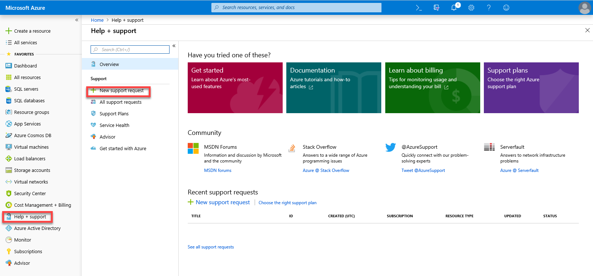
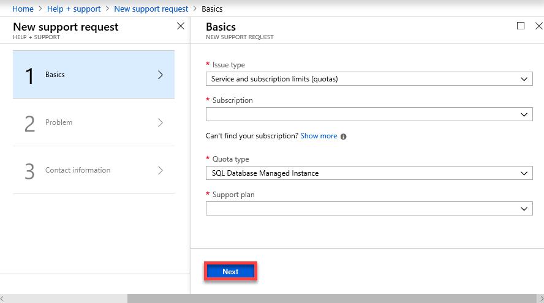
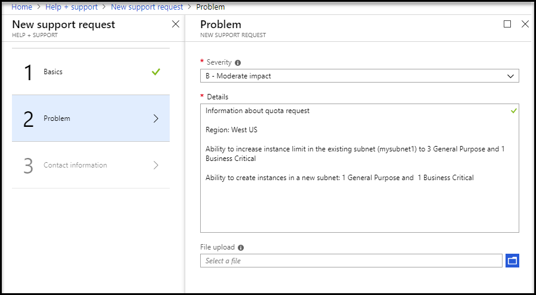

# Overview Azure SQL Database managed instance resource limits

This article provides an overview of the resource limits for Azure SQL Database managed instance, and provides information about how to request an increase to these limits.

> [!NOTE]
> For differences in supported features and T-SQL statements see [Feature differences](sql-database-features.md) and [T-SQL statement support](sql-database-managed-instance-transact-sql-information.md).

## Instance-level resource limits

Managed instance has characteristics and resource limits that depend on the underlying infrastructure and architecture. Limits depend on hardware generation and service tier.

### Hardware generation characteristics

Azure SQL Database managed instance can be deployed on two hardware generations: Gen4 and Gen5. Hardware generations have different characteristics, as described in the following table:

|   | **Gen4** | **Gen5** |
| --- | --- | --- |
| Hardware | Intel E5-2673 v3 (Haswell) 2.4-GHz processors, attached SSD vCore = 1 PP (physical core) | Intel E5-2673 v4 (Broadwell) 2.3-GHz processors, fast NVMe SSD, vCore=1 LP (hyper-thread) |
| Number of vCores | 8, 16, 24 vCores | 4, 8, 16, 24, 32, 40, 64, 80 vCores |
| Max memory (memory/core ratio) | 7 GB per vCore Add more vCores to get more memory. | 5.1 GB per vCore Add more vCores to get more memory. |
| Max In-Memory OLTP memory | Instance limit: 3 GB per vCore Database limits:  - 8-core: 8 GB per database  - 16-core: 20 GB per database  - 24-core: 36 GB per database | Instance limit: 2.5 GB per vCore Database limits:  - 8-core: 13 GB per database  - 16-core: 32 GB per database |
| Max instance reserved storage (General Purpose) |  8 TB | 8 TB |
| Max instance reserved storage (Business Critical) | 1 TB | 1 TB, 2 TB, or 4 TB depending on the number of cores |

> [!IMPORTANT]
> New Gen4 databases are no longer supported in the AustraliaEast region.

### Service tier characteristics

Managed instance has two service tiers: General Purpose and Business Critical. These tiers provide different capabilities, as described in the table below:

| **Feature** | **General Purpose** | **Business Critical** |
| --- | --- | --- |
| Number of vCores\* | Gen4: 8, 16, 24 Gen5: 4, 8, 16, 24, 32, 40, 64, 80 | Gen4: 8, 16, 24, 32   Gen5: 4, 8, 16, 24, 32, 40, 64, 80 |
| Max memory | Gen4: 56 GB - 168 GB (7GB/vCore) Gen5: 40.8 GB - 408 GB (5.1GB/vCore) Add more vCores to get more memory. | Gen4: 56 GB - 168 GB (7GB/vCore) Gen5: 40.8 GB - 408 GB (5.1GB/vCore) Add more vCores to get more memory. |
| Max instance reserved storage size | - 2 TB for 4 vCores (Gen5 only) - 8 TB for other sizes | Gen4: 1 TB   Gen5:  - 1 TB for 4, 8, 16 vCores - 2 TB for 24 vCores - 4 TB for 32, 40, 64, 80 vCores |
| Max database size | Determined by the max storage size per instance | Determined by the max storage size per instance |
| Max number of databases per instance | 100 | 100 |
| Max number of database files per instance | Up to 280 | 32,767 files per database |
| Data/Log IOPS (approximate) | 500 - 7,500 per file \*[Increase file size to get more IOPS](https://docs.microsoft.com/azure/virtual-machines/windows/premium-storage-performance#premium-storage-disk-sizes)| 11 K - 110 K (1375/vCore) Add more vCores to get better IO performance. |
| Log write throughput limit | 3 MB/s per vCore Max 22 MB/s per instance | 4 MB/s per vCore Max 48 MB/s per instance|
| Data throughput (approximate) | 100 - 250 MB/s per file \*[Increase the file size to get better IO performance](https://docs.microsoft.com/azure/virtual-machines/windows/premium-storage-performance#premium-storage-disk-sizes) | N/A |
| Storage IO latency (approximate) | 5-10 ms | 1-2 ms |
| Max tempDB size | 192 - 1,920 GB (24 GB per vCore) Add more vCores to get more TempDB space. | Limited by the max instance storage size. TempDB log file size is currently limited to 24GB/vCore. |
| Max sessions | 30000 | 30000 |

> [!NOTE]
> - Both data and log file size in the user and system databases are included in the instance storage size that is compared with the Max storage size limit. Use <a href="https://docs.microsoft.com/sql/relational-databases/system-catalog-views/sys-master-files-transact-sql">sys.master_files</a> system view to determine the total used space by databases. Error logs are not persisted and not included in the size. Backups are not included in storage size.
> - Throughput and IOPS also depend on the page size that is not explicitly limited by managed instance.

## Supported regions

Managed instances can be created only in [supported regions](https://azure.microsoft.com/global-infrastructure/services/?products=sql-database&regions=all). To create a managed instance in a region that is currently not supported, you can [send a support request via the Azure portal](#obtaining-a-larger-quota-for-sql-managed-instance).

## Supported subscription types

Managed instance currently supports deployment only on the following types of subscriptions:

- [Enterprise Agreement (EA)](https://azure.microsoft.com/pricing/enterprise-agreement/)
- [Pay-as-you-go](https://azure.microsoft.com/offers/ms-azr-0003p/)
- [Cloud Service Provider (CSP)](https://docs.microsoft.com/partner-center/csp-documents-and-learning-resources)
- [Enterprise Dev/Test](https://azure.microsoft.com/offers/ms-azr-0148p/)
- [Pay-As-You-Go Dev/Test](https://azure.microsoft.com/offers/ms-azr-0023p/)
- [Subscriptions with monthly Azure credit for Visual Studio subscribers](https://azure.microsoft.com/pricing/member-offers/credit-for-visual-studio-subscribers/)

## Regional resource limitations

Supported subscription types can contain a limited number of resources per region. Managed instance has two default limits per Azure region depending on a type of subscription type:

- **Subnet limit**: The maximum number of subnets where managed instances are deployed in a single region.
- **vCore limit**: The maximum number of vCores that can be deployed across all instances in a single region.

> [!Note]
> These limits are default settings and not technical limitations. The limits can be increased on-demand by creating a special [support request in the Azure portal](#obtaining-a-larger-quota-for-sql-managed-instance) if you need more managed instances in the current region. As an alternative, you can create new managed instances in another Azure region without sending support requests.

The following table shows the default regional limits for supported subscriptions:

|Subscription type| Max number of managed instance subnets | Max number of vCore units* |
| :---| :--- | :--- |
|Pay-as-you-go|3|320|
|CSP |8 (15 in some regions**)|960 (1440 in some regions**)|
|Pay-as-you-go Dev/Test|3|320|
|Enterprise Dev/Test|3|320|
|EA|8 (15 in some regions**)|960 (1440 in some regions**)|
|Visual Studio Enterprise|2 |64|
|Visual Studio Professional and MSDN Platforms|2|32|

\* When you plan your deployments, consider that a Business Critical (BC) vCore (due to added redundancy) consumes 4x more capacity than a General Purpose (GP) vCore. So, for your calculations, 1 GP vCore = 1 vCore unit and 1 BC vCore = 4 vCore units. To simplify your consumption analysis against the default limits, summarize the vCore units across all subnets in the region where managed instances are deployed and compare the results with the instance unit limits for your subscription type. **Max number of vCore units** limit applies to each subscription in a region. There is no limit per individual subnets except that the sum of all vCores deployed across multiple subnets must be lower or equal to **max number of vCore units**.

\*\* Larger subnet and vCore limits are available in the following regions: Australia East, East US, East US 2, North Europe, South Central US, Southeast Asia, UK South, West Europe, West US 2.

## Obtaining a larger quota for SQL managed instance

If you need more managed instances in your current regions, send a support request to extend the quota using the Azure portal.
To initiate the process of obtaining a larger quota:

1. Open **Help + support**, and click **New support request**.

   
2. On the Basics tab for the new support request:
   - For **Issue type**, select **Service and subscription limits (quotas)**.
   - For **Subscription**, select your subscription.
   - For **Quota type**, select **SQL Database Managed Instance**.
   - For **Support plan**, select your support plan.

     

3. Click **Next**.
4. On the **Problem tab** for the new support request:
   - For **Severity**, select the severity level of the problem.
   - For **Details**, provide additional information about your issue, including error messages.
   - For **File upload**, attach a file with more information (up to 4 MB).

     

     > [!IMPORTANT]
     > A valid request should include:
     > - Region in which subscription limit needs to be increased.
     > - Required number of vCores, per service tier in existing subnets after the quota increase (if any of the existing subnets needs to be expanded.
     > - Required number of new subnets and total number of vCores per service tier within the new subnets (if you need to deploy managed instances in new subnets).

5. Click **Next**.
6. On the Contact Information tab for the new support request, enter preferred contact method (email or phone) and the contact details.
7. Click **Create**.

## Next steps

- For more information about managed instance, see [What is a managed instance?](sql-database-managed-instance.md).
- For pricing information, see [SQL Database managed instance pricing](https://azure.microsoft.com/pricing/details/sql-database/managed/).
- To learn how to create your first managed instance, see [the quickstart guide](sql-database-managed-instance-get-started.md).
