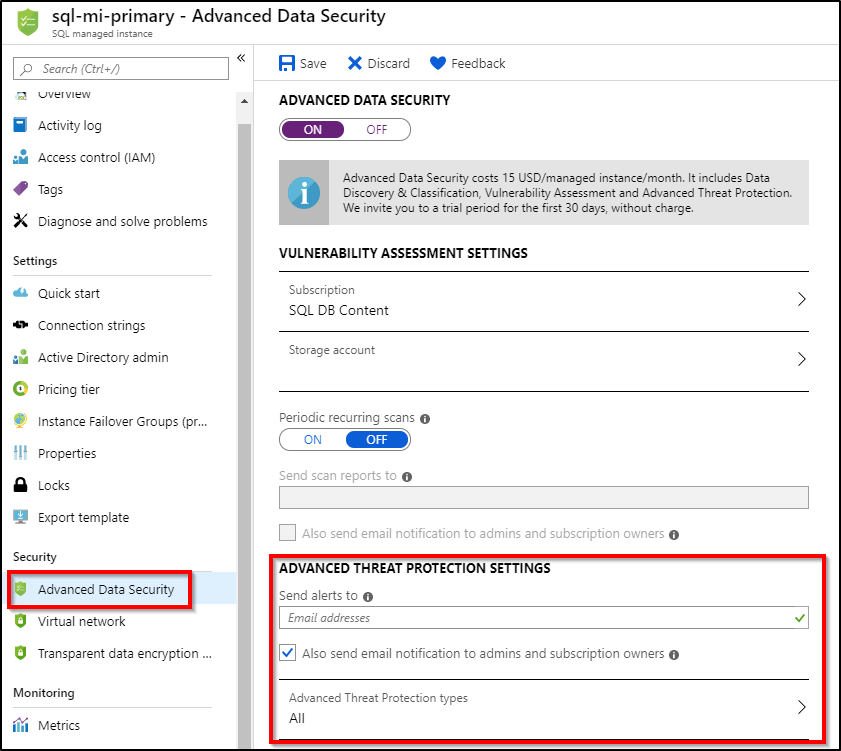
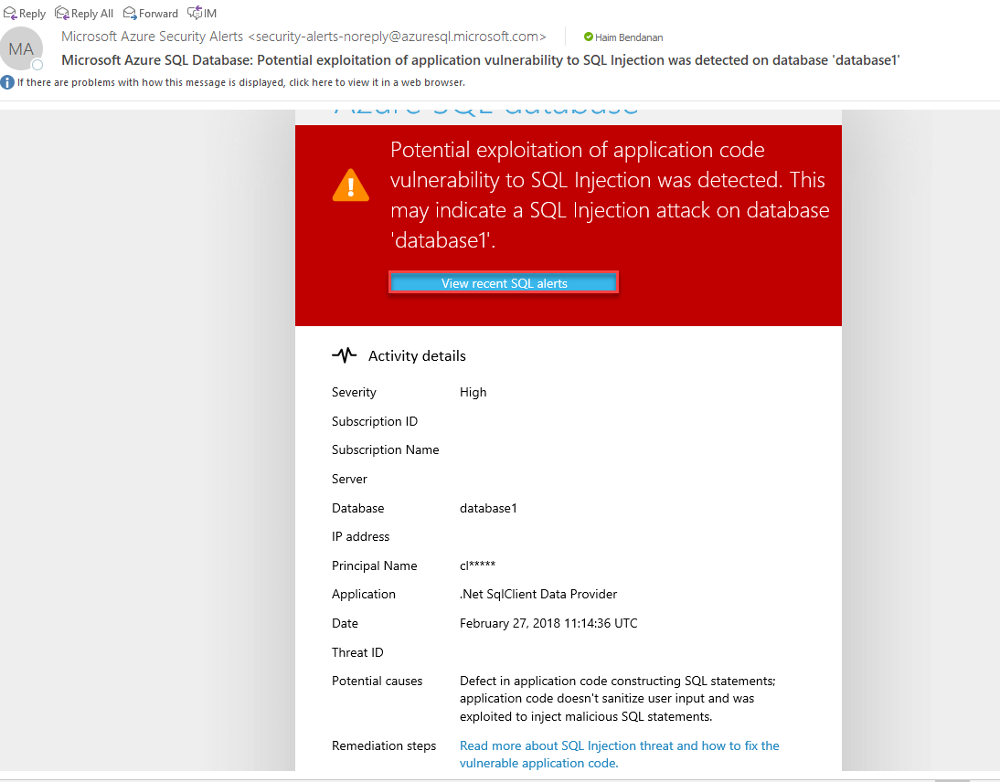
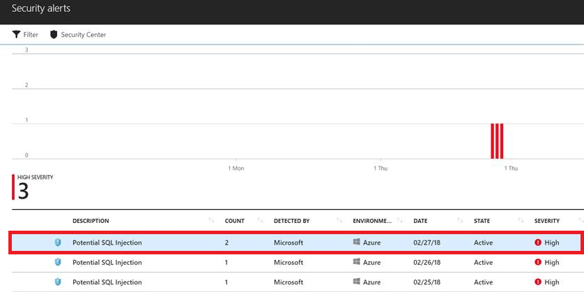
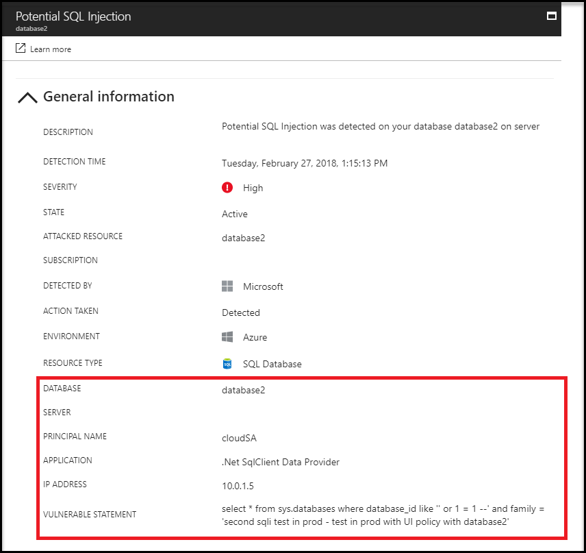

# Azure SQL Database Managed Instance Threat Detection

SQL Threat Detection detects anomalous activities indicating unusual and potentially harmful attempts to access or exploit databases in an Azure SQL Database Managed Instance.

## Overview

Threat Detection detects anomalous database activities indicating potential security threats to Managed Instance. Threat Detection is now in preview for Managed Instance.

Threat Detection provides a new layer of security, which enables customers to detect and respond to potential threats as they occur by providing security alerts on anomalous database activities. Threat Detection makes it simple to address potential threats to the Managed Instance without the need to be a security expert or manage advanced security monitoring systems. For a full investigation experience, it is recommended to enable Azure Managed Instance Auditing, which writes database events to an audit log in your Azure storage account. 

SQL Threat Detection integrates alerts with [Azure Security Center](https://azure.microsoft.com/services/security-center/), and, each protected Managed Instance is billed at the same price as Azure Security Center Standard tier, at $15/node/month, where each protected Managed Instance is counted as one node.  

## Set up Threat Detection for your Managed Instance in the Azure portal
1. Launch the Azure portal at [https://portal.azure.com](https://portal.azure.com).
2. Navigate to the configuration page of the Managed Instance you want to protect. In the **Settings** page, select **Threat Detection**. 
3. In the Threat Detection configuration page 
   - Turn **ON** Threat detection.
   - Configure the **list of emails** to receive security alerts upon detection of anomalous database activities.
   - Select the **Azure storage account** where anomalous threat audit records are saved. 
4.	Click **Save** to save the new or updated threat detection policy.

   

## Explore anomalous Managed Instance activities upon detection of a suspicious event

1. You receive an email notification upon detection of anomalous database activities. 

   The email provides information about the suspicious security event including the nature of the anomalous activities, database name, server name, and the event time. In addition, it provides information on possible causes and recommended actions to investigate and mitigate the potential threat to the Managed Instance.

   

2. Click the **View recent SQL alerts** link in the email to launch the Azure portal and show the Azure Security Center alerts page, which provides an overview of active SQL threats detected on the Managed Instance’s database.

   

3. Click a specific alert to get additional details and actions for investigating this threat and remediating future threats.

   For example, SQL injection is one of the common Web application security issues on the Internet. SQL injection is used to attack data-driven applications. Attackers take advantage of application vulnerabilities to inject malicious SQL statements into application entry fields, breaching or modifying data in the database. For SQL Injection alerts, the alert’s details include the vulnerable SQL statement that was exploited.

   

## Managed Instance Threat Detection alerts 

Threat Detection for Managed Instance detects anomalous activities indicating unusual and potentially harmful attempts to access or exploit databases and it can trigger the following alerts:
- **Vulnerability to SQL Injection**: This alert is triggered when an application generates a faulty SQL statement in the database. This may indicate a possible vulnerability to SQL injection attacks. There are two possible reasons for the generation of a faulty statement:
 - A defect in application code that constructs the faulty SQL statement
 - Application code or stored procedures don't sanitize user input when constructing the faulty SQL statement, which may be exploited for SQL Injection
- **Potential SQL injection**: This alert is triggered when an active exploit happens against an identified application vulnerability to SQL injection. It means that the attacker is trying to inject malicious SQL statements using the vulnerable application code or stored procedures.
- **Access from unusual location**: This alert is triggered when there is a change in the access pattern to a Managed Instance, where someone has logged on to the Managed Instance from an unusual geographical location. In some cases, the alert detects a legitimate action (a new application or developer’s maintenance operation). In other cases, the alert detects a malicious action (former employee, external attacker, and so on).
- **Access from unusual Azure data center**: This alert is triggered when there is a change in the access pattern to Managed Instance, where someone has logged on to the Managed Instance from an Azure Data Center that was not seen accessing this Managed Instance during the recent period. In some cases, the alert detects a legitimate action (your new application in Azure, Power BI, Azure SQL Query Editor, and so on). In other cases, the alert detects a malicious action from an Azure resource/service (former employee, external attacker).
- **Access from unfamiliar principal**: This alert is triggered when there is a change in the access pattern to Managed Instance server, where someone has logged on to the Managed Instance using an unusual principal (SQL user). In some cases, the alert detects a legitimate action (new application developer’s maintenance operation). In other cases, the alert detects a malicious action (former employee, external attacker).
- **Access from a potentially harmful application**: This alert is triggered when a potentially harmful application is used to access the database. In some cases, the alert detects penetration testing in action. In other cases, the alert detects an attack using common attack tools.
- **Brute force SQL credentials**: This alert is triggered when there is an abnormal high number of failed logins with different credentials. In some cases, the alert detects penetration testing in action. In other cases, the alert detects a brute force attack.

## Next steps

- Learn about Managed Instance, see [What is a Managed Instance](sql-database-managed-instance.md)
- Learn more about [Managed Instance Auditing](https://go.microsoft.com/fwlink/?linkid=869430) 
- Learn more about [Azure Security Center](https://docs.microsoft.com/azure/security-center/security-center-intro)
