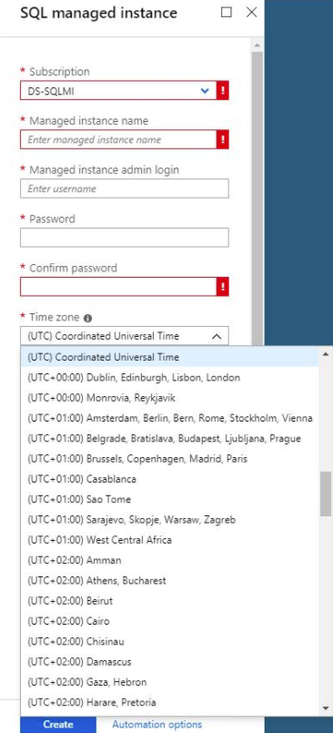

# Time Zone in Azure SQL Database Managed Instance

While using Coordinated Universal Time (UTC) is a recommended practice for data tier of cloud solutions, Azure SQL Database Managed Instance offers a choice of time zone to meet the needs of the existing applications that store date and time values and call date and time functions with an implicit context of a specific time zone.

T-SQL functions like [GETDATE()](https://docs.microsoft.com/en-us/sql/t-sql/functions/getdate-transact-sql) or CLR code observe the time zone set on the instance level. SQL Agent jobs also follow schedule according to the time zone of the instance.

  >[!NOTE]
  > Managed Instance is the only deployment option of Azure SQL Database that supports time zone setting. Other deployment options always follow UTC.
Use [AT TIME ZONE](https://docs.microsoft.com/en-us/sql/t-sql/queries/at-time-zone-transact-sql) in single and pooled SQL databases if you need to interpret date and time information in non-UTC time zone.

## Supported Time Zones

A set of supported time zones is inherited from the underlying operating system of the managed instance and it is being regularly updated to get new time zone definitions and reflect changes to the existing ones.

A list with names of the supported time zones is exposed through the [sys.time_zone_info](https://docs.microsoft.com/en-us/sql/relational-databases/system-catalog-views/sys-time-zone-info-transact-sql) system view.

## Setting Time Zone

A time zone of managed instance can be set during instance creation only. The default time zone is Coordinated Universal Time (UTC).

  >[!NOTE]
  > The time zone of an existing managed instance cannot be changed.

### Setting the Time Zone through Azure Portal

While entering parameters for the new instance, select a time zone from the list of supported time zones:
  


### Azure Resource Manager (ARM) Template

Specify timezoneId property in your [ARM template](https://aka.ms/sql-mi-create-arm-posh) to set the time zone during instance creation.

```json
"properties": {
                "administratorLogin": "[parameters('user')]",
                "administratorLoginPassword": "[parameters('pwd')]",
                "subnetId": "[parameters('subnetId')]",
                "storageSizeInGB": 256,
                "vCores": 8,
                "licenseType": "LicenseIncluded",
                "hardwareFamily": "Gen5",
                "collation": "Serbian_Cyrillic_100_CS_AS",
                "timezoneId": "Central European Standard Time"
            },

```

If not specified, time zone will be set to UTC.

## Checking the time zone of instance

[CURRENT_TIMEZONE](https://docs.microsoft.com/en-us/sql/t-sql/functions/current-timestamp-transact-sql) function returns a display name of the time zone of the instance.

## Cross-feature considerations

### Restore and Import

You can restore backup file or import data to managed instance from an instance or a server with different time zone settings. However, make sure to do so with caution and to analyze the application behavior and the results of the queries and reports, just like when transferring data between two SQL Server instances with different time zone settings.

### Point-in-time restore

When performing point-in-time restore, the time to restore to is interpreted as UTC time to avoid any ambiguity due to daylight saving time and its potential changes.

### Auto-failover groups

Using the same time zone across primary and secondary instance in failover group is not enforced, but it is strongly recommended.
  >[!IMPORTANT]
  > While there are valid scenarios for having different time zone on geo-secondary instance used for read scale only, please note that in the case of manual or automatic failover to secondary instance it will retain its original time zone.

## Limitations

- Time zone of the existing managed instance cannot be changed.
- External processes launched from the SQL Agent jobs do not observe time zone of the instance.
- Managed Instance’s native [New-AzSqlInstance](https://docs.microsoft.com/en-us/powershell/module/az.sql/new-azsqlinstance) PowerShell cmdlet does not support passing time zone parameter yet. Use PowerShell wrapper with [ARM template](https://aka.ms/sql-mi-create-arm-posh) instead.
- CLI command [az sql mi create](https://docs.microsoft.com/en-us/cli/azure/sql/mi?view=azure-cli-latest#az-sql-mi-create) does not support time zone parameter yet.

## See Also  

- [CURRENT_TIMEZONE (Transact-SQL)](https://docs.microsoft.com/en-us/sql/t-sql/functions/current-timezone-transact-sql)
- [AT TIME ZONE (Transact-SQL)](https://docs.microsoft.com/en-us/sql/t-sql/queries/at-time-zone-transact-sql)
- [sys.time_zone_info (Transact-SQL)](https://docs.microsoft.com/en-us/sql/relational-databases/system-catalog-views/sys-time-zone-info-transact-sql)