# Create an Azure SQL Database Managed Instance in the Azure portal

This tutorial demonstrates how to create an Azure SQL Database Managed Instance (preview) using the Azure portal in a dedicated subnet of a virtual network (VNet). It then shows you how to connect to the Managed Instance using SQL Server Management Studio on a virtual machine in the same VNet and then restore a backup of a database stored in Azure blob storage into the Managed Instance.

If you don't have an Azure subscription, create a [free](https://azure.microsoft.com/free/) account before you begin.

> [!IMPORTANT]
> For a list of regions in which Managed Instance is currently available, see [Migrate your databases to a fully managed service with Azure SQL Database Managed Instance](https://azure.microsoft.com/blog/migrate-your-databases-to-a-fully-managed-service-with-azure-sql-database-managed-instance/).
 
## Log in to the Azure portal

Log in to the [Azure portal](https://portal.azure.com/#create/Microsoft.SQLManagedInstance).

## Whitelist your subscription

Managed Instance is being released initially as a gated public preview that requires your subscription to be whitelisted. If your subscription is not already whitelisted, use the following steps to be offered and accept preview terms and send a request for whitelisting.

1. Click **Create a resource** in the upper left-hand corner of the Azure portal.
2. Locate **Managed Instance** and then select **Azure SQL Database Managed Instance (preview)**.
3. Click **Create**.

   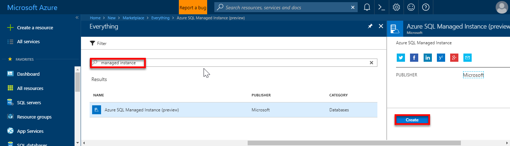

3. Select your subscription, click **Preview terms**, and then provide the requested information.

   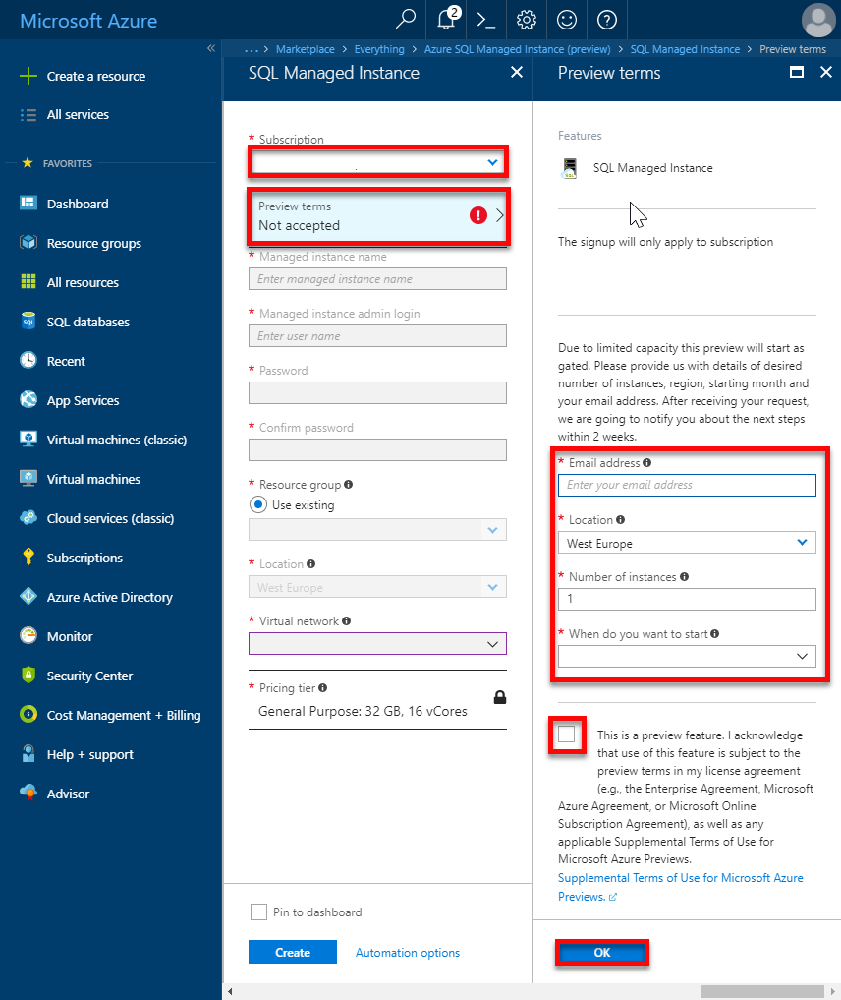

5. Click **OK** when completed.

   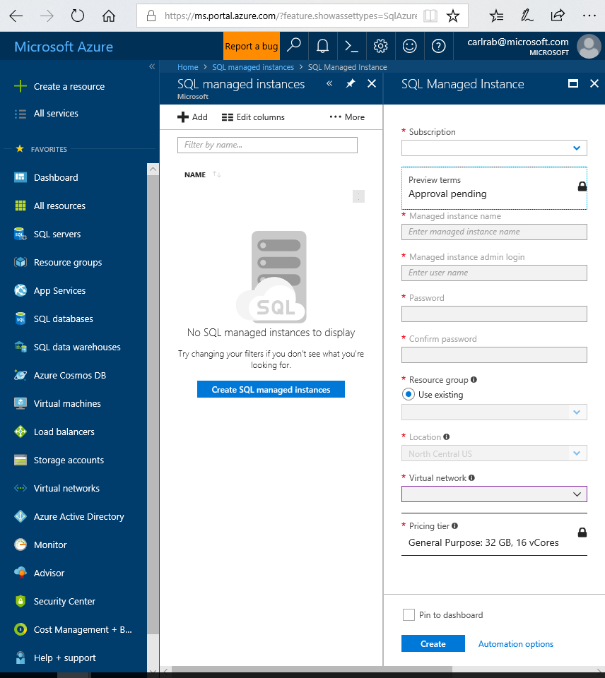

   > [!NOTE]
   > While awaiting preview approval, you can continue and complete the next few sections of this tutorial.

## Configure a virtual network (VNet)

The following steps show you how to create a new [Azure Resource Manager](../azure-resource-manager/resource-manager-deployment-model.md) virtual network (VNet) for use by your Managed Instance. For more information about VNet configuration, see [Managed Instance VNet Configuration](sql-database-managed-instance-vnet-configuration.md).

1. Click **Create a resource** in the upper left-hand corner of the Azure portal.
2. Locate and then click **Virtual Network**, verify the **Resource Manager** is selected as the deployment mode, and then click **Create**.

   

3. Fill out the virtual network form with the requested information, using the information in the following table:

   | Setting| Suggested value | Description |
   | ------ | --------------- | ----------- |
   |**Name**|Any valid name|For valid names, see [Naming rules and restrictions](https://docs.microsoft.com/azure/architecture/best-practices/naming-conventions).|
   |**Address space**|Any valid address range, such as 10.14.0.0/24|The virtual network's address name in CIDR notation.|
   |**Subscription**|Your subscription|For details about your subscriptions, see [Subscriptions](https://account.windowsazure.com/Subscriptions).|
   |**Resource Group**|Any valid resource group (new or existing)|For valid names, see [Naming rules and restrictions](https://docs.microsoft.com/azure/architecture/best-practices/naming-conventions).|
   |**Location**|Any valid location| For information about regions, see [Azure Regions](https://azure.microsoft.com/regions/).|
   |**Subnet name**|Any valid subnet name, such as mi_subnet|For valid names, see [Naming rules and restrictions](https://docs.microsoft.com/azure/architecture/best-practices/naming-conventions).|
   |**Subnet address range**|Any valid subnet address, such as 10.14.0.0/28. Use a subnet address space smaller than the address space itself to allow space to create other subnets in the same VNet, such as a subnet for hosting test / client apps or gateway subnets to connect from on-prem or other VNets.|The subnet's address range in CIDR notation. It must be contained by the address space of the virtual network|
   |**Service endpoints**|Disabled|Enable one or more service endpoints for this subnet|
   ||||

   

4. Click **Create**.

## Create new route table and a route

The following steps show you how to create a 0.0.0.0/0 Next Hop Internet route.

1. Click **Create a resource** in the upper left-hand corner of the Azure portal.
2. Locate and then click **Route table**, and then click **Create** on the Route table page. 

   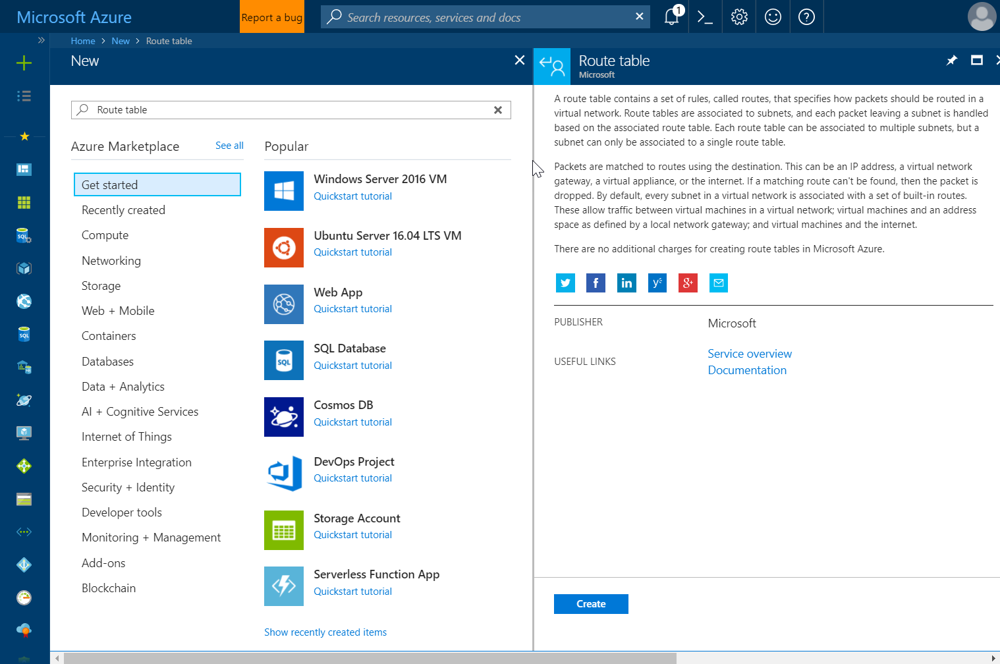

3. Fill out the route table form with the requested information, using the information in the following table:

   | Setting| Suggested value | Description |
   | ------ | --------------- | ----------- |
   |**Name**|Any valid name|For valid names, see [Naming rules and restrictions](https://docs.microsoft.com/azure/architecture/best-practices/naming-conventions).|
   |**Subscription**|Your subscription|For details about your subscriptions, see [Subscriptions](https://account.windowsazure.com/Subscriptions).|
   |**Resource Group**|Select the resource group you created in the previous procedure|For valid names, see [Naming rules and restrictions](https://docs.microsoft.com/azure/architecture/best-practices/naming-conventions).|
   |**Location**|Select the location you specified in the previous procedure| For information about regions, see [Azure Regions](https://azure.microsoft.com/regions/).|
   |**Disable BCP route propagation**|Disabled||
   ||||

   

4. Click **Create**.
5. After the route table has been created, open the newly created route table.

   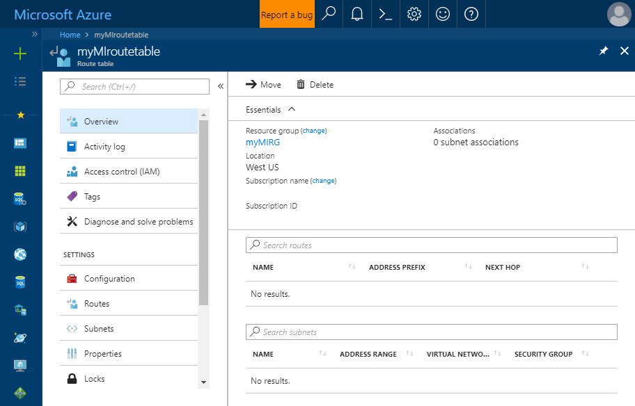

6. Click **Routes** and then click **Add**.

   

7.  Add **0.0.0.0/0 Next Hop Internet route** as the **only** route, using the information in the following table:

    | Setting| Suggested value | Description |
    | ------ | --------------- | ----------- |
    |**Route name**|Any valid name|For valid names, see [Naming rules and restrictions](https://docs.microsoft.com/azure/architecture/best-practices/naming-conventions).|
    |**Address prefix**|0.0.0.0/0|The destination IP address in CIDR notation that this route applies to.|
    |**Next hop type**|Internet|The next hop handles the matching packets for this route|
    |||

    

8. Click **OK**.

## To apply the route table to the Managed Instance subnet

The following steps show you how to set the new route table on the Managed Instance subnet.

1. To set the route table on the Managed Instance subnet, open the virtual network that you created earlier.
2. Click **Subnets** and then click the Managed Instance subnet (**mi_subnet** in the following screenshot).

    

11. Click **Route table** and then select the **myMI_route_table**.

    

12. Click **Save**

    

## Create a Managed Instance

The following steps show you how to create your Managed Instance after your preview has been approved.

1. Click **Create a resource** in the upper left-hand corner of the Azure portal.
2. Locate **Managed Instance** and then select **Azure SQL Database Managed Instance (preview)**.
3. Click **Create**.

   

3. Select your subscription and verify that the preview terms show **Accepted**.

   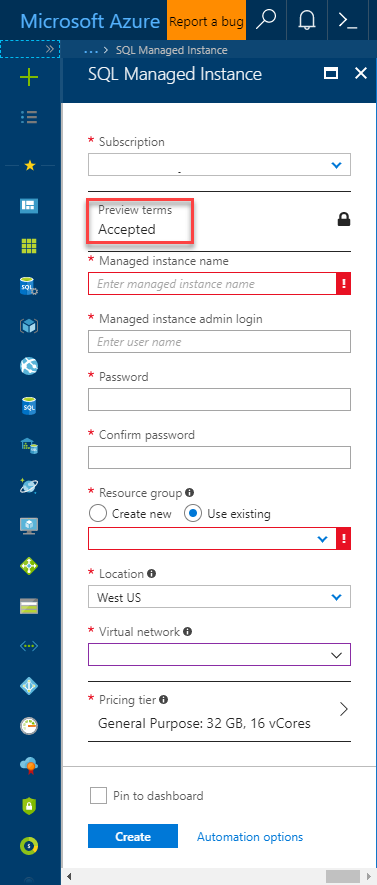

4. Fill out the Managed Instance form with the requested information, using the information in the following table:

   | Setting| Suggested value | Description |
   | ------ | --------------- | ----------- |
   |**Managed instance name**|Any valid name|For valid names, see [Naming rules and restrictions](https://docs.microsoft.com/azure/architecture/best-practices/naming-conventions).|
   |**Managed instance admin login**|Any valid user name|For valid names, see [Naming rules and restrictions](https://docs.microsoft.com/azure/architecture/best-practices/naming-conventions).| 
   |**Password**|Any valid password|The password must be at least 12 characters long and meet the [defined complexity requirements](../virtual-machines/windows/faq.md#what-are-the-password-requirements-when-creating-a-vm).|
   |**Resource Group**|The resource group that you created earlier||
   |**Location**|The location that you previously selected|For information about regions, see [Azure Regions](https://azure.microsoft.com/regions/).|
   |**Virtual network**|The virtual network that you created earlier|

   

5. Click **Pricing tier** to size compute and storage resources as well as review the pricing tier options. By default, your instance gets 32 GB of storage space free of charge, which may not be sufficient for your applications.
6. Use the sliders or text boxes to specify the amount of storage and the number of virtual cores. 
   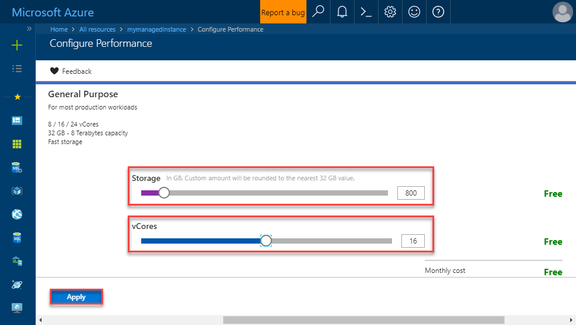

7. When complete, click **Apply** to save your selection.  
8. Click **Create** to deploy the Managed Instance.
9. Click the **Notifications** icon to view the status of deployment.
 
   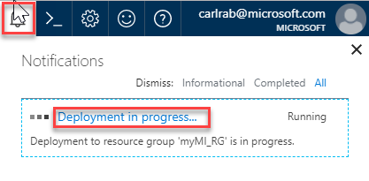

9. Click **Deployment in progress** to open the Managed Instance window to further monitor the deployment progress.
 
   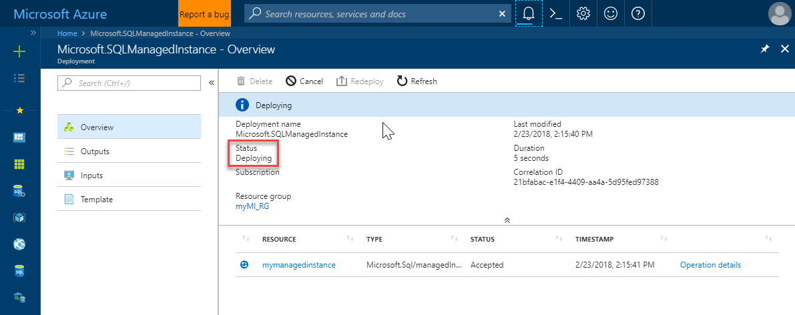

While deployment occurs, continue to the next procedure.

> [!IMPORTANT]
> For the first instance in a subnet, deployment time is typically much longer than in case of the subsequent instances - sometimes more than 24 hours to complete. Do not cancel deployment operation because it lasts longer than you expected. This length of time to deploy your first instance is a temporary situation. Expect a significant reduction of deployment time shortly after the beginning of the public preview.

## Create a new subnet in the VNet for a virtual machine

The following steps show you how to create a second subnet in the VNet for a virtual machine in which you install SQL Server Management Studio and connect to your Managed Instance.

1. Open your virtual network resource.
 
   

2. Click **Subnets** and then click **+Subnet**.
 
   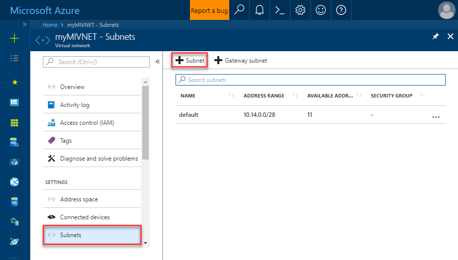

3. Fill out the subnet form with the requested information, using the information in the following table:

   | Setting| Suggested value | Description |
   | ------ | --------------- | ----------- |
   |**Name**|Any valid name|For valid names, see [Naming rules and restrictions](https://docs.microsoft.com/azure/architecture/best-practices/naming-conventions).|
   |**Address range (CIDR block)**|Any valid address range within the VNet (use the default)||
   |**Network security group**|None||
   |**Route table**|None||
   |**Service end points**|None||

   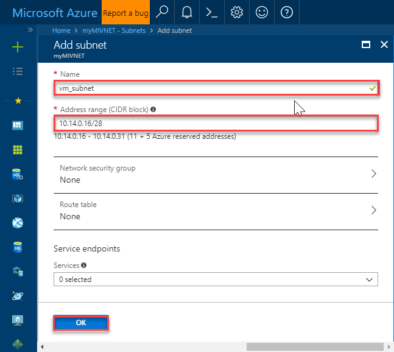

4. Click **OK**.

## Create a virtual machine in the new subnet in the VNet

The following steps show you how to create a virtual machine in the same VNet in which the Managed Instance is being created. 

1. Click **Create a resource** in the upper left-hand corner of the Azure portal.
2. Select **Compute**, and then select **Windows Server 2016 Datacenter** or **Windows 10**. This section of the tutorial is using Windows Server. Configuring Windows 10 is substantially similar. 

   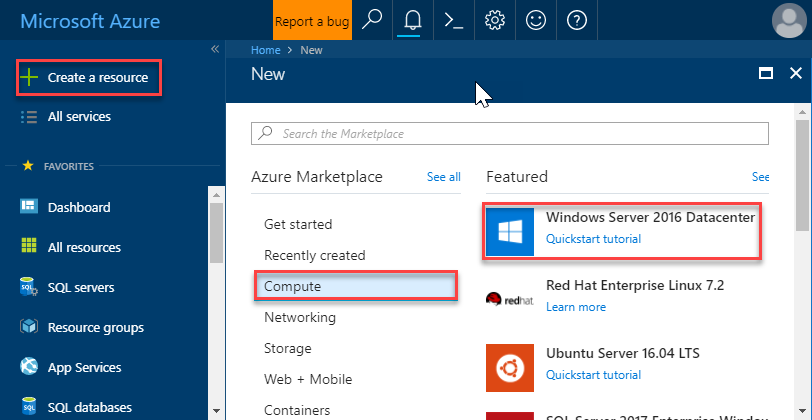

3. Fill out the virtual machine form with the requested information, using the information in the following table:

   | Setting| Suggested value | Description |
   | ------ | --------------- | ----------- |
   |**Name**|Any valid name|For valid names, see [Naming rules and restrictions](https://docs.microsoft.com/azure/architecture/best-practices/naming-conventions).|
   | **VM disk type**|SSD|SSDs provide the best balance between price and performance.|   
   |**User name**|Any valid user name|For valid names, see [Naming rules and restrictions](https://docs.microsoft.com/azure/architecture/best-practices/naming-conventions).| 
   |**Password**|Any valid password|The password must be at least 12 characters long and meet the [defined complexity requirements](../virtual-machines/windows/faq.md#what-are-the-password-requirements-when-creating-a-vm).| 
   |**Subscription**|Your subscription|For details about your subscriptions, see [Subscriptions](https://account.windowsazure.com/Subscriptions).|
   |**Resource Group**|The resource group that you created earlier||
   |**Location**|The location that you previously selected||
   |**Already have a Windows license**|No|If you own Windows licenses with active Software Assurance (SA), use Azure Hybrid Benefit to save compute cost|
   ||||

   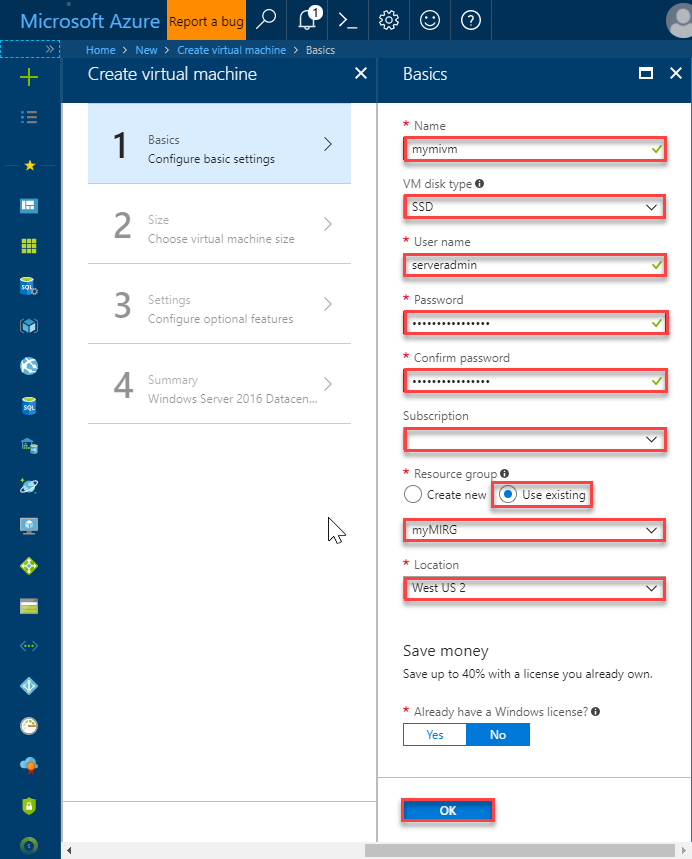

3. Click **OK**.
4. Select a size for the VM. To see more sizes, select **View all** or change the **Supported disk type** filter. For this tutorial, you only need a small virtual machine.

    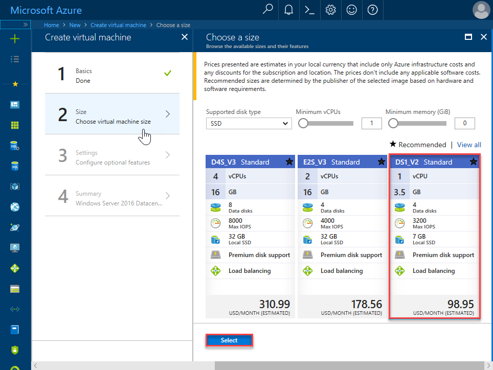  

5. Click **Select**.
6. On the **Settings** form, click **Subnet** and then select **vm_subnet**. Do not choose the subnet in which the Managed Instance is provisioned, but rather another subnet in the same Vnet.

    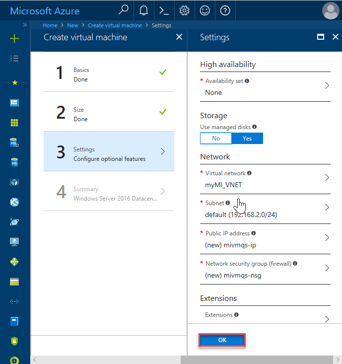  

7. Click **OK**.
8. On the summary page, review the offer details and then click **Create** to start the virtual machine deployment.
 
## Connect to virtual machine

The following steps show you how to connect to your newly created virtual machine using a remote desktop connection.

1. After deployment completes, go to the virtual machine resource.

    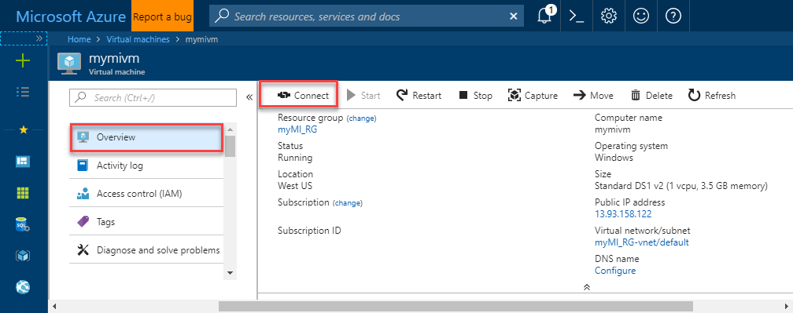  

2. Click the **Connect** button on the virtual machine properties. A Remote Desktop Protocol file (.rdp file) is created and downloaded.
3. To connect to your VM, open the downloaded RDP file. 
4. When prompted, click **Connect**. On a Mac, you need an RDP client such as this [Remote Desktop Client](https://itunes.apple.com/us/app/microsoft-remote-desktop/id715768417?mt=12) from the Mac App Store.

5. Enter the user name and password you specified when creating the virtual machine, then click **Ok**.

6. You may receive a certificate warning during the sign-in process. Click **Yes** or **Continue** to proceed with the connection.

You are connected to your virtual machine in the Server Manager dashboard.

> [!IMPORTANT]
> Do not continue until your Managed Instance is successfully provisioned. After it is provisioned, retrieve the host name for your instance in the **Managed instance** field on the **Overview** tab for your Managed Instance. The name is similar to this: **drfadfadsfd.tr23.westus1-a.worker.database.windows.net**.

## Install SSMS and connect to the Managed Instance

The following steps show you how to download and install SSMS, and then connect to your Managed Instance.

1. In Server Manager, click **Local Server** in the left-hand pane.

    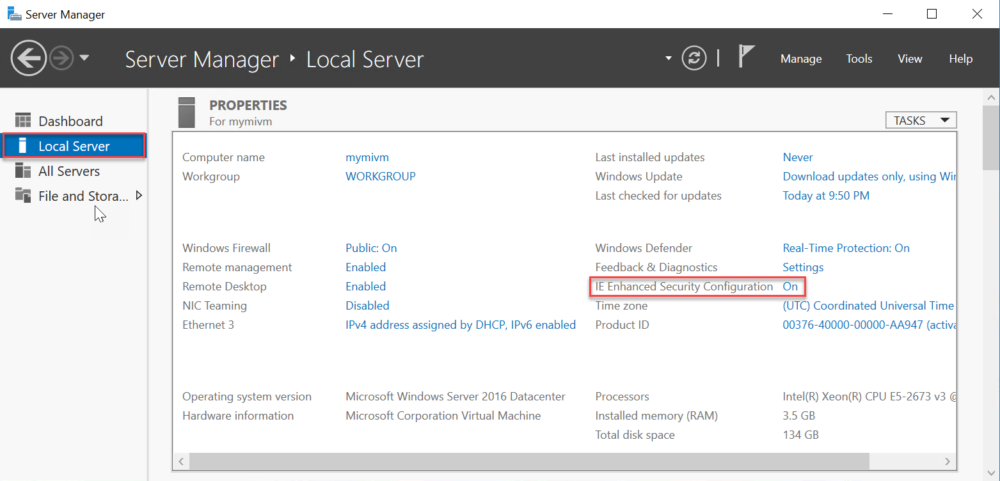  

2. In the **Properties** pane, click **On** to modify the IE Enhanced Security Configuration.
3. In the **Internet Explorer Enhanced Security Configuration** dialog box, click **Off** in the Administrators section of the dialog box and then click **OK**.

    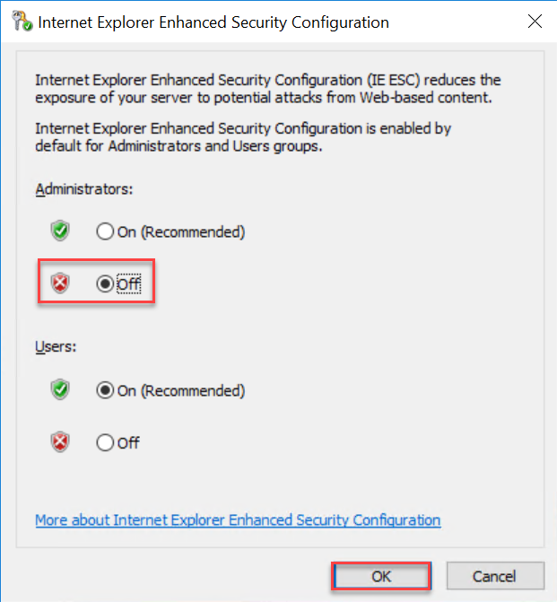  
4. Open **Internet Explorer** from the task bar.
5. Select **Use recommended security and compatibility settings** and then click **OK** to complete the setup of Internet Explorer 11.
6. Enter https://docs.microsoft.com/sql/ssms/download-sql-server-management-studio-ssms in the URL address box and click **Enter**. 
7. Download the most recent version of SQL Server Management Studio and click **Run** when prompted.
8. When prompted, click **Install** to begin.
9. When the installation completes, click **Close**.
10. Open SSMS.
11. In the **Connect to Server** dialog box, enter the **host name* for your Managed Instance in the **Server name** box, select **SQL Server Authentication**, provide your login and password, and then click **Connect**.

    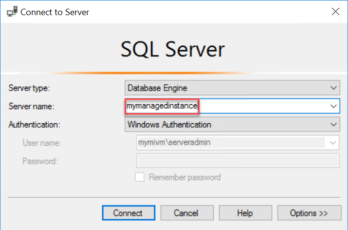  

After you connect, you can view your system and user databases in the Databases node, and various objects in the Security, Server Objects, Replication, Management, SQL Server Agent, and XEvent Profiler nodes.

## Download the Wide World Importers - Standard backup file

Use the following steps to download the Wide World Importers - Standard backup file.

Using Internet Explorer, enter https://github.com/Microsoft/sql-server-samples/releases/download/wide-world-importers-v1.0/WideWorldImporters-Standard.bak in the URL address box and then, when prompted, click **Save** to save this file in the **Downloads** folder.

## Create Azure storage account and upload backup file

1. Click **Create a resource** in the upper left-hand corner of the Azure portal.
2. Locate **Storage** and then click **Storage Account** to open the storage account form.

   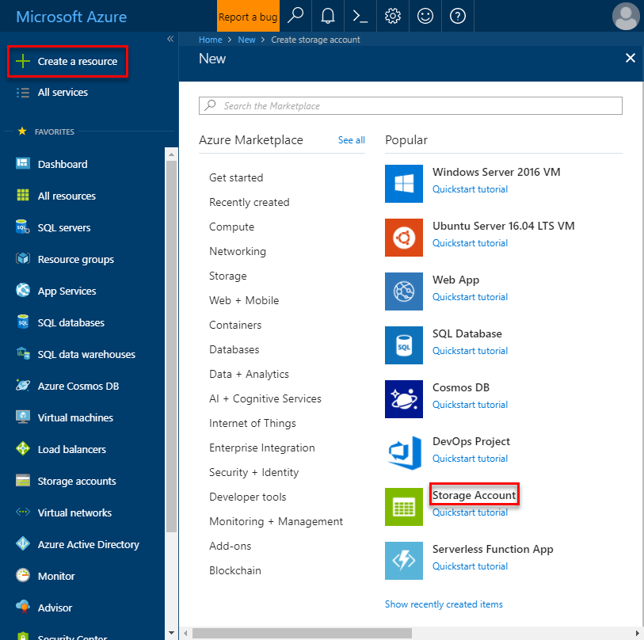

3. Fill out the storage account form with the requested information, using the information in the following table:

   | Setting| Suggested value | Description |
   | ------ | --------------- | ----------- |
   |**Name**|Any valid name|For valid names, see [Naming rules and restrictions](https://docs.microsoft.com/azure/architecture/best-practices/naming-conventions).|
   |**Deployment model**|Resource model||
   |**Account kind**|Blob storage||
   |**Performance**|Standard or premium|Magnetic drives or SSDs|
   |**Replication**|Locally redundant storage||
   |**Access tier (default)|Cool or hot||
   |**Secure transfer required**|Disabled||
   |**Subscription**|Your subscription|For details about your subscriptions, see [Subscriptions](https://account.windowsazure.com/Subscriptions).|
   |**Resource group**|The resource group that you created earlier|| 
   |**Location**|The location that you previously selected||
   |**Virtual networks**|Disabled||

4. Click **Create**.

   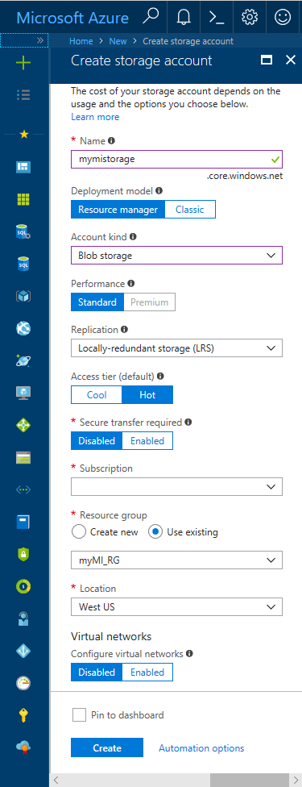

5. After the storage account deployment succeeds, open your new storage account.
6. Under **Settings**, click **Shared Access Signature** to open the Shared access signature (SAS) form.

   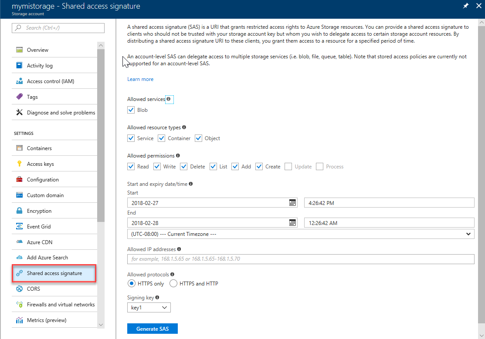

7. On the SAS form, modify the default values as desired. Notice that the expiry date/time is, by default, only 8 hours.
8. Click **Generate SAS**.

   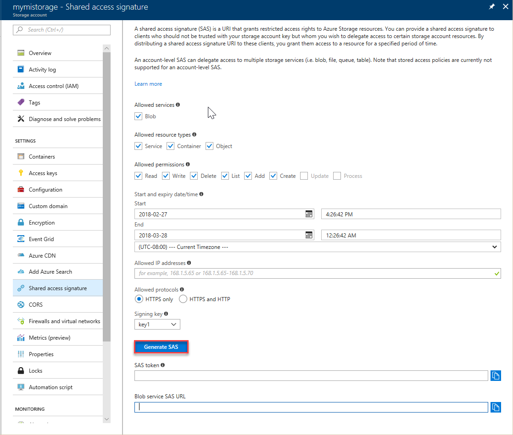

9. Copy and save the **SAS token** and the **Blob server SAS URL**.
10. Under **Settings**, click **Containers**.

    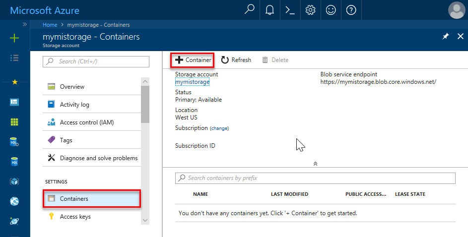

11. Click **+ Container** to create a container to hold your backup file.
12. Fill out the container form with the requested information, using the information in the following table:

    | Setting| Suggested value | Description |
   | ------ | --------------- | ----------- |
   |**Name**|Any valid name|For valid names, see [Naming rules and restrictions](https://docs.microsoft.com/azure/architecture/best-practices/naming-conventions).|
   |**Public access level**|Private (no anonymous access)||

    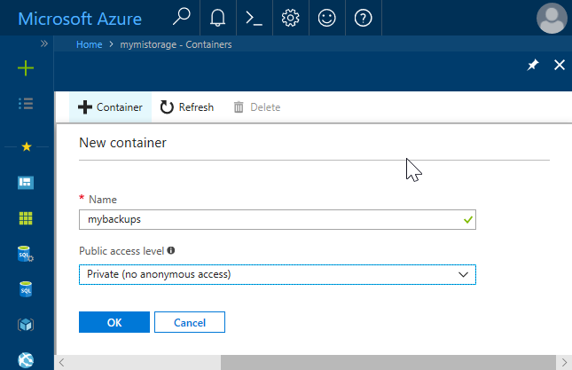

13. Click **OK**.
14. After the container has been created, open the container.

    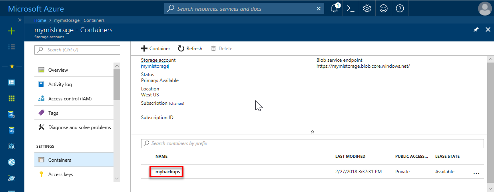

15. Click **Container properties** and then copy the URL to the container.

    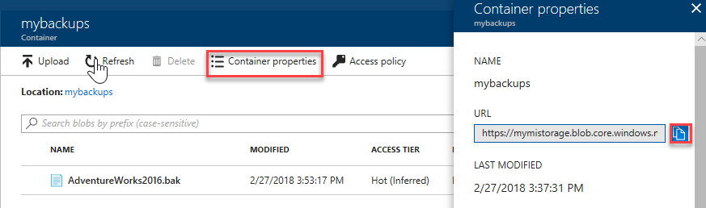

16. Click **Upload** to open the **Upload blob** form.

    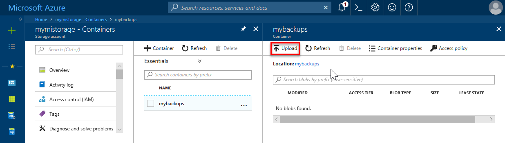

17. Browse to your download folder and select the **AdventureWorks2016.bak** file.

    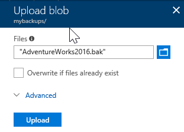

18. Click **Upload**.
19. Do not continue until the upload is complete.

    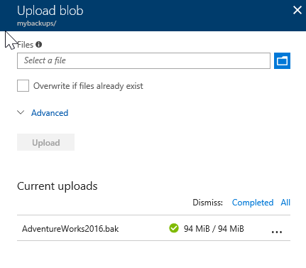


## Restore the Wide World Importers database from a backup file

With SSMS, use the following steps to restore the Wide World Importers database to your Managed Instance from the backup file.

1. In SSMS, open a new query window.
2. Use the following script to create a SAS credential - providing the URL for the storage account container and the SAS key as indicated.

   ```
CREATE CREDENTIAL [https://<storage_account_name>.blob.core.windows.net/<container>] 
WITH IDENTITY = 'SHARED ACCESS SIGNATURE'
, SECRET = '<shared_access_signature_key_with_removed_first_?_symbol>' 
   ```

    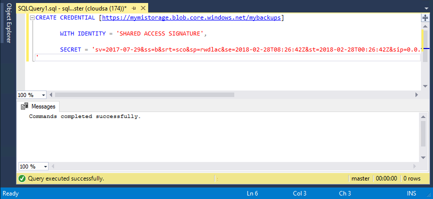

3. Use the following script to create check the SAS credential and backup validity - providing the URL for the container with the backup file:

   ```
   RESTORE FILELISTONLY FROM URL = 
   'https://<storage_account_name>.blob.core.windows.net/<container>/WideWorldImporters-Standard.bak'
   ```

    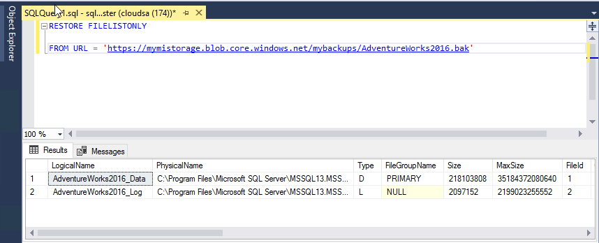

4. Use the following script to restore the Adventure Works 2012 database from a backup file - providing the URL for the container with the backup file:

   ```
   RESTORE DATABASE [Wide World Importers] FROM URL =
  'https://<storage_account_name>.blob.core.windows.net/<container>/WideWorldImporters-Standard.bak'`
   ```

    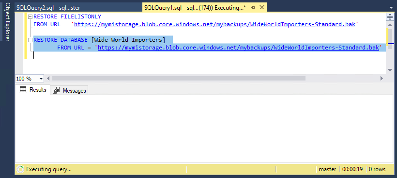

5. To track the status of your restore, run the following query in a new query session:

   ```
SELECT session_id as SPID, command, a.text AS Query, start_time, percent_complete
, dateadd(second,estimated_completion_time/1000, getdate()) as estimated_completion_time 
FROM sys.dm_exec_requests r 
CROSS APPLY sys.dm_exec_sql_text(r.sql_handle) a 
WHERE r.command in ('BACKUP DATABASE','RESTORE DATABASE')`
   ```

    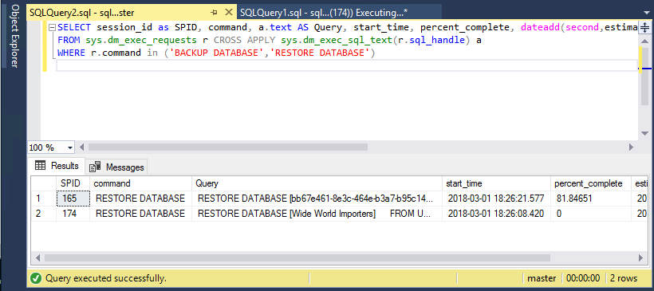

6. When the restore completes, view it in Object Explorer. 

    

## Next steps

- For information about Managed Instance, see [What is a Managed Instance?](sql-database-managed-instance.md).
- For more information about VNet configuration, see [Managed Instance VNet Configuration](sql-database-managed-instance-vnet-configuration.md).
- For information about connecting apps, see [Connect applications](sql-database-managed-instance-connect-app.md).
- For a tutorial using the Azure Database Migration Service (DMS) for migration, see [Managed Instance migration using DMS](../dms/tutorial-sql-server-to-managed-instance.md).
