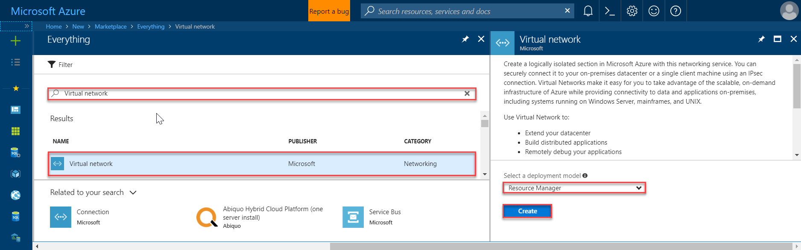
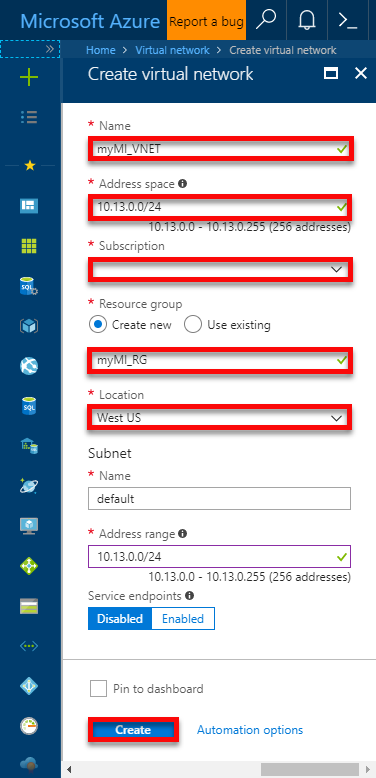
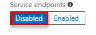
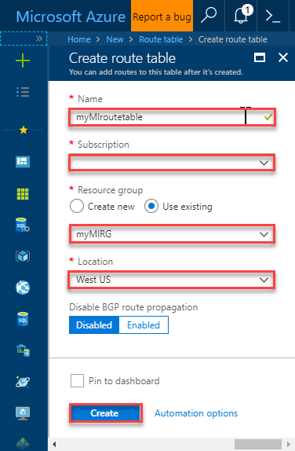
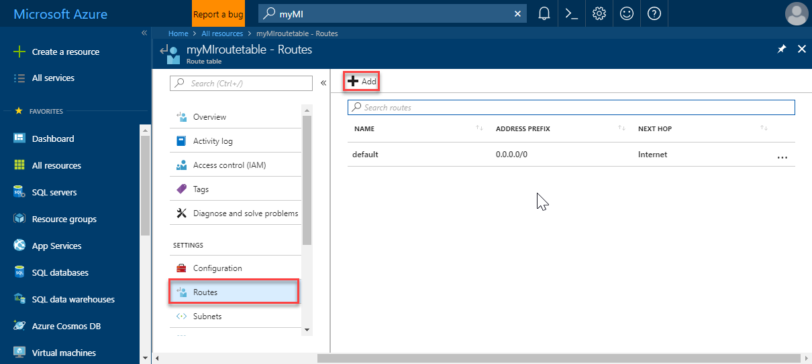
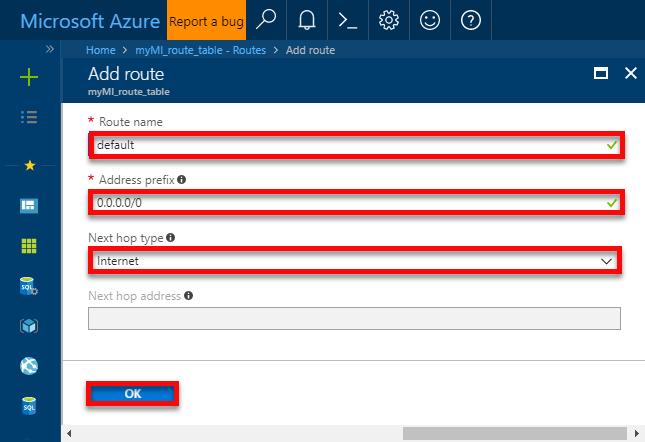
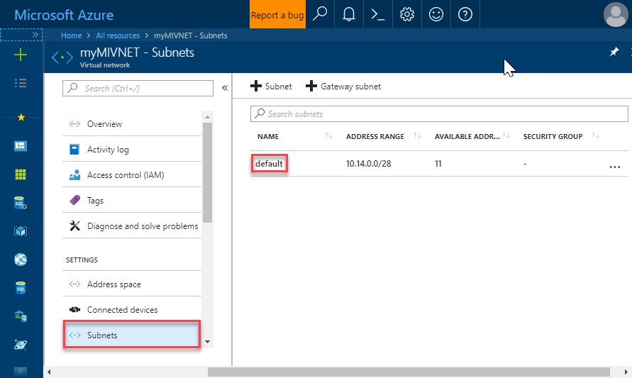
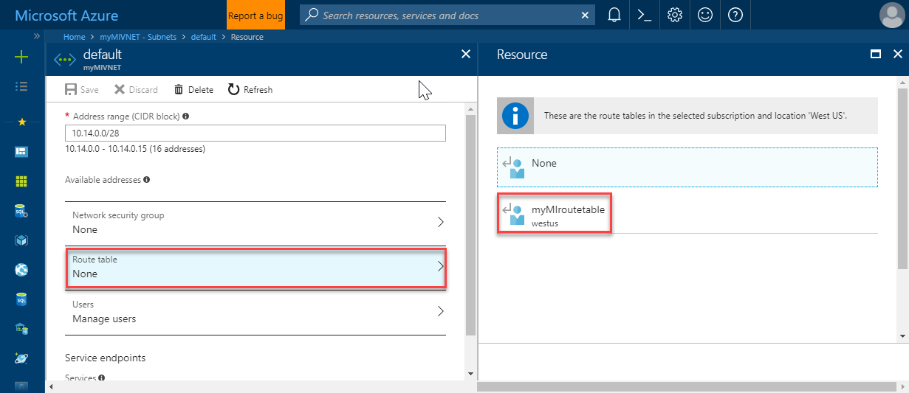
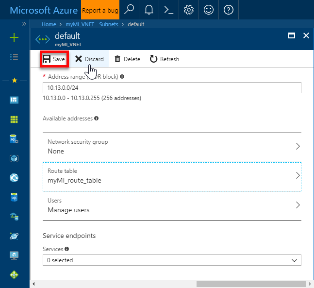

# Configure a VNet for Azure SQL Database Managed Instance

Azure SQL Database Managed Instance (preview) must be deployed within an Azure [virtual network (VNet)](../virtual-network/virtual-networks-overview.md). This deployment enables the following scenarios: 
- Connecting to a Managed Instance directly from an on-premises network 
- Connecting a Managed Instance to linked server or another on-premises data store 
- Connecting a Managed Instance to Azure resources  

## Plan

Plan how you deploy a Managed Instance in virtual network using your answers to the following questions: 
- Do you plan to deploy single or multiple Managed Instances? 

  The number of Managed Instances determines the minimum size of the subnet to allocate for your Managed Instances. For more information, see [Determine the size of subnet for Managed Instance](#create-a-new-virtual-network-for-managed-instances). 
- Do you need to deploy your Managed Instance into an existing virtual network or you are creating a new network? 

   If you plan to use an existing virtual network, you need to modify that network configuration to accommodate your Managed Instance. For more information, see [Modify existing virtual network for Managed Instance](#modify-an-existing-virtual-network-for-managed-instances). 

   If you plan to create new virtual network, see [Create new virtual network for Managed Instance](#create-a-new-virtual-network-for-managed-instances).

## Requirements

For Managed Instance creation you need dedicate subnet inside the VNet that conforms to the following requirements:
- **Be empty**: The subnet must not contain any other cloud service associated to it, and it must not be Gateway subnet. You won’t be able to create Managed Instance in subnet that contains resources other than managed instance or add other resources inside the subnet later.
- **No NSG**: The subnet must not have a Network Security Group associated with it.
- **Have specific route table**: The subnet must have a User Route Table (UDR) with 0.0.0.0/0 Next Hop Internet as the only route assigned to it. For more information, see [Create the required route table and associate it](#create-the-required-route-table-and-associate-it)
3. **Optional custom DNS**: If custom DNS is specified on the VNet, Azure's recursive resolvers IP address (such as 168.63.129.16) must be added to the list. For more information, see [Configuring Custom DNS](sql-database-managed-instance-custom-dns.md).
4. **No Service endpoint**: The subnet must not have a Service endpoint (Storage or Sql) associated to it. Make sure that Service Endpoints option is Disabled when creating VNet.
5. **Sufficient IP addresses**: The subnet must have minimum of 16 IP addresses. For more information, see [Determine the size of subnet for Managed Instances](#determine-the-size-of-subnet-for-managed-instances)

> [!IMPORTANT]
> You won’t be able to deploy new Managed Instance if the destination subnet is not compatible with all of the preceding requirements. The destination Vnet and the subnet must be kept in accordance with these Managed Instance requirements (before and after deployment), as any violation may cause instance to enter faulty state and become unavailable. Recovering from that state requires you to create new instance in a VNet with the compliant networking policies, recreate instance level data, and restore your databases. This introduces significant downtime for your applications.

##  Determine the size of subnet for Managed Instances

When you create a Managed Instance, Azure allocates a number of virtual machines depending on the tier size you select during provisioning. Because these virtual machines are associated with your subnet, they require IP addresses. To ensure high availability during regular operations and service maintenance, Azure may allocate additional virtual machines. As a result, the number of required IP addresses in a subnet is larger than the number of Managed Instances in that subnet. 

By design, a Managed Instance needs a minimum of 16 IP addresses in a subnet and may use up to 256 IP addresses. As a result, you can use subnet masks /28 to /24 when defining your subnet IP ranges. 

If you plan to deploy multiple Managed Instances inside the subnet and need to optimize on subnet size, use these parameters to form a calculation: 

- Azure uses five IP addresses in the subnet for its own needs 
- Each General Purpose instance needs two addresses 
- Each Business Critical instance needs four addresses

**Example**: You plan to have three General Purpose and two Business Critical Managed Instances. That means you need 5 + 3 * 2 + 2 * 4 = 19 IP addresses. As IP ranges are defined in power of 2, you need the IP range of 32 (2^5) IP addresses. Therefore, you need to reserve the subnet with subnet mask of /27. 

## Create a new virtual network for Managed Instances 

Creating an Azure virtual network is a prerequisite for creating a Managed Instance. You can use the Azure portal, [PowerShell](../virtual-network/quick-create-powershell.md), or [Azure CLI](../virtual-network/quick-create-cli.md). The following section shows the steps using the Azure portal. The details discussed here apply to each of these methods.

1. Click **Create a resource** in the upper left-hand corner of the Azure portal.
2. Locate and then click **Virtual Network**, verify the **Resource Manager** is selected as the deployment mode, and then click **Create**.

   

3. Fill out the virtual network form with the requested information, in a manner like the following screenshot:

   

4. Click **Create**.

   The address space and subnet are specified in CIDR notation. 

   > [!IMPORTANT]
   > The default values create subnet that takes all the VNet address space. If you choose this option, you can not create any other resources inside the virtual network other than Managed Instance. 

   The recommended approach would be the following: 
   - Calculate subnet size by following [Determine the size of subnet for Managed Instance](#determine-the-size-of-subnet-for-managed-instances) section  
   - Assess the needs for the rest of VNet 
   - Fill in VNet and subnet address ranges accordingly 

   Make sure that Service endpoints option stays **Disabled**. 

   

## Create the required route table and associate it

1. Sign in to the Azure portal  
2. Locate and then click **Route table**, and then click **Create** on the Route table page.

   

3. Create a 0.0.0.0/0 Next Hop Internet route, in a manner like the following screenshots:

   

   

4. Associate this route with the subnet for the Managed Instance, in a manner like the following screenshots:

    

    

    

Once your VNet has been created, you are ready to create your Managed Instance.  

## Modify an existing virtual network for Managed Instances 

The questions and answers in this section show you how to add a Managed Instance to existing virtual network. 

**Are you using Classic or Resource Manager deployment model for the existing virtual network?** 

You can only create a Managed Instance in Resource Manager virtual networks. 

**Would you like to create new subnet for SQL Managed instance or use existing one?**

If you would like to create new one: 

- Calculate subnet size by following the guidelines in the [Determine the size of subnet for Managed Instances](#determine-the-size-of-subnet-for-managed-instances) section.
- Follow steps in [Add, change, or delete a virtual network subnet](../virtual-network/virtual-network-manage-subnet.md). 
- Create a route table that contains single entry, **0.0.0.0/0**, as the next hop Internet and associate it with the subnet for the Managed Instance.  

In case you would like to create a Managed Instance inside an existing subnet: 
- Check if the subnet is empty - a Managed Instance cannot be created in a subnet that contains other resources including the Gateway subnet 
- Calculate subnet size by following the guidelines in the [Determine the size of subnet for Managed Instances](#determine-the-size-of-subnet-for-managed-instances) section and verify that it is sized appropriately. 
- Check that service endpoints are not enabled on the subnet.
- Make sure that there are no network security groups associated with the subnet 

**Do you have custom DNS server configured?** 

If yes, see [Configuring a Custom DNS](sql-database-managed-instance-custom-dns.md). 

- Create the required route table and associate it: see [Create the required route table and associate it](#create-the-required-route-table-and-associate-it)

## Next steps

- For an overview, see [What is a Managed Instance](sql-database-managed-instance.md)
- For a tutorial showing how to create a VNet, create a Managed Instance, and restore a database from a database backup, see [Creating an Azure SQL Database Managed Instance](sql-database-managed-instance-create-tutorial-portal.md).
- For DNS issues, see [Configuring a Custom DNS](sql-database-managed-instance-custom-dns.md)
