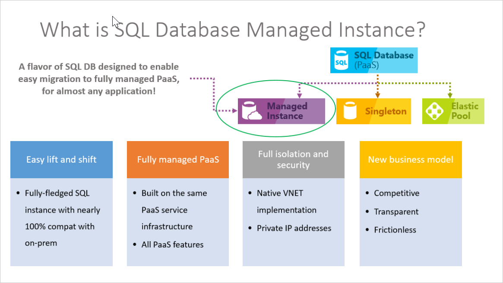
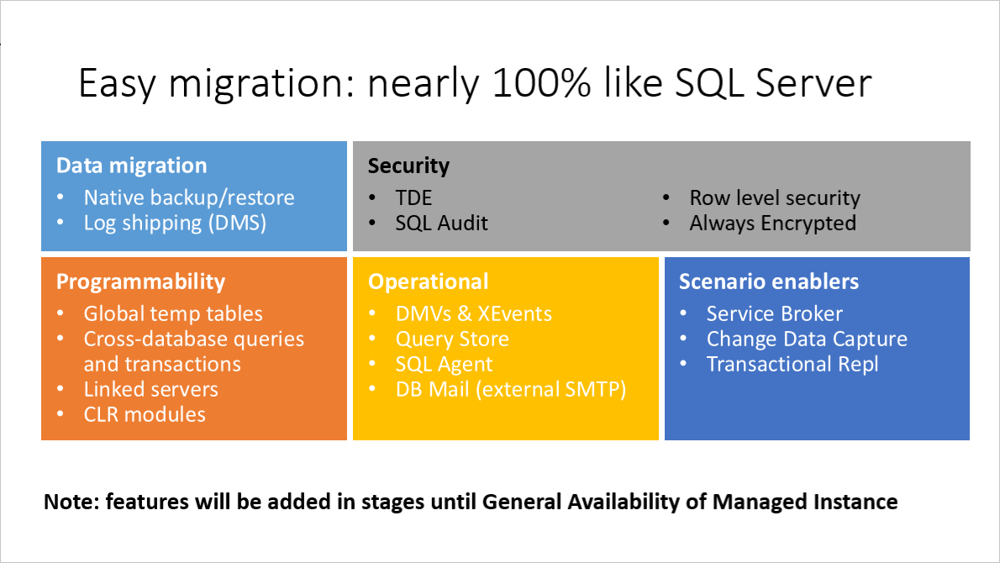

# Use SQL Database Managed Instance with virtual networks and near 100% compatibility

Azure SQL Database Managed Instance is a new deployment model of Azure SQL Database, providing near 100% compatibility with the latest SQL Server on-premises (Enterprise Edition) Database Engine, providing a native [virtual network (VNet)](../virtual-network/virtual-networks-overview.md) implementation that addresses common security concerns, and a [business model](https://azure.microsoft.com/pricing/details/sql-database/) favorable for on-premises SQL Server customers. Managed Instance allows existing SQL Server customers to lift and shift their on-premises applications to the cloud with minimal application and database changes. At the same time, Managed Instance preserves all PaaS capabilities (automatic patching and version updates, [automated backups](sql-database-automated-backups.md), [high-availability](sql-database-high-availability.md) ), that drastically reduces management overhead and TCO.

> [!IMPORTANT]
> For a list of regions in which Managed Instance is currently available, see [supported regions](sql-database-managed-instance-resource-limits.md#supported-regions).

The following diagram outlines key features of the Managed Instance:

Azure SQL Database Managed Instance is designed for customers looking to migrate a large number of apps from on-premises or IaaS, self-built, or ISV provided environment to fully managed PaaS cloud environment, with as low migration effort as possible. Using the fully automated [Data Migration Service (DMS)](../dms/tutorial-sql-server-to-managed-instance.md#create-an-azure-database-migration-service-instance) in Azure, customers can lift and shift their on-premises SQL Server to a Managed Instance that offers compatibility with SQL Server on-premises and complete isolation of customer instances with native VNet support.  With Software Assurance, you can exchange their existing licenses for discounted rates on a SQL Database Managed Instance using the [Azure Hybrid Use Benefit for SQL Server](../virtual-machines/windows/hybrid-use-benefit-licensing.md).  SQL Database Managed Instance is the best migration destination in the cloud for SQL Server instances that require high security and a rich programmability surface.

By General Availability, Managed Instance aims to deliver close to 100% surface area compatibility with the latest on-premises SQL Server version through a staged release plan.

To decide between Azure SQL Database Single Database, Azure SQL Database Managed Instance, and SQL Server IaaS hosted in Virtual Machine see [how to choose the right version of SQL Server in Azure cloud](sql-database-paas-vs-sql-server-iaas.md).

## Key features and capabilities

Azure SQL Database Managed Instance combines the best features that are available both in Azure SQL Database and SQL Server Database Engine.

> [!IMPORTANT]
> A Managed Instance runs with all of the features of the most recent version of SQL Server, including online operations, automatic plan corrections, and other enterprise performance enhancements. A Comparison of the features available is explained in [Feature comparison: Azure SQL Database versus SQL Server](sql-database-features.md).

| **PaaS benefits** | **Business continuity** |
| --- | --- |
|No hardware purchasing and management  No management overhead for managing underlying infrastructure  Quick provisioning and service scaling  Automated patching and version upgrade  Integration with other PaaS data services |99.99% uptime SLA   Built in [high-availability](sql-database-high-availability.md)  Data protected with [automated backups](sql-database-automated-backups.md)  Customer configurable backup retention period (fixed to 7 days in Public Preview)  User-initiated [backups](https://docs.microsoft.com/sql/t-sql/statements/backup-transact-sql?view=azuresqldb-mi-current)  [Point in time database restore](sql-database-recovery-using-backups.md#point-in-time-restore) capability |
|**Security and compliance** | **Management**|
|Isolated environment ([VNet integration](sql-database-managed-instance-vnet-configuration.md), single tenant service, dedicated compute and storage)  [Transparent data encryption (TDE)](https://docs.microsoft.com/sql/relational-databases/security/encryption/transparent-data-encryption-azure-sql) [Azure AD authentication](sql-database-aad-authentication.md), single sign-on support  Adheres to compliance standards same as Azure SQL database  [SQL auditing](sql-database-managed-instance-auditing.md)  [Threat Detection](sql-database-managed-instance-threat-detection.md) |Azure Resource Manager API for automating service provisioning and scaling  Azure portal functionality for manual service provisioning and scaling  Data Migration Service

The key features of Managed Instance are shown in the following table:

|Feature | Description|
|---|---|
| SQL Server version / build | SQL Server Database Engine (latest stable) |
| Managed automated backups | Yes |
| Built-in instance and database monitoring and metrics | Yes |
| Automatic software patching | Yes |
| The latest Database Engine features | Yes |
| Number of data files (ROWS) per the database | Multiple |
| Number of log files (LOG) per database | 1 |
| VNet - Azure Resource Manager deployment | Yes |
| VNet - Classic deployment model | No |
| Portal support | Yes|
| Built-in Integration Service (SSIS) | No - SSIS is a part of [Azure Data Factory PaaS](https://docs.microsoft.com/azure/data-factory/tutorial-deploy-ssis-packages-azure) |
| Built-in Analysis Service (SSAS) | No - SSAS is separate [PaaS](https://docs.microsoft.com/azure/analysis-services/analysis-services-overview) |
| Built-in Reporting Service (SSRS) | No - use Power BI or SSRS IaaS |
|||

## vCore-based purchasing model

The [vCore-based purchasing model](sql-database-service-tiers-vcore.md) in Managed Instance gives you flexibility, control, transparency, and a straightforward way to translate on-premises workload requirements to the cloud. This model allows you to change compute, memory, and storage based upon your workload needs. The vCore model is also eligible for up to 30 percent savings with the [Azure Hybrid Use Benefit for SQL Server](../virtual-machines/windows/hybrid-use-benefit-licensing.md).

In vCore model, you can choose between generations of hardware.

- **Gen 4** Logical CPUs are based on Intel E5-2673 v3 (Haswell) 2.4-GHz processors, attached SSD, physical cores, 7GB RAM per core, and compute sizes between 8 and 24 vCores.
- **Gen 5** Logical CPUs are based on Intel E5-2673 v4 (Broadwell) 2.3-GHz processors, fast eNVM SSD, hyper-threaded logical core, and compute sizes between 8 and 80 cores.

Find more information about the difference between hardware generations in [Managed Instance resource limits](sql-database-managed-instance-resource-limits.md#hardware-generation-characteristics).

## Managed Instance service tiers

Managed Instance is available in two service tiers:

- **General Purpose**: Designed for applications with typical performance and IO latency requirements.
- **Business Critical (preview)**: Designed for applications with low IO latency requirements and minimal impact of underlying maintenance operations on the workload.

Both service tiers guarantee 99.99% availability and enable you to independently select storage size and compute capacity. For more information on the high availability architecture of Azure SQL Database, see [High Availability and Azure SQL Database](sql-database-high-availability.md).

> [!IMPORTANT]
> Changing your service tier from General Purpose to Business Critical or vice versa is not supported in Public Preview. If you want to migrate your databases to an instance in different service tier, you can create new instance, restore databases with point in time restore from the original instance and then drop original instance if it is not needed anymore. However, you can scale your number of vCores and storage up or down within a service tier with no downtime.

### General Purpose service tier

The following list describes key characteristic of the General Purpose service tier:

- Design for the majority of business applications with typical performance requirements
- High-performance Azure Premium storage (8 TB)
- Built-in [High-availability](sql-database-high-availability.md#basic-standard-and-general-purpose-service-tier-availability) based on reliable Azure Premium Storage and [Azure Service Fabric](../service-fabric/service-fabric-overview.md)

For more information, see [Storage layer in General purpose tier](https://medium.com/azure-sqldb-managed-instance/file-layout-in-general-purpose-azure-sql-managed-instance-cf21fff9c76c) and [Storage performance best practices and considerations for Azure SQL DB Managed Instance (General Purpose)](https://blogs.msdn.microsoft.com/sqlcat/2018/07/20/storage-performance-best-practices-and-considerations-for-azure-sql-db-managed-instance-general-purpose/).

Find more information about the difference between service tiers in [Managed Instance resource limits](sql-database-managed-instance-resource-limits.md#service-tier-characteristics).

### Business Critical service tier (preview)

Business Critical service tier is built for applications with high IO requirements. It offers highest resilience to failures using several isolated replicas.

The following list outlines the key characteristics of the Business Critical service tier:

- Designed for business applications with highest performance and HA requirements
- Comes with super-fast SSD storage (up to 1 TB on Gen 4 and up to 4 TB on Gen 5)
- Built-in [High availability](sql-database-high-availability.md#premium-and-business-critical-service-tier-availability) based on [Always On Availability Groups](https://docs.microsoft.com/sql/database-engine/availability-groups/windows/always-on-availability-groups-sql-server) and [Azure Service Fabric](../service-fabric/service-fabric-overview.md).
- Built-in additional [Read-only database replica](sql-database-read-scale-out.md) that can be used for reporting and other read-only workloads
- [In-Memory OLTP](sql-database-in-memory.md) that can be used for workload with high-performance requirements  

> [!IMPORTANT]
> The **Business Critical** service tier is in preview.

Find more information about the difference between service tiers in [Managed Instance resource limits](sql-database-managed-instance-resource-limits.md#service-tier-characteristics).

## Advanced security and compliance

Azure SQL Database Managed Instance combines advanced security features provided by Azure cloud and SQL Server Database Engine.

### Managed Instance security isolation in Azure cloud

Managed Instance provide additional security isolation from other tenants in the Azure cloud. Security isolation includes:

- [Native virtual network implementation](sql-database-managed-instance-vnet-configuration.md) and connectivity to your on-premises environment using Azure Express Route or VPN Gateway
- SQL endpoint is exposed only through a private IP address, allowing safe connectivity from private Azure or hybrid networks
- Single-tenant with dedicated underlying infrastructure (compute, storage)

The following diagram outlines various connectivity options for your applications:

  

To learn more details about VNet integration and networking policy enforcement at the subnet level, see [Configure a VNet for Azure SQL Database Managed Instance](sql-database-managed-instance-vnet-configuration.md) and [Connect your application to Azure SQL Database Managed Instance](sql-database-managed-instance-connect-app.md).

> [!IMPORTANT]
> Place multiple managed instance in the same subnet, wherever that is allowed by your security requirements, as that will bring you additional benefits. Collocating instances in the same subnet will significantly simplify networking infrastructure maintenance and reduce instance provisioning time, since long provisioning duration is associated with the cost of deploying first managed instance in a subnet.

### Azure SQL Database Security Features

Azure SQL Database provides a set of advanced security features that can be used to protect your data.

- [Managed Instance auditing](sql-database-managed-instance-auditing.md) tracks database events and writes them to an audit log file placed in your Azure storage account. Auditing can help maintain regulatory compliance, understand database activity, and gain insight into discrepancies and anomalies that could indicate business concerns or suspected security violations.
- Data encryption in motion - Managed Instance secures your data by providing encryption for data in motion using Transport Layer Security. In addition to transport layer security, SQL Database Managed Instance offers protection of sensitive data in flight, at rest and during query processing with [Always Encrypted](/sql/relational-databases/security/encryption/always-encrypted-database-engine). Always Encrypted is an industry-first that offers unparalleled data security against breaches involving the theft of critical data. For example, with Always Encrypted, credit card numbers are stored encrypted in the database always, even during query processing, allowing decryption at the point of use by authorized staff or applications that need to process that data.
- [Threat Detection](sql-database-managed-instance-threat-detection.md) complements [Managed Instance auditing](sql-database-managed-instance-auditing.md) by providing an additional layer of security intelligence built into the service that detects unusual and potentially harmful attempts to access or exploit databases. You are alerted about suspicious activities, potential vulnerabilities, and SQL injection attacks, as well as anomalous database access patterns. Threat Detection alerts can be viewed from [Azure Security Center](https://azure.microsoft.com/services/security-center/) and provide details of suspicious activity and recommend action on how to investigate and mitigate the threat.  
- [Dynamic data masking](/sql/relational-databases/security/dynamic-data-masking) limits sensitive data exposure by masking it to non-privileged users. Dynamic data masking helps prevent unauthorized access to sensitive data by enabling you to designate how much of the sensitive data to reveal with minimal impact on the application layer. It’s a policy-based security feature that hides the sensitive data in the result set of a query over designated database fields, while the data in the database is not changed.
- [Row-level security](/sql/relational-databases/security/row-level-security) enables you to control access to rows in a database table based on the characteristics of the user executing a query (such as by group membership or execution context). Row-level security (RLS) simplifies the design and coding of security in your application. RLS enables you to implement restrictions on data row access. For example, ensuring that workers can access only the data rows that are pertinent to their department, or restricting a data access to only the relevant data.
- [Transparent data encryption (TDE)](https://docs.microsoft.com/sql/relational-databases/security/encryption/transparent-data-encryption-azure-sql) encrypts Azure SQL Database Managed Instance data files, known as encrypting data at rest. TDE performs real-time I/O encryption and decryption of the data and log files. The encryption uses a database encryption key (DEK), which is stored in the database boot record for availability during recovery. You can protect all your databases in Managed Instance with transparent data encryption. TDE is SQL’s proven encryption-at-rest technology that is required by many compliance standards to protect against theft of storage media. During public preview, the automatic key management model is supported (performed by the PaaS platform).

Migration of an encrypted database to SQL Managed Instance is supported via the Azure Database Migration Service (DMS) or native restore. If you plan to migrate encrypted database using native restore, migration of the existing TDE certificate from the SQL Server on-premise or SQL Server VM to Managed instance is a required step. For more information about migration options, see [SQL Server instance migration to Azure SQL Database Managed Instance](sql-database-managed-instance-migrate.md).

## Azure Active Directory Integration

Azure SQL Database Managed Instance supports traditional SQL server Database engine logins and logins integrated with Azure Active Directory (AAD). AAD Logins are Azure cloud version of Windows database logins that you are using in your on-premises environment.

### Azure Active Directory integration and multi-factor authentication

Managed Instance enables you to centrally manage identities of database user and other Microsoft services with [Azure Active Directory integration](sql-database-aad-authentication.md). This capability simplified permission management and enhances security. Azure Active Directory supports [multi-factor authentication](sql-database-ssms-mfa-authentication-configure.md) (MFA) to increase data and application security while supporting a single sign-on process.

### Authentication

Managed Instance authentication refers to how users prove their identity when connecting to the database. SQL Database supports two types of authentication:  

- **SQL Authentication**:

  This authentication method uses a username and password.
- **Azure Active Directory Authentication**:

  This authentication method uses identities managed by Azure Active Directory and is supported for managed and integrated domains. Use Active Directory authentication (integrated security) [whenever possible](https://docs.microsoft.com/sql/relational-databases/security/choose-an-authentication-mode).

### Authorization

Authorization refers to what a user can do within an Azure SQL Database, and is controlled by your user account's database role memberships and object-level permissions. Managed Instance has same authorization capabilities as SQL Server 2017.

## Database migration

Managed Instance targets user scenarios with mass database migration from on-premises or IaaS database implementations. Managed Instance supports several database migration options:

### Backup and restore  

The migration approach leverages SQL backups to Azure blob storage. Backups stored in Azure storage blob can be directly restored into Managed Instance using the [T-SQL RESTORE command](https://docs.microsoft.com/sql/t-sql/statements/restore-statements-transact-sql?view=azuresqldb-mi-current).

- For a quickstart showing how to restore the Wide World Importers - Standard database backup file, see [Restore a backup file to a Managed Instance](sql-database-managed-instance-get-started-restore.md). This quickstart shows you have to upload a backup file to Azure blog storage and secure it using a Shared access signature (SAS) key.
- For information about restore from URL, see [Native RESTORE from URL](sql-database-managed-instance-migrate.md#native-restore-from-url).

> [!IMPORTANT]
> Backups from a Managed Instance can only be restored to another Managed Instance. They cannot be restored to an on-premises SQL Server or to an Azure SQL Database logical server single or pooled database.

### Data Migration Service

The Azure Database Migration Service is a fully managed service designed to enable seamless migrations from multiple database sources to Azure Data platforms with minimal downtime. This service streamlines the tasks required to move existing third party and SQL Server databases to Azure. Deployment options include Azure SQL Database, Managed Instance, and SQL Server in Azure VM at Public Preview. See [How to migrate your on-premises database to Managed Instance using DMS](https://aka.ms/migratetoMIusingDMS).

## SQL features supported

Managed Instance aims to deliver close to 100% surface area compatibility with on-premises SQL Server coming in stages until service general availability. For a features and comparison list, see [SQL Database feature comparison](sql-database-features.md), and for a list of T-SQL differences in Managed Instances versus SQL Server, see [Managed Instance T-SQL Differences from SQL Server](sql-database-managed-instance-transact-sql-information.md).

Managed Instance supports backward compatibility to SQL 2008 databases. Direct migration from SQL 2005 database servers is supported, compatibility level for migrated SQL 2005 databases are updated to SQL 2008.
  
The following diagram outlines surface area compatibility in Managed Instance:  

### Key differences between SQL Server on-premises and Managed Instance

Managed Instance benefits from being always-up-to-date in the cloud, which means that some features in on-premises SQL Server may be either obsolete, retired, or have alternatives. There are specific cases when tools need to recognize that a particular feature works in a slightly different way or that service is not running in an environment you do not fully control:

- High-availability is built in and pre-configured using technology similar to [Always On Availability Groups](https://docs.microsoft.com/sql/database-engine/availability-groups/windows/always-on-availability-groups-sql-server).
- Automated backups and point in time restore. Customer can initiate `copy-only` backups that do not interfere with automatic backup chain.
- Managed Instance does not allow specifying full physical paths so all corresponding scenarios have to be supported differently: RESTORE DB does not support WITH MOVE, CREATE DB doesn’t allow physical paths, BULK INSERT works with Azure Blobs only, etc.
- Managed Instance supports [Azure AD authentication](sql-database-aad-authentication.md) as cloud alternative to Windows authentication.
- Managed Instance automatically manages XTP filegroup and files for databases containing In-Memory OLTP objects
- Managed Instance supports SQL Server Integration Services (SSIS) and can host SSIS catalog (SSISDB) that stores SSIS packages, but they are executed on a managed Azure-SSIS Integration Runtime (IR) in Azure Data Factory (ADF), see [Create Azure-SSIS IR in ADF](https://docs.microsoft.com/azure/data-factory/create-azure-ssis-integration-runtime). To compare the SSIS features in SQL Database and Managed Instance, see [Compare SQL Database logical server and Managed Instance](../data-factory/create-azure-ssis-integration-runtime.md#compare-sql-database-logical-server-and-sql-database-managed-instance).

### Managed Instance administration features

Managed Instance enable system administrator to focus on what matters the most for business. Many system administrator/DBA activities are not required, or they are simple. For example, OS / RDBMS installation and patching, dynamic instance resizing and configuration, backups, [database replication](replication-with-sql-database-managed-instance.md) (including system databases), high availability configuration, and configuration of health and performance monitoring data streams.

> [!IMPORTANT]
> For a list of supported, partially supported, and unsupported features, see [SQL Database features](sql-database-features.md). For a list of T-SQL differences in Managed Instances versus SQL Server, see [Managed Instance T-SQL Differences from SQL Server](sql-database-managed-instance-transact-sql-information.md)

### How to programmatically identify a Managed Instance

The following table shows several properties, accessible through Transact SQL, that you can use to detect that your application is working with Managed Instance and retrieve important properties.

|Property|Value|Comment|
|---|---|---|
|`@@VERSION`|Microsoft SQL Azure (RTM) - 12.0.2000.8 2018-03-07 Copyright (C) 2018 Microsoft Corporation.|This value is same as in SQL Database.|
|`SERVERPROPERTY ('Edition')`|SQL Azure|This value is same as in SQL Database.|
|`SERVERPROPERTY('EngineEdition')`|8|This value uniquely identifies Managed Instance.|
|`@@SERVERNAME`, `SERVERPROPERTY ('ServerName')`|Full instance DNS name in the following format:`<instanceName>`.`<dnsPrefix>`.database.windows.net, where `<instanceName>` is name provided by the customer, while `<dnsPrefix>` is auto-generated part of the name guaranteeing global DNS name uniqueness ("wcus17662feb9ce98", for example)|Example: my-managed-instance.wcus17662feb9ce98.database.windows.net|

## Next steps

- To learn how to create your first Managed Instance, see [Quick-start guide](sql-database-managed-instance-get-started.md).
- For a features and comparison list, see [SQL common features](sql-database-features.md).
- For more information about VNet configuration, see [Managed Instance VNet Configuration](sql-database-managed-instance-vnet-configuration.md).
- For a quickstart that creates a Managed Instance and restores a database from a backup file, see [Create a Managed Instance](sql-database-managed-instance-get-started.md).
- For a tutorial using the Azure Database Migration Service (DMS) for migration, see [Managed Instance migration using DMS](../dms/tutorial-sql-server-to-managed-instance.md).
- For pricing information, see [SQL Database Managed Instance pricing](https://azure.microsoft.com/pricing/details/sql-database/managed/).
