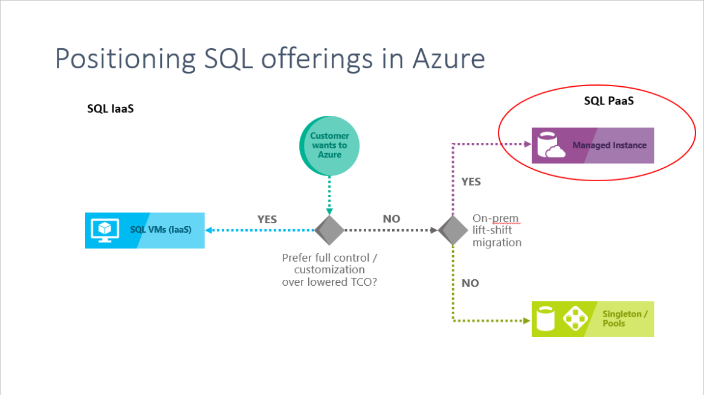
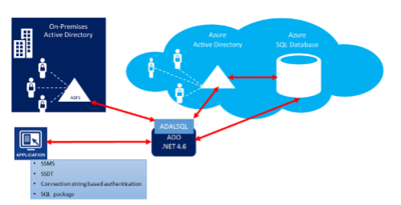
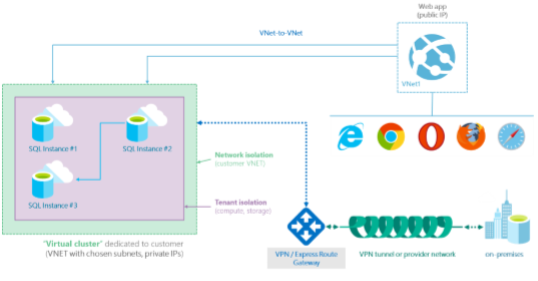

# What is an Azure SQL Database Managed Instance?

Azure SQL Database Managed Instance (preview) is a new capability of Azure SQL Database, providing near 100% compatibility with SQL Server on-premises, providing a native [virtual network (VNet)](../virtual-network/virtual-networks-overview.md) implementation that addresses common security concerns, and a [business model](https://azure.microsoft.com/pricing/details/sql-database/) favorable for on-premises SQL Server customers. Managed Instance allows existing SQL Server customers to lift and shift their on-premises applications to the cloud with minimal application and database changes. At the same time, Managed Instance preserves all PaaS capabilities (automatic patching and version updates, backup, high-availability),  that drastically reduces management overhead and TCO.
 
The following diagram outlines key features of the Managed Instance:

 

Managed Instance is envisioned as preferred platform for the following scenarios: 

- SQL Server on-premises / IaaS customers looking to migrate their applications to a fully managed service with minimal design changes.
- ISVs relying on SQL databases, who want to enable their customers to migrate to the cloud and thus achieve substantial competitive advantage or global market reach. 

By General Availability, Managed Instance aims to deliver close to 100% surface area compatibility with the latest on-premises SQL Server version through a staged release plan. 

The following table outlines key differences and envisioned usage scenarios between SQL IaaS, Azure SQL Database and Managed Instance:

| | Usage scenario | 
| --- | --- | 
|Managed Instance |For customers looking to migrate a large number of apps from on-premises or IaaS, self-built or ISV provided, with as low migration effort as possible, propose Managed Instance. Using the fully automated [Data Migration Service (DMS)](/sql/dma/dma-overview) in Azure, customers can lift and shift their on-premises SQL Server to a Managed Instance that offers compatibility with SQL Server on-premises and complete isolation of customer instances with native VNet support.  With Software Assurance, you can exchange their existing licenses for discounted rates on a SQL Database Managed Instance using the [Azure Hybrid Use Benefit for SQL Server](../virtual-machines/windows/hybrid-use-benefit-licensing.md).  SQL Database Managed Instance is the best migration destination in the cloud for SQL Server instances that require high security and a rich programmability surface. |
|Azure SQL Database |For customers developing new SaaS multi-tenant applications or intentionally transforming their existing on-premises apps into a SaaS multitenant app, propose elastic pools. Benefits of this model are:   • conversion of the business model from selling licenses to selling service subscriptions (for ISVs),   • easy and bullet-proof tenant isolation   • a simplified database-centric programming model   • the potential to scale out without hitting a hard ceiling.   For customers developing new apps other than SaaS multi-tenant, whose workload is stable and predictable, propose single databases. Benefits of this model are   • a simplified database-centric programming model   • predictable performance for each database.|
|SQL IaaS |For customers needing to customize the operating system or the database server, as well as customers having specific requirements in terms of running third-party apps by side with SQL Server (on the same VM), propose SQL VMs / IaaS as the optimal solution|
|||

  

## Key features and capabilities of a Managed Instance 

| **PaaS benefits** | **Business continuity** |
| --- | --- |
|• No hardware purchasing and management  • No management overhead for managing underlying infrastructure  • Quick provisioning and service scaling  • Automated patching and version upgrade   • Integration with other PaaS data services (SQL Server Integration Service and SQL Server Analysis Service) |• 99.99% uptime SLA   • Built in high availability  • Data protected with automated backups  • Customer configurable backup retention period  • User-initiated backups  • Point in time database restore capability |
|**Security and compliance** | **Management**|
| • Isolated environment (VNet integration, single-tenant service, dedicated compute and storage  • Encryption of the data in transit  • Azure AD authentication, single sign-on support  • Adheres to compliance standards same as Azure SQL database  • SQL auditing  • Threat detection | • Azure Resource Manager API for automating service provisioning and scaling  • Azure portal functionality for manual service provisioning and scaling  • Data Migration Service) 

 

## Managed Instance service tier

Managed Instance is initially available in a single service tier - General Purpose - that is designed for applications with typical availability and common IO latency requirements.

The following list describes key characteristic of the General Purpose service tier: 

- Design for the majority of business applications with typical performance and HA requirements 
- High-performance Azure Premium storage (8 TB) 
- 100 databases / instance 

In this tier, you can independently select storage and compute capacity. 

The following diagram illustrates the active compute and the redundant nodes in this service tier.
 
 

The following outlines key features of the General Purpose service tier:

|Feature | Description|
|---|---|
| Number of vCores* | 8, 16, 24|
| SQL Server version / build | SQL Server (latest available) |
| Min storage size | 32 GB |
| Max storage size | 8 TB |
| Expected storage IOPS | 500-7500 IOPS per data file (depends on data file) |
| Number of data files (ROWS) per the database | Multiple | 
| Number of log files (LOG) per database | 1 | 
| Managed automated backups | Yes |
| HA | Based on remote storage |
| Built-in instance and database monitoring and metrics | Yes |
| Automatic software patching | Yes |
| VNet - Azure Resource Manager deployment | Yes |
| Portal support | Yes|
|||

\* A virtual core represents the logical CPU offered with an option to choose between generations of hardware. Gen 4 Logical CPUs are based on Intel E5-2673 v3 (Haswell) 2.4 GHz processors and Gen 5 Logical CPUs are based on Intel E5-2673 v4 (Broadwell) 2.3 GHz processors.  

## Managed Instance high availability 

Managed Instance offers 99.99% uptime SLA with automatic failover. High availability configuration is automatically provisioned and does not require any additional configuration. Managed Instance deploys a set of virtual machines (“virtual cluster”) whose size is automatically adjusted to ensure the uptime SLA. Managed instances that are deployed in different subnets do not share same virtual cluster.

## Advanced security and compliance 

### Managed Instance security isolation 

Managed Instance provide additional security isolation from other tenants in the Azure cloud. Security isolation includes: 

- Native virtual network implementation and connectivity to your on-premises environment using Azure Express Route or VPN Gateway 
- SQL endpoint is exposed only through a private IP address, allowing safe connectivity from private Azure or hybrid networks
- Single-tenant with dedicated underlying infrastructure (compute, storage)

The following diagram outlines isolation design: 

  

### Auditing for compliance and security 

Managed Instance [auditing](sql-database-auditing.md) tracks database events and writes them to an audit log in your Azure storage account. Auditing can help maintain regulatory compliance, understand database activity, and gain insight into discrepancies and anomalies that could indicate business concerns or suspected security violations. 

### Data encryption at rest 

Transparent data encryption helps protect against the threat of malicious activity by performing real-time encryption and decryption of the database, associated backups, and transaction log files at rest without requiring changes to the application. All provisioned databases are automatically protected with [transparent data encryption](/sql/relational-databases/security/encryption/transparent-data-encryption-azure-sql) (TDE). TDE is SQL’s proven encryption-at-rest technology that is required by many compliance standards to protect against theft of storage media. In Public Preview customer can use only automatic key management (performed by the PaaS platform). Customer who restore encrypted databases can temporarily use keys stored in master to support migration scenario. Once database is restored, TDE will automatically switch to automatic key management mode

User-controlled key management (based on Azure Key Vault) is planned for GA.

### Data encryption in motion 

Managed Instance secures your data by providing encryption for data in motion using Transport Layer Security.

In addition to transport layer security, SQL Database Managed Instance offers protection of sensitive data in flight, at rest and during query processing with [Always Encrypted](/sql/relational-databases/security/encryption/always-encrypted-database-engine). Always Encrypted is an industry-first that offers unparalleled data security against breaches involving the theft of critical data. For example, with Always Encrypted, credit card numbers are stored encrypted in the database always, even during query processing, allowing decryption at the point of use by authorized staff or applications that need to process that data. 

### Dynamic data masking 

SQL Database [dynamic data masking](/sql/relational-databases/security/dynamic-data-masking) limits sensitive data exposure by masking it to nonprivileged users. Dynamic data masking helps prevent unauthorized access to sensitive data by enabling you to designate how much of the sensitive data to reveal with minimal impact on the application layer. It’s a policy-based security feature that hides the sensitive data in the result set of a query over designated database fields, while the data in the database is not changed. 

### Row-level security 

[Row-level security](/sql/relational-databases/security/row-level-security) enables you to control access to rows in a database table based on the characteristics of the user executing a query (such as by group membership or execution context). Row-level security (RLS) simplifies the design and coding of security in your application. RLS enables you to implement restrictions on data row access. For example, ensuring that workers can access only the data rows that are pertinent to their department, or restricting a data access to only the relevant data. 

### Threat detection 

Azure SQL Database [Threat Detection](sql-database-threat-detection.md) complements auditing, by providing an additional layer of security intelligence built into the service that detects unusual and potentially harmful attempts to access or exploit databases. You are alerted about suspicious activities, potential vulnerabilities, and SQL injection attacks, as well as anomalous database access patterns. Threat Detection alerts can be viewed from [Azure Security Center](https://azure.microsoft.com/services/security-center/) and provide details of suspicious activity and recommend action on how to investigate and mitigate the threat.  

### Azure Active Directory integration and multi-factor authentication 

SQL Database enables you to centrally manage identities of database user and other Microsoft services with [Azure Active Directory integration](sql-database-aad-authentication.md). This capability simplified permission management and enhances security. Azure Active Directory supports [multi-factor authentication](sql-database-ssms-mfa-authentication-configure.md) (MFA) to increase data and application security while supporting a single sign-on process. 

 

### Authentication 
SQL database authentication refers to how users prove their identity when connecting to the database. SQL Database supports two types of authentication:  

- SQL Authentication, which uses a username and password.
- Azure Active Directory Authentication, which uses identities managed by Azure Active Directory and is supported for managed and integrated domains.  

### Authorization

Authorization refers to what a user can do within an Azure SQL Database, and is controlled by your user account's database role memberships and object-level permissions. Managed Instance has same authorization capabilities as SQL Server 2017. 

## Database migration 

Managed Instance targets user scenarios with mass database migration from on-premises or IaaS database implementations.  Managed Instance supports several database migration options: 

### Backup and restore  

The migration approach leverages SQL backups to Azure blob storage. Backups stored in Azure storage blob can be directly restored into Managed Instance. 

## SQL Features supported 

Managed Instance aims to deliver close to 100% surface area compatibility with on-premises SQL Server coming in stages until service general availability. For a features and comparison list, see [SQL common features](sql-database-features.md).
 
Managed Instance supports backward compatibility to SQL 2008 databases.  Direct migration from SQL 2005 database servers is supported, compatibility level for migrated SQL 2005 databases are updated to SQL 2008. 
 
The following diagram outlines surface area compatibility in Managed Instance:  

 

### Key differences between SQL Server on-premises and SQL Managed Instance 

Managed Instance benefits from being always-up-to-date in the cloud, which means that some features in on-premises SQL Server may be either obsolete, retired, or have alternatives.  There are specific cases when tools need to recognize that a particular feature works in a slightly different way or that service is not running in an environment you do not fully control: 

- High-availability is built in and pre-configured. Always On high availability features are not exposed in a same way as it is on SQL IaaS implementations 
- Automated backups and point in time restore. Customer can initiate `copy-only` backups that do not interfere with automatic backup chain. 
- Managed Instance does not allow specifying full physical paths so all corresponding scenarios have to be supported differently: RESTORE DB does not support WITH MOVE, CREATE DB doesn’t allow physical paths, BULK INSERT works with Azure Blobs only, etc. 
- Managed Instance supports [Azure AD authentication](sql-database-aad-authentication.md) as cloud alternative to Windows authentication. 
- Managed Instance fully supports integration with Business Intelligence PaaS services in Azure (SSIS, SSRS, SSAS) to enable migration from IaaS BI services. 
- Related features (such as Maintenance Plans) have to be supported differently (through integration with SSIS PaaS). 
- Managed Instance automatically manages XTP filegroup and files for databases containing In-Memory OLTP objects
 
### Managed Instance administration features  

Managed Instance enable system administrator to focus on what matters the most for business. Many system administrator/DBA activities are not required, or they are simple. For example, OS / RDBMS installation and patching, dynamic instance resizing and configuration, backups, database replication (including system databases), high availability configuration, configuration of health and performance monitoring data streams, etc. Azure SQL Database enables DBAs to put their Tier2/Tier3 databases on auto-pilot even for advanced scenarios such as workload tuning and focus on Tier1 / business critical workloads. 

> [!IMPORTANT]
> For a list of supported, partially supported, and unsupported features, see [SQL Database features](sql-database-features.md). For a list of T-SQL differences in Managed Instances versus SQL Server, see [Azure SQL Database Managed Instance T-SQL Differences from SQL Server](sql-database-managed-instance-transact-sql-information.md)
 
## Next steps

- For a features and comparison list, see [SQL common features](sql-database-features.md).
<!---- For a quickstart tutorial, see Create a Managed Instance - sql-database-quickstart-managed-instance.md (to be created)--->
