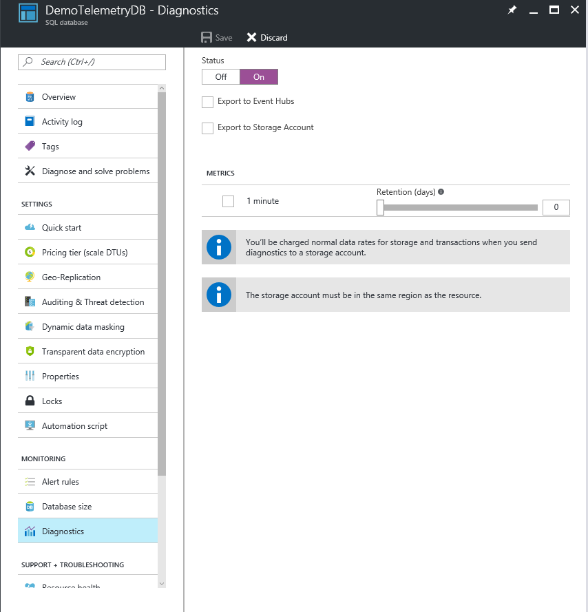
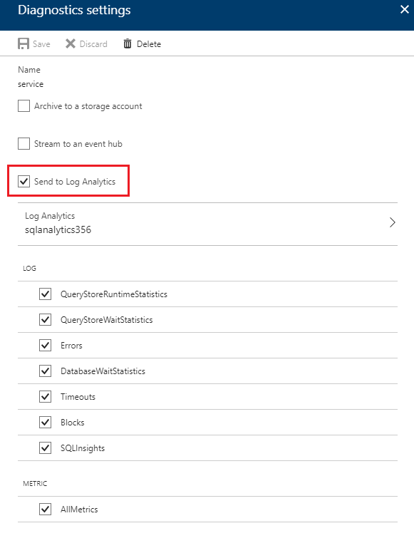
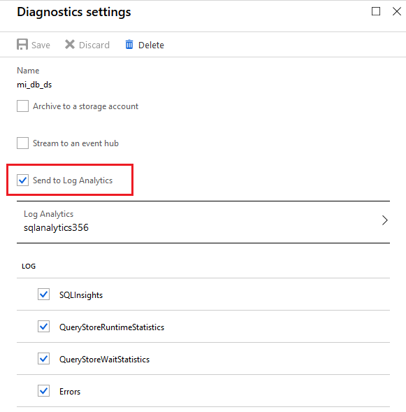
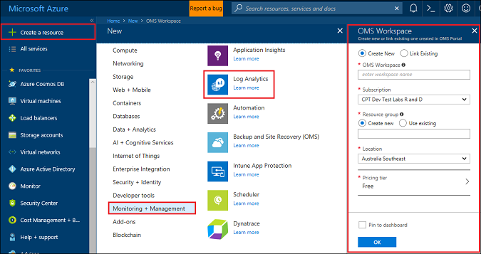
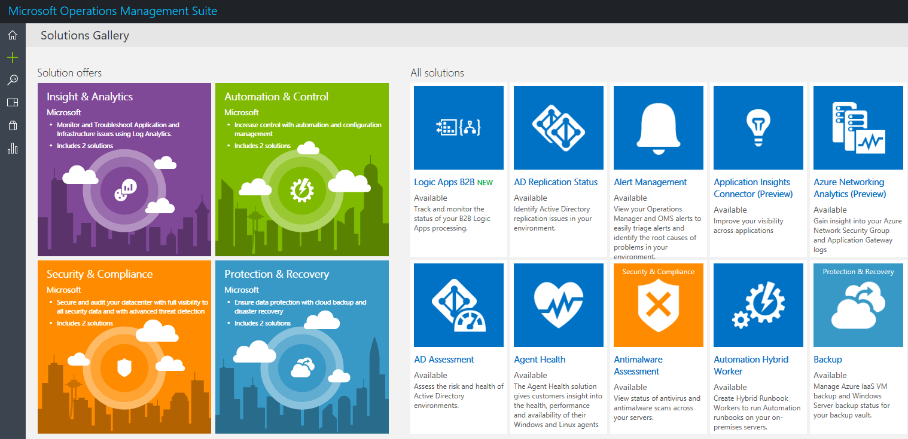

# Azure SQL Database metrics and diagnostics logging 

Azure SQL Database, and Managed Instance databases can emit metrics and diagnostics logs for easier performance monitoring. You can configure a database to stream resource usage, workers and sessions, and connectivity into one of these Azure resources:

* **Azure SQL Analytics**: Used as integrated Azure database intelligent performance monitoring solution with reporting, alerting, and mitigating capabilities.
* **Azure Event Hubs**: Used for integrating SQL Database telemetry with your custom monitoring solution or hot pipelines.
* **Azure Storage**: Used for archiving vast amounts of telemetry for a small price.

    

## Enable logging for a database

Metrics and diagnostics logging on SQL Database, or Managed Instance database is not enabled by default. You can enable and manage metrics and diagnostics telemetry logging on a database by using one of the following methods:

- Azure portal
- PowerShell
- Azure CLI
- Azure Monitor REST API 
- Azure Resource Manager template

When you enable metrics and diagnostics logging, you need to specify the Azure resource where selected data will be collected. Options available include:

- SQL Analytics
- Event Hubs
- Storage 

You can provision a new Azure resource or select an existing resource. After selecting a resource, using a database Diagnostic settings option, you need to specify which data to collect. Available options, with support for Azure SQL Database and Managed Instance database include:

| Monitoring telemetry | Azure SQL Database support | Database in Managed Instance support |
| :------------------- | ------------------- | ------------------- |
| [All metrics](sql-database-metrics-diag-logging.md#all-metrics): Contains DTU/CPU percentage, DTU/CPU limit, physical data read percentage, log write percentage, Successful/Failed/Blocked by firewall connections, sessions percentage, workers percentage, storage, storage percentage, and XTP storage percentage. | Yes | No |
| [QueryStoreRuntimeStatistics](sql-database-metrics-diag-logging.md#query-store-runtime-statistics): Contains information about the query runtime statistics, such are CPU usage and query duration stats. | Yes | Yes |
| [QueryStoreWaitStatistics](sql-database-metrics-diag-logging.md#query-store-wait-statistics): Contains information about the query wait statistics, which tells you what your queries waited on, such as CPU, LOG, and LOCKING. | Yes | Yes |
| [Errors](sql-database-metrics-diag-logging.md#errors-dataset): Contains information about SQL errors that happened on this database. | Yes | No |
| [DatabaseWaitStatistics](sql-database-metrics-diag-logging.md#database-wait-statistics-dataset): Contains information about how much time a database spent waiting on different wait types. | Yes | No |
| [Timeouts](sql-database-metrics-diag-logging.md#time-outs-dataset): Contains information about timeouts that happened on a database. | Yes | No |
| [Blocks](sql-database-metrics-diag-logging.md#blockings-dataset): Contains information about blocking events that happened on a database. | Yes | No |
| [SQLInsights](sql-database-metrics-diag-logging.md#intelligent-insights-dataset): Contains Intelligent Insights into performance. [Learn more about Intelligent Insights](sql-database-intelligent-insights.md). | Yes | Yes |

**Please note**: To use Audit and SQLSecurityAuditEvents logs, although these options are available inside database Diagnostic settings, these logs should be enabled only through **SQL Auditing** solution to configure streaming telemetry to Log Analytics, Event Hub or Storage.

If you select Event Hubs or a storage account, you can specify a retention policy. This policy deletes data that is older than a selected time period. If you specify Log Analytics, the retention policy depends on the selected pricing tier. For more information, see [Log Analytics pricing](https://azure.microsoft.com/pricing/details/log-analytics/). 

## Enable logging for elastic pools or Managed Instance

Metrics and diagnostics logging elastic pools or Managed Instance is not enabled by default. You can enable and manage metrics and diagnostics telemetry logging for elastic pool or Managed Instance. The following data is available for collection:

| Monitoring telemetry | Elastic pool support | Managed Instance support |
| :------------------- | ------------------- | ------------------- |
| [All metrics](sql-database-metrics-diag-logging.md#all-metrics) (elastic pools): Contains eDTU/CPU percentage, eDTU/CPU limit, physical data read percentage, log write percentage, sessions percentage, workers percentage, storage, storage percentage, storage limit, and XTP storage percentage. | Yes | N/A |
| [ResourceUsageStats](sql-database-metrics-diag-logging.md#resource-usage-stats) (Managed Instance): Contains vCores count, average CPU percentage, IO requests, bytes read/written, reserved storage space, used storage space. | N/A | Yes |

To understand the metrics and log categories that are supported by the various Azure services, we recommend that you read:

* [Overview of metrics in Microsoft Azure](../monitoring-and-diagnostics/monitoring-overview-metrics.md)
* [Overview of Azure diagnostics logs](../monitoring-and-diagnostics/monitoring-overview-of-diagnostic-logs.md) 

### Azure portal

- To enable metrics and diagnostics logs collection fir SQL Databases or Managed Instance databases, go to your database, and then select **Diagnostics settings**. Select **+Add diagnostic setting** to configure a new setting, or **Edit setting** to edit an existing setting.

   

- For **Azure SQL Database** create new or edit existing diagnostics settings by selecting the target and the telemetry.

   

- For **Managed Instance database** create new or edit existing diagnostics settings by selecting the target and the telemetry.

   

### PowerShell

To enable metrics and diagnostics logging by using PowerShell, use the following commands:

- To enable storage of diagnostics logs in a storage account, use this command:

   ```powershell
   Set-AzureRmDiagnosticSetting -ResourceId [your resource id] -StorageAccountId [your storage account id] -Enabled $true
   ```

   The storage account ID is the resource ID for the storage account where you want to send the logs.

- To enable streaming of diagnostics logs to an event hub, use this command:

   ```powershell
   Set-AzureRmDiagnosticSetting -ResourceId [your resource id] -ServiceBusRuleId [your service bus rule id] -Enabled $true
   ```

   The Azure Service Bus rule ID is a string with this format:

   ```powershell
   {service bus resource ID}/authorizationrules/{key name}
   ``` 

- To enable sending diagnostics logs to a Log Analytics workspace, use this command:

   ```powershell
   Set-AzureRmDiagnosticSetting -ResourceId [your resource id] -WorkspaceId [resource id of the log analytics workspace] -Enabled $true
   ```

- You can obtain the resource ID of your Log Analytics workspace by using the following command:

   ```powershell
   (Get-AzureRmOperationalInsightsWorkspace).ResourceId
   ```

You can combine these parameters to enable multiple output options.

### To configure multiple Azure resources

To support multiple subscriptions, use the PowerShell script from [Enable Azure resource metrics logging using PowerShell](https://blogs.technet.microsoft.com/msoms/2017/01/17/enable-azure-resource-metrics-logging-using-powershell/).

Provide the workspace resource ID &lt;$WSID&gt; as a parameter when executing the script (Enable-AzureRMDiagnostics.ps1) to send diagnostic data from multiple resources to the workspace. To get the workspace ID &lt;$WSID&gt; to which you would like to send diagnostic data, replace &lt;subID&gt; with the subscription ID, replace &lt;RG_NAME&gt; with the resource group name, and replace &lt;WS_NAME&gt; with the workspace name in the following script.

- To configure multiple Azure resources, use the following commands:

    ```powershell
    PS C:\> $WSID = "/subscriptions/<subID>/resourcegroups/<RG_NAME>/providers/microsoft.operationalinsights/workspaces/<WS_NAME>"
    PS C:\> .\Enable-AzureRMDiagnostics.ps1 -WSID $WSID
    ```

### Azure CLI

To enable metrics and diagnostics logging by using the Azure CLI, use the following commands:

- To enable storage of diagnostics logs in a storage account, use this command:

   ```azurecli-interactive
   azure insights diagnostic set --resourceId <resourceId> --storageId <storageAccountId> --enabled true
   ```

   The storage account ID is the resource ID for the storage account where you want to send the logs.

- To enable streaming of diagnostics logs to an event hub, use this command:

   ```azurecli-interactive
   azure insights diagnostic set --resourceId <resourceId> --serviceBusRuleId <serviceBusRuleId> --enabled true
   ```

   The Service Bus rule ID is a string with this format:

   ```azurecli-interactive
   {service bus resource ID}/authorizationrules/{key name}
   ```

- To enable sending diagnostics logs to a Log Analytics workspace, use this command:

   ```azurecli-interactive
   azure insights diagnostic set --resourceId <resourceId> --workspaceId <resource id of the log analytics workspace> --enabled true
   ```

You can combine these parameters to enable multiple output options.

### REST API

Read about how to [change diagnostics settings by using the Azure Monitor REST API](https://docs.microsoft.com/rest/api/monitor/diagnosticsettings). 

### Resource Manager template

Read about how to [enable diagnostics settings at resource creation by using a Resource Manager template](../monitoring-and-diagnostics/monitoring-enable-diagnostic-logs-using-template.md). 

## Stream into Log Analytics 
SQL Database metrics and diagnostics logs can be streamed into Log Analytics by using the built-in **Send to Log Analytics** option in the portal. You also can enable Log Analytics by using a diagnostics setting via PowerShell cmdlets, the Azure CLI, or the Azure Monitor REST API.

### Installation overview

Monitoring a SQL Database fleet is simple with Log Analytics. Three steps are required:

1. Create a Log Analytics resource.

2. Configure databases to record metrics and diagnostics logs into the Log Analytics resource you created.

3. Install the **Azure SQL Analytics** solution from the Azure Marketplace.

### Create a Log Analytics resource

1. Select **Create a resource** in the menu on the left.

2. Select **Monitoring + Management**.

3. Select **Log Analytics**.

4. Fill in the Log Analytics form with the additional information that is required: workspace name, subscription, resource group, location, and pricing tier.

   

### Configure databases to record metrics and diagnostics logs

The easiest way to configure where databases record their metrics is through the Azure portal. In the portal, go to your SQL Database resource and select **Diagnostics settings**. 

### Install the SQL Analytics solution from the gallery

1. After you create the Log Analytics resource and your data is flowing into it, install the SQL Analytics solution. On the home page, on the side menu, select **Solutions Gallery**. In the gallery, select the **Azure SQL Analytics** solution, and select **Add**.

   

2. On your home page, the **Azure SQL Analytics** tile appears. Select this tile to open the SQL Analytics dashboard.

### Use the SQL Analytics solution

SQL Analytics is a hierarchical dashboard that allows you to move through the hierarchy of SQL Database resources. To learn how to use the SQL Analytics solution, see [Monitor SQL Database by using the SQL Analytics solution](../log-analytics/log-analytics-azure-sql.md).

## Stream into Event Hubs

SQL Database metrics and diagnostics logs can be streamed into Event Hubs by using the built-in **Stream to an event hub** option in the portal. You also can enable the Service Bus rule ID by using a diagnostics setting via PowerShell cmdlets, the Azure CLI, or the Azure Monitor REST API. 

### What to do with metrics and diagnostics logs in Event Hubs
After the selected data is streamed into Event Hubs, you're one step closer to enabling advanced monitoring scenarios. Event Hubs acts as the front door for an event pipeline. After data is collected into an event hub, it can be transformed and stored by using any real-time analytics provider or batching/storage adapters. Event Hubs decouples the production of a stream of events from the consumption of those events. In this way, event consumers can access the events on their own schedule. For more information on Event Hubs, see:

- [What are Azure Event Hubs?](../event-hubs/event-hubs-what-is-event-hubs.md)
- [Get started with Event Hubs](../event-hubs/event-hubs-csharp-ephcs-getstarted.md)


Here are a few ways that you might use the streaming capability:

* **View service health by streaming hot-path data to Power BI**. By using Event Hubs, Stream Analytics, and Power BI, you can easily transform your metrics and diagnostics data into near real-time insights on your Azure services. For an overview of how to set up an event hub, process data with Stream Analytics, and use Power BI as an output, see [Stream Analytics and Power BI](../stream-analytics/stream-analytics-power-bi-dashboard.md).

* **Stream logs to third-party logging and telemetry streams**. By using Event Hubs streaming, you can get your metrics and diagnostics logs into different third-party monitoring and log analytics solutions. 

* **Build a custom telemetry and logging platform**. If you already have a custom-built telemetry platform or are considering building one, the highly scalable publish-subscribe nature of Event Hubs allows you to flexibly ingest diagnostics logs. See [Dan Rosanova's guide to using Event Hubs in a global-scale telemetry platform](https://azure.microsoft.com/documentation/videos/build-2015-designing-and-sizing-a-global-scale-telemetry-platform-on-azure-event-Hubs/).

## Stream into Storage

SQL Database metrics and diagnostics logs can be stored in Storage by using the built-in **Archive to a storage account** option in the portal. You also can enable Storage by using a diagnostics setting via PowerShell cmdlets, the Azure CLI, or the Azure Monitor REST API.

### Schema of metrics and diagnostics logs in the storage account

After you set up metrics and diagnostics logs collection, a storage container is created in the storage account you selected when the first rows of data are available. The structure of these blobs is:

```powershell
insights-{metrics|logs}-{category name}/resourceId=/SUBSCRIPTIONS/{subscription ID}/ RESOURCEGROUPS/{resource group name}/PROVIDERS/Microsoft.SQL/servers/{resource_server}/ databases/{database_name}/y={four-digit numeric year}/m={two-digit numeric month}/d={two-digit numeric day}/h={two-digit 24-hour clock hour}/m=00/PT1H.json
```
    
Or, more simply:

```powershell
insights-{metrics|logs}-{category name}/resourceId=/{resource Id}/y={four-digit numeric year}/m={two-digit numeric month}/d={two-digit numeric day}/h={two-digit 24-hour clock hour}/m=00/PT1H.json
```

For example, a blob name for all metrics might be:

```powershell
insights-metrics-minute/resourceId=/SUBSCRIPTIONS/s1id1234-5679-0123-4567-890123456789/RESOURCEGROUPS/TESTRESOURCEGROUP/PROVIDERS/MICROSOFT.SQL/ servers/Server1/databases/database1/y=2016/m=08/d=22/h=18/m=00/PT1H.json
```

If you want to record the data from the elastic pool, the blob name is a bit different:

```powershell
insights-{metrics|logs}-{category name}/resourceId=/SUBSCRIPTIONS/{subscription ID}/ RESOURCEGROUPS/{resource group name}/PROVIDERS/Microsoft.SQL/servers/{resource_server}/ elasticPools/{elastic_pool_name}/y={four-digit numeric year}/m={two-digit numeric month}/d={two-digit numeric day}/h={two-digit 24-hour clock hour}/m=00/PT1H.json
```

### Download metrics and logs from Storage

Learn how to [download metrics and diagnostics logs from Storage](../storage/blobs/storage-quickstart-blobs-dotnet.md#download-the-sample-application).

## Metrics and logs available

Please find detailed monitoring telemetry content of metrics and logs available for Azure SQL Database, elastic pools, Managed Instance, and databases in Managed Instance.

## All metrics

### All metrics for elastic pools

|**Resource**|**Metrics**|
|---|---|
|Elastic pool|eDTU percentage, eDTU used, eDTU limit, CPU percentage, physical data read percentage, log write percentage, sessions percentage, workers percentage, storage, storage percentage, storage limit, XTP storage percentage |

### All metrics for Azure SQL Database

|**Resource**|**Metrics**|
|---|---|
|Azure SQL Database|DTU percentage, DTU used, DTU limit, CPU percentage, physical data read percentage, log write percentage, Successful/Failed/Blocked by firewall connections, sessions percentage, workers percentage, storage, storage percentage, XTP storage percentage, and deadlocks |

## Logs

### Logs for Managed Instance

### Resource Usage Stats

|Property|Description|
|---|---|
|TenantId|Your tenant ID.|
|SourceSystem|Always: Azure|
|TimeGenerated [UTC]|Time stamp when the log was recorded.|
|Type|Always: AzureDiagnostics|
|ResourceProvider|Name of the resource provider. Always: MICROSOFT.SQL|
|Category|Name of the category. Always: ResourceUsageStats|
|Resource|Name of the resource.|
|ResourceType|Name of the resource type. Always: MANAGEDINSTANCES|
|SubscriptionId|Subscription GUID that the database belongs to.|
|ResourceGroup|Name of the resource group that the database belongs to.|
|LogicalServerName_s|Name of the Managed Instance.|
|ResourceId|Resource URI.|
|SKU_s|Managed Instance product SKU|
|virtual_core_count_s|Numver of vCores available|
|avg_cpu_percent_s|Average CPU percentage|
|reserved_storage_mb_s|Reserved storage capacity on Managed Instance|
|storage_space_used_mb_s|Used storage on Managed Instance|
|io_requests_s|IOPS count|
|io_bytes_read_s|IOPS bytes read|
|io_bytes_written_s|IOPS bytes written|

### Logs for Azure SQL Database and Managed Instance database

### Query Store runtime statistics

|Property|Description|
|---|---|
|TenantId|Your tenant ID.|
|SourceSystem|Always: Azure|
|TimeGenerated [UTC]|Time stamp when the log was recorded.|
|Type|Always: AzureDiagnostics|
|ResourceProvider|Name of the resource provider. Always: MICROSOFT.SQL|
|Category|Name of the category. Always: QueryStoreRuntimeStatistics|
|OperationName|Name of the operation. Always: QueryStoreRuntimeStatisticsEvent|
|Resource|Name of the resource.|
|ResourceType|Name of the resource type. Always: SERVERS/DATABASES|
|SubscriptionId|Subscription GUID that the database belongs to.|
|ResourceGroup|Name of the resource group that the database belongs to.|
|LogicalServerName_s|Name of the server that the database belongs to.|
|ElasticPoolName_s|Name of the elastic pool that the database belongs to, if any.|
|DatabaseName_s|Name of the database.|
|ResourceId|Resource URI.|
|query_hash_s|Query hash.|
|query_plan_hash_s|Query plan hash.|
|statement_sql_handle_s|Statement sql handle.|
|interval_start_time_d|Start datetimeoffset of the interval in number of ticks from 1900-1-1.|
|interval_end_time_d|End datetimeoffset of the interval in number of ticks from 1900-1-1.|
|logical_io_writes_d|Total number of logical IO writes.|
|max_logical_io_writes_d|Max number of logical IO writes per execution.|
|physical_io_reads_d|Total number of physical IO reads.|
|max_physical_io_reads_d|Max number of logical IO reads per execution.|
|logical_io_reads_d|Total number of logical IO reads.|
|max_logical_io_reads_d|Max number of logical IO reads per execution.|
|execution_type_d|Execution type.|
|count_executions_d|Number of executions of the query.|
|cpu_time_d|Total CPU time consumed by the query in microseconds.|
|max_cpu_time_d|Max CPU time consumer by a single execution in microseconds.|
|dop_d|Sum of degrees of parallelism.|
|max_dop_d|Max degree of parallelism used for single execution.|
|rowcount_d|Total number of rows returned.|
|max_rowcount_d|Max number of rows returned in single execution.|
|query_max_used_memory_d|Total amount of memory used in KB.|
|max_query_max_used_memory_d|Max amount of memory used by a single execution in KB.|
|duration_d|Total execution time in microseconds.|
|max_duration_d|Max execution time of a single execution.|
|num_physical_io_reads_d|Total number of physical reads.|
|max_num_physical_io_reads_d|Max number of physical reads per execution.|
|log_bytes_used_d|Total amount of log bytes used.|
|max_log_bytes_used_d|Max amount of log bytes used per execution.|
|query_id_d|ID of the query in Query Store.|
|plan_id_d|ID of the plan in Query Store.|

Learn more about [Query Store runtime statistics data](https://docs.microsoft.com/sql/relational-databases/system-catalog-views/sys-query-store-runtime-stats-transact-sql).

### Query Store wait statistics

|Property|Description|
|---|---|
|TenantId|Your tenant ID.|
|SourceSystem|Always: Azure|
|TimeGenerated [UTC]|Time stamp when the log was recorded.|
|Type|Always: AzureDiagnostics|
|ResourceProvider|Name of the resource provider. Always: MICROSOFT.SQL|
|Category|Name of the category. Always: QueryStoreWaitStatistics|
|OperationName|Name of the operation. Always: QueryStoreWaitStatisticsEvent|
|Resource|Name of the resource|
|ResourceType|Name of the resource type. Always: SERVERS/DATABASES|
|SubscriptionId|Subscription GUID that the database belongs to.|
|ResourceGroup|Name of the resource group that the database belongs to.|
|LogicalServerName_s|Name of the server that the database belongs to.|
|ElasticPoolName_s|Name of the elastic pool that the database belongs to, if any.|
|DatabaseName_s|Name of the database.|
|ResourceId|Resource URI.|
|wait_category_s|Category of the wait.|
|is_parameterizable_s|Is the query parameterizable.|
|statement_type_s|Type of the statement.|
|statement_key_hash_s|Statement key hash.|
|exec_type_d|Type of execution.|
|total_query_wait_time_ms_d|Total wait time of the query on the specific wait category.|
|max_query_wait_time_ms_d|Max wait time of the query in individual execution on the specific wait category.|
|query_param_type_d|0|
|query_hash_s|Query hash in Query Store.|
|query_plan_hash_s|Query plan hash in Query Store.|
|statement_sql_handle_s|Statement handle in Query Store.|
|interval_start_time_d|Start datetimeoffset of the interval in number of ticks from 1900-1-1.|
|interval_end_time_d|End datetimeoffset of the interval in number of ticks from 1900-1-1.|
|count_executions_d|Count of executions of the query.|
|query_id_d|ID of the query in Query Store.|
|plan_id_d|ID of the plan in Query Store.|

Learn more about [Query Store wait statistics data](https://docs.microsoft.com/sql/relational-databases/system-catalog-views/sys-query-store-wait-stats-transact-sql).

### Errors dataset

|Property|Description|
|---|---|
|TenantId|Your tenant ID.|
|SourceSystem|Always: Azure|
|TimeGenerated [UTC]|Time stamp when the log was recorded.|
|Type|Always: AzureDiagnostics|
|ResourceProvider|Name of the resource provider. Always: MICROSOFT.SQL|
|Category|Name of the category. Always: Errors|
|OperationName|Name of the operation. Always: ErrorEvent|
|Resource|Name of the resource|
|ResourceType|Name of the resource type. Always: SERVERS/DATABASES|
|SubscriptionId|Subscription GUID that the database belongs to.|
|ResourceGroup|Name of the resource group that the database belongs to.|
|LogicalServerName_s|Name of the server that the database belongs to.|
|ElasticPoolName_s|Name of the elastic pool that the database belongs to, if any.|
|DatabaseName_s|Name of the database.|
|ResourceId|Resource URI.|
|Message|Error message in plain text.|
|user_defined_b|Is the error user defined bit.|
|error_number_d|Error code.|
|Severity|Severity of the error.|
|state_d|State of the error.|
|query_hash_s|Query hash of the failed query, if available.|
|query_plan_hash_s|Query plan hash of the failed query, if available.|

Learn more about [SQL Server error messages](https://msdn.microsoft.com/library/cc645603.aspx).

### Database wait statistics dataset

|Property|Description|
|---|---|
|TenantId|Your tenant ID.|
|SourceSystem|Always: Azure|
|TimeGenerated [UTC]|Time stamp when the log was recorded.|
|Type|Always: AzureDiagnostics|
|ResourceProvider|Name of the resource provider. Always: MICROSOFT.SQL|
|Category|Name of the category. Always: DatabaseWaitStatistics|
|OperationName|Name of the operation. Always: DatabaseWaitStatisticsEvent|
|Resource|Name of the resource|
|ResourceType|Name of the resource type. Always: SERVERS/DATABASES|
|SubscriptionId|Subscription GUID that the database belongs to.|
|ResourceGroup|Name of the resource group that the database belongs to.|
|LogicalServerName_s|Name of the server that the database belongs to.|
|ElasticPoolName_s|Name of the elastic pool that the database belongs to, if any.|
|DatabaseName_s|Name of the database.|
|ResourceId|Resource URI.|
|wait_type_s|Name of the wait type.|
|start_utc_date_t [UTC]|Measured period start time.|
|end_utc_date_t [UTC]|Measured period end time.|
|delta_max_wait_time_ms_d|Max waited time per execution|
|delta_signal_wait_time_ms_d|Total signal wait time.|
|delta_wait_time_ms_d|Total wait time in the period.|
|delta_waiting_tasks_count_d|Number of waiting tasks.|

Learn more about [database wait statistics](https://docs.microsoft.com/sql/relational-databases/system-dynamic-management-views/sys-dm-os-wait-stats-transact-sql).

### Time-outs dataset

|Property|Description|
|---|---|
|TenantId|Your tenant ID.|
|SourceSystem|Always: Azure|
|TimeGenerated [UTC]|Time stamp when the log was recorded.|
|Type|Always: AzureDiagnostics|
|ResourceProvider|Name of the resource provider. Always: MICROSOFT.SQL|
|Category|Name of the category. Always: Timeouts|
|OperationName|Name of the operation. Always: TimeoutEvent|
|Resource|Name of the resource|
|ResourceType|Name of the resource type. Always: SERVERS/DATABASES|
|SubscriptionId|Subscription GUID that the database belongs to.|
|ResourceGroup|Name of the resource group that the database belongs to.|
|LogicalServerName_s|Name of the server that the database belongs to.|
|ElasticPoolName_s|Name of the elastic pool that the database belongs to, if any.|
|DatabaseName_s|Name of the database.|
|ResourceId|Resource URI.|
|error_state_d|Error state code.|
|query_hash_s|Query hash, if available.|
|query_plan_hash_s|Query plan hash, if available.|

### Blockings dataset

|Property|Description|
|---|---|
|TenantId|Your tenant ID.|
|SourceSystem|Always: Azure|
|TimeGenerated [UTC]|Time stamp when the log was recorded.|
|Type|Always: AzureDiagnostics|
|ResourceProvider|Name of the resource provider. Always: MICROSOFT.SQL|
|Category|Name of the category. Always: Blocks|
|OperationName|Name of the operation. Always: BlockEvent|
|Resource|Name of the resource|
|ResourceType|Name of the resource type. Always: SERVERS/DATABASES|
|SubscriptionId|Subscription GUID that the database belongs to.|
|ResourceGroup|Name of the resource group that the database belongs to.|
|LogicalServerName_s|Name of the server that the database belongs to.|
|ElasticPoolName_s|Name of the elastic pool that the database belongs to, if any.|
|DatabaseName_s|Name of the database.|
|ResourceId|Resource URI.|
|lock_mode_s|Lock mode used by the query.|
|resource_owner_type_s|Owner of the lock.|
|blocked_process_filtered_s|Blocked process report XML.|
|duration_d|Duration of the lock in microseconds.|

### Deadlocks dataset

|Property|Description|
|---|---|
|TenantId|Your tenant ID.|
|SourceSystem|Always: Azure|
|TimeGenerated [UTC] |Time stamp when the log was recorded.|
|Type|Always: AzureDiagnostics|
|ResourceProvider|Name of the resource provider. Always: MICROSOFT.SQL|
|Category|Name of the category. Always: Deadlocks|
|OperationName|Name of the operation. Always: DeadlockEvent|
|Resource|Name of the resource.|
|ResourceType|Name of the resource type. Always: SERVERS/DATABASES|
|SubscriptionId|Subscription GUID that the database belongs to.|
|ResourceGroup|Name of the resource group that the database belongs to.|
|LogicalServerName_s|Name of the server that the database belongs to.|
|ElasticPoolName_s|Name of the elastic pool that the database belongs to, if any.|
|DatabaseName_s|Name of the database. |
|ResourceId|Resource URI.|
|deadlock_xml_s|Deadlock report XML.|

### Automatic tuning dataset

|Property|Description|
|---|---|
|TenantId|Your tenant ID.|
|SourceSystem|Always: Azure|
|TimeGenerated [UTC]|Time stamp when the log was recorded.|
|Type|Always: AzureDiagnostics|
|ResourceProvider|Name of the resource provider. Always: MICROSOFT.SQL|
|Category|Name of the category. Always: AutomaticTuning|
|Resource|Name of the resource.|
|ResourceType|Name of the resource type. Always: SERVERS/DATABASES|
|SubscriptionId|Subscription GUID that the database belongs to.|
|ResourceGroup|Name of the resource group that the database belongs to.|
|LogicalServerName_s|Name of the server that the database belongs to.|
|LogicalDatabaseName_s|Name of the database.|
|ElasticPoolName_s|Name of the elastic pool that the database belongs to, if any.|
|DatabaseName_s|Name of the database.|
|ResourceId|Resource URI.|
|RecommendationHash_s|Unique hash of Automatic tuning recommendation.|
|OptionName_s|Automatic tuning operation.|
|Schema_s|Database schema.|
|Table_s|Table affected.|
|IndexName_s|Index name.|
|IndexColumns_s|Column name.|
|IncludedColumns_s|Columns included.|
|EstimatedImpact_s|Estimated impact of Automatic tuning recommendation JSON.|
|Event_s|Type of Automatic tuning event.|
|Timestamp_t|Last updated timestamp.|

### Intelligent Insights dataset
Learn more about the [Intelligent Insights log format](sql-database-intelligent-insights-use-diagnostics-log.md).

## Next steps

To learn how to enable logging and understand the metrics and log categories supported by the various Azure services, read:

 * [Overview of metrics in Microsoft Azure](../monitoring-and-diagnostics/monitoring-overview-metrics.md)
 * [Overview of Azure diagnostics logs](../monitoring-and-diagnostics/monitoring-overview-of-diagnostic-logs.md)

To learn about Event Hubs, read:

* [What is Azure Event Hubs?](../event-hubs/event-hubs-what-is-event-hubs.md)
* [Get started with Event Hubs](../event-hubs/event-hubs-csharp-ephcs-getstarted.md)

To learn more about Storage, see how to [download metrics and diagnostics logs from Storage](../storage/blobs/storage-quickstart-blobs-dotnet.md#download-the-sample-application).
