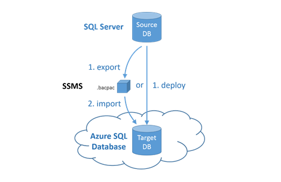
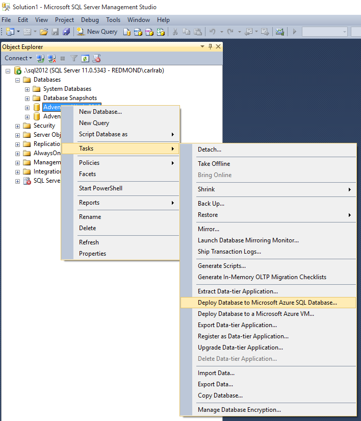
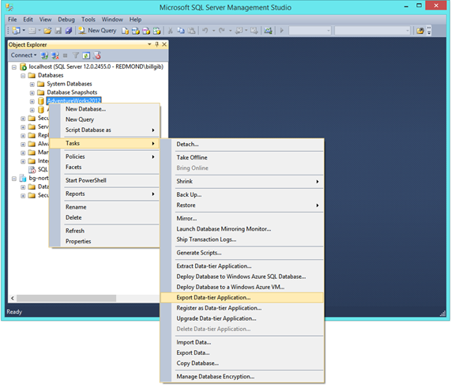
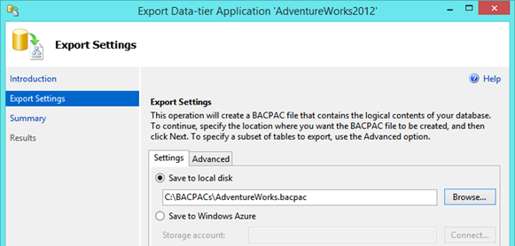
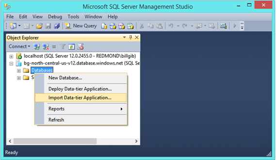
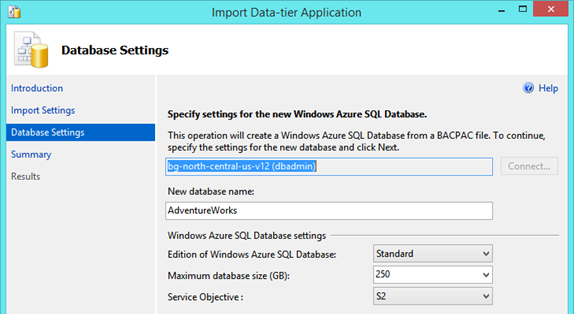

<properties
   pageTitle="Migrating to SQL Database using SSMS"
   description="Microsoft Azure SQL Database, migrate sql database, migrate using ssms"
   services="sql-database"
   documentationCenter=""
   authors="carlrabeler"
   manager="jeffreyg"
   editor=""/>

<tags
   ms.service="sql-database"
   ms.devlang="NA"
   ms.topic="article"
   ms.tgt_pltfrm="NA"
   ms.workload="data-management"
   ms.date="08/24/2015"
   ms.author="carlrab"/>

#Migrating a compatible database using SSMS

If a database schema is compatible with Azure SQL Database, the migration only requires that the database is imported into Azure. This can be done either in a single step using SSMS by deploying the database to Azure SQL Database or as a two-step process by first exporting a BACPAC of the database and then importing that BACPAC into an Azure SQL Server as a new database.

When you export a BACPAC, you can either export it to a local file or directly to an Azure blob. If you export it locally, you can upload the exported BACPAC to an Azure blob. Once the BACPAC file is stored in an Azure blob, you can then import the BACPAC as a database using the Azure portal. Running the import in the Azure portal will reduce the latency in the import step which will improve performance and reliability of the migration with large databases.

Deploying directly from SSMS will always deploy the entire schema and all data, while export using a BACPAC allows you to select the subset of objects to export to the BACPAC. The exported BACPAC always includes the complete database schema and, by default, data from all the tables. Whether you deploy from SSMS or export and then import from SSMS (or the Azure portal) the same DAC technology is used under the hood and the outcome is the same.

This option is also used as the final step in option #2 to migrate the databases after it has been updated to make it compatible with Azure SQL Database.

## Get Latest Version of SQL Server Management Studio

Use the latest version of Microsoft SQL Server Management Studio for SQL Server to ensure that you have the most recent updates for the tools within SSMS and for interacting with the Azure portal. To get the latest version of Microsoft SQL Server Management Studio for SQL Server, [download it](https://msdn.microsoft.com/library/mt238290.aspx) and install it on a client computer with connectivity to the database that you plan to migrating and to the internet.

##Using SSMS to Deploy to Azure SQL Database
1.	Provision a logical server using the Azure Management Portal.
2.	Locate the source database in the SSMS Object Explorer and execute the task, **Export Data-tier Application…**

	

3.	In the deployment wizard, configure the connection to the target Azure SQL Database logical server that you provisioned in step 1.
4.	Provide the **name** for the database and set the **Edition** (service tier) and **Service Objective** (performance level). See [Azure SQL Database service tiers](sql-database-service-tiers.md) for more information on configuring these settings.

	

5.	Complete the wizard to migrate the database.  
Depending on the size and complexity of the database, deployment may take from a few minutes to many hours. If there are incompatibilities, the schema validation routines will quickly detect errors before any deployment to Azure actually occurs. If errors indicate that the database schema is incompatible with the SQL Database, use migration option #2. See [Update database in place then deploy to Azure SQL Database.](sql-database-migrate-visualstudio-ssdt.md)

##Use SSMS to export a BACPAC and then import it to SQL Database
The deployment process can be broken into two steps: export and import. In the first step, a BACPAC file is created which is then used as input in the second step.

1.	Provision a logical server using the Azure Management Portal.
2.	Locate the source database in the SSMS Object Explorer and select the task, **Deploy Database to Azure SQL Database…**

	

3. In the export wizard, configure the export to save the BACPAC file to either a local disk location or to a an Azure blob. The exported BACPAC always includes the complete database schema and, by default, data from all the tables. Use the Advanced tab if you want to exclude data from some or all of the tables. You might, for example, choose to export only the data for reference tables.

	

4.	Once the BACPAC has been created, connect to the server you created in Step 1, right click the **Databases** folder and click **Import Data-tier Application...**
	
	>[AZURE.NOTE] Note: You could also import the BACPAC file stored in an Azure blob from within the Azure management portal.

	

5.	In the import wizard, choose the BACPAC file you just exported to create the new database in Azure SQL Database.

	

6.	Provide the name for the database and set the Edition (service tier) and Service Objective (performance level).

7.	Complete the wizard to import the BACPAC file and create the database in Azure SQL Database.

	

##Alternatives
You can also use the command line utility sqlpackage.exe to deploy the database or export and import a BACPAC. Sqlpackage.exe uses the same DAC technology as SSMS so the outcome is the same. For more information see [SqlPackage.exe on MSDN](https://msdn.microsoft.com/library/hh550080.aspx).
