<properties 
   pageTitle="Migration using Visual Studio and SSDT" 
   description="Microsoft Azure SQL Database, database migration, import database, export database, migration wizard" 
   services="sql-database" 
   documentationCenter="" 
   authors="carlrabeler" 
   manager="jeffreyg" 
   editor=""/>

<tags
   ms.service="sql-database"
   ms.devlang="NA"
   ms.topic="article"
   ms.tgt_pltfrm="NA"
   ms.workload="data-management" 
   ms.date="08/24/2015"
   ms.author="carlrab"/>

#Update database in place then deploy to Azure SQL Database

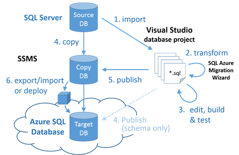

Use this Option when the migration of an on-premises database to Azure SQL Database V12 requires schema changes because the database uses SQL Server features that are not supported in Azure SQL Database, or to test whether non-supported features are present within an on-premises database. 

Use the [lastest SQL Server Data Tools for Visual Studio](https://msdn.microsoft.com/library/mt204009.aspx) with Visual Studio 2013 Update 4 or later.

With this option:

 - SQL Server Data Tools for Visual Studio ("SSDT") is first used to create a database project from the source database. 
 - The project’s target platform is then set to Azure SQL Database V12 and the project is built to identify all compatibility issues. 
 - Once the project builds successfully, the schema is published back to a copy of the source database (do not overwrite the source database).
 - The data compare feature in SSDT is then used to compare the source database to the newly created Azure SQL compatible database and then update the new database with data from the source database. 
 - The updated database is then deployed to Azure using SSMS, either directly or by exporting and then importing a BACPAC file.
 
>[AZURE.NOTE] Note: If a schema-only deployment is required, the updated schema can be published directly from Visual Studio to Azure SQL Database.

## Migration Steps

1.	Open the **SQL Server Object Explorer** in Visual Studio. Use **Add SQL Server** to connect to the SQL Server instance containing the database being migrated. Locate the database in the explorer, right click it and select **Create New Project…** 

	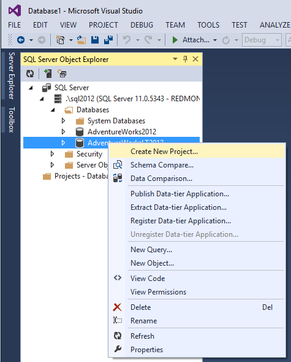

2.	Configure the import settings to **Import application-scoped objects only**. Uncheck the options to import the following: referenced logins, permissions and database settings.

	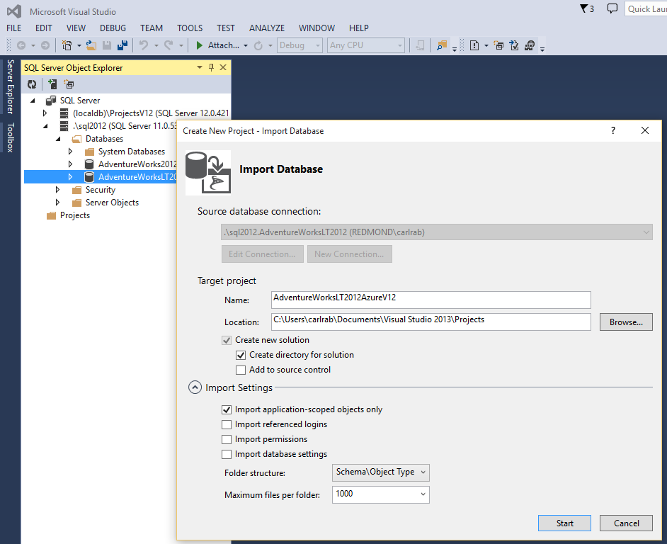

3.	Click **Start** to import the database and create the project, which will contain a T-SQL script file for each object in the database. The script files are nested in folders within the project.

	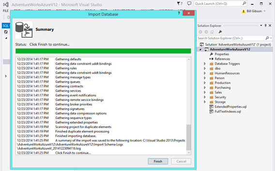

4.	In the Visual Studio Solution Explorer, right click on the database project and select Properties. This will open the **Project Settings** page on which you should configure the Target Platform to Microsoft Azure SQL Database V12.

	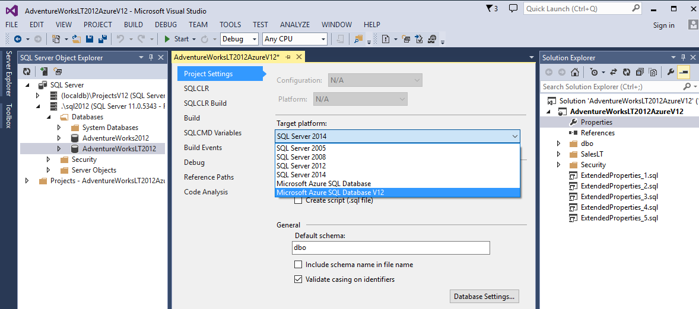

5.	Right-click on the project and select **Build** to build the project.

	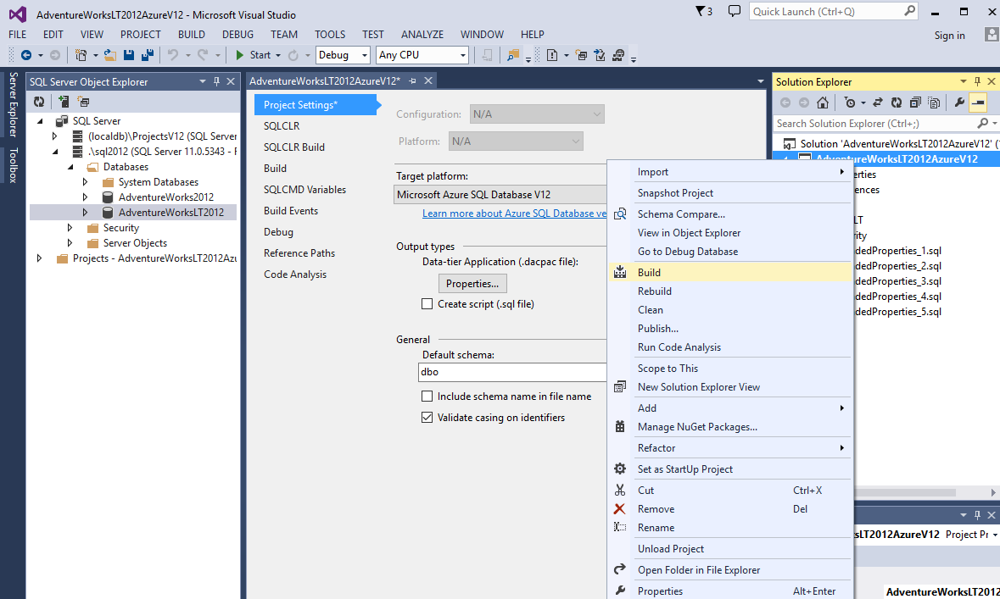

6.	The **Error List** displays each incompatibility. In this case, the user name NT AUTHORITY\NETWORK SERVICE is incompatible. Since it is incompatible, you can comment it out or remove it (and address the implications of removing this login and role from the database solution). 

	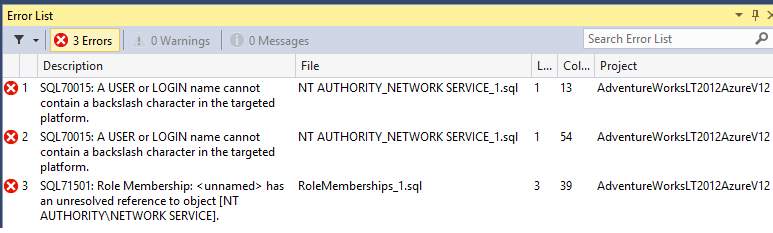
  
7.	Double-click the first script to open the script in a query window and comment out the script, and then execute the script. 
	

8.	Repeat this process for each script containing incompatibilities until no error remain.
	
 
9.	When the database is free of errors right click on the project and select **Publish** to build and publish the database to a copy of the source database (it is highly recommended to use a copy, at least initially). 
 - Before you publish, depending on the source SQL Server version (earlier than SQL Server 2014), you may need to reset the project’s target platform to enable deployment. 
 - If you are migrating an older SQL Server database you must not introduce any features into the project that are not supported in the source SQL Server unless you first migrate the database to a newer version of SQL Server. 

	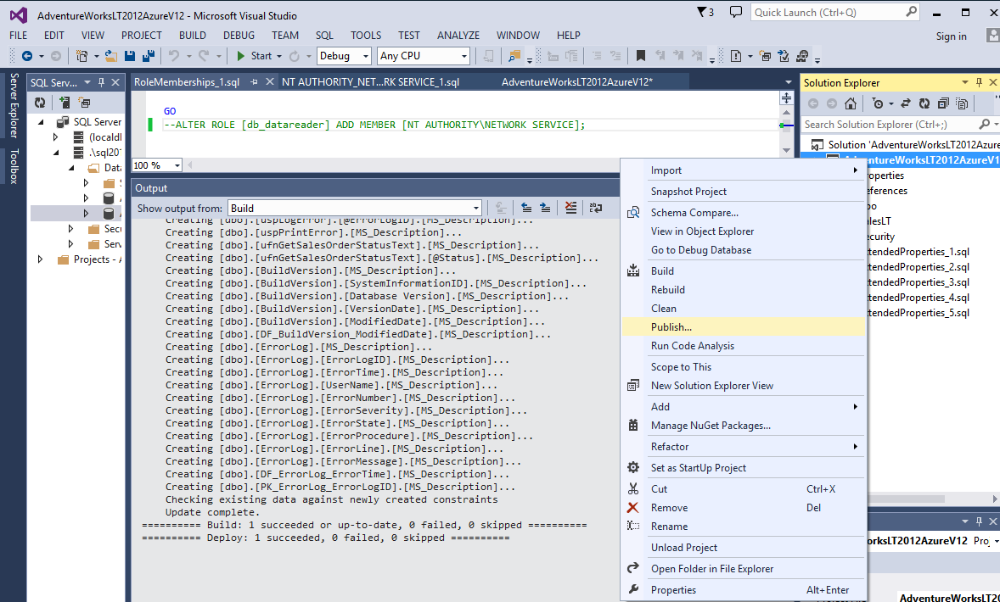

	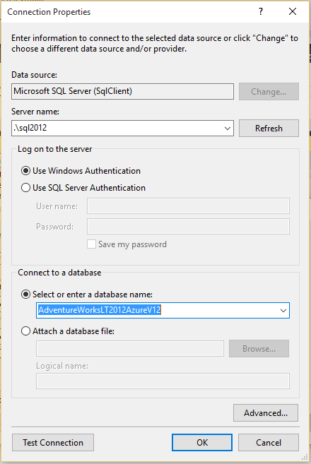

10.	In SQL Server Object Explorer, right-click your source database and click **Data Comparison** to compare the project to the original database to understand what changes have been made by the wizard. Select your Azure SQL V12 version of the database and then click **Finish**.

	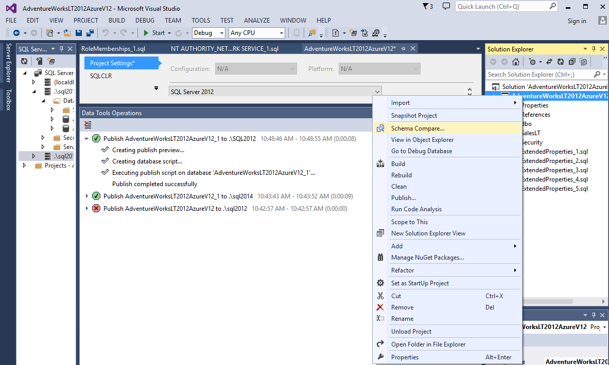

	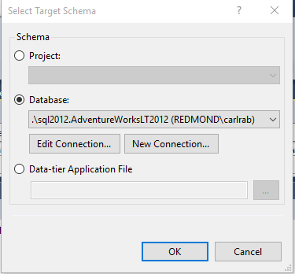

12.	Review the differences detected and then click **Update Target** to migrate data from the source database into the Azure SQL V12 database. 

	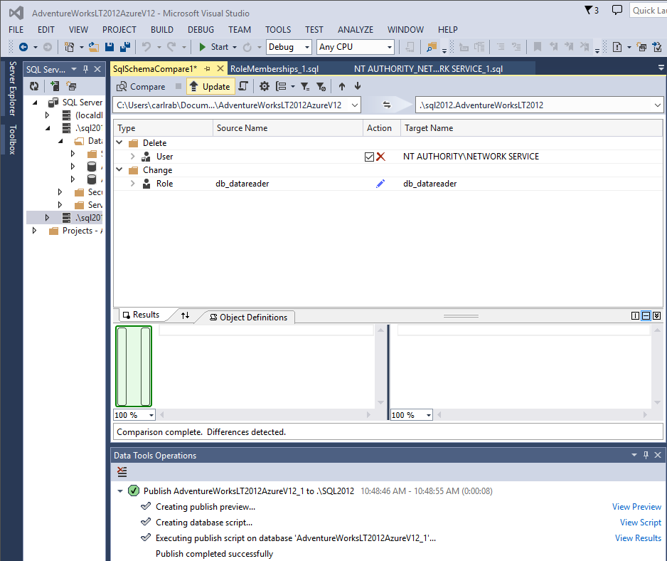

14.	Deploy the Azure SQL V12 compatible database schema and data to Azure SQL Database using SSMS. See [Migrating a compatible database using SSMS.](sql-database-migrate-ssms.md)