# Migrate your SQL Server database to Azure SQL Database using DMA

Moving your SQL Server database to an Azure SQL Database single database is as simple as creating an empty SQL database in Azure and then using  the [Data Migration Assistant](https://www.microsoft.com/download/details.aspx?id=53595) (DMA) to import the database into Azure. For additional migration options, see [Migrate your database to Azure SQL Database](sql-database-cloud-migrate.md).

> [!IMPORTANT]
> To migrate to Azure SQL Database Managed Instance, see [Migrate from SQL Server to a Managed Instance](sql-database-managed-instance-migrate.md)

In this tutorial, you learn to:

> [!div class="checklist"]
> * Create an empty Azure SQL database in the Azure portal (using a new or existing Azure SQL Database server)
> * Create a server-level firewall in the Azure portal (if not previously created)
> * Use the [Data Migration Assistant](https://www.microsoft.com/download/details.aspx?id=53595) (DMA) to import your SQL Server database into the empty Azure SQL database 
> * Use [SQL Server Management Studio](https://docs.microsoft.com/sql/ssms/download-sql-server-management-studio-ssms) (SSMS) to change database properties.

If you don't have an Azure subscription, [create a free account](https://azure.microsoft.com/free/) before you begin.

## Prerequisites

To complete this tutorial, make sure the following prerequisites are completed:

- Installed the newest version of [SQL Server Management Studio](https://docs.microsoft.com/sql/ssms/download-sql-server-management-studio-ssms) (SSMS).  
- Installed the newest version of the [Data Migration Assistant](https://www.microsoft.com/download/details.aspx?id=53595) (DMA).
- You have identified and have access to a database to migrate. This tutorial uses the [SQL Server 2008R2 AdventureWorks OLTP database](https://msftdbprodsamples.codeplex.com/releases/view/59211) on an instance of SQL Server 2008R2 or newer, but you can use any database of your choice. To fix compatibility issues, use [SQL Server Data Tools](https://docs.microsoft.com/sql/ssdt/download-sql-server-data-tools-ssdt)

## Log in to the Azure portal

Sign in to the [Azure portal](https://portal.azure.com/).

## Create a blank SQL database

An Azure SQL database is created with a defined set of [compute and storage resources](sql-database-service-tiers-dtu.md). The database is created within an [Azure resource group](../azure-resource-manager/resource-group-overview.md) and in an [Azure SQL Database logical server](sql-database-features.md). 

Follow these steps to create a blank SQL database. 

1. Click **Create a resource** in the upper left-hand corner of the Azure portal.

2. Select **Databases** from the **New** page, and select **Create** under **SQL Database** on the **New** page.

   

3. Fill out the SQL Database form with the following information, as shown on the preceding image:   

   | Setting       | Suggested value | Description | 
   | ------------ | ------------------ | ------------------------------------------------- | 
   | **Database name** | mySampleDatabase | For valid database names, see [Database Identifiers](https://docs.microsoft.com/sql/relational-databases/databases/database-identifiers). | 
   | **Subscription** | Your subscription  | For details about your subscriptions, see [Subscriptions](https://account.windowsazure.com/Subscriptions). |
   | **Resource group** | myResourceGroup | For valid resource group names, see [Naming rules and restrictions](https://docs.microsoft.com/azure/architecture/best-practices/naming-conventions). |
   | **Select source** | Blank database | Specifies that a blank database should be created. |

4. Click **Server** to create and configure a new server for your new database. Fill out the **New server form** with the following information: 

   | Setting       | Suggested value | Description | 
   | ------------ | ------------------ | ------------------------------------------------- | 
   | **Server name** | Any globally unique name | For valid server names, see [Naming rules and restrictions](https://docs.microsoft.com/azure/architecture/best-practices/naming-conventions). | 
   | **Server admin login** | Any valid name | For valid login names, see [Database Identifiers](https://docs.microsoft.com/sql/relational-databases/databases/database-identifiers).|
   | **Password** | Any valid password | Your password must have at least eight characters and must contain characters from three of the following categories: upper case characters, lower case characters, numbers, and non-alphanumeric characters. |
   | **Location** | Any valid location | For information about regions, see [Azure Regions](https://azure.microsoft.com/regions/). |

   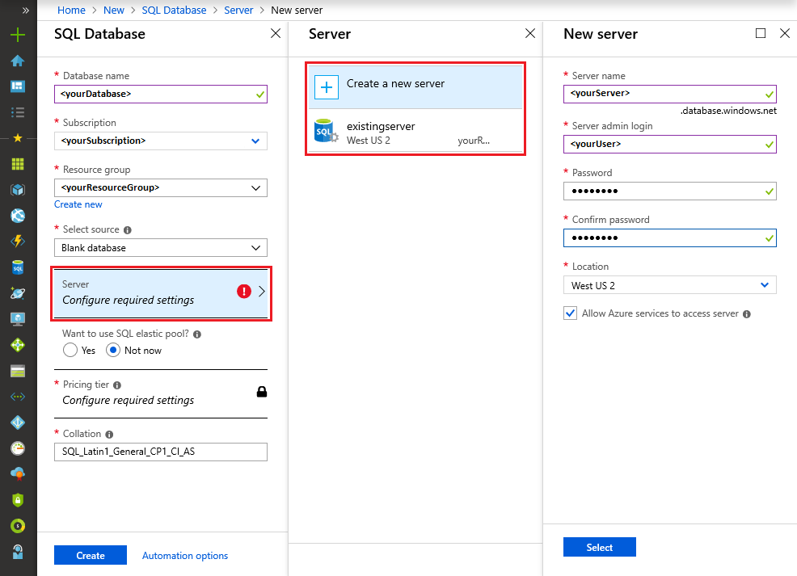

5. Click **Select**.

6. Click **Pricing tier** to specify the service tier, the number of DTUs, and the amount of storage. Explore the options for the number of DTUs and storage that is available to you for each service tier. 

7. For this tutorial, select the **Standard** service tier and then use the slider to select **100 DTUs (S3)** and **400** GB of storage.

   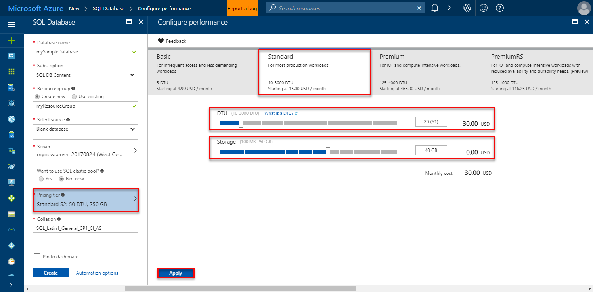

8. Accept the preview terms to use the **Add-on Storage** option. 

   > [!IMPORTANT]
   > More than 1 TB of storage in the Premium tier is currently available in all regions except the following: West Central US, China East, USDoDCentral, USGov Iowa, Germany Central, USDoDEast, US Gov Southwest, Germany Northeast,  China North. In other regions, the storage max in the Premium tier is limited to 1 TB. See [P11-P15 Current Limitations]( sql-database-dtu-resource-limits-single-databases.md#single-database-limitations-of-p11-and-p15-when-the-maximum-size-greater-than-1-tb).  

9. After selecting the server tier, the number of DTUs, and the amount of storage, click **Apply**.  

10. Select a **collation** for the blank database (for this tutorial, use the default value). For more information about collations, see [Collations](https://docs.microsoft.com/sql/t-sql/statements/collations)

11. Now that you have completed the SQL Database form, click **Create** to provision the database. Provisioning takes a few minutes. 

12. On the toolbar, click **Notifications** to monitor the deployment process.
    
     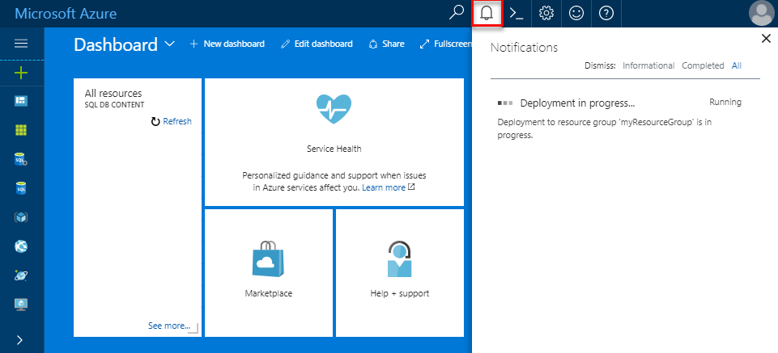

## Create a server-level firewall rule

The SQL Database service creates a firewall at the server-level that prevents external applications and tools from connecting to the server or any databases on the server unless a firewall rule is created to open the firewall for specific IP addresses. Follow these steps to create a [SQL Database server-level firewall rule](sql-database-firewall-configure.md) for your client's IP address and enable external connectivity through the SQL Database firewall for your IP address only. 

> [!NOTE]
> SQL Database communicates over port 1433. If you are trying to connect from within a corporate network, outbound traffic over port 1433 may not be allowed by your network's firewall. If so, you cannot connect to your Azure SQL Database server unless your IT department opens port 1433.
>

1. After the deployment completes, click **SQL databases** from the left-hand menu and then click **mySampleDatabase** on the **SQL databases** page. The overview page for your database opens, showing you the fully qualified server name (such as **mynewserver-20170824.database.windows.net**) and provides options for further configuration. 

2. Copy this fully qualified server name for use to connect to your server and its databases in subsequent quickstarts. 

   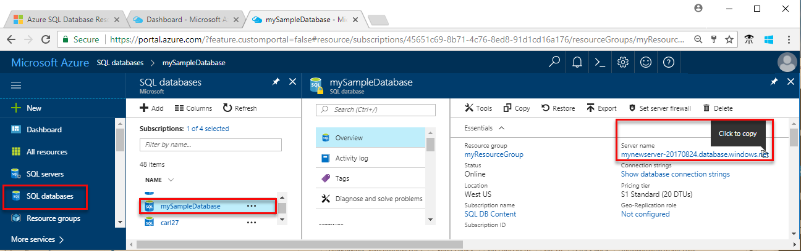 

3. Click **Set server firewall** on the toolbar. The **Firewall settings** page for the SQL Database server opens. 

   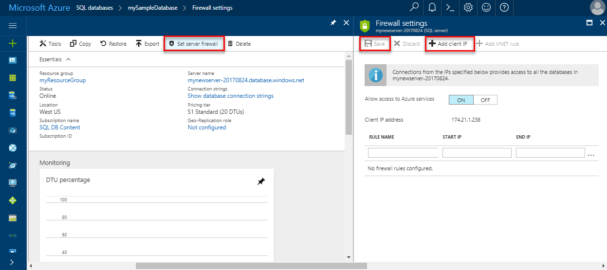 

4. Click **Add client IP** on the toolbar to add your current IP address to a new firewall rule. A firewall rule can open port 1433 for a single IP address or a range of IP addresses.

5. Click **Save**. A server-level firewall rule is created for your current IP address opening port 1433 on the logical server.

6. Click **OK** and then close the **Firewall settings** page.

You can now connect to the SQL Database server and its databases using SQL Server Management Studio, Data Migration Assistant, or another tool of your choice from this IP address using the server admin account created in the previous procedure.

> [!IMPORTANT]
> By default, access through the SQL Database firewall is enabled for all Azure services. Click **OFF** on this page to disable for all Azure services.

## SQL server connection information

Get the fully qualified server name for your Azure SQL Database server in the Azure portal. You use the fully qualified server name to connect to your Azure SQL server using client tools, including the Data Migration Assistance and SQL Server Management Studio.

1. Sign in to the [Azure portal](https://portal.azure.com/).
2. Select **SQL Databases** from the left-hand menu, and click your database on the **SQL databases** page. 
3. In the **Essentials** pane in the Azure portal page for your database, locate and then copy the **Server name**.

   

## Migrate your database

Follow these steps to use the **[Data Migration Assistant](https://www.microsoft.com/download/details.aspx?id=53595)** to assess the readiness of your database for migration to Azure SQL Database and to complete the migration.

1. Open the **Data Migration Assistant**. You can run DMA on any computer with connectivity to the SQL Server instance containing the database that you plan to migrate and connectivity to the internet. You do not need to install it on the computer hosting the SQL Server instance that you are migrating. The firewall rule that you created in a previous procedure must be for the computer on which you are running the Data Migration Assistant.

     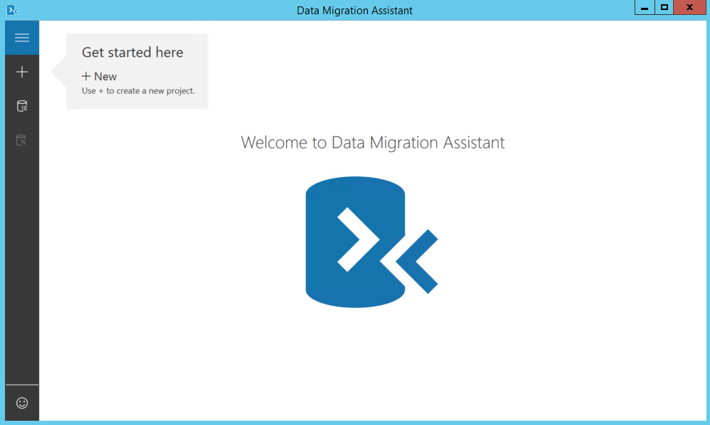

2. In the left-hand menu, click **+ New** to create an **Assessment** project. Fill in the requested values and then click **Create**:

   | Setting      | Suggested value | Description | 
   | ------------ | ------------------ | ------------------------------------------------- | 
   | Project type | Migration | Choose to either assess your database for migration or choose to assess and migration as part of the same workflow |
   |Project name|Migration tutorial| A descriptive name |
   |Source server type| SQL Server | This is the only source currently supported |
   |Target server type| Azure SQL Database| Choices include: Azure SQL Database, SQL Server, SQL Server on Azure virtual machines |
   |Migration Scope| Schema and data| Choices include: Schema and data, schema only, data only |
   
   

3.  On the **Select source** page, fill in the requested values and then click **Connect**:

    | Setting      | Suggested value | Description | 
    | ------------ | ------------------ | ------------------------------------------------- | 
    | Server name | Your server name or IP address | Your server name or IP address |
    | Authentication type | Your preferred authentication type| Choices: Windows Authentication, SQL Server Authentication, Active Directory Integrated Authentication, Active Directory Password Authentication |
    | Username | Your login name | Your login must have **CONTROL SERVER** permissions |
    | Password| Your password | Your password |
    | Connection properties| Select **Encrypt connection** and **Trust server certificate** as appropriate for your environment. | Choose the properties appropriate for the connect to your server |

    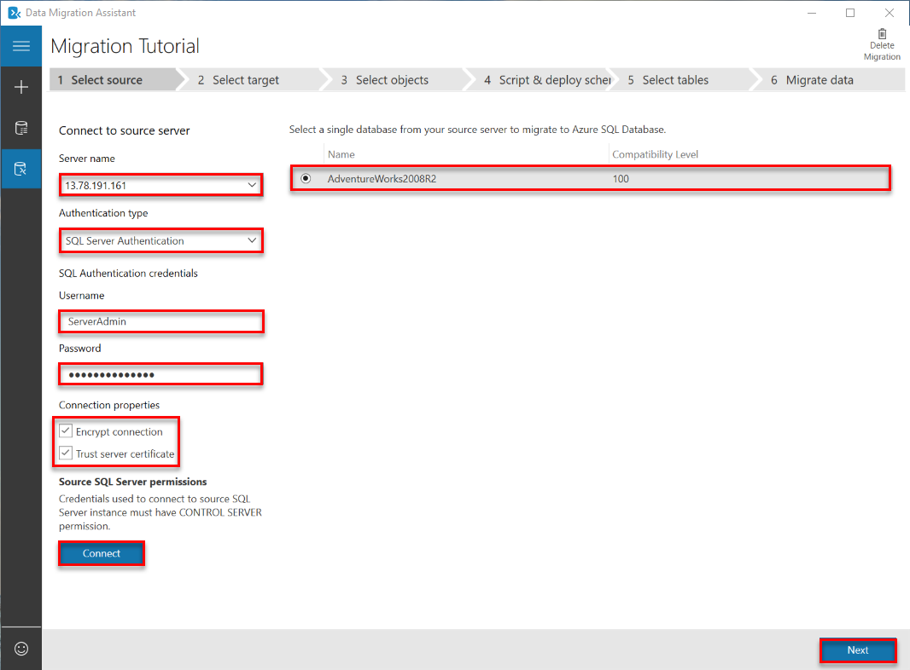

5. Select a single database from your source server to migrate to Azure SQL Database and then click **Next**. For this tutorial, there is only a single database.

6. On the **Select target** page, fill in the requested values and then click **Connect**:

    | Setting      | Suggested value | Description | 
    | ------------ | ------------------ | ------------------------------------------------- | 
    | Server name | Your fully qualified Azure Database server name | Your fully qualified Azure Database server name from the previous procedure |
    | Authentication type | SQL Server Authentication | SQL Server authentication is the only option as this tutorial is written, but Active Directory Integrated Authentication and Active Directory Password Authentication are also supported by Azure SQL Database |
    | Username | Your login name | Your login must have **CONTROL DATABASE** permissions to the source database |
    | Password| Your password | Your password |
    | Connection properties| Select **Encrypt connection** and **Trust server certificate** as appropriate for your environment. | Choose the properties appropriate for the connect to your server |

    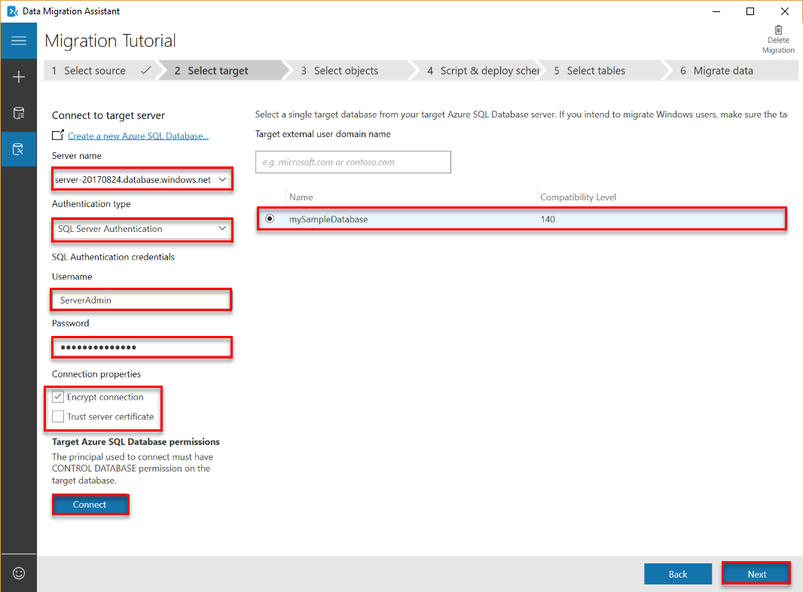

7. Select the database from the target server that you created in a previous procedure and then click **Next** to start the source database schema assessment process. For this tutorial, there is only a single database. Notice that the compatibility level for this database is set to 140, which is the default compatibility level for all new databases in Azure SQL Database.

   > [!IMPORTANT] 
   > After you migrate your database to Azure SQL Database, you can choose to operate the database at a specified compatibility level for backward compatibility purposes. For more information on the implications and options for operating a database at a specific compatibility level, see [ALTER DATABASE Compatibility Level](https://docs.microsoft.com/sql/t-sql/statements/alter-database-transact-sql-compatibility-level). See also [ALTER DATABASE SCOPED CONFIGURATION](https://docs.microsoft.com/sql/t-sql/statements/alter-database-scoped-configuration-transact-sql) for information about additional database-level settings related to compatibility levels.
   >

8. On the **Select objects** page, after the source database schema assessment process completes, review the objects selected for migration and review the objects containing issues. For example, review the **dbo.uspSearchCandidateResumes** object for **SERVERPROPERTY('LCID')** behavior changes and the **HumanResourcesJobCandidate** object for Full-Text Search changes. 

   > [!IMPORTANT] 
   > Depending upon the database's design and your application's design, when you migrate your source database, you may need to modify either or both your database or your application after migration (and, in some cases, before migration). For information about Transact-SQL differences that may affect your migration, see [Resolving Transact-SQL differences during migration to SQL Database](sql-database-transact-sql-information.md).

     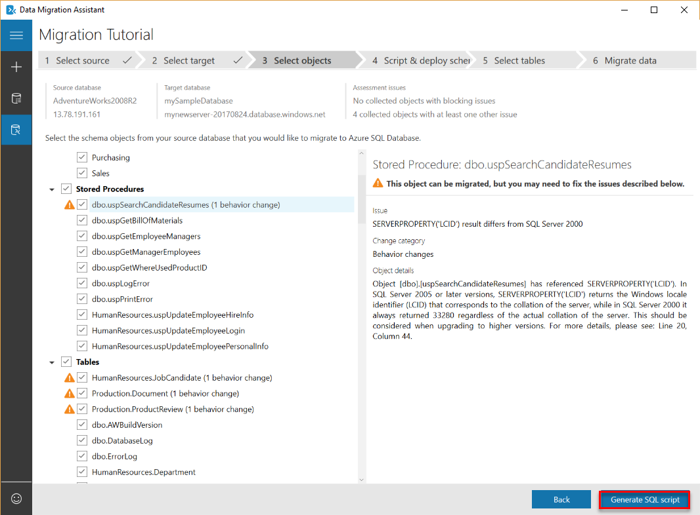

9. Click **Generate SQL script** to script the schema objects in the source database. 
10. Review the generated script and then click **Next issue** as needed to review the identified assessment issues and recommendations. For example, for Full-Text Search, the recommendation when you upgrade is to test your applications leveraging the Full-Text features. You can save or copy the script if you wish.

     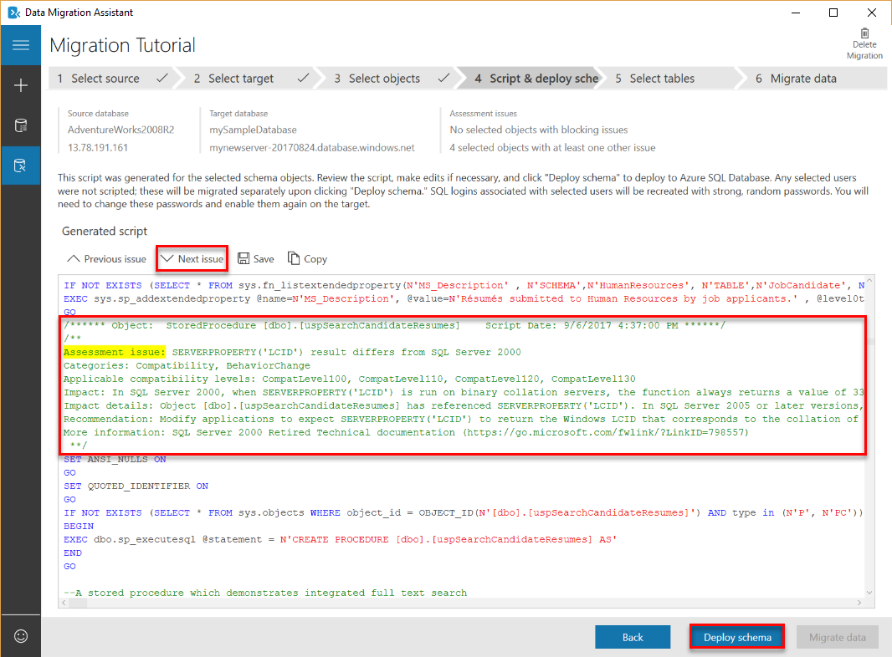

11. Click **Deploy schema** and watch the schema migration process.

     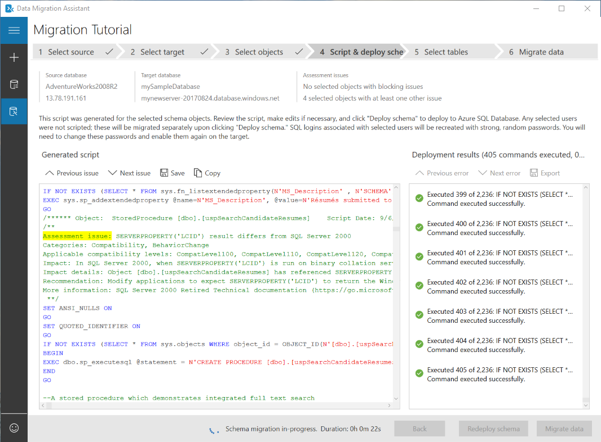

12. When the schema migration completes, review the results for errors and then, assuming there are none, click **Migrate data**.
13. On the **Select tables** page, review the tables selected for migration and then click **Start data migration**.

     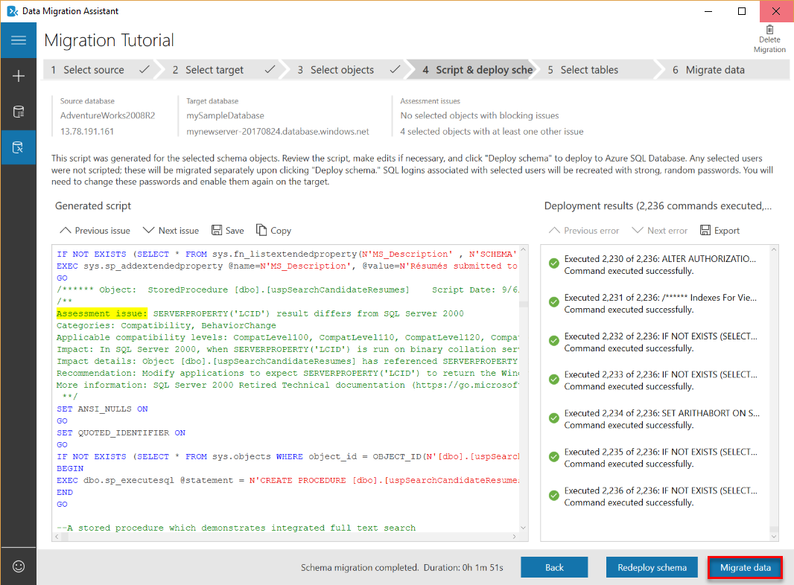

14. Watch the migration process.

     

## Connect to the database with SSMS

Use [SQL Server Management Studio](https://docs.microsoft.com/sql/ssms/sql-server-management-studio-ssms) to establish a connection to your Azure SQL Database server.

1. Open SQL Server Management Studio.

2. In the **Connect to Server** dialog box, enter the following information:

   | Setting       | Suggested value | Description | 
   | ------------ | ------------------ | ------------------------------------------------- | 
   | Server type | Database engine | This value is required |
   | Server name | The fully qualified server name | The name should be something like this: **mynewserver20170824.database.windows.net**. |
   | Authentication | SQL Server Authentication | SQL Authentication is the only authentication type that we have configured in this tutorial. |
   | Login | The server admin account | This is the account that you specified when you created the server. |
   | Password | The password for your server admin account | This is the password that you specified when you created the server. |

   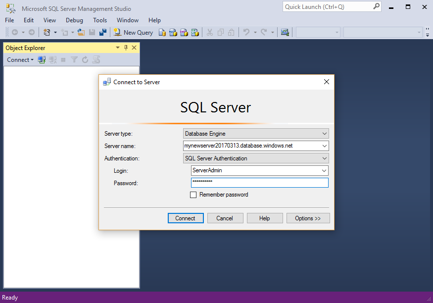

3. Click **Options** in the **Connect to server** dialog box. In the **Connect to database** section, enter **mySampleDatabase** to connect to this database.

     

4. Click **Connect**. The Object Explorer window opens in SSMS. 

5. In Object Explorer, expand **Databases** and then expand **mySampleDatabase** to view the objects in the sample database.

   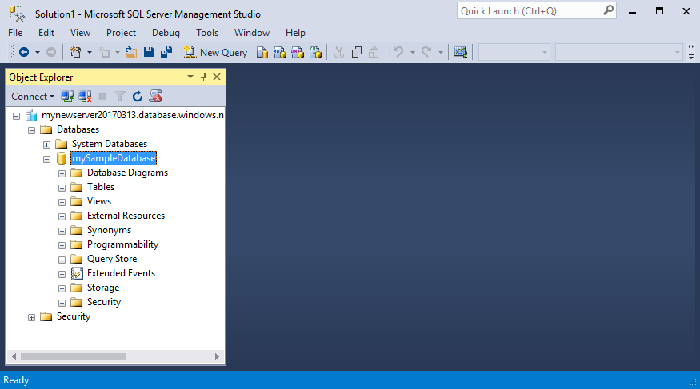  

## Change database properties

You can change the service tier, compute size, and compatibility level using SQL Server Management Studio. During the import phase, we recommend that you import to a higher service tier or compute size for best performance, but that you scale down after the import completes to save money until you are ready to actively use the imported database. Changing the compatibility level may yield better performance and access to the newest capabilities of the Azure SQL Database service. When you migrate an older database, its database compatibility level is maintained at the lowest supported level that is compatible with the database being imported. For more information, see [Improved query performance with compatibility Level 130 in Azure SQL Database](sql-database-compatibility-level-query-performance-130.md).

1. In Object Explorer, right-click **mySampleDatabase** and then click **New Query**. A query window opens connected to your database.

2. Execute the following command to set the service tier to **Standard** and the compute size to **S1**.

    ```sql
    ALTER DATABASE mySampleDatabase 
    MODIFY 
        (
        EDITION = 'Standard'
        , MAXSIZE = 250 GB
        , SERVICE_OBJECTIVE = 'S1'
    );
    ```

## Next steps 
In this tutorial you learned to:

> * Create an empty Azure SQL database in the Azure portal 
> * Create a server-level firewall in the Azure portal 
> * Use the [Data Migration Assistant](https://www.microsoft.com/download/details.aspx?id=53595) (DMA) to import your SQL Server database into the empty Azure SQL database 
> * Use [SQL Server Management Studio](https://docs.microsoft.com/sql/ssms/download-sql-server-management-studio-ssms) (SSMS) to change database properties.

Advance to the next tutorial to learn how to secure your database.

> [!div class="nextstepaction"]
> [Secure your Azure SQL Database](sql-database-security-tutorial.md).


