# Migrate your SQL Server database to Azure SQL Database

Moving your SQL Server database to Azure SQL Database is a three part process - you prepare, export and import the database. In this tutorial, you learn to:

> [!div class="checklist"]
> * Prepare a database in a SQL Server for migration to Azure SQL Database using the [Data Migration Assistant](https://www.microsoft.com/download/details.aspx?id=53595) (DMA)
> * Export the database to a BACPAC file
> * Import the BACPAC file into an Azure SQL Database

## Prerequisites

To complete this tutorial, make sure the following prerequisites are completed:

- The newest version of [SQL Server Management Studio](https://docs.microsoft.com/sql/ssms/download-sql-server-management-studio-ssms) (SSMS). Installing SSMS also installs the newest version of SQLPackage, a command-line utility that can be used to automate a range of database development tasks. 
- The [Data Migration Assistant](https://www.microsoft.com/download/details.aspx?id=53595) (DMA).
- A database to migrate. This tutorial uses the [SQL Server 2008R2 AdventureWorks OLTP database](https://msftdbprodsamples.codeplex.com/releases/view/59211) on an instance of SQL Server 2008R2 or newer, but you can use any database of your choice. To fix compatibility issues, use [SQL Server Data Tools](https://docs.microsoft.com/sql/ssdt/download-sql-server-data-tools-ssdt)

## Prepare for migration

You are ready to prepare for migration. Follow these steps to use the **[Data Migration Assistant](https://www.microsoft.com/download/details.aspx?id=53595)** to assess the readiness of your database for migration to Azure SQL Database.

1. Open the **Data Migration Assistant**. You can run DMA on any computer with connectivity to the SQL Server instance containing the database that you plan to migrate, you do not need to install it on the computer hosting the SQL Server instance.

     

2. In the left-hand menu, click **+ New** to create an **Assessment** project. Fill in the form with a **Project name** (all other values should be left at their default values) and click **Create**. The **Options** page opens.

     

3. On the **Options** page, click **Next**. The **Select sources** page opens.

     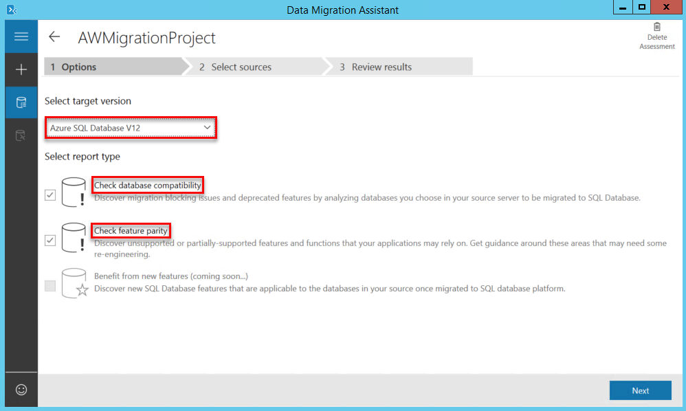 

4. On the **Select sources** page, enter the name of SQL Server instance containing the server you plan to migrate. Change the other values on this page if necessary. Click **Connect**.

     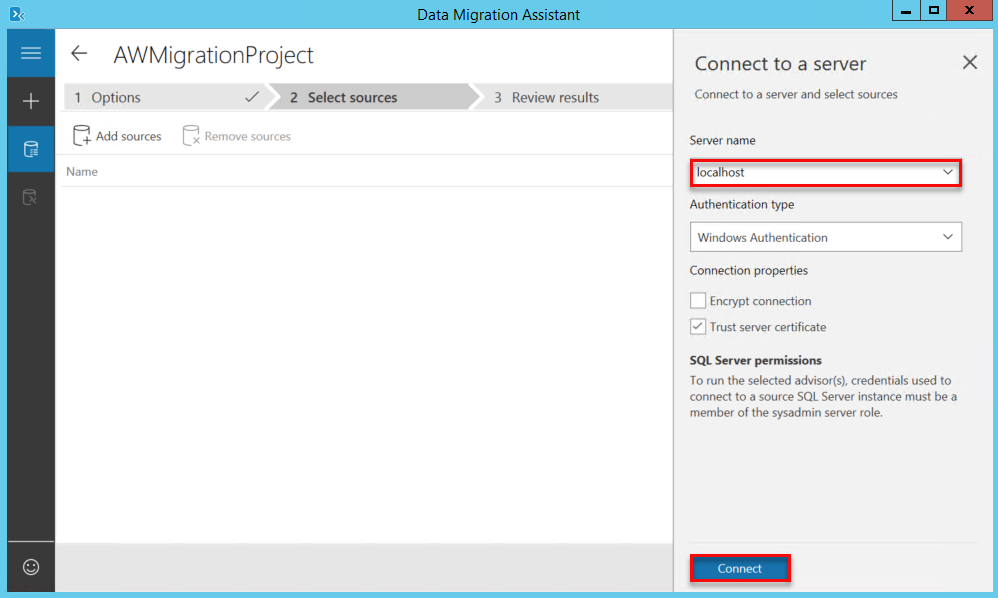

5. In the **Add sources** portion of the **Select sources** page, select the checkboxes for the databases to be tested for compatibility. Click **Add**.

     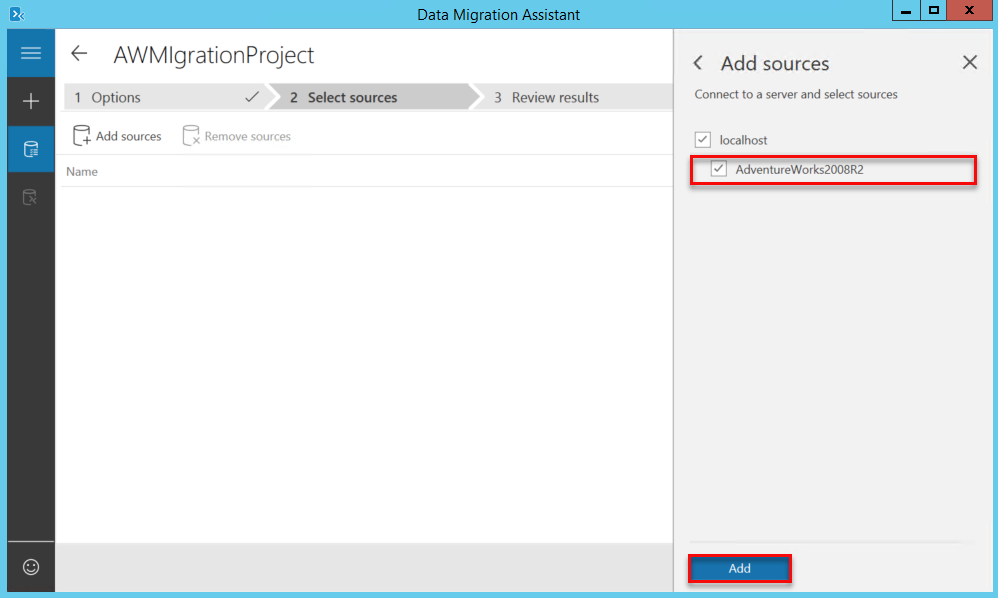

6. Click **Start Assessment**.

     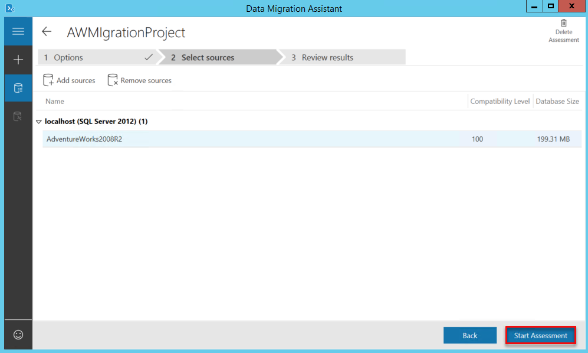

7. When the assessment completes, first look to see if the database is sufficiently compatible to migrate. Look for the checkmark in a green circle.

     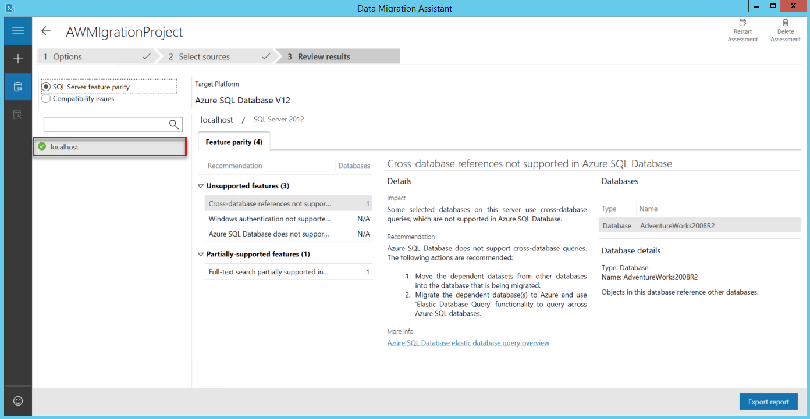

8. Review the results, beginning with **SQL Server feature parity**. Specifically review the information about unsupported and partially supported features, and the provided information about recommended actions. 

     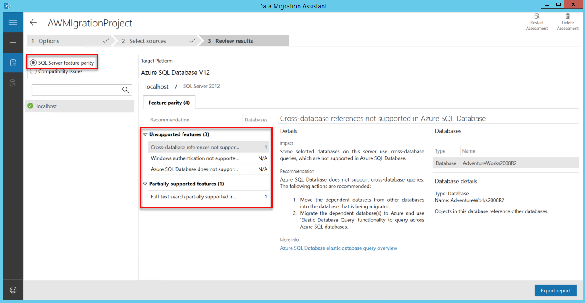

9. Click **Compatibility issues**. Specifically review the information about migration blockers, behavior changes, and deprecated features for each compatibility level. For the AdventureWorks2008R2 database, review the changes to Full-Text Search since SQL Server 2008 and the changes to SERVERPROPERTY('LCID') since SQL Server 2000. For details on these changes, links for more information is provided. Many search options and settings for Full-Text Search have changed 

   > [!IMPORTANT] 
   > After you migrate your database to Azure SQL Database, you can choose to operate the database at its current compatibility level (level 100 for the AdventureWorks2008R2 database) or at a higher level. For more information on the implications and options for operating a database at a specific compatibility level, see [ALTER DATABASE Compatibility Level](https://docs.microsoft.com/sql/t-sql/statements/alter-database-transact-sql-compatibility-level). See also [ALTER DATABASE SCOPED CONFIGURATION](https://docs.microsoft.com/sql/t-sql/statements/alter-database-scoped-configuration-transact-sql) for information about additional database-level settings related to compatibility levels.
   >

10. Optionally, click **Export report** to save the report as a JSON file.
11. Close the Data Migration Assistant.

## Export to BACPAC file 

A BACPAC file is a ZIP file with an extension of BACPAC containing the metadata and data from a SQL Server database. A BACPAC file can be stored in Azure blob storage or in local storage for archiving or for migration - such as from SQL Server to Azure SQL Database. For an export to be transactionally consistent, you must ensure either that no write activity is occurring during the export.

Follow these steps to use the SQLPackage command-line utility to export the AdventureWorks2008R2 database to local storage.

1. Open a Windows command prompt and change your directory to a folder in which you have the **130** version of SQLPackage - such as **C:\Program Files (x86)\Microsoft SQL Server\130\DAC\bin**.

2. Execute the following SQLPackage command at the command prompt to export the **AdventureWorks2008R2** database from **localhost** to **AdventureWorks2008R2.bacpac**. Change any of these values as appropriate to your environment.

    ```SQLPackage
    sqlpackage.exe /Action:Export /ssn:localhost /sdn:AdventureWorks2008R2 /tf:AdventureWorks2008R2.bacpac
    ```

    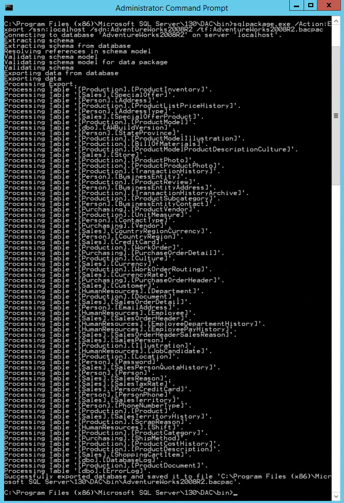

Once the execution is complete the generated BCPAC file is stored in the directory where the sqlpackage executable is located. In this example C:\Program Files (x86)\Microsoft SQL Server\130\DAC\bin. 

## Log in to the Azure portal

Log in to the [Azure portal](https://portal.azure.com/). Logging on from the computer from which you are running the SQLPackage command-line utility eases the creation of the firewall rule in step 5.

## Create a SQL Database logical server

An [Azure SQL Database logical server](sql-database-features.md) acts as a central administrative point for multiple databases. Follow these steps to create a SQL Database logical server to contain the migrated Adventure Works OLTP SQL Server database. 

1. Click the **New** button found on the upper left-hand corner of the Azure portal.

2. Type **server** in the search window on the **New** page, and select **SQL database (logical server)** from the filtered list.

    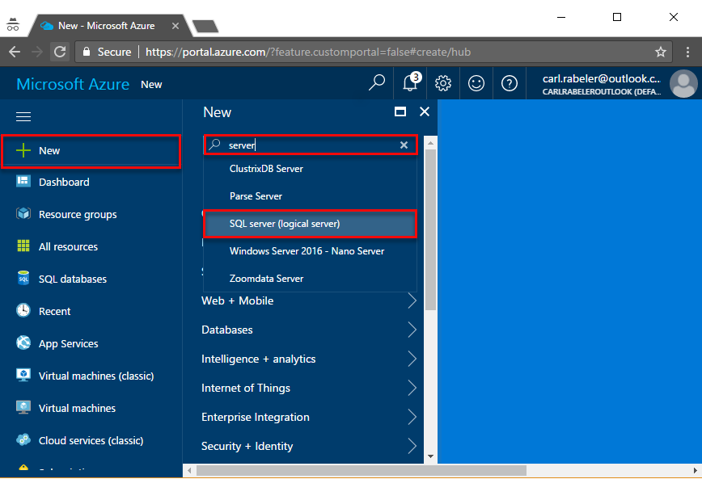

3. On the **Everything** page, click **SQL server (logical server)** and then click **Create** on the **SQL Server (logical server)** page.

    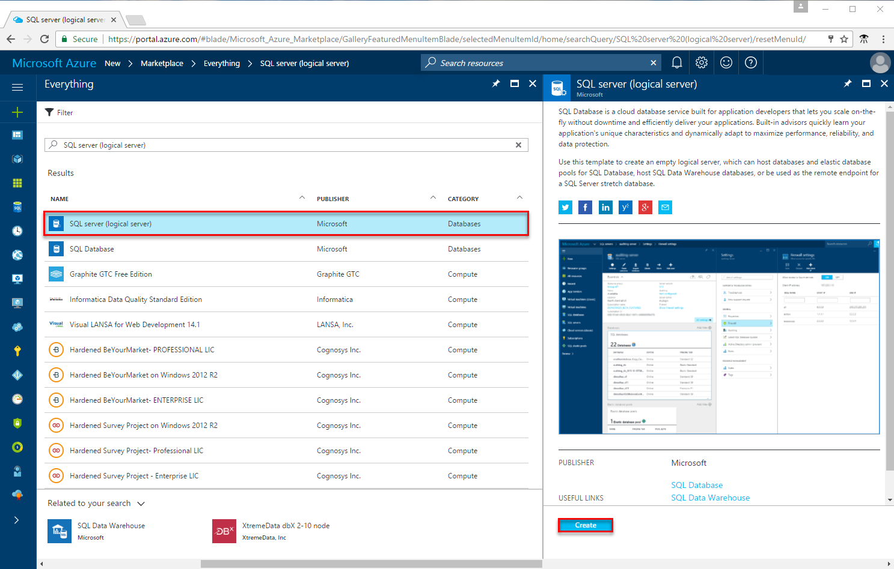

4. Fill out the SQL server (logical server) form with the following information, as shown on the preceding image:     

   | Setting       | Suggested value | Description | 
   | ------------ | ------------------ | ------------------------------------------------- | 
   | **Server name** | Any globally unique name | For valid server names, see [Naming rules and restrictions](https://docs.microsoft.com/azure/architecture/best-practices/naming-conventions). | 
   | **Server admin login** | Any valid name | For valid login names, see [Database Identifiers](https://docs.microsoft.com/en-us/sql/relational-databases/databases/database-identifiers). |
   | **Password** | Any valid password | Your password must have at least 8 characters and must contain characters from three of the following categories: upper case characters, lower case characters, numbers, and and non-alphanumeric characters. |
   | **Subscription** | Your subscription | For details about your subscriptions, see [Subscriptions](https://account.windowsazure.com/Subscriptions). |
   | **Resource group** | myResourceGroup | For valid resource group names, see [Naming rules and restrictions](https://docs.microsoft.com/azure/architecture/best-practices/naming-conventions). |
   | **Location** | Any valid location | For information about regions, see [Azure Regions](https://azure.microsoft.com/regions/). |

   

5. Click **Create** to provision the logical server. Provisioning takes a few minutes. 

## Create a server-level firewall rule

The SQL Database service creates a [firewall at the server-level](sql-database-firewall-configure.md) that prevents external applications and tools from connecting to the server or any databases on the server unless a firewall rule is created to open the firewall for specific IP addresses. Follow these steps to create a SQL Database server-level firewall rule for the IP address of the computer from which you are running the SQLPackage command-line utility. This enables SQLPackage to connect to the SQL Database logical server through the Azure SQL Database firewall. 

1. Click **All resources** from the left-hand menu and click your new server on the **All resources** page. The overview page for your server opens, showing you the fully qualified server name (such as **mynewserver20170403.database.windows.net**) and provides options for further configuration.

     

2. Click **Firewall** in the left-hand menu under **Settings** on the overview page. The **Firewall settings** page for the SQL Database server opens. 

3. Click **Add client IP** on the toolbar to add the IP address of the computer you are currently using and then click **Save**. A server-level firewall rule is created for this IP address.

     

4. Click **OK**.

You can now connect to all databases on this server using SQL Server Management Studio or another tool of your choice from this IP address using the server admin account created previously.

> [!NOTE]
> SQL Database communicates over port 1433. If you are trying to connect from within a corporate network, outbound traffic over port 1433 may not be allowed by your network's firewall. If so, you will not be able to connect to your Azure SQL Database server unless your IT department opens port 1433.
>

## Import BACPAC file to Azure SQL Database 

The newest versions of the SQLPackage command-line utility provide support for creating an Azure SQL database at a specified [service tier and performance level](sql-database-service-tiers.md). For best performance during import, select a high service tier and performance level and then scale down after import if the service tier and performance level is higher than you need immediately.

Follow these steps use the SQLPackage command-line utility to import the AdventureWorks2008R2 database to Azure SQL Database.

- Execute the following SQLPackage command at the command prompt to import the **AdventureWorks2008R2** database from local storage to the Azure SQL Database logical server that you previously created with a database name of **myMigratedDatabase**, a service tier of **Premium**, and a Service Objective of **P6**. Change any of these three values as appropriate to your environment.

    ```
    SqlPackage.exe /a:import /tcs:"Data Source=mynewserver20170403.database.windows.net;Initial Catalog=myMigratedDatabase;User Id=<change_to_your_admin_user_account>;Password=<change_to_your_password>" /sf:AdventureWorks2008R2.bacpac /p:DatabaseEdition=Premium /p:DatabaseServiceObjective=P6
    ```

   

> [!IMPORTANT]
> An Azure SQL Database logical server listens on port 1433. If you are attempting to connect to an Azure SQL Database logical server from within a corporate firewall, this port must be open in the corporate firewall for you to successfully connect.
>

## Connect using SQL Server Management Studio (SSMS)

Use SQL Server Management Studio to establish a connection to your Azure SQL Database server and newly migrated database. If you are running SQL Server Management Studio on a different computer from which you ran SQLPackage, create a firewall rule for this computer using the steps in the previous procedure.

1. Open SQL Server Management Studio.

2. In the **Connect to Server** dialog box, enter the following information:
   - **Server type**: Specify Database engine
   - **Server name**: Enter your fully qualified server name, such as **mynewserver20170403.database.windows.net**
   - **Authentication**: Specify SQL Server Authentication
   - **Login**: Enter your server admin account
   - **Password**: Enter the password for your server admin account
 
    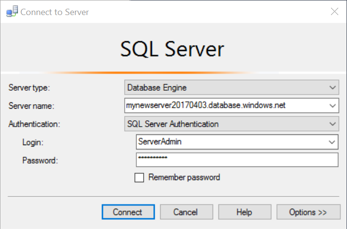

3. Click **Connect**. The Object Explorer window opens. 

4. In Object Explorer, expand **Databases** and then expand **myMigratedDatabase** to view the objects in the sample database.

## Change database properties

You can change the service tier, performance level, and compatibility level using SQL Server Management Studio.

1. In Object Explorer, right-click **myMigratedDatabase** and click **New Query**. A query window opens connected to your database.

2. Execute the following command to set the service tier to **Standard** and the performance level to **S1**.

    ```
    ALTER DATABASE myMigratedDatabase 
    MODIFY 
        (
        EDITION = 'Standard'
        , MAXSIZE = 250 GB
        , SERVICE_OBJECTIVE = 'S1'
    );
    ```

    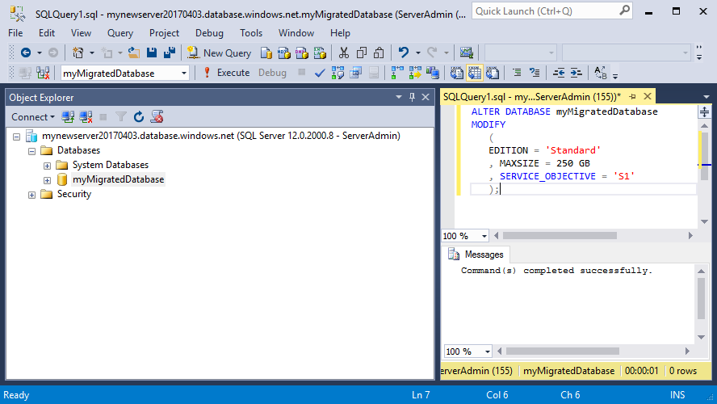

3. Execute the following command to change the database compatibility level to **130**.

    ```
    ALTER DATABASE myMigratedDatabase  
    SET COMPATIBILITY_LEVEL = 130;
    ```

   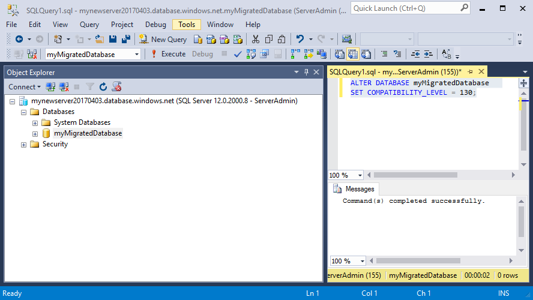

## Next steps 
In this tutorial you prepared, exported and imported your database. You learned to:

> [!div class="checklist"]
> * Prepare a database in a SQL Server for migration to Azure SQL Database
> * Export the database to a BACPAC file
> * Import the BACPAC file into an Azure SQL Database

Advance to the next tutorial to learn how to secure your database.

> [!div class="nextstepaction"]
> [Secure your Azure SQL Database](sql-database-security-tutorial.md).


