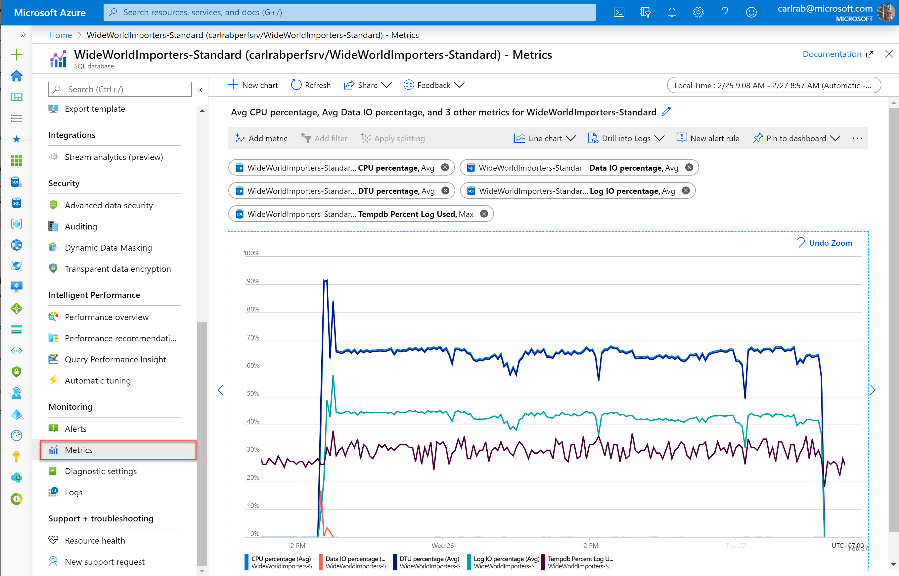

# Monitoring and performance tuning in Azure SQL Database

To monitor the performance of a database in Azure SQL Database, start by monitoring the CPU and IO resources used relative to the level of database performance you chose. To accomplish this, Azure SQL Database emits resource metrics that can be viewed in the Azure portal or by using SQL Server management tools, SQL Server Management Studio or Azure Data Studio.

Azure SQL Database provides a number of Database Advisors to provide intelligent performance tuning recommendations and automatic tuning options to improve performance for single and pooled databases. Additionally, Query Performance Insight shows you details about the queries responsible for the most CPU and IO usage  for single and pooled databases.

Azure SQL Database provides additional monitoring and tuning capabilities backed by artificial intelligence to assist you in troubleshooting and maximizing the performance of your databases and solutions. You can choose to configure the streaming export of these Intelligent Insights to one of several destinations for consumption and analysis.

## Monitoring and tuning capabilities enabled by default

Azure SQL Database has built-in resource monitoring, query tuning recommendations, query performance analysis, and automatic tuning capabilities.

### SQL Database resource monitoring

You can quickly monitor the following resource metrics in the Azure portal in the **Metrics** view:

- **DTU usage**

  Check to see if a database or elastic pool is reaching 100 percent of DTU usage for an extended period of time. High DTU usage indicates that your workload might need more CPU or IO resources. It might also indicate queries that need to be optimized.
- **CPU usage**

  Check to see if a database, elastic pool, or managed instance is reaching 100 percent of CPU usage for an extended period of time. High CPU indicates that your workload might need more CPU or IO resources. It might also indicate queries that need to be optimized.
- **IO usage**

  Check to see if a database, elastic pool, or managed instance is reaching the IO limits of the underlying storage. High IO usage indicates that your workload might need more CPU or IO resources. It might also indicate queries that need to be optimized.

  

### SQL Database Advisors

Azure SQL Database includes [Database Advisors](sql-database-advisor.md) that provide performance tuning recommendations for single and pooled databases. These recommendations are available in the Azure portal as well as by using PowerShell. You can also enable [automatic tuning](sql-database-automatic-tuning.md) so that SQL Database can automatically implement these tuning recommendations.

### Query Performance Insight

[Query Performance Insight](sql-database-query-performance.md) shows the performance in the Azure portal of top consuming and longest running queries for single and pooled databases.

## Monitoring capabilities in the SQL database engine

The built-in Azure capabilities described previously are built on top of [SQL Server Query Store](https://docs.microsoft.com/sql/relational-databases/performance/monitoring-performance-by-using-the-query-store). For these capabilities to work, Query Store must be enabled, which it is by default. The resource metrics displayed in Azure can also be queried directly using SQL Server Management Studio or Azure Data Studio.

In addition to the Query Store, the SQL database engine records server and database state information in [dynamic management views (DMVs)](https://docs.microsoft.com/sql/relational-databases/system-dynamic-management-views/system-dynamic-management-views). This information can a;sp be queried using SQL Server Management Studio or Azure Data Studio. You can use this information for advanced diagnostic troubleshooting and performance analysis.

## Generate intelligent assessments of performance issues

Azure SQL Database [Intelligent Insights](sql-database-intelligent-insights.md) uses built-in intelligence to continuously monitor database usage through artificial intelligence and detect disruptive events that cause poor performance. Once detected, a detailed analysis is performed that generates a resource log with an intelligent assessment of the issue. This assessment consists of a root cause analysis of the database performance issue and, where possible, recommendations for performance improvements.

Intelligent Insights is a unique capability of Azure built-in intelligence that provides the following value:

- Proactive monitoring
- Tailored performance insights
- Early detection of database performance degradation
- Root cause analysis of issues detected
- Performance improvement recommendations
- Scale out capability on hundreds of thousands of databases
- Positive impact to DevOps resources and the total cost of ownership

## Enable the streaming export metrics and resource logs

You can enable and configure the streaming export of diagnostic telemetry to one of several destinations. Use SQL Analytics and other capabilities to consume this additional diagnostic telemetry to identify and resolve performance problems.

You configure diagnostic settings to stream categories of metrics and resource logs for single databases, pooled databases, elastic pools, managed instances, and instance databases to one of the following Azure resources.

### Log Analytics workspace in Azure monitor

You can stream metrics and resource logs to a [Log Analytics workspace in Azure Monitor](../azure-monitor/platform/resource-logs-collect-workspace.md). Data streamed here can be consumed by [SQL Analytics](../azure-monitor/insights/azure-sql.md), which is a cloud only monitoring solution that provides intelligent monitoring of your databases that includes performance reports, alerts, and mitigation recommendations. Data streamed to a Log Analytics workspace can be analyzed with other monitoring data collected and also enables you to leverage other Azure Monitor features such as alerts and visualizations.

### Azure Event Hubs

You can stream metrics and resource logs to [Azure Event Hubs](../azure-monitor/platform/resource-logs-stream-event-hubs.md). Streaming diagnostic telemetry to event hubs to provide the following functionality:

- **Stream logs to 3rd party logging and telemetry systems**

  Stream all of your metrics and resource logs to a single event hub to pipe log data to a third-party SIEM or log analytics tool.
- **Build a custom telemetry and logging platform**

  The highly scalable publish-subscribe nature of event hubs allows you to flexibly ingest metrics and resource logs into a custom telemetry platform. See [Designing and Sizing a Global Scale Telemetry Platform on Azure Event Hubs](https://azure.microsoft.com/documentation/videos/build-2015-designing-and-sizing-a-global-scale-telemetry-platform-on-azure-event-Hubs/) for details.
- **View service health by streaming data to Power BI**

  Use Event Hubs, Stream Analytics, and Power BI to transform your diagnostics data into near real-time insights on your Azure services. See [Stream Analytics and Power BI: A real-time analytics dashboard for streaming data](https://docs.microsoft.com/azure/stream-analytics/stream-analytics-power-bi-dashboard) for details on this solution.

### Azure Storage

Stream metrics and resource logs to [Azure Storage](../azure-monitor/platform/resource-logs-collect-storage.md). Use Azure storage to archive vast amounts of diagnostic telemetry for a fraction of the cost of the previous two streaming options.

### Use extended events in the SQL database engine

Additionally, you can use [extended events](https://docs.microsoft.com/sql/relational-databases/extended-events/extended-events) in SQL for additional advanced monitoring and troubleshooting. The extended events architecture enables users to collect as much or as little data as is necessary to troubleshoot or identify a performance problem. For information about using extended events in SQL Database, see [Extended events in SQL Database](sql-database-xevent-db-diff-from-svr.md).

## Use SQL Analytics

Use [SQL Analytics](../azure-monitor/insights/azure-sql.md) to visualize key performance metrics with built-in intelligence for performance troubleshooting.

## Next steps
