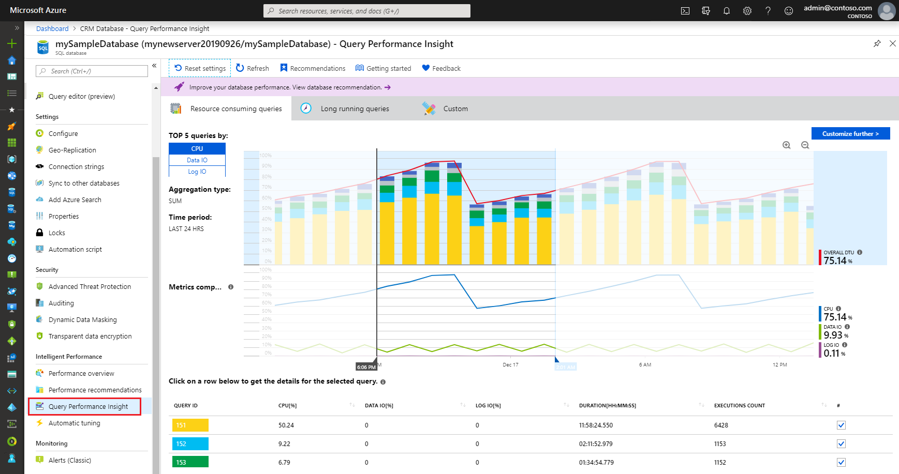

# Monitoring and performance tuning in Azure SQL Database

To monitor the performance of a database in Azure SQL Database, start by monitoring the CPU and IO resources used relative to the level of database performance you chose. To accomplish this, Azure SQL Database provides both built-in monitoring and performance tuning capabilities as well as additional capabilities to assist you in maximizing the performance of your databases and solutions.

Use the built-in performance tuning capabilities to determine the queries responsible for the most CPU and IO usage. Use the intelligent performance tuning recommendations and automatic tuning options to improve performance.

## Built-in capabilities

Azure SQL Database has built-in monitoring and tuning capabilities both within Azure and within the SQL database engine.

### Azure monitoring and tuning capabilities

The built-in monitoring and performance tuning capabilities in Azure enable you to:

- Monitor database resource usage
- Increase or decrease available resources (such as CPU, memory, and I/O)
- Identity the top resource consuming queries
- Identify the top long-running queries
- View service-provided tuning recommendations and tuning actions
- Enable and configure a number of automatic tuning capabilities

You can quickly monitor the following resources in the Azure portal:

- **DTU usage**: Check to see if the database is reaching 100 percent of DTU usage for an extended period of time. High DTU usage indicates that your workload might need more CPU or IO resources. It might also indicate queries that need to be optimized.
- **CPU usage**: Check to see if the database is reaching 100 percent of CPU usage for an extended period of time. High CPU indicates that your workload might need more CPU or IO resources. It might also indicate queries that need to be optimized.
- **IO usage**: Check to see if the database is reaching the IO limits of the underlying storage. High IO usage indicates that your workload might need more CPU or IO resources. It might also indicate queries that need to be optimized.

Additional resource usage can also be monitored using the Azure portal, but a deeper root cause analysis generally requires additional capabilities and skills.

### SQL database engine monitoring and tuning capabilities

The SQL database engine provides the following built-in capabilities:

- **Query Store**: Query Store is database feature that continuously collects and presents detailed historic information about all queries. Use Query Store in a wide set of scenarios when tracking and ensuring predictable workload performance is critical. For more information, see [Query Store Usage Scenarios](https://docs.microsoft.com/sql/relational-databases/performance/query-store-usage-scenarios).
- **Dynamic managed views**: The SQL database engine records server and database state information in [dynamic management views (DMVs)](https://docs.microsoft.com/sql/relational-databases/system-dynamic-management-views/system-dynamic-management-views). This information can be used to monitor the health of a SQL database instance, diagnose problems, and tune performance.

## Collecting additional diagnostic telemetry

For more advanced monitoring and tuning, you need to collect additional diagnostic telemetry.

### Stream diagnostic telemetry from within Azure to a selected destination

You can enable and configure the streaming export of diagnostic telemetry to one of several destinations. Use SQL Analytics and other capabilities to consume this additional diagnostic telemetry to identify and resolve performance problems.

You configure diagnostic settings to stream categories of metrics and platform logs for single databases, pooled databases, elastic pools, managed instances, and instance databases to one of the following Azure resources:

- [Log Analytics workspace in Azure Monitor](../azure-monitor/platform/resource-logs-collect-workspace.md): Data streamed here can be consumed by [SQL Analytics](../azure-monitor/insights/azure-sql.md), which is a cloud only monitoring solution that provides intelligent monitoring of your databases that includes performance reports, alerts, and mitigation recommendations. Data streamed to a Log Analytics workspace can be analyzed with other monitoring data collected and also enables you to leverage other Azure Monitor features such as alerts and visualizations
- [Azure Event Hubs](../azure-monitor/platform/resource-logs-stream-event-hubs.md): Streaming diagnostic telemetry to event hubs to provide the following functionality:

  - **Stream logs to 3rd party logging and telemetry systems**: Stream all of your platform logs to a single event hub to pipe log data to a third-party SIEM or log analytics tool.
  - **Build a custom telemetry and logging platform**: The highly scalable publish-subscribe nature of event hubs allows you to flexibly ingest platform logs into a custom telemetry platform. See [Designing and Sizing a Global Scale Telemetry Platform on Azure Event Hubs](https://azure.microsoft.com/documentation/videos/build-2015-designing-and-sizing-a-global-scale-telemetry-platform-on-azure-event-Hubs/) for details.
  - **View service health by streaming data to Power BI**: Use Event Hubs, Stream Analytics, and Power BI to transform your diagnostics data into near real-time insights on your Azure services. See [Stream Analytics and Power BI: A real-time analytics dashboard for streaming data](https://docs.microsoft.com/azure/stream-analytics/stream-analytics-power-bi-dashboard) for details on this solution.
- [Azure Storage](../azure-monitor/platform/resource-logs-collect-storage.md): Use Azure storage to archive vast amounts of diagnostic telemetry for a fraction of the cost of the previous two streaming options.

This diagnostic telemetry can be used to gauge resource utilization and query execution statistics for easier performance monitoring.

### Use extended events in the SQL database engine

Additionally, you can use [extended events](https://docs.microsoft.com/sql/relational-databases/extended-events/extended-events) in SQL for additional advanced monitoring and troubleshooting. The extended events architecture enables users to collect as much or as little data as is necessary to troubleshoot or identify a performance problem. For information about using extended events in SQL Database, see [Extended events in SQL Database](sql-database-xevent-db-diff-from-svr.md).

## Use the artificial intelligence in SQL Database

- Use [SQL Analytics](../azure-monitor/insights/azure-sql.md) to visualize key performance metrics with built-in intelligence for performance troubleshooting
- Use [Azure SQL Intelligent Insights](sql-database-intelligent-insights.md) to automatically monitor database performance. When a performance problem is detected, a diagnostic log is generated. The log provides details and a root cause analysis (RCA) of the problem. A performance-improvement recommendation is provided when possible.

## Next steps

- blah