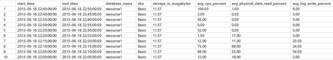
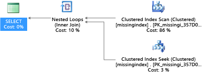
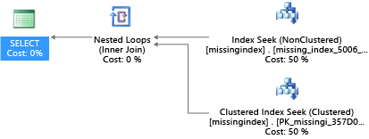
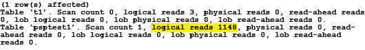
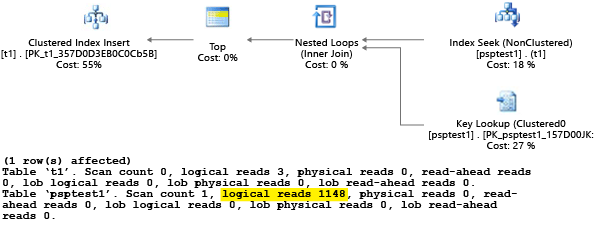
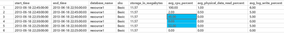

<properties
	pageTitle="Azure SQL Database performance guidance for single databases"
	description="This topic provides guidance to help you determine which service tier is right for your application and provides recommendations for tuning your application to get the most out of your Azure SQL Database."
	services="sql-database"
	documentationCenter="na"
	authors="carlrabeler"
	manager="jhubbard"
	editor="" />

<tags
	ms.service="sql-database"
	ms.devlang="na"
	ms.topic="article"
	ms.tgt_pltfrm="na"
	ms.workload="data-management"
	ms.date="06/30/2016"
	ms.author="carlrab" />

# Azure SQL Database performance guidance for single databases

## Overview

Microsoft Azure SQL Database has three [service tiers](sql-database-service-tiers.md), Basic, Standard, and Premium. All strictly isolate the resource provided to your Azure SQL Database and guarantee predictable performance. The throughput guaranteed for your database rises from Basic through Standard and then to Premium.

>[AZURE.NOTE] The Business and Web service tiers were retired September 2015. For more information, see [Web and Business Edition Sunset FAQ](https://msdn.microsoft.com/library/azure/dn741330.aspx). For detailed information on upgrading existing Web and Business databases to the new service tiers, see [Upgrade SQL Database Web/Business Databases to New Service Tiers](sql-database-upgrade-server-portal.md).

This paper provides guidance to help you determine which service tier is right for your application and provides recommendations for tuning your application to get the most out of your Azure SQL Database.

>[AZURE.NOTE] This article focuses on performance guidance for single databases in SQL Database. For performance guidance related to elastic database pools, see [Price and performance considerations for an elastic database pool](sql-database-elastic-pool-guidance.md). Note, however, that many tuning recommendations in this article for a single database can be applied to databases within an elastic pool with similar performance benefits.

**Authors:** Conor Cunningham, Kun Cheng, Jan Engelsberg

**Technical Reviewers:** Morgan Oslake, Joanne Marone, Keith Elmore, José Batista-Neto, Rohit Nayak

## Azure SQL Database background

To understand how the Basic, Standard, and Premium service tiers enhance the Azure SQL Database service, it helps to have a good overall understanding of Azure SQL Database. You can choose Azure SQL Database for several reasons. One reason is to avoid the lengthy cycle of purchasing and installing hardware. Azure SQL Database allows you to create and drop databases on-the-fly without waiting on a purchase order to be approved, machines to arrive, power and cooling to be upgraded, or installation to be done. Microsoft handles these challenges and greatly reduces the time required from idea to solution by pre-provisioning hardware based on aggregate demand in each of our data centers. This can save weeks or months for your business over buying and deploying hardware manually.

Microsoft also includes many automatic management features in Azure SQL Database such as automatic HA and built-in management.

### Automatic high-availability (HA)
 Azure SQL Database keeps at least three replicas for each user database and has logic to automatically commit each change synchronously to a quorum of the replicas. This guarantees that any single machine failure does not cause data loss. Furthermore, each replica is placed on different hardware racks so that loss of power or network switches does not impact your database. Finally, there is logic to automatically rebuild replicas if a machine is lost so that the system automatically preserves the desired health properties even if a machine becomes unhealthy. These mechanisms avoid the time-consuming process required today to install and configure high-availability solutions today. Having a pre-configured HA solution for your data removes another key headache from building a mission-critical database solution using traditional techniques.

### Built-in management
 Azure SQL Database is run as a service. This means that there are defined uptime targets for each database, avoiding lengthy maintenance downtime windows. Microsoft provides a single-vendor solution for the service, meaning there is only one company to call if there ever are any issues that arise. Microsoft is also continuously updating the service, adding features, capacity, and finding ways to improve your experience in each update we do. Updates happen transparently and without downtime windows, meaning that they are integrated into our normal HA failover mechanism. This allows you to immediately take advantage of new features whenever we announce their availability instead of waiting for a server to be upgraded during some future downtime window.

All of these capabilities are delivered in all service tiers, starting at a low entry price point of a few dollars per month. This is far lower than it would cost to buy and run your own server, meaning that even the smallest project can take advantage of Azure without spending a lot of money.

## What is different in the service tiers?
There are three service tiers: Basic, Standard, and Premium. Each service tier has one or more performance levels that provide power to run your databases in a predictable manner. The power is described in [Database Transaction Units (DTUs)](sql-database-technical-overview.md#understand-dtus).

The Basic service tier is designed to provide good performance predictability for each database hour over hour. The DTU of a Basic database is designed to provide sufficient resources for small databases without multiple concurrent requests to performance nicely.

The Standard service tier offers improved performance predictability and raises the bar for databases with multiple concurrent requests like workgroup and web applications. Using a Standard service tier database allows you to size your database application based on predictable performance minute over minute.

The marquee capability with regards to performance of the Premium service tier is the predictable performance second over second for each Premium database. Using the Premium service tier allows you to size your database application based on peak load for that database and removes cases where performance variance can cause small queries to take longer than expected in latency-sensitive operations. This model can greatly simplify the development and product validation cycles needed for applications that need to make strong statements about peak resource needs, performance variance, or query latency.

Similar to Standard, the Premium service tier offers the choice of different performance levels based on the desired isolation for a customer.

The performance level settings in Standard and Premium allow you to pay only for the capacity you need and to dial capacity up or down as a workload changes. For example, if your database workload is busy during the back-to-school shopping season, you might increase the performance level for the database during that time period and reduce it after that peak time window ends. This allows you to minimize what you pay by optimizing your cloud environment to the seasonality of your business. This model also works well for software product release cycles. A test team might allocate capacity while doing test runs and release that capacity once the tests are completed. These capacity requests fit well with the model that you would pay for capacity as you need it and avoid spending on dedicated resources that are rarely used. This gives you a performance experience much closer to the traditional, dedicated hardware model that many Microsoft customers have used with SQL Server. This should allow a greater set of applications to run more easily on Azure SQL Database.

For more information about the service tiers, performance levels, and DTUs, see [Azure SQL Database Service Tiers and Performance Levels](sql-database-service-tiers.md).

## Reasons to use the service tiers

While each workload can differ, the purpose of the service tiers is to provide high performance predictability at a variety of performance levels. They enable customers with a large scale of resource requirements for their databases to work in a more dedicated computing environment.

### Basic service tier use cases:

- **Getting started with Azure SQL Database**: Applications in development often don't need high performance levels. Basic databases provide an ideal environment of database development at a low price point.
- **Database with a single user**: Applications that associate a single user with a database normally don’t have high requirements concurrency and performance. For applications with these requirements are candidates for the Basic service tier.

### Standard service tier use cases:

- **Database with multiple concurrent requests**: Applications that service more than one user at a time, like websites with moderate traffic or departmental applications which require a bigger amount of resources are a good candidate for the Standard service tier.

### Premium service tier use cases:

- **High Peak Load**: An application that requires a lot of CPU, Memory, or IO to complete its operations. For example, if a database operation is known to consume several CPU cores for an extended period of time, this is a candidate for using Premium databases.
- **Many Concurrent Requests**: Some database applications service many concurrent requests for example when serving a website with high traffic volume. Basic and Standard service tiers have limits to the amount of concurrent requests. Applications requiring more connections would need to pick an appropriate reservation size to handle the maximum number of needed requests.
- **Low Latency**: Some applications need to guarantee a response from the database in minimal time. If a given stored procedure is called as part of a broader customer operation, there might be a requirement to return from that call in no more than 20 milliseconds 99% of the time. This kind of application will benefit from Premium databases to make sure that computing power is available.

The exact level you will need depends on the peak load requirements for each resource dimension. Some applications may use trivial amounts of one resource but have significant requirements in another.

For more information about the service tiers, see [Azure SQL Database Service Tiers and Performance Levels](sql-database-service-tiers.md).

## Billing and pricing information

Elastic database pools are billed per the following characteristics:

- An elastic pool is billed upon its creation, even when there are no databases in the pool.
- An elastic pool is billed hourly. This is the same metering frequency as for performance levels of single databases.
- If an elastic pool is resized to a new amount of eDTUs, then the pool is not billed according to the new amount of eDTUS until the resizing operation completes. This follows the same pattern as changing the performance level of standalone databases.

- The price of an elastic pool is based on the number of eDTUs of the pool. The price of an elastic pool is independent of the utilization of the elastic databases within it.
- Price is computed by (number of pool eDTUs)x(unit price per eDTU).

The unit eDTU price for an elastic pool is higher than the unit DTU price for a standalone database in the same service tier. For details, see [SQL Database pricing](https://azure.microsoft.com/pricing/details/sql-database/).  

## Service tier capabilities and limits
Each service tier and performance level is associated with different limits and performance characteristics. The following table describes these characteristics for a single database.

[AZURE.INCLUDE [SQL DB service tiers table](../../includes/sql-database-service-tiers-table.md)]

The following sections provide more information on each area in the previous table.

### Maximum database size

**Maximum database size** is simply the limit on the size of the database in GB.

### DTUs

**DTUs** refers to Database Transaction Units. It is the unit of measure in SQL Database that represents the relative power of databases based on a real-world measure: the database transaction. This consists of a set of operations that are typical for an online transaction processing (OLTP) request, measured by how many transactions could be completed per second under fully loaded conditions. To get more information about DTUs, see [Understand DTUs](sql-database-technical-overview.md#understand-dtus). For more information on how DTUs were measured, see [Benchmark overview](sql-database-benchmark-overview.md).

### Point-in-time restore

**Point-in-time restore** is the ability to restore your database to a previous point in time. Your service tier determines how many days back in time you can go. For more information, see [Point-in-Time Restore](sql-database-recovery-using-backups.md#point-in-time-restore).

### Disaster recovery

**Disaster recovery** refers to the ability to recover from an outage on your primary SQL database.

*Geo-restore* is available to all service tiers at no extra cost. In the event of an outage, you can use the most recent geo-redundant backup to restore your database to any Azure region.

[Active Geo-Replication](sql-database-geo-replication-overview.md) provides similar disaster recovery features but with a much lower Recovery Point Objective (RPO). For example, with Geo-restore, the RPO is less than one hour (in other words, the backup might be from up to one hour ago). But for Active Geo-Replication, the RPO is less than 5 seconds.

For more information, see the [Business Continuity Overview](sql-database-business-continuity.md).

### Max In-Memory OLTP storage
**Max In-Memory OLTP storage** refers to the maximum amount of storage available to the [In-Memory OLTP Preview](sql-database-in-memory.md) for Premium databases. This is also sometimes referred to as *XTP In-Memory storage*. You can use the Azure Classic Portal or the **sys.dm_db_resource_stats** view to monitor your In-Memory storage use. For more information on monitoring, see [Monitor In-Memory OLTP Storage](sql-database-in-memory-oltp-monitoring.md).

>[AZURE.NOTE] The In-Memory OLTP Preview is currently only supported for single databases and not for databases in elastic database pools.

### Max concurrent requests

**Max concurrent requests** is the maximum number of concurrent user/application requests executing at the same time in the database. To see the number of concurrent requests, run the following Transact-SQL query on your SQL database:

	SELECT COUNT(*) AS [Concurrent_Requests]
	FROM sys.dm_exec_requests R

If you are analyzing the workload of an on-premises SQL Server database, you should modify this query to filter on the specific database you are analyzing. For example, if you have an on-premises database named MyDatabase, the following Transact-SQL query will return the count of concurrent requests in that database.

	SELECT COUNT(*) AS [Concurrent_Requests]
	FROM sys.dm_exec_requests R
	INNER JOIN sys.databases D ON D.database_id = R.database_id
	AND D.name = 'MyDatabase'

Note that this is just a snapshot at a single point in time. To get a better understanding of your workload, you would have to collect many samples over time to understand your concurrent request requirements.

### Max concurrent logins

**Max concurrent logins** represents the limit on the number of users or applications attempting to login to the database at the same time. Note that even if these clients use the same connection string, the service authenticates each login. So if ten users all simultaneously connected to the database with the same username and password, there would be ten concurrent logins. This limit only applies to the duration of the login and authentication. So if the same ten users connected sequentially to the database, the number of concurrent logins would never be higher than one.

>[AZURE.NOTE] This limit does not currently apply to databases in elastic database pools.

There is no query or DMV that can show you concurrent login counts or history. You can analyze your user and application patterns to get an idea of the frequency of logins. You could also run real-world loads in a test environment to make sure that you are not hitting this or other limits described in this topic.

### Max sessions

**Max sessions** is the maximum number of concurrent open connections to the database. When a user logs in, a session is established and remains active until they logout or the session times out. To see your current number of active sessions, run the following Transact-SQL query on you SQL database:

	SELECT COUNT(*) AS [Sessions]
	FROM sys.dm_exec_connections

If you are analyzing an on-premises SQL Server workload, modify the query to focus on a specific database. This will help you to determine the possible session needs for that database if you were to move it to Azure SQL Database.

	SELECT COUNT(*)  AS [Sessions]
	FROM sys.dm_exec_connections C
	INNER JOIN sys.dm_exec_sessions S ON (S.session_id = C.session_id)
	INNER JOIN sys.databases D ON (D.database_id = S.database_id)
	WHERE D.name = 'MyDatabase'

Again, these queries return a point-in-time count, so collecting multiple samples over time gives you the best understanding of your session usage.

For SQL Database analysis, you can also query **sys.resource_stats** to get historical statistics on sessions using the **active_session_count** column. Move information is provided on using this view in the following monitoring section.

## Monitoring resource use
There are two views that enable you to monitor resource usage for a SQL database relative to its service tier:

- [sys.dm_db_resource_stats](https://msdn.microsoft.com/library/dn800981.aspx)
- [sys.resource_stats](https://msdn.microsoft.com/library/dn269979.aspx)

>[AZURE.NOTE] It is also possible to use the Azure Classic Portal to view resource utilization. For an example, see [Service tiers - Monitoring performance](sql-database-service-tiers.md#monitoring-performance).

### Using sys.dm_db_resource_stats
The [sys.dm_db_resource_stats](https://msdn.microsoft.com/library/dn800981.aspx) view exists in each SQL database and supplies recent resource utilization data relative to the service tier. Average percentages for CPU, data IO, log writes, and memory are recorded every 15 seconds and are maintained for one hour.

Because this view provides a more granular look at resource utilization, you should first use **sys.dm_db_resource_stats ** for any current-state analysis or troubleshooting. For example, the following query show the average and maximum resource utilization for the current database over the last hour:

	SELECT  
	    AVG(avg_cpu_percent) AS 'Average CPU Utilization In Percent',
	    MAX(avg_cpu_percent) AS 'Maximum CPU Utilization In Percent',
	    AVG(avg_data_io_percent) AS 'Average Data IO In Percent',
	    MAX(avg_data_io_percent) AS 'Maximum Data IO In Percent',
	    AVG(avg_log_write_percent) AS 'Average Log Write Utilization In Percent',
	    MAX(avg_log_write_percent) AS 'Maximum Log Write Utilization In Percent',
	    AVG(avg_memory_usage_percent) AS 'Average Memory Usage In Percent',
	    MAX(avg_memory_usage_percent) AS 'Maximum Memory Usage In Percent'
	FROM sys.dm_db_resource_stats;  

For other queries, see the examples in [sys.dm_db_resource_stats](https://msdn.microsoft.com/library/dn800981.aspx).

### Using sys.resource_stats

The [sys.resource_stats](https://msdn.microsoft.com/library/dn269979.aspx) view in the **master** database provides additional information for monitoring the performance use of your SQL database within its specific service tier and performance level. The data is collected every five minutes and maintained for approximately 35 days. This view is more useful for longer-term historical analysis of your SQL database resource utilization.

The following graph shows the CPU resource utilization for Premium database with P2 performance level for each hour in a week. This particular graph starts on a Monday, showing 5 work days and then a weekend where much less happens on the application.

From the data, this database currently has peak CPU load of just over 50% CPU utilization relative to the P2 performance level (mid-day on Tuesday). If CPU was the dominant factor in the application’s resource profile, then you may decide that the P2 is the right performance level to guarantee that the workload always fits. If an application expects growth over time, then it makes sense to allow for some extra resource buffer so that the application does not ever hit the ceiling. This will help avoid customer-visible errors caused by the database not having enough power to process requests effectively, especially in latency-sensitive environments (like a database supporting an application that paints web pages based on the results of database calls).

It is worth noting that other application types may interpret the same graph differently. For example, if an application tried to process payroll data each day and had the same chart, this kind of "batch job" model might do just fine in a P1 performance level. The P1 performance level has 100 DTUs compared to the 200 DTUs of the P2 performance level. That means that the P1 performance level provides half the performance of the P2 performance level. So 50% of CPU utilization in P2 equals 100% CPU utilization in P1. As long as the application does not have timeouts, it may not matter if a big job takes 2 hours or 2.5 hours to complete as long as it gets done today. An application in this category can probably just use a P1 performance level. You can take advantage of the fact that there are periods of time during the day where resource usage is lower, meaning that any "big peak" might spill over into one of the troughs later in the day. The P1 performance level might be great for such an application (and save it money) as long as the jobs can complete on-time each day.

Azure SQL Database exposes consumed resource information for each active database in the **sys.resource_stats** view of the **master** database in each server. The data in the table is aggregated for 5 minute intervals. With the Basic, Standard, and Premium service tiers, the data can take greater than 5 minutes to appear in the table, meaning this data is better for historical rather than near-real-time analysis. Querying the **sys.resource_stats** view shows the recent history of a database to validate whether the reservation picked delivered the desired performance when needed.

>[AZURE.NOTE] You must be connected to the **master** database of your logical SQL Database server in order to query **sys.resource_stats** in the following examples.

The following example demonstrates how the data in this view is exposed:

	SELECT TOP 10 *
	FROM sys.resource_stats
	WHERE database_name = 'resource1'
	ORDER BY start_time DESC

The following example demonstrate different ways that you can understand the resource utilization of your SQL database by using the **sys.resource_stats** catalog view.

>[AZURE.NOTE] Some of the columns of **sys.resource_stats** have changed in current V12 databases, so the sample queries in the following examples might generate errors. Future updates to this topic will provide new versions of the queries that addresses this issue.

1. For example, to look at past week’s resource usage for database, "userdb1", you can run following query.

		SELECT *
		FROM sys.resource_stats
		WHERE database_name = 'userdb1' AND
		      start_time > DATEADD(day, -7, GETDATE())
		ORDER BY start_time DESC;

2. In order to evaluate how well your workload fits into the performance level, you have to drill down at each different aspect of the resource metrics: CPU, reads, write, number of workers, and number of sessions. Here is a revised query using sys.resource_stats to report the average as well as maximum values of these resource metrics.

		SELECT
		    avg(avg_cpu_percent) AS 'Average CPU Utilization In Percent',
		    max(avg_cpu_percent) AS 'Maximum CPU Utilization In Percent',
		    avg(avg_data_io_percent) AS 'Average Physical Data IO Utilization In Percent',
		    max(avg_data_io_percent) AS 'Maximum Physical Data IO Utilization In Percent',
		    avg(avg_log_write_percent) AS 'Average Log Write Utilization In Percent',
		    max(avg_log_write_percent) AS 'Maximum Log Write Utilization In Percent',
		    avg(max_session_percent) AS 'Average % of Sessions',
		    max(max_session_percent) AS 'Maximum % of Sessions',
		    avg(max_worker_percent) AS 'Average % of Workers',
		    max(max_worker_percent) AS 'Maximum % of Workers'
		FROM sys.resource_stats
		WHERE database_name = 'userdb1' AND start_time > DATEADD(day, -7, GETDATE());

3. With the above information of average and maximum values of each resource metric, you can assess how well your workload fits into the performance level you chose. In most cases, average values from sys.resource_stats give you a good baseline to use against the target size. It should be your primary measurement stick. For example, if you are using the Standard service tier with S2 performance level, the average utilization percentages for CPU, reads and writes are below 40%, the average number of workers is below 50 and the average number of session is below 200, your workload might fit into the S1 performance level. It is easy to see if your database fits within the worker and session limits. To see if a database fits into a lower performance level with regards to CPU, reads and writes, you divide the DTU number of the lower performance level by the DTU number of your current performance level and multiply the result by 100:

	**S1 DTU / S2 DTU * 100 = 20 / 50 * 100 = 40**

	The result is the relative performance difference between the two performance levels in percent. If your utilization is not exceeding this percentage, your workload might fit into the lower performance level. However, you need to look at all ranges of resource usage values as well and determine, percentage wise, how often your database workload would fit into the lower performance level. The following query outputs the fit percentage per resource dimension, based on the threshold of 40% calculated above.

		SELECT
		    (COUNT(database_name) - SUM(CASE WHEN avg_cpu_percent >= 40 THEN 1 ELSE 0 END) * 1.0) / COUNT(database_name) AS 'CPU Fit Percent'
		    ,(COUNT(database_name) - SUM(CASE WHEN avg_log_write_percent >= 40 THEN 1 ELSE 0 END) * 1.0) / COUNT(database_name) AS 'Log Write Fit Percent'
		    ,(COUNT(database_name) - SUM(CASE WHEN avg_data_io_percent >= 40 THEN 1 ELSE 0 END) * 1.0) / COUNT(database_name) AS 'Physical Data IO Fit Percent'
		FROM sys.resource_stats
		WHERE database_name = 'userdb1' AND start_time > DATEADD(day, -7, GETDATE());

	Based on your database service level objective (SLO), you can decide if your workload fits into the lower performance level. If your database workload SLO is 99.9% and the query above returns values greater than 99.9 for all three resource dimensions, your workload is very likely to fit into the lower performance level.

	Looking at the fit percentage also gives you insights into whether you have to move to the next higher performance level to meet your SLO. For example, "userdb1" shows the following utilization for the past week.

	| Average CPU Percent | Maximum CPU Percent |
	|---|---|
	| 24.5 | 100.00 |

	Average CPU is about a quarter of the limit of the performance level, which would fit nicely into the performance level of the database. However the maximum value shows that the database reaches the limit of the performance level. Do you need to move to the next higher performance level? Again you have to look at how many times your workload reaches 100% and compare it to your database workload SLO.

		SELECT
		(COUNT(database_name) - SUM(CASE WHEN avg_cpu_percent >= 100 THEN 1 ELSE 0 END) * 1.0) / COUNT(database_name) AS 'CPU Fit Percent'
		,(COUNT(database_name) - SUM(CASE WHEN avg_log_write_percent >= 100 THEN 1 ELSE 0 END) * 1.0) / COUNT(database_name) AS 'Log Write Fit Percent’
		,(COUNT(database_name) - SUM(CASE WHEN avg_data_io_percent >= 100 THEN 1 ELSE 0 END) * 1.0) / COUNT(database_name) AS 'Physical Data IO Fit Percent'
		FROM sys.resource_stats
		WHERE database_name = 'userdb1' AND start_time > DATEADD(day, -7, GETDATE());

	If the query above returns a value less than 99.9 for any of the three resource dimensions, you should consider either moving to the next higher performance level or use application tuning techniques to reduce the load on the Azure SQL Database.

4. The above exercise should also take into account your projected workload increase in the future.

## Tuning your application

In traditional on-premises SQL Server, the process of doing initial capacity planning is often separated from the process of running an application in production. In other words, the purchase of hardware and the associated licenses to run SQL Server are done up-front, while performance tuning is done afterwards. When using Azure SQL Database, it is generally recommended (and, because you are billed each month, likely desirable) to interleave the process of running and tuning an application. The model of paying for capacity on-demand allows you to tune your application to use the minimum resources needed right now instead of massively overprovisioning on hardware based on guesses of the future growth plans for an application (which are often incorrect since they have to predict far into the future). Note that some customers might decide to not tune an application and instead choose to over-provision hardware resources. This approach might make sense when you do not want to change a key application during a busy period for the application. Tuning an application can minimize resource requirements and lower monthly bills when using the service tiers in Azure SQL Database.

### Application characteristics

While the service tiers are designed to improve performance stability and predictability for an application, there are some best practices for tuning your application to better take advantage of the feature. While many applications will see significant performance gains simply by switching to a higher performance level and or service tier, not all applications may benefit as much without additional tuning. Applications that have the following characteristics should also consider additional application tuning to further improve performance when using Azure SQL Database.

- **Applications that have slow performance due to "chatty" behavior**: This includes applications that make excessive data access operations that are sensitive to network latency. Such applications may require modification to reduce the number of data access operations to the Azure SQL Database. For example, the application may be improved by using techniques such as batching ad-hoc queries together or moving the queries to stored procedures. For more information, see the section 'Batching Queries' that follows.
- **Databases with an intensive workload that can't be supported by an entire single machine**: Databases that exceed the resources of the highest Premium performance level are not good candidates. These databases may benefit from scaling out the workload. For more information, see the sections 'Cross-database Sharding' and 'Functional Partitioning' that follow.
- **Applications that contain nonoptimal queries**: Applications, especially in the data access layer, that have poorly tuned queries may not benefit from choosing a higher performance level as expected. This includes queries that lack a WHERE clause, have missing indexes, or have outdated statistics. These applications will benefit from standard query performance tuning techniques. For more information, see the sections 'Missing Indexes' and 'Query Tuning/Hinting' that follow.
- **Applications that have nonoptimal data access design**: Applications that have inherent data access concurrency issues, for example deadlocking, may not benefit from choosing a higher performance level. Application developers should consider reducing roundtrips against the Azure SQL Database by caching data on the client side by using the Azure Caching service or other caching technologies. See the Application tier caching section that follows.

## Tuning techniques
This section explains some techniques that you can use to tune Azure SQL Database to gain the best performance out of your application and be able to run in the smallest possible performance level. A number of the techniques match traditional SQL Server tuning best practices, but some techniques are specific to Azure SQL Database. In some cases, traditional SQL Server techniques can be extended to also work on Azure SQL Database by examining the consumed resources for a database to find areas to further tune.

### Query Performance Insight and SQL Database Advisor
SQL Database provides two tools in the Azure Portal for analyzing and fixing performance issues with your database:

- [Query Performance Insight](sql-database-query-performance.md)
- [SQL Database Advisor](sql-database-advisor.md)

Refer to the previous links for more information about each tool and how to use them. The two following sections on missing indexes and query tuning provide other ways to manually find and correct similar performance issues. We recommend that you first try the tools in the portal to more efficiently diagnose and correct problems. Use the manual tuning approach for special cases.

### Missing indexes
A common problem in OLTP database performance relates to the physical database design. Often database schemas are designed and shipped without testing at scale (either in load or in data volume). Unfortunately, the performance of a query plan may be acceptable at small scale but may degrade substantially when faced with production-level data volumes. The most common source of this issue is due to the lack of appropriate indexes to satisfy filters or other restrictions in a query. Often, this manifests as a table scan when an index seek could suffice.

The following example creates a case where the selected query plan contains a scan when a seek would suffice.

	DROP TABLE dbo.missingindex;
	CREATE TABLE dbo.missingindex (col1 INT IDENTITY PRIMARY KEY, col2 INT);
	DECLARE @a int = 0;
	SET NOCOUNT ON;
	BEGIN TRANSACTION
	WHILE @a < 20000
	BEGIN
	    INSERT INTO dbo.missingindex(col2) VALUES (@a);
	    SET @a += 1;
	END
	COMMIT TRANSACTION;
	GO
	SELECT m1.col1
	FROM dbo.missingindex m1 INNER JOIN dbo.missingindex m2 ON(m1.col1=m2.col1)
	WHERE m1.col2 = 4;

Azure SQL Database contains functionality to help hint database administrators on how to find and fix common missing index conditions. Dynamic management views (DMVs) built into Azure SQL Database look at query compilation where an index would significantly reduce the estimated cost to run a query. During query execution, it tracks how often each query plan is executed as well as the estimated gap between the executing query plan and the imagined one where that index existed. This allows a database administrator to quickly guess which physical database design changes might improve the overall workload cost for a given database and its real workload.

>[AZURE.NOTE] Before using the DMVs to find missing indexes, first review the section on [Query Performance Insight and SQL Database Advisor](#query-performance-insight-and-index-advisor).

The following query can be used to evaluate potential missing indexes.

	SELECT CONVERT (varchar, getdate(), 126) AS runtime,
	    mig.index_group_handle, mid.index_handle,
	    CONVERT (decimal (28,1), migs.avg_total_user_cost * migs.avg_user_impact *
	            (migs.user_seeks + migs.user_scans)) AS improvement_measure,
	    'CREATE INDEX missing_index_' + CONVERT (varchar, mig.index_group_handle) + '_' +
	              CONVERT (varchar, mid.index_handle) + ' ON ' + mid.statement + '
	              (' + ISNULL (mid.equality_columns,'')
	              + CASE WHEN mid.equality_columns IS NOT NULL
	                          AND mid.inequality_columns IS NOT NULL
	                     THEN ',' ELSE '' END + ISNULL (mid.inequality_columns, '')
	              + ')'
	              + ISNULL (' INCLUDE (' + mid.included_columns + ')', '') AS create_index_statement,
	    migs.*,
	    mid.database_id,
	    mid.[object_id]
	FROM sys.dm_db_missing_index_groups AS mig
	INNER JOIN sys.dm_db_missing_index_group_stats AS migs
	    ON migs.group_handle = mig.index_group_handle
	INNER JOIN sys.dm_db_missing_index_details AS mid
	    ON mig.index_handle = mid.index_handle
	ORDER BY migs.avg_total_user_cost * migs.avg_user_impact * (migs.user_seeks + migs.user_scans) DESC

In this example, it suggested the following index.

	CREATE INDEX missing_index_5006_5005 ON [dbo].[missingindex] ([col2])  

Once created, that same SELECT statement now picks a different plan that uses a seek instead of a scan, executing more efficiently as shown in the following query plan.

The key insight is that the IO capacity of a shared, commodity system is generally more limited than a dedicated server machine. As such, there is a premium on minimizing unnecessary IO to take maximal advantage of the system within the DTU of each performance level of the service tiers in Azure SQL Database. Appropriate physical database design choices can significantly improve the latency for individual queries, the throughput of concurrent requests you can handle per scale unit, and minimize the costs required to satisfy the query. For more information about the missing index DMVs, see [sys.dm_db_missing_index_details](https://msdn.microsoft.com/library/ms345434.aspx).

### Query tuning/hinting
The Query Optimizer within Azure SQL Database is very similar to the traditional SQL Server Query Optimizer. Many of the best practices for tuning queries and understanding the reasoning model limitations for the Query Optimizer apply to Azure SQL Database as well. Tuning queries in Azure SQL Database can have the added benefit of reducing the aggregate resource demands and allow an application to run at lower cost than an un-tuned equivalent because it can run in a lower performance level.

One common example seen in SQL Server that also applies to Azure SQL Database relates to how parameters are "sniffed" during compilation to try to create a more optimal plan. Parameter sniffing is a process by with the query optimizer considers the current value of a parameter when compiling a query in the hopes of generating a more optimal query plan. While this strategy can often lead to a query plan that is significantly faster than a plan compiled without knowledge of parameter values, the current SQL Server/Azure SQL Database behavior is imperfect – there are cases when the parameter is not sniffed, and there are cases where the parameter is sniffed but the generated plan is suboptimal for the full set of parameter values in a workload. Microsoft includes query hints (directives) to allow you to specify intent more deliberately and override the default behavior for parameter sniffing. Often, using hints can fix cases where the default SQL Server/Azure SQL Database behavior is imperfect for a given customer workload.

The following example demonstrates how the query processor can generate a plan that is sub-optimal for both performance and resource requirements and how using a query hint can reduce query run-time and resource requirements on Azure SQL Database.

The following is an example setup.

	DROP TABLE psptest1;
	CREATE TABLE psptest1(col1 int primary key identity, col2 int, col3 binary(200));

	DECLARE @a int = 0;
	SET NOCOUNT ON;
	BEGIN TRANSACTION
	WHILE @a < 20000
	BEGIN
	    INSERT INTO psptest1(col2) values (1);
	    INSERT INTO psptest1(col2) values (@a);
	    SET @a += 1;
	END
	COMMIT TRANSACTION
	CREATE INDEX i1 on psptest1(col2);
	GO

	CREATE PROCEDURE psp1 (@param1 int)
	AS
	BEGIN
	    INSERT INTO t1 SELECT * FROM psptest1
	    WHERE col2 = @param1
	    ORDER BY col2;
	END
	GO

	CREATE PROCEDURE psp2 (@param2 int)
	AS
	BEGIN
	    INSERT INTO t1 SELECT * FROM psptest1 WHERE col2 = @param2
	    ORDER BY col2
	    OPTION (OPTIMIZE FOR (@param2 UNKNOWN))
	END
	GO

	CREATE TABLE t1 (col1 int primary key, col2 int, col3 binary(200));
	GO

The setup code creates a table that contains skewed data distribution. The optimal query plan differs based on which parameter is being selected. Unfortunately, the plan caching behavior does not always recompile the query based on the most common parameter value, meaning that it is possible for a suboptimal plan to be cached and used for many values, even when a different plan would be a better average plan choice. It then creates two stored procedures which are identical except one contains a special query hint (reasoning explained below).

**Example (part 1):**

	-- Prime Procedure Cache with scan plan
	EXEC psp1 @param1=1;
	TRUNCATE TABLE t1;

	-- Iterate multiple times to show the performance difference
	DECLARE @i int = 0;
	WHILE @i < 1000
	BEGIN
	    EXEC psp1 @param1=2;
	    TRUNCATE TABLE t1;
	    SET @i += 1;
	END

**Example (part 2 – please wait 10 minutes before trying this part so that it is obviously different in the resulting telemetry data):**

	EXEC psp2 @param2=1;
	TRUNCATE TABLE t1;

	DECLARE @i int = 0;
	WHILE @i < 1000
	BEGIN
	    EXEC psp2 @param2=2;
	    TRUNCATE TABLE t1;
	    SET @i += 1;
	END

Each part of this example attempts to run a parameterized insert statement 1000 times (to generate sufficient load to be interested on a test data set). When executing stored procedures, the query processor examines the parameter value passed to the procedure during its first compilation (known as parameter "sniffing"). The resulting plan is cached and used for later invocations, even if the parameter value is different. As a result, the optimal plan may not be used in all cases. Sometimes customers need to guide the optimizer to pick a plan that is better for the average case rather than the specific case when the query was first compiled. In this example, the initial plan will generate a "scan" plan which reads all rows to find each value that matches the parameter.

Because we executed the procedure with the value 1, the resulting plan was optimal for 1 but sub-optimal for all other values in the table. The resulting behavior is likely not the desired behavior if you pick each plan randomly, as the plan will perform more slowly and take more resources to execute.

Running the test with "SET STATISTICS IO ON" shows the logical scan work done in this example under the covers – you can see that there are 1148 reads done by the plan (which is inefficient if the average case is to return just one row).

The second part of the example uses a query hint to tell the optimizer to use a specific value during the compilation process. In this case, it forces the query processor to ignore the value passed as the parameter and instead to assume an "UNKNOWN”, meaning a value that has the average frequency in the table (ignoring skew). The resulting plan is a seek based plan which will be faster and use fewer resources, on average, than the plan from part 1 of the example.

The impact of this can be seen by examining the **sys.resource_stats** table (Note: there will be a delay from the time that you execute the test to the time where the data is populated into the table). For this example, part 1 executed during the 22:25:00 time window and part 2 was executed 22:35:00. Note that the earlier time window used more resources in that time window than the later one (due to plan efficiency improvements).

	SELECT TOP 1000 *
	FROM sys.resource_stats
	WHERE database_name = 'resource1'
	ORDER BY start_time DESC

>[AZURE.NOTE] While the example used here is purposefully small, the impact of suboptimal parameters can be substantial, especially on larger databases. The difference, in extreme cases, can be between seconds and hours for the fast and slow cases.

You can examine **sys.resource_stats** to determine whether the resource for a given test uses more or less resources than another test. When comparing data, separate tests by enough time that they are not grouped together in the same 5-minute time window in the **sys.resource_stats** view. Furthermore, note that the goal of the exercise is to minimize total resources used, not to minimize the peak resources per se. Generally, optimizing a piece of code for latency will also reduce resource consumption. Make sure that the changes considered in any application are actually needed and do not negatively impact the customer experience for anyone using an application when using query hints.

If a workload contains a set of repeating queries, it often makes sense to capture and validate the optimality of those plan choices since it will likely drive the minimum resource size unit required to host the database. Once validated, occasional re-examination of those plans can make sure that they have not degraded. For more information about query hints, see [Query Hints (Transact-SQL)](https://msdn.microsoft.com/library/ms181714.aspx).

### Cross-database sharding
Because Azure SQL Database runs on commodity hardware, there are generally lower capacity limits for a single database than in a traditional on-premises SQL Server installation. So, there are a number of customers that use sharding techniques to spread database operations over multiple databases when they do not fit into the limits for a single database in Azure SQL Database. Most customers using sharding techniques today on Azure SQL Database split their data on a single dimension across multiple databases. The approach involves understanding that often OLTP applications perform transactions that only apply to one row or a small group of rows within the schema.

>[AZURE.NOTE] SQL Database now provides a library to assist with sharding. For more information, see [Elastic Database client library overview](sql-database-elastic-database-client-library.md).

For example, if a database contains customer, order, and order details (as seen in the traditional example Northwind database shipped in SQL Server), then this data could be split into multiple databases by grouping a customer with the related order and order detail information and guaranteeing it stays within a single database. The application would split different customers across databases, effectively spreading the load across multiple databases. This allows customers not only to avoid the maximum database size limit, but it also allows Azure SQL Database to process workloads that are significantly larger than the limits of the different performance levels so long as each individual database fits into its DTU.

While database sharding does not reduce the aggregate resource capacity for a solution, this technique is highly effective to support very large solutions spread over multiple databases and allows for each database to run in a different performance level to support very large "effective" databases with high resource requirements.

### Functional partitioning
SQL Server users often combine many functions within a single database. For example, if an application contains logic to manage inventory for a store, that database might contain logic associated with inventory, tracking purchase orders, stored procedures and indexed/materialized views that managed end-of-month reporting, and other functions. This technique gives the benefit of being able to easily administer the database for operations such as BACKUP, but it also requires that you size the hardware to handle the peak load across all functions of an application.

Within a scale-out architecture used within Azure SQL Database, it is often beneficial to split different functions of an application out into different databases. This allows each of them to scale independently. As an application becomes busier (and gets more load on the database), this allows the administrator to choose performance levels independently for each function within an application. In the limit, this architecture allows an application to become larger than a single commodity machine can handle by spreading the load across multiple machines.

### Batching queries
For applications that access data in the fashion of high, frequent ad-hoc querying, a big chunk of response time is spent on network communication between the application tier and the Azure SQL Database tier. Even when both the application and Azure SQL Databasereside in the same data center, the network latency between the two could be magnified by a high number of data access operations. To reduce the network round trips for these data access operations, the application developer should consider options of batching up the ad-hoc queries or compiling them into stored procedures. Batching up the ad-hoc queries can send multiple queries as one big batch in a single trip to Azure SQL Database. Compiling ad-hoc queries in a stored procedure could achieve the same result as batching. Using a stored procedure also gives you the benefit of increasing the chances of caching the query plans in Azure SQL Database for subsequent executions of the same stored procedure.

Some applications are write-intensive. Sometimes, it is possible to reduce the total IO load on a database by considering how to batch writes together. This is often as simple as using explicit transactions instead of auto-commit transactions within stored procedures and ad hoc batches. An evaluation of different techniques that can be used can be found at [Batching Techniques for SQL Database Applications in Azure](https://msdn.microsoft.com/library/windowsazure/dn132615.aspx). Experiment with your own workload to find the right model for batching, taking care to understand that a given model might have slightly different transactional consistency guarantees. Finding the right workload that minimizes resource use requires finding the right combination of consistency and performance tradeoffs.

### Application-tier caching
Some database applications contain read-heavy workloads. It is possible to utilize caching layers to reduce the load on the database and to potentially reduce the performance level required to support a database using Azure SQL Database. [Azure Redis Cache](https://azure.microsoft.com/services/cache/) enables a customer with a read-heavy workload to read the data once (or perhaps once per application-tier machine, depending on how it is configured) and store that data outside of Azure SQL Database. This provides an ability to reduce database load (CPU and Read IO), but there is an impact on transactional consistency since the data being read from the cache may be out of date with the data in the database. While there are many applications where an amount of inconsistency is acceptable, this is not true for all workloads. Please fully understand any application requirements before employing an application-tier caching strategy.

## Conclusion

The service tiers in Azure SQL Database empower you to raise the bar on the types of applications you build in the cloud. When combined with diligent application tuning, you can get powerful and predictable performance for your application. This document outlines recommended techniques to optimize a database’s resource consumption to fit nicely into one of the performance levels. Tuning is an ongoing exercise in the cloud model, and the service tiers and their performance levels allow administrators to maximize performance while minimizing costs on the Microsoft Azure platform.
