# Troubleshoot performance issues and optimize your database

Missing indexes and poorly optimized queries are common reasons for poor database performance. In this tutorial you learn to:
> [!div class="checklist"]
> * Review, apply and revert performance improvement recommendations
> * Find queries with high resource utilization
> * Find long running queries

> You need a continuous workload on a database with performance issues – missing an index for example to receive a recommendation.
>

## Log in to the Azure portal

Log in to the [Azure portal](https://portal.azure.com/).

## Review and apply a recommendation

Follow these steps to apply a recommendation from the system for your database:

1. Click the **Performance recommendations** menu in the database blade.

    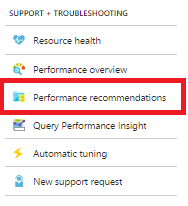

2. From the list of recommendations, select an active recommendation. In this example, Create Index.

    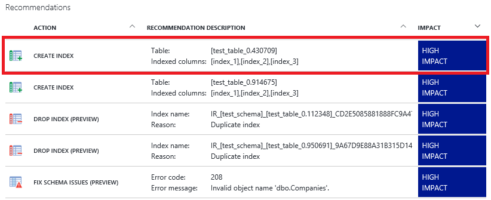

3. Apply the recommendation by clicking the **Apply** button. Optionally, review the recommendation details and see the T-SQL script to  be executed by clicking on **View Script** button.

    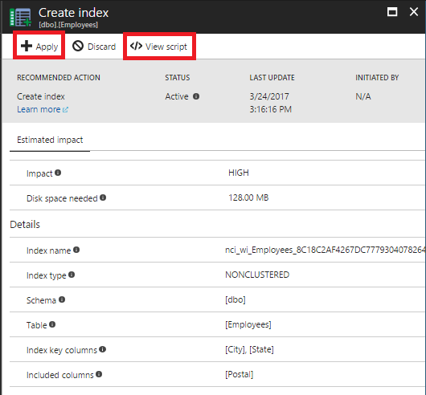

4. [Optional] Enable automatic tuning for recommendations to be applied automatically.

    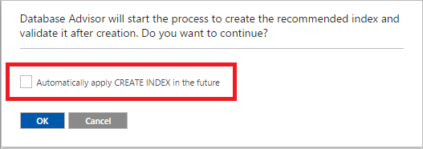

## Revert a recommendation

The Database Advisor monitors every recommendation implemented. If a recommendation doesn't improve the workload it will be automatically reverted. Manually reverting a recommendation is possible, but not necessary in most cases. To revert a recommendation:

1. Go to the performance recommendations menu and select one of the applied recommendations.

    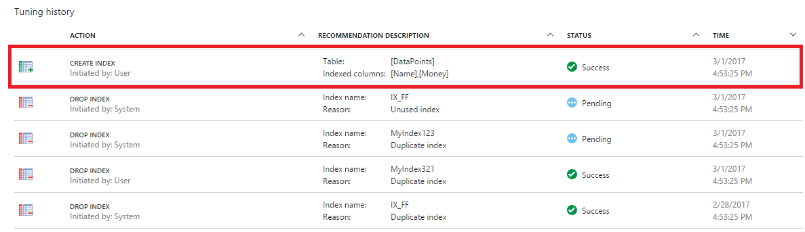

2. In the details view, click **Revert**.

    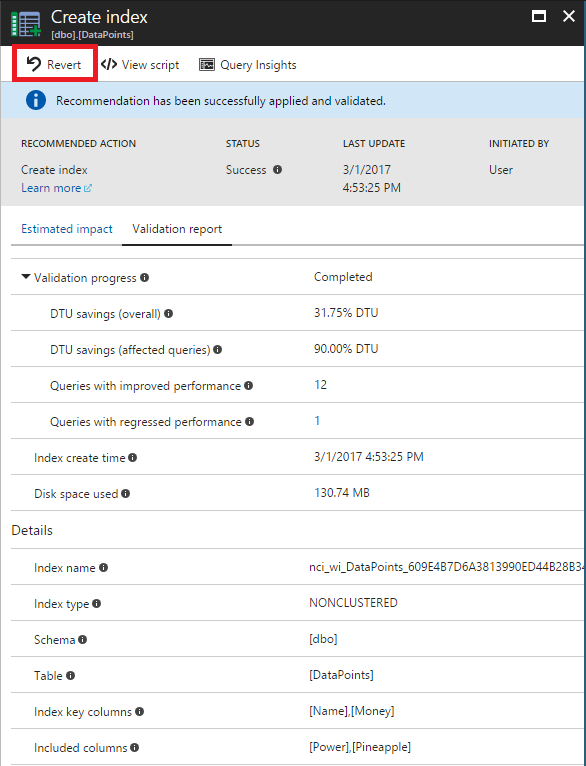

## Find the query that consumes the most resources

Follow these steps to find the query consuming the most resources:

1. Click on the **Query Performance Insight** menu in the database blade.

    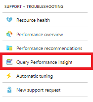

2. Select a resource type.

    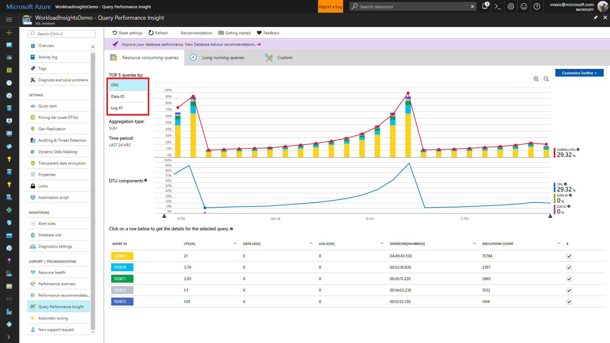

3. Select the first query in the table.

    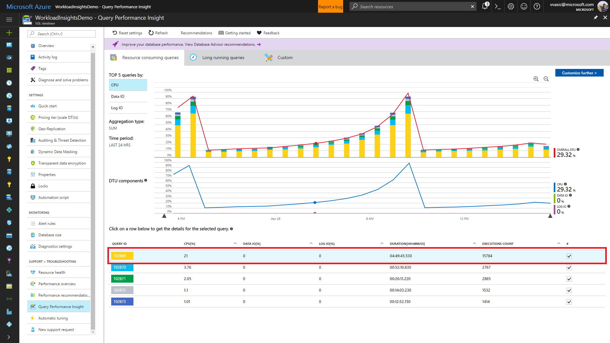

4. Review the query details.

    

## Find the longest running query

1. Go to Query Performance Insight and select the **Long running queries** tab.

    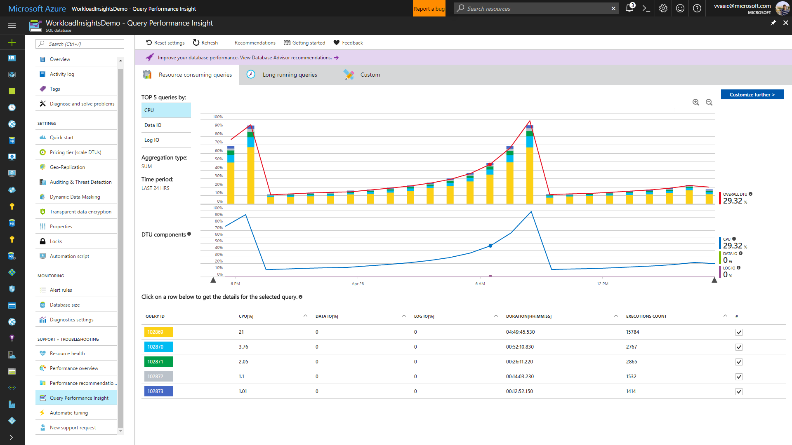

3. Select the first query in the table.

    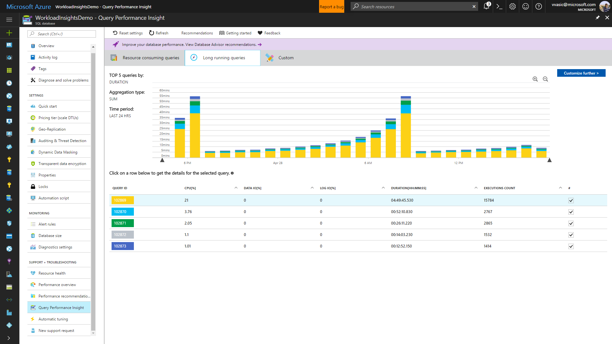

4. Review the query details.

    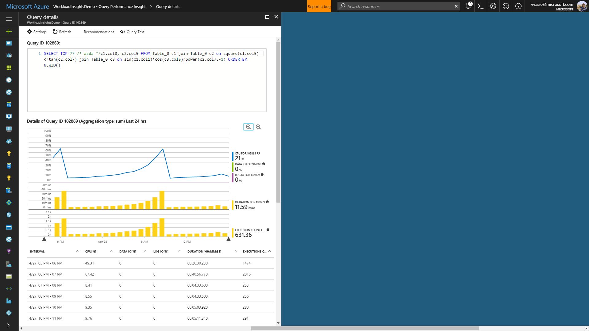

## Next steps 
Missing indexes and poorly optimized queries are common reasons for poor database performance. In this tutorial you learned to:
> [!div class="checklist"]
> * Review, apply and revert performance improvement recommendations
> * Find queries with high resource utilization
> * Find long running queries

[SQL Database performance tuning tips](https://docs.microsoft.com/azure/sql-database/sql-database-troubleshoot-performance)
