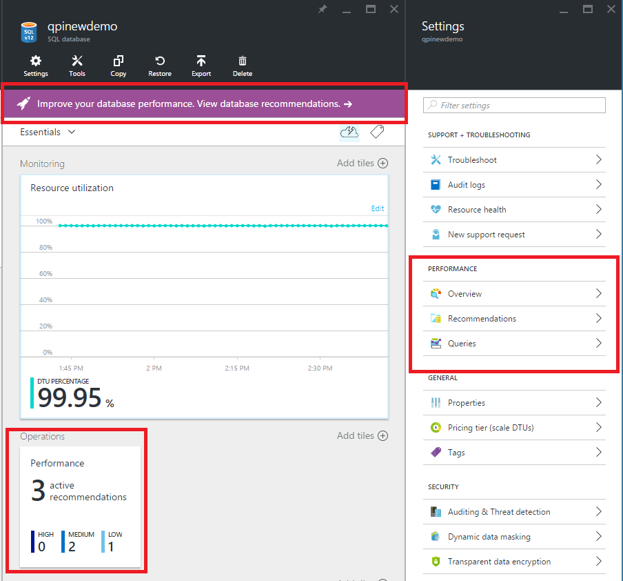
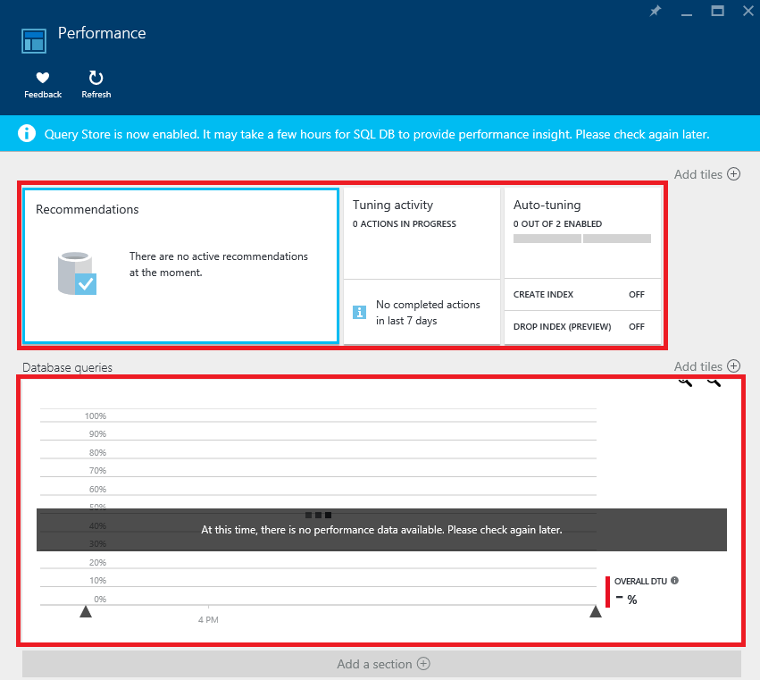
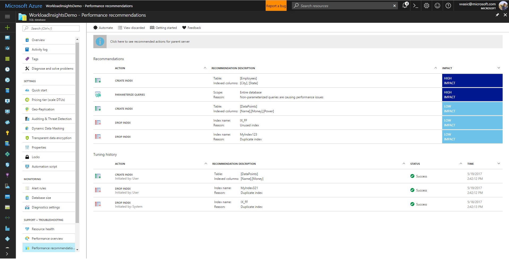

# Monitor and improve performance

Azure SQL Database identifies potential problems in your database and recommends actions that can improve performance of your workload by providing intelligent tuning actions and recommendations.

To review your database performance, use the **Performance** tile on the Overview page, or navigate down to "Support + troubleshooting" section:

   

In the "Support + troubleshooting" section, you can use the following pages:

1. [Performance overview](#performance-overview) to monitor performance of your database. 
2. [Performance recommendations](#performance-recommendations) to find performance recommendations that can improve performance of your workload.
3. [Query Performance Insight](#query-performance-insight) to find top resource consuming queries.
4. [Automatic tuning](#automatic-tuning) to let Azure SQL Database automatically optimize your database.

## Performance Overview

This view provides a summary of your database performance, and helps you with performance tuning and troubleshooting. 

* The **Recommendations** tile provides a breakdown of tuning recommendations for your database (top three recommendations are shown if there are more). Clicking this tile takes you to **[Performance recommendations](#performance-recommendations)**. 
* The **Tuning activity** tile provides a summary of the ongoing and completed tuning actions for your database, giving you a quick view into the history of tuning activity. Clicking this tile takes you to the full tuning history view for your database.
* The **Auto-tuning** tile shows the [auto-tuning configuration](sql-database-automatic-tuning-enable.md) for your database (tuning options that are automatically applied to your database). Clicking this tile opens the automation configuration dialog.
* The **Database queries** tile shows the summary of the query performance for your database (overall DTU usage and top resource consuming queries). Clicking this tile takes you to **[Query Performance Insight](#query-performance-insight)**.

## Performance recommendations

This page provides intelligent [tuning recommendations](sql-database-advisor.md) that can improve your database's performance. The following types of recommendations are shown on this page:

* Recommendations on which indexes to create or drop.
* Recommendations when schema issues are identified in the database.
* Recommendations when queries can benefit from parameterized queries.

You can also find complete history of tuning actions that were applied in the past.

Learn how to find an apply performance recommendations in [Find and apply performance recommendations](sql-database-advisor-portal.md) article.

## Automatic tuning

Azure SQL databases can automatically tune database performance by applying [performance recommendations](sql-database-advisor.md). To learn more, read [Automatic tuning article](sql-database-automatic-tuning.md). To enable it, read [how to enable automatic tuning](sql-database-automatic-tuning-enable.md).

## Query Performance Insight

[Query Performance Insight](sql-database-query-performance.md) allows you to spend less time troubleshooting database performance by providing:

* Deeper insight into your databases resource (DTU) consumption. 
* The top CPU consuming queries, which can potentially be tuned for improved performance. 
* The ability to drill down into the details of a query. 

  

Find more information about this page in the article **[How to use Query Performance Insight](sql-database-query-performance.md)**.

## Additional resources

* [Azure SQL Database performance guidance for single databases](sql-database-performance-guidance.md)
* [When should an elastic pool be used?](sql-database-elastic-pool-guidance.md)

