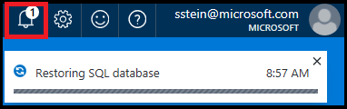
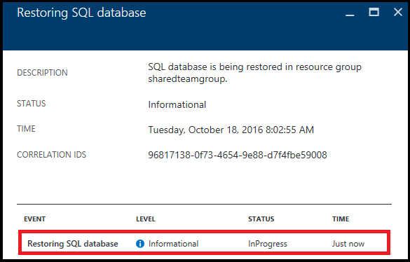

<properties
	pageTitle="Restore an Azure SQL database to a previous point in time (Azure portal) | Microsoft Azure"
	description="Restore an Azure SQL database to a previous point in time."
	services="sql-database"
	documentationCenter=""
	authors="stevestein"
	manager="jhubbard"
	editor=""/>

<tags
	ms.service="sql-database"
	ms.devlang="NA"
	ms.date="10/18/2016"
	ms.author="sstein"
	ms.workload="NA"
	ms.topic="article"
	ms.tgt_pltfrm="NA"/>

# Restore an Azure SQL database to a previous point in time with the Azure portal

> [AZURE.SELECTOR]
- [Overview](sql-database-recovery-using-backups.md)
- [Point-In-Time Restore: PowerShell](sql-database-point-in-time-restore-powershell.md)

This article shows you how to restore your database to an earlier point in time from [SQL Database automated backups](sql-database-automated-backups.md) using the Azure portal.

## Restore a SQL database to a previous point in time

Select a database to restore in the Azure portal:

1.	Open the [Azure portal](https://portal.azure.com).
2.  On the left side of the screen, select **More services** > **SQL databases**.
3.  Click the database you want to restore.
4.  At the top of your database's page, select **Restore**:

    

5.  On the **Restore** page, select the date and time (in UTC time) to restore the database to, and then click **OK**:

    

## Monitor the restore operation

1. After clicking **OK** in the previous step, click the notification icon at the upper right of the page, and click the **Restoring SQL database** notification for details.

    

2. The Restoring SQL database page opens with information about the status of the restore. You can click the line-item for more details:

    

 

## Next steps

- For a business continuity overview and scenarios, see [Business continuity overview](sql-database-business-continuity.md)
- To learn about Azure SQL Database automated backups, see [SQL Database automated backups](sql-database-automated-backups.md)
- To learn about using automated backups for recovery, see [restore a database from the service-initiated backups](sql-database-recovery-using-backups.md)
- To learn about faster recovery options, see [Active-Geo-Replication](sql-database-geo-replication-overview.md)  
- To learn about using automated backups for archiving, see [database copy](sql-database-copy.md)
