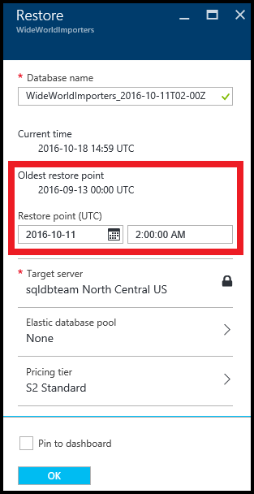

<properties
	pageTitle="Restore an Azure SQL Database to a previous point in time (Azure Portal) | Microsoft Azure"
	description="Restore an Azure SQL Database to a previous point in time."
	services="sql-database"
	documentationCenter=""
	authors="stevestein"
	manager="jhubbard"
	editor=""/>

<tags
	ms.service="sql-database"
	ms.devlang="NA"
	ms.date="07/17/2016"
	ms.author="sstein"
	ms.workload="NA"
	ms.topic="article"
	ms.tgt_pltfrm="NA"/>

# Restore an Azure SQL Database to a previous point in time with the Azure Portal

> [AZURE.SELECTOR]
- [Overview](sql-database-recovery-using-backups.md)
- [Point-In-Time Restore: PowerShell](sql-database-point-in-time-restore-powershell.md)

This article shows you how to restore your database to an earlier point in time from [SQL Database automated backups](sql-database-automated-backups.md) using the Azure Portal.

## Select a database to restore to a previous point in time

To restore a database in the Azure Portal do the following:

1.	Open the [Azure Portal](https://portal.azure.com).
2.  On the left side of the screen select **BROWSE** > **SQL databases**.
3.  Navigate to the database you want to restore and select it.
4.  At the top of your database's blade, select **Restore**:

    

5.  Specify a database name, point in time and then click Ok:

    

## Next steps

- For a business continuity overview and scenarios, see [Business continuity overview](sql-database-business-continuity.md)
- To learn about Azure SQL Database automated backups, see [SQL Database automated backups](sql-database-automated-backups.md)
- To learn about using automated backups for recovery, see [restore a database from the service-initiated backups](sql-database-recovery-using-backups.md)
- To learn about faster recovery options, see [Active-Geo-Replication](sql-database-geo-replication-overview.md)  
- To learn about using automated backups for archiving, see [database copy](sql-database-copy.md)
