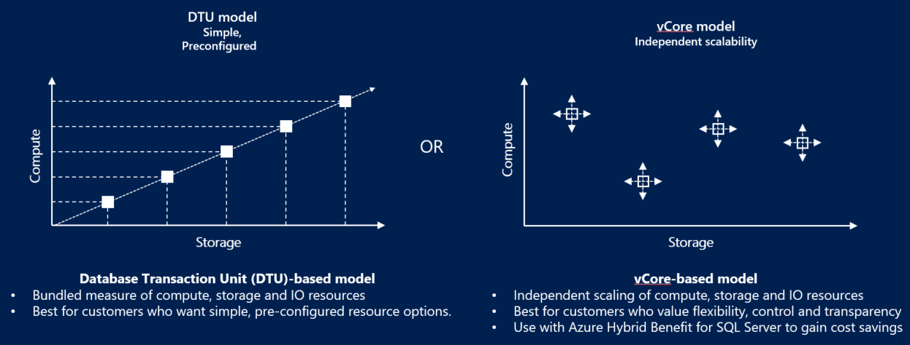

# Choose between the vCore and the DTU purchasing models

Azure SQL Database lets you easily purchase a fully managed platform as a service (PaaS) database engine that fits your performance and cost needs. Depending on the deployment model you've chosen for Azure SQL Database, you can select the purchasing model that works for you:

- [Virtual core (vCore)-based purchasing model](sql-database-service-tiers-vcore.md) (recommended). This purchasing model provides a choice between a provisioned compute tier and a serverless (preview) compute tier. With the provisioned compute tier, you choose the exact amount of compute resources that are always provisioned for your workload. With the serverless compute tier, you specify the autoscaling of the compute resources over a configurable compute range. With this compute tier, you can also automatically pause and resume the database based on workload activity. The vCore unit price per unit of time is lower in the provisioned compute tier than it is in the serverless compute tier.
- [Database transaction unit (DTU)-based purchasing model](sql-database-service-tiers-dtu.md). This purchasing model provides bundled compute and storage packages balanced for common workloads.

Different purchasing models are available for different Azure SQL Database deployment models:

- The [single database](sql-database-single-databases-manage.md) and [elastic pool](sql-database-elastic-pool.md) deployment options in [Azure SQL Database](sql-database-technical-overview.md) offer both the [DTU-based purchasing model](sql-database-service-tiers-dtu.md) and the [vCore-based purchasing model](sql-database-service-tiers-vcore.md).
- The [managed instance](sql-database-managed-instance.md) deployment option in Azure SQL Database offers only the [vCore-based purchasing model](sql-database-service-tiers-vcore.md).
- The [hyperscale service tier](sql-database-service-tier-hyperscale.md) is available for single databases that are using the [vCore-based purchasing model](sql-database-service-tiers-vcore.md).

The following table and chart compare and contrast the vCore-based and the DTU-based purchasing models:

|**Purchasing model**|**Description**|**Best for**|
|---|---|---|
|DTU-based model|This model is based on a bundled measure of compute, storage, and I/O resources. Compute sizes are expressed in DTUs for single databases and in elastic database transaction units (eDTUs) for elastic pools. For more information about DTUs and eDTUs, see [What are DTUs and eDTUs?](sql-database-purchase-models.md#dtu-based-purchasing-model).|Best for customers who want simple, preconfigured resource options.|
|vCore-based model|This model allows you to independently choose compute and storage resources. The vCore-based purchasing model also allows you to use [Azure Hybrid Benefit for SQL Server](https://azure.microsoft.com/pricing/hybrid-benefit/) to gain cost savings.|Best for customers who value flexibility, control, and transparency.|
||||  

## Compute costs

### Provisioned compute costs

In the provisioned compute tier, the compute cost reflects the total compute capacity that is provisioned for the application.

In the business critical service tier, we automatically allocate at least 3 replicas. To reflect this additional allocation of compute resources, the price in the vCore-based purchasing model is approximately 2.7x higher in the business critical service tier than it is in the general purpose service tier. Likewise, the higher storage price per GB in the business critical service tier reflects the high I/O and low latency of the SSD storage.

The cost of backup storage is the same for the business critical service tier and the general purpose service tier because both tiers use standard storage.

### Serverless compute costs

For a description of how compute capacity is defined and costs are calculated for the serverless compute tier, see [SQL Database serverless (preview)](sql-database-serverless.md).

## Storage costs

Different types of storage are billed differently. For data storage, you're charged for the provisioned storage based upon the maximum database or pool size you select. The cost doesn't change unless you reduce or increase that maximum. Backup storage is associated with automated backups of your instance and is allocated dynamically. Increasing your backup-retention period increases the backup storage that’s consumed by your instance.

By default, 7 days of automated backups of your databases are copied to a read-access geo-redundant storage (RA-GRS) standard Blob storage account. This storage is used by weekly full backups, daily differential backups, and transaction log backups, which are copied every 5 minutes. The size of the transaction logs depends on the rate of change of the database. A minimum storage amount equal to 100 percent of the database size is provided at no extra charge. Additional consumption of backup storage is charged in GB per month.

For more information about storage prices, see the [pricing](https://azure.microsoft.com/pricing/details/sql-database/single/) page.

## vCore-based purchasing model

A virtual core (vCore) represents a logical CPU and offers you the option to choose between generations of hardware and the physical characteristics of the hardware (for example, the number of cores, the memory, and the storage size). The vCore-based purchasing model gives you flexibility, control, transparency of individual resource consumption, and a straightforward way to translate on-premises workload requirements to the cloud. This model allows you to choose compute, memory, and storage resources based upon your workload needs.

In the vCore-based purchasing model, you can choose between the [general purpose](sql-database-high-availability.md#basic-standard-and-general-purpose-service-tier-availability) and [business critical](sql-database-high-availability.md#premium-and-business-critical-service-tier-availability) service tiers for [single databases](sql-database-single-database-scale.md), [elastic pools](sql-database-elastic-pool.md), and [managed instances](sql-database-managed-instance.md). For single databases, you can also choose the [hyperscale service tier](sql-database-service-tier-hyperscale.md).

The vCore-based purchasing model lets you independently choose compute and storage resources, match on-premises performance, and optimize price. In the vCore-based purchasing model, you pay for:

- Compute resources (the service tier + the number of vCores and the amount of memory + the generation of hardware).
- The type and amount of data and log storage.
- Backup storage (RA-GRS).

> [!IMPORTANT]
> Compute resources, I/O, and data and log storage are charged per database or elastic pool. Backup storage is charged per each database. For more information about managed instance charges, see [managed instances](sql-database-managed-instance.md).
> **Region limitations:** For the current list of supported regions, see [products available by region](https://azure.microsoft.com/global-infrastructure/services/?products=sql-database&regions=all). To create a managed instance in a region that currently isn't supported, [send a support request via the Azure portal](sql-database-managed-instance-resource-limits.md#obtaining-a-larger-quota-for-sql-managed-instance).

If your single database or elastic pool consumes more than 300 DTUs, converting to the vCore-based purchasing model might reduce your costs. You can convert by using your API of choice or by using the Azure portal, with no downtime. However, conversion isn't required and isn't done automatically. If the DTU-based purchasing model meets your performance and business requirements, you should continue using it.

To convert from the DTU-based purchasing model to the vCore-based purchasing model, select the compute size by using the following rules of thumb:

- Every 100 DTUs in the standard tier require at least 1 vCore in the general purpose service tier.
- Every 125 DTUs in the premium tier require at least 1 vCore in the business critical service tier.

## DTU-based purchasing model

A database transaction unit (DTU) represents a blended measure of CPU, memory, reads, and writes. The DTU-based purchasing model offers a set of preconfigured bundles of compute resources and included storage to drive different levels of application performance. If you prefer the simplicity of a preconfigured bundle and fixed payments each month, the DTU-based model might be more suitable for your needs.

In the DTU-based purchasing model, you can choose between the basic, standard, and premium service tiers for both [single databases](sql-database-single-database-scale.md) and [elastic pools](sql-database-elastic-pool.md). The DTU-based purchasing model isn't available for [managed instances](sql-database-managed-instance.md).

### Database transaction units (DTUs)

For a single database at a specific compute size within a [service tier](sql-database-single-database-scale.md), Microsoft guarantees a certain level of resources for that database (independent of any other database in the Azure cloud). This guarantee provides a predictable level of performance. The amount of resources allocated for a database is calculated as a number of DTUs and is a bundled measure of compute, storage, and I/O resources.

The ratio among these resources is originally determined by an [online transaction processing (OLTP) benchmark workload](sql-database-benchmark-overview.md) designed to be typical of real-world OLTP workloads. When your workload exceeds the amount of any of these resources, your throughput is throttled, resulting in slower performance and time-outs.

The resources used by your workload don't impact the resources available to other SQL databases in the Azure cloud. Likewise, the resources used by other workloads don't impact the resources available to your SQL database.

DTUs are most useful for understanding the relative resources that are allocated for Azure SQL databases at different compute sizes and service tiers. For example:

- Doubling the DTUs by increasing the compute size of a database equates to doubling the set of resources available to that database.
- A premium service tier P11 database with 1750 DTUs provides 350x more DTU compute power than a basic service tier database with 5 DTUs.  

To gain deeper insight into the resource (DTU) consumption of your workload, use [query-performance insights](sql-database-query-performance.md) to:

- Identify the top queries by CPU/duration/execution count that can potentially be tuned for improved performance. For example, an I/O-intensive query might benefit from [in-memory optimization techniques](sql-database-in-memory.md) to make better use of the available memory at a certain service tier and compute size.
- Drill down into the details of a query to view its text and its history of resource usage.
- Access performance-tuning recommendations that show actions taken by [SQL Database Advisor](sql-database-advisor.md).

### Elastic database transaction units (eDTUs)

For SQL databases that are always available, rather than provide a dedicated set of resources (DTUs) that might not always be needed, you can place these databases into an [elastic pool](sql-database-elastic-pool.md). The databases in an elastic pool are on a single Azure SQL Database server and share a pool of resources.

The shared resources in an elastic pool are measured by elastic database transaction units (eDTUs). Elastic pools provide a simple, cost-effective solution to manage performance goals for multiple databases that have widely varying and unpredictable usage patterns. An elastic pool guarantees that all the resources can't be consumed by one database in the pool, while ensuring that each database in the pool always has a minimum amount of necessary resources available.

A pool is given a set number of eDTUs for a set price. In the elastic pool, individual databases can autoscale within the configured boundaries. A database under a heavier load will consume more eDTUs to meet demand. Databases under lighter loads will consume fewer eDTUs. Databases with no load will consume no eDTUs. Because resources are provisioned for the entire pool, rather than per database, elastic pools simplify your management tasks and provide a predictable budget for the pool.

You can add additional eDTUs to an existing pool with no database downtime and with no impact on the databases in the pool. Similarly, if you no longer need extra eDTUs, remove them from an existing pool at any time. You can also add databases to or subtract databases from a pool at any time. To reserve eDTUs for other databases, limit the number of eDTUs a database can use under a heavy load. If a database consistently underuses resources, move it out of the pool and configure it as a single database with a predictable amount of required resources.

### Determine the number of DTUs needed by a workload

If you want to migrate an existing on-premises or SQL Server virtual machine workload to Azure SQL Database, use the [DTU calculator](https://dtucalculator.azurewebsites.net/) to approximate the number of DTUs needed. For an existing Azure SQL Database workload, use [query-performance insights](sql-database-query-performance.md) to understand your database-resource consumption (DTUs) and gain deeper insights for optimizing your workload. The [sys.dm_db_ resource_stats](https://msdn.microsoft.com/library/dn800981.aspx) dynamic management view (DMV) lets you view resource consumption for the last hour. The [sys.resource_stats](https://msdn.microsoft.com/library/dn269979.aspx) catalog view displays resource consumption for the last 14 days, but at a lower fidelity of five-minute averages.

### Workloads that benefit from an elastic pool of resources

Pools are well-suited for databases with a low resource-utilization average and relatively infrequent utilization spikes. SQL Database automatically evaluates the historical resource usage of databases on an existing SQL Database server and recommends the appropriate pool configuration in the Azure portal. For more information, see [When should you consider a SQL Database elastic pool?](sql-database-elastic-pool.md).

## Frequently asked questions (FAQs)

### Do I need to take my application offline to convert from a DTU-based service tier to a vCore-based service tier?

No. You don't need to take the application offline. The new service tiers offer a simple online-conversion method that's similar to the existing process of upgrading databases from the standard to the premium service tier and the other way around. You can start this conversion by using the Azure portal, PowerShell, the Azure CLI, T-SQL, or the REST API. See [Manage single databases](sql-database-single-database-scale.md) and [Manage elastic pools](sql-database-elastic-pool.md).

### Can I convert a database from a service tier in the vCore-based purchasing model to a service tier in the DTU-based purchasing model?

Yes, you can easily convert your database to any supported performance objective by using the Azure portal, PowerShell, the Azure CLI, T-SQL, or the REST API. See [Manage single databases](sql-database-single-database-scale.md) and [Manage elastic pools](sql-database-elastic-pool.md).

## Next steps

- For more information about the vCore-based purchasing model, see [vCore-based purchasing model](sql-database-service-tiers-vcore.md).
- For more information about the DTU-based purchasing model, see [DTU-based purchasing model](sql-database-service-tiers-dtu.md).
