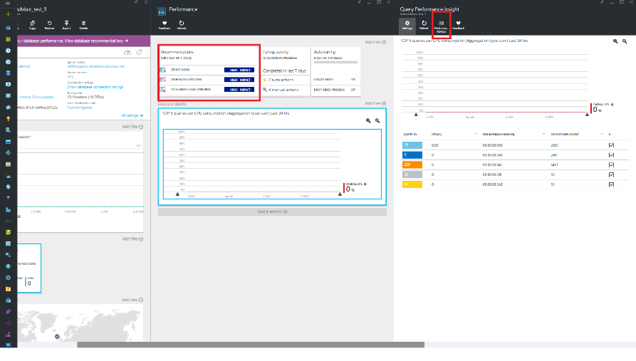
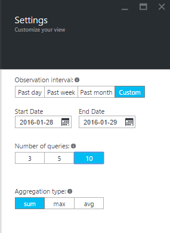
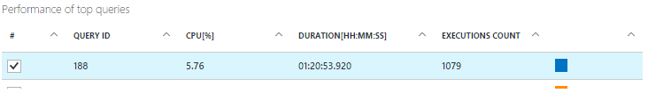

<properties 
   pageTitle="Azure SQL Database Query Performance Insight" 
   description="Query performance monitoring identifies the most CPU-consuming queries for an Azure SQL Database." 
   services="sql-database" 
   documentationCenter="" 
   authors="stevestein" 
   manager="jhubbard" 
   editor="monicar"/>

<tags
   ms.service="sql-database"
   ms.devlang="na"
   ms.topic="article"
   ms.tgt_pltfrm="na"
   ms.workload="data-management" 
   ms.date="08/09/2016"
   ms.author="sstein"/>

# Azure SQL Database Query Performance Insight

Managing and tuning the performance of relational databases is a challenging task that requires significant expertise and time investment. Query Performance Insight allows you to spend less time troubleshooting database performance by providing the following:​

- Deeper insight into your databases resource (DTU) consumption. 
- The top CPU consuming queries, which can potentially be tuned for improved performance. 
- The ability to drill down into the details of a query.
​

## Prerequisites

- Query Performance Insight is only available with Azure SQL Database V12.
- Query Performance Insight requires that [Query Store](https://msdn.microsoft.com/library/dn817826.aspx) is running on your database. If Query Store is not running, the portal prompts you to turn it on.

 
## Permissions

The following [role-based access control](../active-directory/role-based-access-control-configure.md) permissions are required to use Query Performance Insight: 

- **Reader**, **Owner**, **Contributor**, **SQL DB Contributor**, or **SQL Server Contributor** permissions are required to view the top resource consuming queries and charts. 
- **Owner**, **Contributor**, **SQL DB Contributor**, or **SQL Server Contributor** permissions are required to view query text.

## Using Query Performance Insight

Query Performance Insight is easy to use:

- Review the list of top resource-consuming queries. 
- To view its details, select an individual query.
- Open [SQL Database Advisor](sql-database-advisor.md) and check if any recommendations are available.
- Zoom in for detailed information.

    

> [AZURE.NOTE] A couple hours of data needs to be captured by Query Store for SQL Database to provide query performance insight. If the database has no activity or Query Store was not active during a certain time period, the charts are empty when displaying that time period. If Query Store is not running, you may enable it at any time.   

## Review top CPU consuming queries

In the [portal](http://portal.azure.com) do the following:

1. Browse to a SQL database and click **Settings** > **Performance** > **Queries**. 

    ![Query Performance Insight][1]

    The top queries view opens and the top CPU consuming queries are listed.

1. Click around the chart for details. The top line shows overall DTU% for the database. The bars show CPU% consumed by the selected queries during the selected interval (for example, if **Past week** is selected each bar represents one day).

    ![top queries][2]

    The bottom grid represents aggregated information for the visible queries.

    -	Query ID – unique identifier of query inside database. 
    -	CPU per query during observable interval (depends on aggregation function).
    -	Duration per query (depends on aggregation function).
    -	Total number of executions for a particular query.

	Select or clear individual queries to include or exclude them from the chart. 

1. If your data becomes stale, click the **Refresh** button.
1. Optionally, click **Settings** to customize how CPU consumption data is displayed, or to show a different time period.

    

## Viewing individual query details

To view query details:

1. Click any query in the list of top queries.

    

4. The details view opens and the queries CPU consumption is broken down over time.
3. Click around the chart for details. The top line is overall DTU%, and the bars are CPU% consumed by the selected query.
4. Review the data to see detailed metrics including duration, number of executions, and resource utilization percentage for each interval the query was running.
    
    ![query details][3]

1. Optionally, click **Settings** to customize how CPU consumption data is displayed, or to show a different time period.

## 	Optimizing the Query Store configuration for Query Performance Insight

During your use of Query Performance Insight, you might encounter the following Query Store messages:

- "Query store has reached its capacity and not collecting new data."
- "Query Store for this database is in read-only mode and not collecting performance insights data."
- "Query Store parameters are not optimally set for Query Performance Insight."

These messages usually appear when Query Store is not able to collect new data. To resolve these issues, you have a couple of options:

-	Change the Retention and Capture policy of Query Store
-	Increase size of Query Store 
-	Clear Query Store

### Recommended retention and capture policy

There are two types of retention policies:

- Size based – if set to AUTO it cleans data automatically when near max size is reached.
- Time based - if Query Store runs out of space, it deletes query information older than the default setting of 30 days.

Capture policy could be set to:

- **All** – Captures all queries. **All** is the default option.
- **Auto** – Infrequent queries and queries with insignificant compile and execution duration are ignored. Thresholds for execution count, compile, and runtime duration are internally determined.
- **None** – Query Store stops capturing new queries.
	
We recommend setting all policies to AUTO and clean policy to 30 days:

    ALTER DATABASE [YourDB] 
    SET QUERY_STORE (SIZE_BASED_CLEANUP_MODE = AUTO);
    	
    ALTER DATABASE [YourDB] 
    SET QUERY_STORE (CLEANUP_POLICY = (STALE_QUERY_THRESHOLD_DAYS = 30));
    
    ALTER DATABASE [YourDB] 
    SET QUERY_STORE (QUERY_CAPTURE_MODE = AUTO);

Increase size of Query Store by connecting to a database and issuing following query:

    ALTER DATABASE [YourDB]
    SET QUERY_STORE (MAX_STORAGE_SIZE_MB = 1024);

Clear Query Store. Deletes all current information in the Query Store:

    ALTER DATABASE [YourDB] SET QUERY_STORE CLEAR;

## Summary

Query Performance Insight helps you understand the impact of your query workload and how it relates to database resource consumption. With this feature, you learn about the top consuming queries, and easily identify the ones to fix before they become a problem.

## Next steps

For additional recommendations about improving the performance of your SQL database, click [Database Advisor](sql-database-advisor.md) on the **Query Performance Insight** blade.

<!--Image references-->
[1]: ./media/sql-database-query-performance/tile.png
[2]: ./media/sql-database-query-performance/top-queries.png
[3]: ./media/sql-database-query-performance/query-details.png

