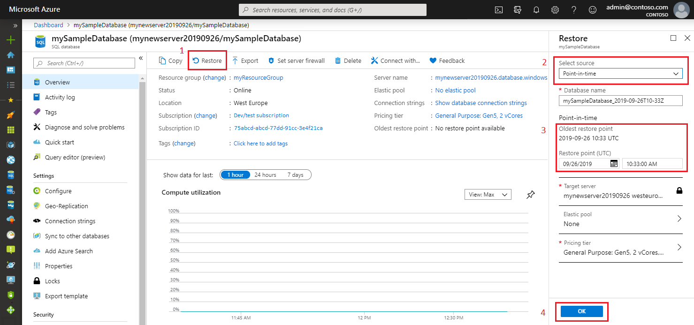
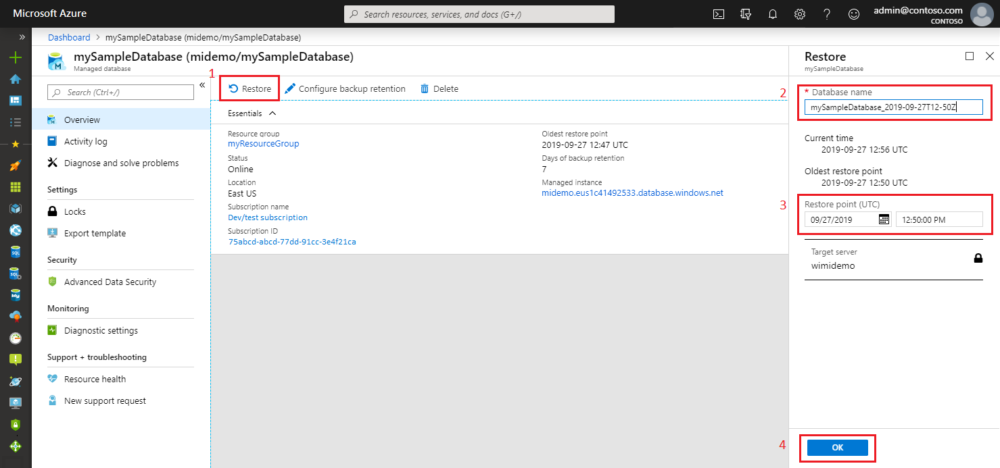
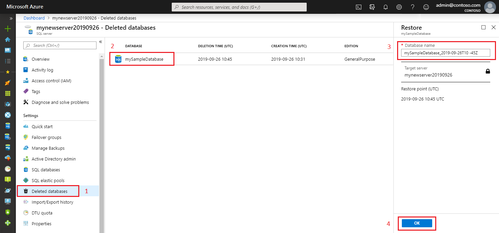
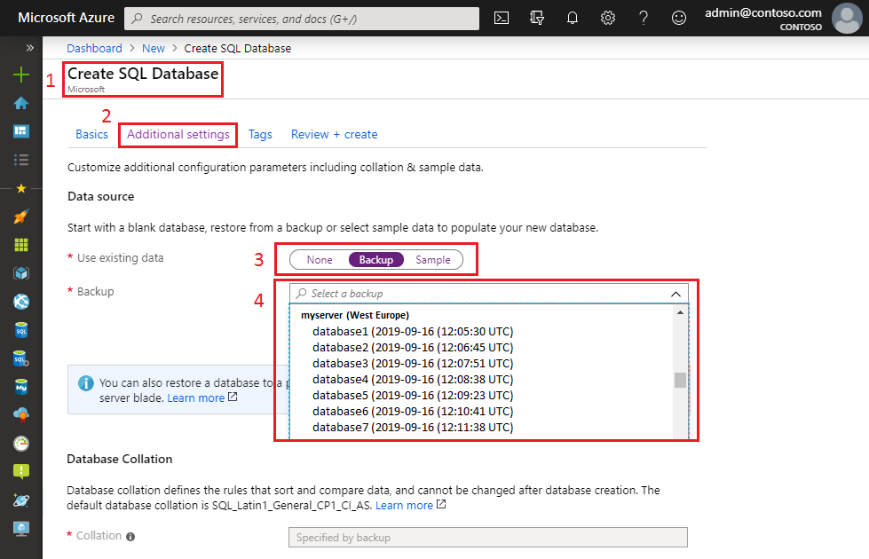
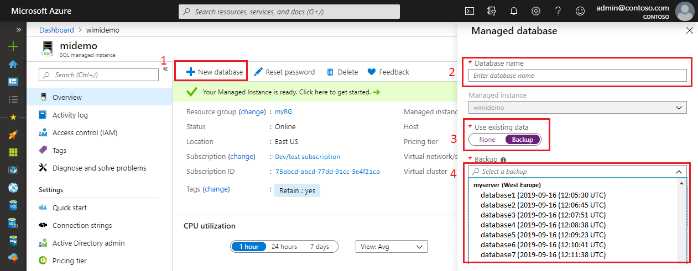

# Recover an Azure SQL database by using automated database backups

By default, Azure SQL Database backups are stored in geo-replicated blob storage (RA-GRS storage type). The following options are available for database recovery by using [automated database backups](sql-database-automated-backups.md). You can:

- Create a new database on the same SQL Database server, recovered to a specified point in time within the retention period.
- Create a database on the same SQL Database server, recovered to the deletion time for a deleted database.
- Create a new database on any SQL Database server in the same region, recovered to the point of the most recent backups.
- Create a new database on any SQL Database server in any other region, recovered to the point of the most recent replicated backups.

If you configured [backup long-term retention](sql-database-long-term-retention.md), you can also create a new database from any long-term retention backup on any SQL Database server.

> [!IMPORTANT]
> You can't overwrite an existing database during restore.

When you're using the Standard or Premium service tiers, your database restore might incur an extra storage cost. The extra cost is incurred when the maximum size of the restored database is greater than the amount of storage included with the target database's service tier and performance level. For pricing details of extra storage, see the [SQL Database pricing page](https://azure.microsoft.com/pricing/details/sql-database/). If the actual amount of used space is less than the amount of storage included, you can avoid this extra cost by setting the maximum database size to the included amount.

## Recovery time

The recovery time to restore a database by using automated database backups is affected by several factors:

- The size of the database.
- The compute size of the database.
- The number of transaction logs involved.
- The amount of activity that needs to be replayed to recover to the restore point.
- The network bandwidth if the restore is to a different region.
- The number of concurrent restore requests being processed in the target region.

For a large or very active database, the restore might take several hours. If there is a prolonged outage in a region, it's possible that a high number of geo-restore requests will be initiated for disaster recovery. When there are many requests, the recovery time for individual databases can increase. Most database restores complete in less than 12 hours.

For a single subscription, there are limitations on the number of concurrent restore requests. These limitations apply to any combination of point-in-time restores, geo-restores, and restores from long-term retention backup.

| | **Max # of concurrent requests being processed** | **Max # of concurrent requests being submitted** |
| :--- | --: | --: |
|Single database (per subscription)|10|60|
|Elastic pool (per pool)|4|200|
||||

There isn't a built-in method to restore the entire server. For an example of how to accomplish this task, see [Azure SQL Database: Full Server Recovery](https://gallery.technet.microsoft.com/Azure-SQL-Database-Full-82941666).

> [!IMPORTANT]
> To recover by using automated backups, you must be a member of the SQL Server contributor role in the subscription, or be the subscription owner. For more information, see [RBAC: Built-in roles](../role-based-access-control/built-in-roles.md). You can recover by using the Azure portal, PowerShell, or the REST API. You can't use Transact-SQL.

## Point-in-time restore

You can restore a standalone, pooled, or instance database to an earlier point in time by using the Azure portal, [PowerShell](https://docs.microsoft.com/powershell/module/az.sql/restore-azsqldatabase), or the [REST API](https://docs.microsoft.com/rest/api/sql/databases). The request can specify any service tier or compute size for the restored database. Ensure that you have sufficient resources on the server to which you are restoring the database. When complete, the restore creates a new database on the same server as the original database. The restored database is charged at normal rates, based on its service tier and compute size. You don't incur charges until the database restore is complete.

You generally restore a database to an earlier point for recovery purposes. You can treat the restored database as a replacement for the original database, or use it as a data source to update the original database.

- **Database replacement**

  If you intend the restored database to be a replacement for the original database, you should specify the original database's compute size and service tier. You can then rename the original database, and give the restored database the original name by using the [ALTER DATABASE](/sql/t-sql/statements/alter-database-azure-sql-database) command in T-SQL.

- **Data recovery**

  If you plan to retrieve data from the restored database to recover from a user or application error, you need to write and execute a  data recovery script that extracts data from the restored database and applies to the original database. Although the restore operation may take a long time to complete, the restoring database is visible in the database list throughout the restore process. If you delete the database during the restore, the restore operation will be canceled and you will not be charged for the database that did not complete the restore.
  
### Point-in-time restore by using Azure portal

You can recover a single SQL database or instance database to a point in time from the overview blade of the database you want to restore in the Azure portal.

#### Single Azure SQL database

To recover a single or pooled database to a point in time by using the Azure portal, open the database overview page, and select **Restore** on the toolbar. Choose the backup source, and select the point-in-time backup point from which a new database will be created. 

  

#### Managed instance database

To recover a managed instance database to a point in time by using the Azure portal, open the database overview page, and select **Restore** on the toolbar. Choose the point-in-time backup point from which a new database will be created. 

  

> [!TIP]
> To programmatically restore a database from a backup, see [Programmatically performing recovery using automated backups](sql-database-recovery-using-backups.md).

## Deleted database restore

You can restore a deleted database to the deletion time, or an earlier point in time, on the same SQL Database server or the same managed instance. You can accomplish this through the Azure portal, [PowerShell](https://docs.microsoft.com/powershell/module/az.sql/restore-azsqldatabase), or the [REST (createMode=Restore)](https://docs.microsoft.com/rest/api/sql/databases/createorupdate). You restore a deleted database by creating a new database from the backup.

> [!IMPORTANT]
> If you delete an Azure SQL Database server or managed instance, all its databases are also deleted, and can't be recovered. You can't restore a deleted server or managed instance.

### Deleted database restore by using the Azure portal

You restore deleted databases from the Azure portal from the server and instance resource.

#### Single Azure SQL database

To recover a single or pooled deleted database to the deletion time by using the Azure portal, open the server overview page, and select **Deleted databases**. Select a deleted database that you want to restore, and type the name for the new database that will be created with data restored from the backup.

  

#### Managed instance database

To recover a managed database by using the Azure portal, open the managed instance overview page, and select **Deleted databases**. Select a deleted database that you want to restore, and type the name for the new database that will be created with data restored from the backup.

  

### Deleted database restore by using PowerShell

Use the following sample scripts to restore a deleted database for Azure SQL Database and a managed instance by using PowerShell.

#### Single Azure SQL database

For a sample PowerShell script showing how to restore a deleted Azure SQL database, see [Restore a SQL database using PowerShell](scripts/sql-database-restore-database-powershell.md).

#### Managed instance database

For a sample PowerShell script showing how to restore a deleted instance database, see [Restore deleted database on managed instance using PowerShell](sql-database-managed-instance-point-in-time-restore.md#restore-a-deleted-database)

> [!TIP]
> To programmatically restore a deleted database, see [Programmatically performing recovery using automated backups](sql-database-recovery-using-backups.md).

## Geo-restore

You can restore a SQL database on any server in any Azure region from the most recent geo-replicated backups. Geo-restore uses a geo-replicated backup as its source. You can request geo-restore even if the database or datacenter is inaccessible due to an outage.

Geo-restore is the default recovery option when your database is unavailable because of an incident in the hosting region. You can restore the database to a server in any other region. There is a delay between when a backup is taken and when it is geo-replicated to an Azure blob in a different region. As a result, the restored database can be up to one hour behind the original database. The following illustration shows a database restore from the last available backup in another region.

### Geo-restore by using the Azure portal

From the Azure portal, you create a new single or managed instance database, and select an available geo-restore backup. The newly created database contains the geo-restored backup data.

#### Single Azure SQL database

To geo-restore a single SQL database from the Azure portal in the region and server of your choice, follow these steps:

1. From **Dashboard**, select **Add** > **Create SQL Database**. On the **Basics** tab, enter the required information.
2. Select **Additional settings**.
3. For **Use existing data**, select **Backup**.
4. For **Backup**, select a backup from the list of available geo-restore backups.

    

Complete the process of creating a new database from the backup. When you create the single Azure SQL database, it contains the restored geo-restore backup.

#### Managed instance database

To geo-restore a managed instance database from the Azure portal to an existing managed instance in a region of your choice, select a managed instance on which you want a database to be restored. Follow these steps:

1. Select **New database**.
2. Type a desired database name.
3. Under **Use existing data**, select **Backup**.
4. Select a backup from the list of available geo-restore backups.

    

Complete the process of creating a new database. When you create the instance database, it contains the restored geo-restore backup.

### Geo-restore by using PowerShell

#### Single Azure SQL database

For a PowerShell script that shows how to perform geo-restore for a single SQL database, see [Use PowerShell to restore an Azure SQL single database to an earlier point in time](scripts/sql-database-restore-database-powershell.md).

#### Managed instance database

For a PowerShell script that shows how to perform geo-restore for a managed instance database, see [Use PowerShell to restore a managed instance database to another geo-region](scripts/sql-managed-instance-restore-geo-backup.md).

### Geo-restore considerations

You can't perform a point-in-time restore on a geo-secondary database. You can only do so on a primary database. For detailed information about using geo-restore to recover from an outage, see [Recover from an outage](sql-database-disaster-recovery.md).

> [!IMPORTANT]
> Geo-restore is the most basic disaster recovery solution available in SQL Database. It relies on automatically created geo-replicated backups with recovery point objective (RPO) equal to 1 hour, and the estimated recovery time of up to 12 hours. It doesn't guarantee that the target region will have the capacity to restore your databases after a regional outage, because a sharp increase of demand is likely. If your application uses relatively small databases and is not critical to the business, geo-restore is an appropriate disaster recovery solution. For business-critical applications that require large databases and must ensure business continuity, use [Auto-failover groups](sql-database-auto-failover-group.md). It offers a much lower RPO and recovery time objective, and the capacity is always guaranteed. For more information on business continuity choices, see [Overview of business continuity](sql-database-business-continuity.md).

## Programmatically performing recovery by using automated backups

You can also use Azure PowerShell or the REST API for recovery. The following tables describe the set of commands available.

### PowerShell

[!INCLUDE [updated-for-az](../../includes/updated-for-az.md)]
> [!IMPORTANT]
> The PowerShell Azure Resource Manager module is still supported by Azure SQL Database, but all future development is for the Az.Sql module. For these cmdlets, see [AzureRM.Sql](https://docs.microsoft.com/powershell/module/AzureRM.Sql/). Arguments for the commands in the Az module and in AzureRm modules are to a great extent identical.

#### Single Azure SQL database

To restore a standalone or pooled database, see [Restore-AzSqlDatabase](/powershell/module/az.sql/restore-azsqldatabase).

  | Cmdlet | Description |
  | --- | --- |
  | [Get-AzSqlDatabase](/powershell/module/az.sql/get-azsqldatabase) |Gets one or more databases. |
  | [Get-AzSqlDeletedDatabaseBackup](/powershell/module/az.sql/get-azsqldeleteddatabasebackup) | Gets a deleted database that you can restore. |
  | [Get-AzSqlDatabaseGeoBackup](/powershell/module/az.sql/get-azsqldatabasegeobackup) |Gets a geo-redundant backup of a database. |
  | [Restore-AzSqlDatabase](/powershell/module/az.sql/restore-azsqldatabase) |Restores a SQL database. |

  > [!TIP]
  > For a sample PowerShell script that shows how to perform a point-in-time restore of a database, see [Restore a SQL database using PowerShell](scripts/sql-database-restore-database-powershell.md).

#### Managed instance database

To restore a managed instance database, see [Restore-AzSqlInstanceDatabase](/powershell/module/az.sql/restore-azsqlinstancedatabase).

  | Cmdlet | Description |
  | --- | --- |
  | [Get-AzSqlInstance](/powershell/module/az.sql/get-azsqlinstance) |Gets one or more managed instances. |
  | [Get-AzSqlInstanceDatabase](/powershell/module/az.sql/get-azsqlinstancedatabase) | Gets an instance database. |
  | [Restore-AzSqlInstanceDatabase](/powershell/module/az.sql/restore-azsqlinstancedatabase) |Restores an instance database. |

### REST API

To restore a single or pooled database by using the REST API:

| API | Description |
| --- | --- |
| [REST (createMode=Recovery)](https://docs.microsoft.com/rest/api/sql/databases) |Restores a database. |
| [Get Create or Update Database Status](https://docs.microsoft.com/rest/api/sql/operations) |Returns the status during a restore operation. |

### Azure CLI

#### Single Azure SQL database

To restore a single or pooled database by using the Azure CLI, see [az sql db restore](/cli/azure/sql/db#az-sql-db-restore).

#### Managed instance database

To restore a managed instance database by using the Azure CLI, see [az sql midb restore](/cli/azure/sql/midb#az-sql-midb-restore).

## Summary

Automatic backups protect your databases from user and application errors, accidental database deletion, and prolonged outages. This built-in capability is available for all service tiers and compute sizes.

## Next steps

- [Business continuity overview](sql-database-business-continuity.md)
- [SQL Database automated backups](sql-database-automated-backups.md)
- [Long-term retention](sql-database-long-term-retention.md)
- To learn about faster recovery options, see [Active geo-replication](sql-database-active-geo-replication.md) or [Auto-failover groups](sql-database-auto-failover-group.md).
