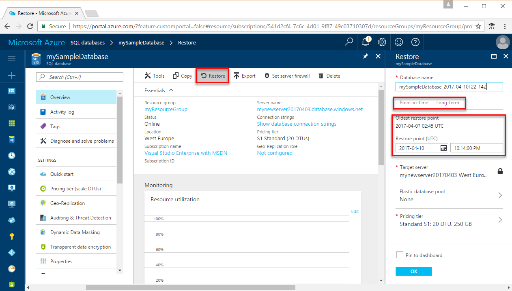
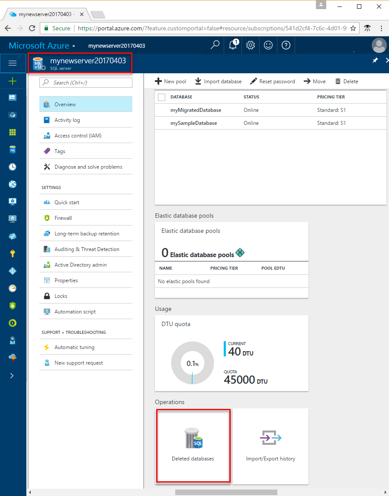
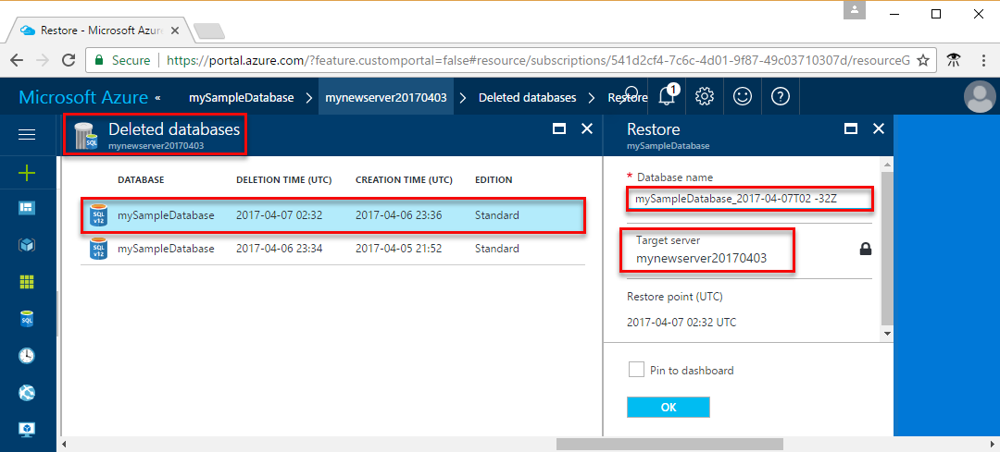

# Recover an Azure SQL database using automated database backups

By default, SQL Database backups are stored in geo-replicated blob storage (RA-GRS). The following options are available for database recovery using [automated database backups](sql-database-automated-backups.md):

- Create a new database on the same SQL Database server recovered to a specified point in time within the retention period.
- Create a database on the same SQL Database server recovered to the deletion time for a deleted database.
- Create a new database on any SQL Database server in the same region recovered to the point of the most recent backups.
- Create a new database on any SQL Database server in any other region recovered to the point of the most recent replicated backups.

If you configured [backup long-term retention](sql-database-long-term-retention.md), you can also create a new database from any LTR backup on any SQL Database server.

> [!IMPORTANT]
> You cannot overwrite an existing database during restore.

When using Standard or Premium service tier, a restored database incurs an extra storage cost under the following conditions:

- Restore of P11–P15 to S4-S12 or P1–P6 if the database max size is greater than 500 GB.
- Restore of P1–P6 to S4-S12 if the database max size is greater than 250 GB.

The extra cost is icurred when the max size of the restored database is greater than the amount of storage included with the target database's service tier and performance level. The extra storage provisioned above the included amount is charged extra. For pricing details of extra storage, see the [SQL Database pricing page](https://azure.microsoft.com/pricing/details/sql-database/). If the actual amount of used space is less than the amount of storage included, you can avoid  this extra cost by setting the max database size to the included amount.

> [!NOTE]
> [Automated database backups](sql-database-automated-backups.md) are used when you create a [database copy](sql-database-copy.md).

## Recovery time

The recovery time to restore a database using automated database backups is impacted by several factors:

- The size of the database
- The compute size of the database
- The number of transaction logs involved
- The amount of activity that needs to be replayed to recover to the restore point
- The network bandwidth if the restore is to a different region
- The number of concurrent restore requests being processed in the target region

For a large and/or very active database, the restore may take several hours. If there is prolonged outage in a region, it is possible that there are large numbers of geo-restore requests being processed by other regions. When there are many requests, the recovery time may increase for databases in that region. Most database restores complete in less than 12 hours.

For a single subscription, there are limitations on number of concurrent restore requests.  These limitations apply to any combination of point in time restores, geo restores and restores from long-term retention backup):

| | **Max # of concurrent requests being processed** | **Max # of concurrent requests being submitted** |
| :--- | --: | --: |
|Single database (per subscription)|10|60|
|Elastic pool (per pool)|4|200|
||||

Currently there isn't a built-in method to restore the entire server. The [Azure SQL Database: Full Server Recovery](https://gallery.technet.microsoft.com/Azure-SQL-Database-Full-82941666) script is an example of how you can accomplish this task.

> [!IMPORTANT]
> To recover using automated backups, you must be a member of the SQL Server Contributor role in the subscription or be the subscription owner - see [RBAC: Built-in roles](../role-based-access-control/built-in-roles.md). You can recover using the Azure portal, PowerShell, or the REST API. You cannot use Transact-SQL.

## Point-in-time restore

You can restore a standalone, pooled, or instance database to an earlier point in time using the Azure portal, [PowerShell](https://docs.microsoft.com/powershell/module/az.sql/restore-azsqldatabase), or the [REST API](https://docs.microsoft.com/rest/api/sql/databases). The request can specify any service tier or compute size for the restored database. Ensure you have sufficient resources on the server to which you are restoring the database. Once complete, a new database will be created on the same server as the original database. The restored database will be charged at normal rates based on its service tier and compute size. You do not incur charges until the database restore is complete.

You generally restore a database to an earlier point for recovery purposes. You can treat the restored database as a replacement for the original database or use it as a source data to update the original database.

- **Database replacement**

  If the restored database is intended as a replacement for the original database, you should specify the original database's compute size and service tier. You can then rename the original database and give the restored database the original name using the [ALTER DATABASE](/sql/t-sql/statements/alter-database-azure-sql-database) command in T-SQL.

- **Data recovery**

  If you plan to retrieve data from the restored database to recover from a user or application error, you need to write and execute a  data recovery script that extracts data from the restored database and applies to the original database. Although the restore operation may take a long time to complete, the restoring database is visible in the database list throughout the restore process. If you delete the database during the restore, the restore operation will be canceled and you will not be charged for the database that did not complete the restore.

To recover a single, pooled, or instance database to a point in time using the Azure portal, open the page for your database and click **Restore** on the toolbar.

> [!IMPORTANT]
> To programmatically restore a database from a backup, see [Programmatically performing recovery using automated backups](sql-database-recovery-using-backups.md#programmatically-performing-recovery-using-automated-backups)

## Deleted database restore

You can restore a deleted database to the deletion time or an earlier point in time on the same SQL Database server using the Azure portal, [PowerShell](https://docs.microsoft.com/powershell/module/az.sql/restore-azsqldatabase), or the [REST (createMode=Restore)](https://docs.microsoft.com/rest/api/sql/databases/createorupdate). You can [restore deleted database on Managed Instance using PowerShell](https://blogs.msdn.microsoft.com/sqlserverstorageengine/20../../recreate-dropped-database-on-azure-sql-managed-instance). 

> [!TIP]
> For a sample PowerShell script showing how to restore a deleted database, see [Restore a SQL database using PowerShell](scripts/sql-database-restore-database-powershell.md).
> [!IMPORTANT]
> If you delete an Azure SQL Database server instance, all its databases are also deleted and cannot be recovered. There is currently no support for restoring a deleted server.

### Deleted database restore using the Azure portal

To recover a deleted database using the Azure portal, open the page for your server and in the Operations area, click **Deleted databases**.

> [!IMPORTANT]
> To programmatically restore a deleted database, see [Programmatically performing recovery using automated backups](sql-database-recovery-using-backups.md#programmatically-performing-recovery-using-automated-backups)

## Geo-restore

You can restore a SQL database on any server in any Azure region from the most recent geo-replicated backups. Geo-restore uses a geo-replicated backup as its source. It can be requested even if the database or datacenter is inaccessible due to an outage.

Geo-restore is the default recovery option when your database is unavailable because of an incident in the hosting region. You can restore the database to a server in any other region. There is a delay between when a backup is taken and when it is geo-replicated to an Azure blob in a different region. As a result, the restored database can be up to one hour behind the orignal database. The following illustration shows restore of the database from the last available backup in another region.

> [!TIP]
> For a sample PowerShell script showing how to perform a geo-restore, see [Restore a SQL database using PowerShell](scripts/sql-database-restore-database-powershell.md).

Point-in-time restore on a geo-secondary is not currently supported. Point-in-time restore can be done only on a primary database. For detailed information about using geo-restore to recover from an outage, see [Recover from an outage](sql-database-disaster-recovery.md).

> [!IMPORTANT]
> Geo-restore is the most basic disaster recovery solution available in SQL Database. It relies on automatically created geo-replicated backups with RPO = 1 hour and the estimated recovery time of up to 12 hours. It does not guarantee that the target region will have the capacity to restore your database(s) after a regional ourage because a sharp increase of demand will be likely. For non business critical application that use relatively small databases, geo-restore is an appropriate disaster recovery solution. For business critical applications that use large databases and must ensure business continuity, you should use [Auto-failover groups](sql-database-auto-failover-group.md). It offers a much lower RPO and RTO, and the capacity is always guaranteed. For more information on business continuity choices, see [Overview of business continuity](sql-database-business-continuity.md).

### Geo-restore using the Azure portal

To geo-restore a database during its [DTU-based model retention period](sql-database-service-tiers-dtu.md) or [vCore-based model retention period](sql-database-service-tiers-vcore.md) using the Azure portal, open the SQL Databases page and then click **Add**. In the **Select source** text box, select **Backup**. Specify the backup from which to perform the recovery in the region and on the server of your choice.

> [!Note]
> Geo-restore using the Azure portal is not available in Managed Instance. Please use PowerShell instead.

## Programmatically performing recovery using automated backups

As previously discussed, in addition to the Azure portal, database recovery can be performed programmatically using Azure PowerShell or the REST API. The following tables describe the set of commands available.

### PowerShell

[!INCLUDE [updated-for-az](../../includes/updated-for-az.md)]
> [!IMPORTANT]
> The PowerShell Azure Resource Manager module is still supported by Azure SQL Database, but all future development is for the Az.Sql module. For these cmdlets, see [AzureRM.Sql](https://docs.microsoft.com/powershell/module/AzureRM.Sql/). The arguments for the commands in the Az module and in the AzureRm modules are substantially identical.

- To restore a standalone or pooled database, see [Restore-AzSqlDatabase](/powershell/module/az.sql/restore-azsqldatabase).

  | Cmdlet | Description |
  | --- | --- |
  | [Get-AzSqlDatabase](/powershell/module/az.sql/get-azsqldatabase) |Gets one or more databases. |
  | [Get-AzSqlDeletedDatabaseBackup](/powershell/module/az.sql/get-azsqldeleteddatabasebackup) | Gets a deleted database that you can restore. |
  | [Get-AzSqlDatabaseGeoBackup](/powershell/module/az.sql/get-azsqldatabasegeobackup) |Gets a geo-redundant backup of a database. |
  | [Restore-AzSqlDatabase](/powershell/module/az.sql/restore-azsqldatabase) |Restores a SQL database. |

  > [!TIP]
  > For a sample PowerShell script showing how to perform a point-in-time restore of a database, see [Restore a SQL database using PowerShell](scripts/sql-database-restore-database-powershell.md).

- To restore a Managed Instance database, see [Restore-AzSqlInstanceDatabase](/powershell/module/az.sql/restore-azsqlinstancedatabase).

  | Cmdlet | Description |
  | --- | --- |
  | [Get-AzSqlInstance](/powershell/module/az.sql/get-azsqlinstance) |Gets one or more managed instances. |
  | [Get-AzSqlInstanceDatabase](/powershell/module/az.sql/get-azsqlinstancedatabase) | Gets an instance databases. |
  | [Restore-AzSqlInstanceDatabase](/powershell/module/az.sql/restore-azsqlinstancedatabase) |Restores an instance database. |

### REST API

To restore a single or pooled database using the REST API:

| API | Description |
| --- | --- |
| [REST (createMode=Recovery)](https://docs.microsoft.com/rest/api/sql/databases) |Restores a database |
| [Get Create or Update Database Status](https://docs.microsoft.com/rest/api/sql/operations) |Returns the status during a restore operation |

### Azure CLI

- To restore a single or pooled database using Azure CLI, see [az sql db restore](/cli/azure/sql/db#az-sql-db-restore).
- To restore a managed instance using Azure CLI, see [az sql midb restore](/cli/azure/sql/midb#az-sql-midb-restore)

## Summary

Automatic backups protect your databases from user and application errors, accidental database deletion, and prolonged outages. This built-in capability is available for all service tiers and compute sizes.

## Next steps

- For a business continuity overview and scenarios, see [Business continuity overview](sql-database-business-continuity.md).
- To learn about Azure SQL Database automated backups, see [SQL Database automated backups](sql-database-automated-backups.md).
- To learn about long-term retention, see [Long-term retention](sql-database-long-term-retention.md).
- To learn about faster recovery options, see [Active geo-replication](sql-database-active-geo-replication.md) or [Auto-failover groups](sql-database-auto-failover-group.md).
