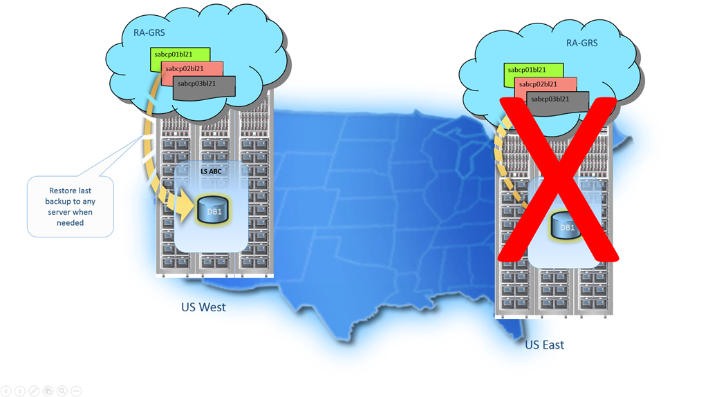

<properties
   pageTitle="Cloud business continuity - Restore a deleted database - SQL Database | Microsoft Azure"
   description="Learn about Point-in-Time Restore, that enables you to roll back an Azure SQL Database to a previous point in time (up to 35 days)."
   services="sql-database"
   documentationCenter=""
   authors="stevestein"
   manager="jhubbard"
   editor="monicar"/>

<tags
   ms.service="sql-database"
   ms.devlang="NA"
   ms.topic="article"
   ms.tgt_pltfrm="NA"
   ms.workload="sqldb-bcdr"
   ms.date="06/09/2016"
   ms.author="sstein"/>

# Recover an Azure SQL database using automated database backups

SQL Database provides three options for database recovery using [SQL Database automated backups](sql-database-automated-backups.md). You can restore a database from the service-initiated backups during their [retention period](sql-database-service-tiers.md) to:

- A new database on the same logical server recovered to a specified point in time within the retention period. 
- A database on the same logical server recovered to the deletion time for a deleted database.
- A new database on any logical server in any region recovered to the most recent daily backups in geo-replicated blob storage (RA-GRS).

You can also use [SQL Database automated backups](sql-database-automated-backups.md) to create a [database copy](sql-database-copy.md) on any logical server in any region that is transactionally consistent with the current SQL Datbase. You can use database copy and [export to a BACPAC](sql-database-export.md) to archive a transactionally consistent copy of a database for long-term storage beyond your retention period, or to transfer a copy of your database to an on-premises or Azure VM instance of SQL Server.

## Recovery time

The recovery time to restore a database using automated database backups is impacted by a number of factors: 
 - The size of the database
 - The performance level of the database
 - The number of transaction logs involved
 - The amount of activity that needs to be replayed to recover to the restore point
 - The network bandwidth if the restore is to a different region 
 - The number of concurrent restore requests being processed in the target region. 
 
 For a very large and/or active database the restore may take several hours. If there is prolonged outage in a region, it is possible that there will be large numbers of Geo-Restore requests being processed by other regions. If there are a large number of requests this may increase the recovery time for databases in that region. The majority of database restores complete within 12 hours.

 There is no built-in functionality to do bulk restore. The [Azure SQL Database: Full Server Recovery](https://gallery.technet.microsoft.com/Azure-SQL-Database-Full-82941666) script is an example of one way of accomplishing this task.

> [AZURE.IMPORTANT] To recover using automated backups, you must be a member of the SQL Server Contributor role in the subscription or be the subscription owner. You can recover using the Azure portal, PowerShell or the REST API. You cannot use Transact-SQL. 

## Point-In-Time Restore

Point-In-Time Restore allows you to restore an existing database as a new database to an earlier point in time on the same logical server using [SQL Database automated backups](sql-database-automated-backups.md). You cannot overwrite the existing database. You can restore to an earlier point in time using the [Azure portal](sql-database-point-in-time-restore-portal.md), [PowerShell](sql-database-point-in-time-restore-powershell.md) or the [REST API](https://msdn.microsoft.com/library/azure/mt163685.aspx).

> [AZURE.SELECTOR]
- [Point-In-Time Restore: Azure portal](sql-database-point-in-time-restore-portal.md)
- [Point-In-Time Restore: PowerShell](sql-database-point-in-time-restore-powershell.md)

The database can be restored to any performance level or elastic pool. You need to ensure you have a sufficient DTU quota on the logical server or elastic pool. Keep in mind that the restore creates a new database and that the service tier and performance level of the restored database may be different than the current state of the live database. Once complete, the restored database is a normal fully accessible online database charged at normal rates based on its service tier and performance level. You do not incur charges until the database restore is complete.

You generally restore a database to an earler point for recovery purposes. When doing so, you can treat the restored database as a replacement for the original database or use it to retrieve data from and then update the original database. 

- ***Database replacement:*** If the restored database is intended as a replacement for the original database, you should verify the performance level and/or service tier are appropriate and scale the database if necessary. You can rename the original database and then give the restored database the original name using the ALTER DATABASE command in T-SQL. 
- ***Data recovery:*** If you plan to retrieve data from the restored database to recover from a user or application error, you will separately need to write and execute whatever data recovery scripts you need to extract data from the restored database to the original database. Although the restore operation may take a long time to complete, the restoring database will be visible in the database list throughout. If you delete the database during the restore, it will cancel the operation and you will not be charged for the database that did not complete the restore. 

For detailed information about using Point-in-Time Restore to recover from user and application errors, see [Recover from a user error](sql-database-user-error-recovery.md)

## Deleted database restore

Deleted database restore allows you to restore a deleted database to the deletion time for a deleted database on the same logical server using [SQL Database automated backups](sql-database-automated-backups.md). 

> [AZURE.IMPORTANT] If you delete an Azure SQL Database server instance, all of its databases are also deleted and cannot be recovered. There is no support for restoring a deleted server at this time.

You can use the same or a new database name for the restored database. You can use the [Azure portal](sql-database-restore-deleted-database-portal.md), [PowerShell](sql-database-restore-deleted-database-powershell.md) or the [REST API](https://msdn.microsoft.com/library/azure/mt163685.aspx). 

> [AZURE.SELECTOR]
- [Deleted datbase restore: Azure portal](sql-database-restore-deleted-database-portal.md)
- [Deleted datbase restore: PowerShell](sql-database-restore-deleted-database-powershell.md)

## Geo-Restore

Geo-Restore allows you to restore a SQL database on any server in any Azure region from the most recent geo-replicated [automated daily backup](sql-database-automated-backups.md). Geo-Restore uses a geo-redundant backup as its source and can be used to recover a database even if the database or datacenter is inaccessible due to an outage. You can use the [Azure portal](sql-database-geo-restore-portal.md), [PowerShell](sql-database-geo-restore-powershell.md), or the [REST (createMode=Restore)](https://msdn.microsoft.com/library/azure/mt163685.aspx) 

> [AZURE.SELECTOR]
- [Geo-Restore: Azure portal](sql-database-geo-restore-portal.md)
- [Geo-Restore: PowerShell](sql-database-geo-restore-powershell.md)

Geo-Restore is the default recovery option when your database is unavailable because of an incident in the region where the database is hosted. If a large scale incident in a region results in unavailability of your database application, you can use Geo-Restore to restore a database from the most recent backup to a server in any other region. All backups are geo-replicated and can have a delay between when the backup is taken and geo-replicated to the Azure blob in a different region. This delay can be up to an hour so in the event of a disaster there can be up to 1 hour data loss, i.e., RPO of up to 1 hour. The following shows restore of the database from the last daily backup.

For detailed information about using Geo-Restore to recover from an outage, see [Recover from an outage](sql-database-disaster-recovery.md)

> [AZURE.IMPORTANT] While Geo-Restore is available with all service tiers, it is the most basic of the disaster recovery solutions available in SQL Database with the longest RPO and Estimate Recovery Time (ERT). For Basic databases with maximum size of 2 GB Geo-Restore provides a reasonable DR solution with an ERT of 12 hours. For larger Standard or Premium databases, if significantly shorter recovery times are desired, or to reduce the likelihood of data loss you should consider using Active Geo-Replication. Active Geo-Replication offers a much lower RPO and ERT as it only requires you initiate a failover to a continuously replicated secondary. For details, see [Active Geo-Replication](sql-database-geo-replication-overview.md).

## Programmatically performing recovery using automated backups

As discussed above, in addiition to the Azure portal, database recovery can be performed programmically using Azure PowerShell and the REST API. The tables below describe the set of commands available.

### PowerShell

|Cmdlet|Description|
|------|-----------|
|[Get-AzureRmSqlDatabase](https://msdn.microsoft.com/en-us/library/azure/mt603648.aspx)|Gets one or more databases.|
|[Get-AzureRMSqlDeletedDatabaseBackup](https://msdn.microsoft.com/en-us/library/azure/mt693387.aspx)|Gets a deleted database that you can restore.|
|[Get-AzureRmSqlDatabaseGeoBackup](https://msdn.microsoft.com/library/azure/mt693388.aspx)|Gets a geo-redundant backup of a database.|
|[Restore-AzureRmSqlDatabase](https://msdn.microsoft.com/library/azure/mt693390.aspx)|Restores a SQL database.|
||||

### REST API

|API|Description|
|---|-----------|
|[REST (createMode=Restore)](https://msdn.microsoft.com/library/azure/mt163685.aspx)|Restores a database|
|[Get Create or Update Database Status](https://msdn.microsoft.com/library/azure/mt643934.aspx)|Returns the status during a restore operation|
||||

## Summary

Automatic backups protect your databases from user and application errors, accidental database deletion, and prolonged outages. This zero-cost zero-admin solution is available with all SQL databases. 

## Next steps

- For a business continuity overview, see [Business continuity overview](sql-database-business-continuity.md)
- To learn about Azure SQL Database automated backups, see [SQL Database automated backups](sql-database-automated-backups.md)
- To learn about business continuity design and recovery scenarios, see [Continuity scenarios](sql-database-business-continuity-scenarios.md)
- To learn about faster recovery options, see [Active-Geo-Replication](sql-database-geo-replication-overview.md)  
- To learn about using automated backups for archiving, see [database copy](sql-database-copy.md)
