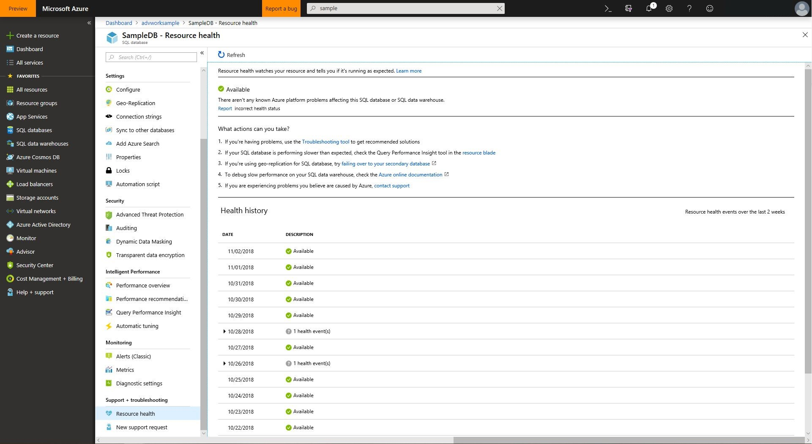
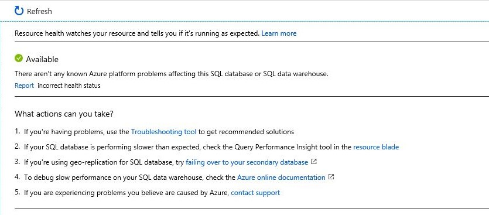
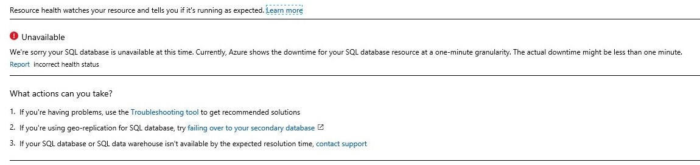
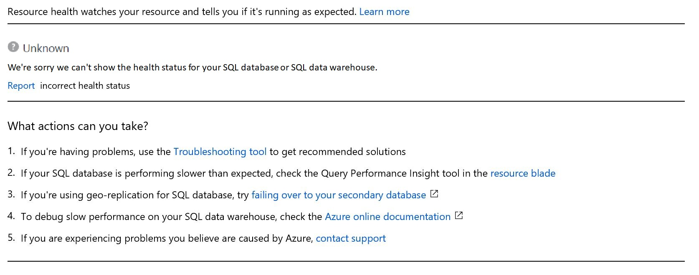

# Use Resource Health to troubleshoot connectivity for Azure SQL Database

## Overview

[Resource Health](../service-health/resource-health-overview.md#get-started) for SQL Database helps you diagnose and get support when an Azure issue impacts your SQL resources. It informs you about the current and past health of your resources and helps you mitigate issues. Resource health provides technical support when you need help with Azure service issues.

## Health checks

Resource Health determines the health of your SQL resource by examining the success and failure of logins to the resource. Currently, Resource Health for your SQL DB resource only examines login failures due to system error and not user error. The Resource Health status is updated every 1-2 minutes.

## Health States

### Available

A status of **Available** means that Resource Health has not detected logins failures due to system errors on your SQL resource.

### Degraded

A status of **Degraded** means that Resource Health has detected a majority of successful logins, but some failures as well. These are most likely transient login errors. To reduce the impact of connection issues caused by transient login errors, please implement [retry logic](./sql-database-connectivity-issues.md#retry-logic-for-transient-errors) in your code.

### Unavailable

A status of **Unavailable** means that Resource Health has detected consistent login failures to your SQL resource. If your resource remains in this state for an extended period of time, please contact support.

### Unknown

The health status of **Unknown** indicates that Resource Health hasn't received information about this resource for more than 10 minutes. Although this status isn't a definitive indication of the state of the resource, it is an important data point in the troubleshooting process. If the resource is running as expected, the status of the resource will change to Available after a few minutes. If you're experiencing problems with the resource, the Unknown health status might suggest that an event in the platform is affecting the resource.

## Historical information

You can access up to 14 days of health history in the Health history section of Resource Health. The section will also contain the downtime reason (when available) for the downtimes reported by Resource Health. Currently, Azure shows the downtime for your SQL database resource at a two-minute granularity. The actual downtime is likely less than a minute – average is 8s.

### Downtime reasons

When your SQL Database experiences downtime, analysis is performed to determine a reason. When available, the downtime reason is reported in the Health History section of Resource Health. Downtime reasons are typically published 30 minutes after an event.

#### Planned maintenance

The Azure infrastructure periodically performs planned maintenance – upgrade of hardware or software components in the datacenter. While the database undergoes maintenance, SQL may terminate some existing connections and refuse new ones. The login failures experienced during planned maintenance are typically transient and [retry logic](./sql-database-connectivity-issues.md#retry-logic-for-transient-errors) helps reduce the impact. If you continue to experience login errors, please contact support.

#### Reconfiguration

Reconfigurations are considered transient conditions, and are expected from time to time. These events can be triggered by load balancing or software/hardware failures. Any client production application that connects to a cloud database should implement a robust connection [retry logic](./sql-database-connectivity-issues.md#retry-logic-for-transient-errors), as it would help mitigate these situations and should generally make the errors transparent to the end user.

## Next steps

- Learn more about [retry logic for transient errors](./sql-database-connectivity-issues.md#retry-logic-for-transient-errors)
- [Troubleshoot, diagnose, and prevent SQL connection errors](./sql-database-connectivity-issues.md)
- Learn more about [configuring Resource Health alerts](../service-health/resource-health-alert-arm-template-guide.md)
- Get an overview of [Resource Health](../service-health/resource-health-overview.md)
- [Resource Health FAQ](../service-health/resource-health-faq.md)
