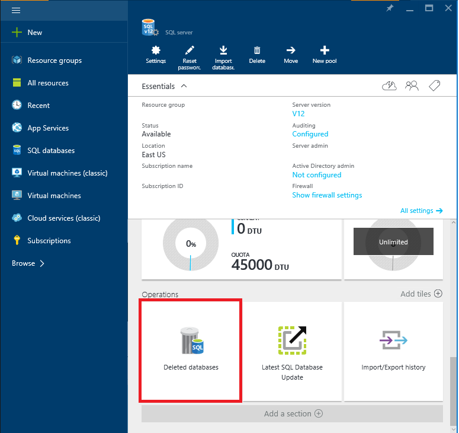
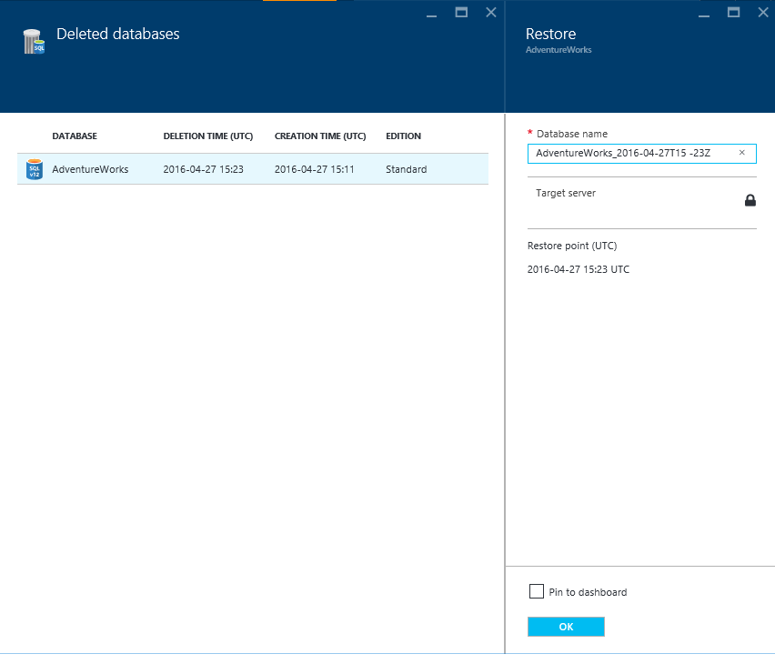

<properties
	pageTitle="Restore a deleted Azure SQL database (Azure Portal) | Microsoft Azure"
	description="Restore a deleted Azure SQL database (Azure Portal)."
	services="sql-database"
	documentationCenter=""
	authors="stevestein"
	manager="jhubbard"
	editor=""/>

<tags
	ms.service="sql-database"
	ms.devlang="NA"
	ms.date="07/09/2016"
	ms.author="sstein"
	ms.workload="NA"
	ms.topic="article"
	ms.tgt_pltfrm="NA"/>

# Restore a deleted Azure SQL database using the Azure Portal

> [AZURE.SELECTOR]
- [Overview](sql-database-recovery-using-backups.md)
- [Deleted database restore: PowerShell](sql-database-restore-deleted-database-powershell.md)

## Select the database to restore 

To restore a database in the Azure Portal do the following:

1.	Open the [Azure Portal](https://portal.azure.com).
2.  On the left side of the screen select **BROWSE** > **SQL servers**.
3.  Navigate to the server with the deleted database you want to restore and select the server
4.  Scroll down to the **operations** section of your server blade and select **Deleted databases**:
	
5.  Select the deleted database you want to restore.
6.  Specify a database name, and click Ok:

    

## Next steps

- For a business continuity overview and scenarios, see [Business continuity overview](sql-database-business-continuity.md)
- To learn about Azure SQL Database automated backups, see [SQL Database automated backups](sql-database-automated-backups.md)
- To learn about using automated backups for recovery, see [restore a database from the service-initiated backups](sql-database-recovery-using-backups.md)
- To learn about faster recovery options, see [Active-Geo-Replication](sql-database-geo-replication-overview.md)  
- To learn about using automated backups for archiving, see [database copy](sql-database-copy.md)
