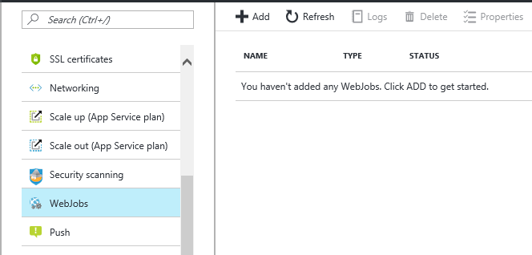

# Update the tenant catalog with the current state of Azure resources

This tutorial covers setting up and running the CatalogSync WebJob, which synchronizes resource information from Azure into the catalog. As the CatalogSync WebJob runs unattended, it authenticates using a service principal. In this tutorial you create the service principal, deploy an App Service application, and configure and add the Catalog Sync WebJob to it.


To complete this tutorial, make sure of the following:

* The WTP app is deployed. To deploy in less than five minutes, see [Deploy and explore the WTP SaaS application](sql-database-saas-tutorial.md).
* Azure PowerShell is installed. For details, see [Getting started with Azure PowerShell](https://docs.microsoft.com/powershell/azure/get-started-azureps).

## Catalog resource synchronization pattern

In the Wingtip SaaS application, the catalog’s primary function is to manage the mapping between a tenant and the database in which its data is stored. Disaster recovery (DR), and some advanced provisioning scenarios, require additional information about the current state of the tenant servers, elastic pools and databases; CatalogSync ensures this information is kept up-to-date in the Catalog. CatalogSync is written in PowerShell, but could have been written in other languages.

In DR scenarios, up-to-date configuration information is used to enable a mirror-image recovery environment to be constructed in the event of a prolonged outage. This information is used to ensure that databases and pools, if recovered to another region, have the same performance characteristics after recovery as they had before the outage. This information is a natural extension of the database mapping information already maintained in the catalog. By storing this additional information in the catalog, it ensures that it is available alongside the core catalog information in a recovery scenario.


## Create the service principal in Azure Active Directory and deploy the App Service

In this first step you will create the service principal for the WebJob in Azure Active Directory, and then deploy the App Service that will host the WebJob. The WebJob signs in to Azure as the service principal to access resource information.

1. Open …\\Learning Modules\\Provision and Catalog\\Catalog Sync\\_Demo-CatalogSync.ps1_ in PowerShell ISE.
1. Set **$DemoScenario** to **1**, Deploy the CatalogSync App Service application, and execute using **F5**

At this point you will have an App Service named CatalogSync-&lt;USER&gt; in the WTP resource.

## Configure, deploy, and start the WebJob

In this step, you will modify the WebJob script with information about your Azure account so that the WebJob can log in to Azure using the service principal created in step 1. Then you will zip up the web job script and its associated files and deploy it into the App Service created above. The WebJob will start running immediately and continue unattended.

You will need the following information available about your Azure account:

* Active Directory domain name
* Tenant Id
* Subscription Id

1. To find the Domain name:

    1. Open the Azure portal and hover the cursor over your login name in the top right of the page. The domain name typically ends with …onmicrosoft.com.

1. To find your Tenant Id and Subscription Id

    1. Open …\\Learning Modules\\Provision and Catalog\\Catalog Sync\\Demo-CatalogSync.ps1

    1. Set **$DemoScenario** to **1,** Display Tenant Id and Subscription Id then execute using **F5.** Your ids will be displayed as console output

1. Update the web job script with your account information

    1. Open …\\Learning Modules\\Provision and Catalog\\Catalog Sync\\Catalog Sync Web Job\\Run.ps1

    1. Modify **$domainName**, **$tenantId**, **$subscriptionId** and save the file.

1. Deploy the WebJob to the App Service

    1. Open the …\\Catalog Sync Web Job\\ folder in Windows Explorer.

    1. Select all the contents selected including the Common subdirectory, with all files selected, right-click one of them, and select Send To &gt; Compressed (zipped) folder.

    1. Rename the resulting zip file to CatalogSync.zip

    1. Open the **CatalogSync-&lt;USER&gt;** app service in the Azure portal

    1. Select WebJobs in the context menu (you may need to scroll down to locate this option).

        

    1. Select **+Add** to create a new WebJob

    1. Name the WebJob “**CatalogSync**”, upload the CatalogSync.zip file created above. Set the job type to **continuous**, and select **OK** to create the WebJob.

The WebJob should start running after a few moments. Every 60 seconds it wakes up and synchronizes changes into the extended resource tables in the catalog. To see its effect, do the following:

1. Open SSMS and **connect to the WTP catalog server** at Catalog-&lt;USER&gt;.database.windows.net, using the user name: *developer*, password: *P@ssword1*.
1. Expand the databases and locate the database **tenantcatalog**
1. Right-click on the database and select **New Query**
1. Enter and execute (F5) the following three-line query:

   ```sql
   SELECT \* FROM \[dbo\].\[Databases\]
   SELECT \* FROM \[dbo\].\[ElasticPools\]
   SELECT \* FROM \[dbo\].\[Servers\]
   ```

1. Now make a material change to the tenant databases and watch how it is reflected in the tables above by re-running the queries again after 60 seconds. Try deploying a new tenant, scaling a pool up/down, or creating a new pool and moving a tenant database into it. See the Performance Monitoring and Management tutorial for instructions.

## Next steps

## Additional resources